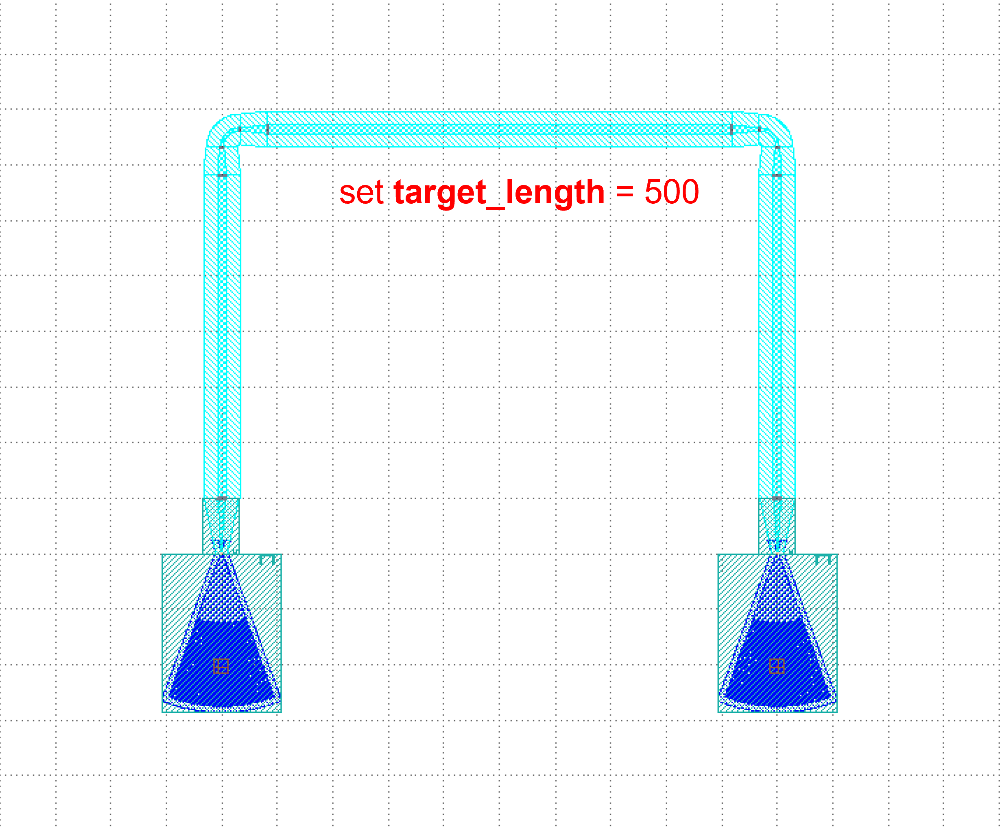

Routing Path Selection
====================

There are two ways to choose a path.

1. ``waypoints``
2. ``waylines``

``waypoints`` and ``waylines`` are used as parameters in the routing method to aid in waveguide alignment and avoidance, however, they cannot be used at the same time；

``waypoints`` can set the turning angle. If you have determined that the waveguide needs to pass through some points, you can use ``waypoints``, ``waylines`` can be more concise to do 90 degrees of turning.

Here's a comparison of the two options

.. image:: ../images/routing_way_en.png

``waylines`` example1
-----------------------------
::

    device = fp.LinkBetween(
        start=gc1["op_0"],
        end=gc2["op_0"],
        link_type=TECH.WG.SWG.C.EXPANDED,
        bend_factory=TECH.WG.SWG.C.WIRE.BEND_CIRCULAR,
        # By setting waylines so that the waveguide passes through the x=-50, y=50 and x=50 lines in turn
        waylines=[fp.until_x(-50), fp.until_y(50), fp.until_x(50)]
    )

.. image:: ../images/routingpath.1.png

By setting ``Waylines`` so that the wave guide first passes through the line ``x=-50`` and then through the lines ``y=50``, ``x=50``.

``waylines`` example2
------------------------------
::

    device = fp.LinkBetween(
        start=gc1["op_0"],
        end=gc2["op_0"],
        link_type=TECH.WG.FWG.C.WIRE,
        bend_factory=TECH.WG.FWG.C.WIRE.BEND_CIRCULAR,
        waylines=[
            fp.until_x(x=-100),  # Pass through the line x = -100
            fp.until_y(y=fp.START+100),  # Take the vertical coordinate Y of the starting port, where Y=0, and pass through the line y=Y+100
            fp.until_x(x=fp.PREV+100),  # Take the horizontal coordinate X of the last turn, here X = -100, and pass through the line x = X + 100
            fp.until_y(y=fp.END+50),  # Take the vertical coordinate Y of the termination port, where Y=0, and pass through the line y=Y+50
            fp.until_x(x=fp.PREV+100)  # Take the horizontal coordinate X of the last turn, where X=0, and pass through the line x=X+100
                  ]
    )

.. image:: ../images/routingpath.2.png

Here ``fp.END`` is used to get the position of the end port, and similarly ``fp.START`` can be used to get the position of the start port. Also ``fp.PREV`` to get the position of the last turning point in real time, which allows the user to design based on the last turning point.

``waypoints`` example
----------------------------
::

    device = fp.LinkBetween(
        start=gc1["op_0"],
        end=gc2["op_0"],
        link_type=TECH.WG.SWG.C.EXPANDED,
        bend_factory=TECH.WG.SWG.C.WIRE.BEND_CIRCULAR,
        # Set waypoints to guide the waveguide through the path points, the three values in the fp.Waypoints brackets represent x,y,angle respectively.
        waypoints=[
           fp.Waypoint(-50, 10, 90),
           fp.Waypoint(0, 50, 0),
           fp.Waypoint(50, 10, -90)]
    )

    insts += device

.. image:: ../images/routingpath.3.png

Set ``Waypoints`` to guide the waveguide through the ``Waypoints``, the three values in the ``fp.Waypoint`` brackets represent ``x``,``y``,``angle`` respectively.

For the case where the two ports are connected in U-shape, the length can be defined by setting the ``target_length`` parameter in ``LinkBetween`` and ``LINKER``, and the waveguide will automatically extend the straight waveguide to the corresponding length, where ``target_length`` is the total length of the entire wiring waveguide.

``Target_length`` example
------------------------------------
::

    device = fp.LinkBetween(
        start=gc1["op_0"],
        end=gc2["op_0"],
        link_type=TECH.WG.SWG.C.EXPANDED,
        bend_factory=TECH.WG.SWG.C.WIRE.BEND_CIRCULAR,
        # set target_length
        target_length=500
    )

    insts += device

.. image:: ../images/routingpath.4.png

