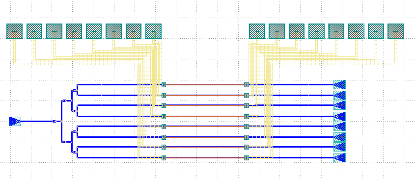
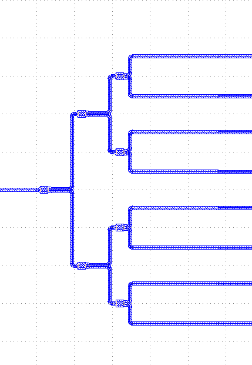
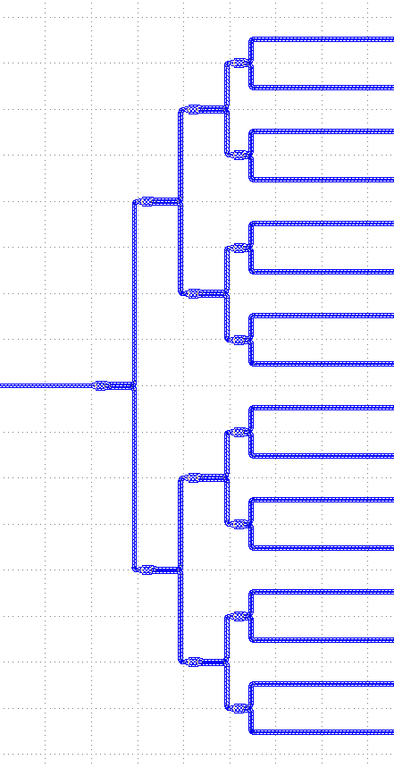
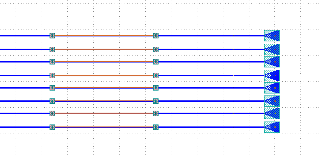
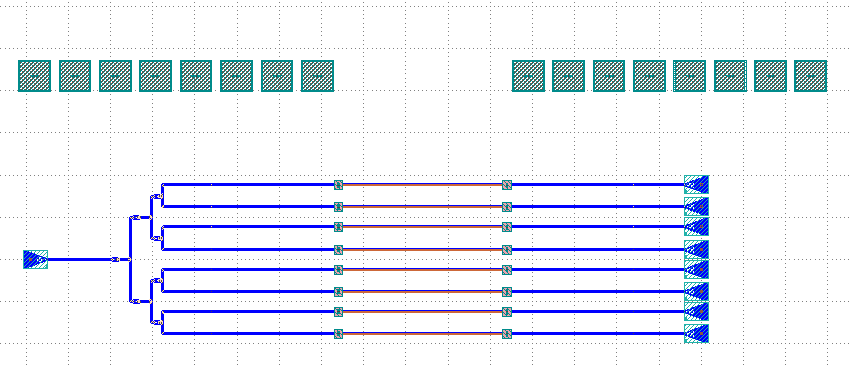
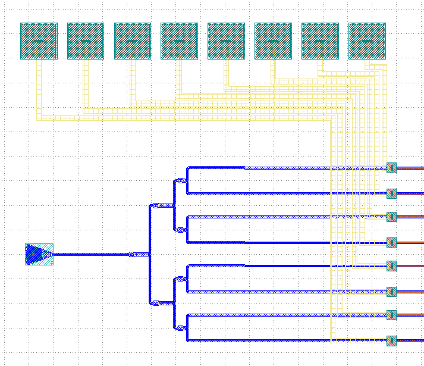

Optical Phased Array (OPA)
^^^^^^^^^^^^^^^^^^^^^^^^^^^^^^^^^^^^^^^^^^^^^^^^^^^^^^^^^^^

Part I. Introduction
------------------------------------
In this work, we present the implementation of an optical phase array layout using **PhotoCAD** layout tool. The field of silicon photonics has seen significant growth in recent years, with the integration of optical components and systems onto silicon chips becoming increasingly important for various applications, including high-speed data communication [1]_ , optical sensing [2]_, and LiDAR [3]_ .

An optical phase array is a crucial component in many of these applications, allowing for the control and manipulation of the phase of light in optical systems. To achieve this, we utilized **PhotoCAD**, a leading layout tool for photonic devices, to design and implement our optical phase array.The layout of the optical phase array was optimized to meet the specific requirements of our application, taking into consideration parameters such as waveguide dimensions and grating period. The resulting layout was then transferred to a silicon wafer for fabrication, following standard silicon photonics fabrication processes.

The implementation of an optical phase array using **PhotoCAD** represents a significant step forward in the development of silicon photonic devices, providing a low-cost and efficient means to control the phase of light in optical systems. This work highlights the importance of accurate and efficient photonic layout tools in the development of cutting-edge silicon photonic technologies.

The optical phased array (OPA) consists of a split tree with each output connected to a ``tin_heater``, another port of the ``tin_heater`` will be connected to a ``GratingCoupler``, two ``electrical ports`` exist on each ``tin_heater``, and the ``electrical port`` is connected to the ``BondPad`` by the ``LinkBetween`` function.

Part II. Full script
-----------------------------------------
::

    from dataclasses import dataclass
    from typing import Mapping, cast

    import numpy
    import numpy as np
    from fnpcell import all as fp
    from gpdk import all as pdk
    from gpdk.technology import get_technology
    from gpdk.components.step.step2.mmi1x2 import MMI1x2

    @dataclass(eq=False)
    class MMITree(fp.PCell):
        x_spacing: float = fp.PositiveFloatParam(default=50)
        end_y_spacing: float = fp.PositiveFloatParam(default=100)
        order: float = fp.PositiveFloatParam(default=3)
        def build(self):
            insts, elems, ports = super().build()
            TECH = get_technology()

            x_spacing = self.x_spacing
            end_y_spacing = self.end_y_spacing
            order = self.order
            mmi = MMI1x2()
            num_per_col = []
            v_spacing = []

            for i in range(order):
                num_per_col.append(2**i)
                v_spacing.append(end_y_spacing*(2**(order - i - 1)))

            for i in range(order):
                for j in range(num_per_col[i]):
                    x = i * x_spacing
                    y = (-(num_per_col[i] - 1) * v_spacing[i]/2) + j * v_spacing[i]
                    mmi = mmi["op_0"].repositioned(at=(x,y)).owner
                    insts += mmi, f"{i},{j}"

            mmi_tree = cast(Mapping[str, fp.ICellRef], insts)

            for i in range(order):
                for j in range(num_per_col[i]):
                    if i < order-1:
                        link1 = fp.LinkBetween(start=mmi_tree[f"{i},{j}"]["op_1"],
                                               end=mmi_tree[f"{i+1},{2*j}"]["op_0"],
                                               bend_factory=TECH.WG.FWG.C.WIRE.BEND_CIRCULAR)
                        insts += link1
                        link2 = fp.LinkBetween(start=mmi_tree[f"{i},{j}"]["op_2"],
                                               end=mmi_tree[f"{i+1},{2*j+1}"]["op_0"],
                                               bend_factory=TECH.WG.FWG.C.WIRE.BEND_CIRCULAR)
                        insts += link2

            ports += mmi_tree["0,0"]["op_0"].with_name("op_0")
            for i in range(num_per_col[-1]):
                ports += mmi_tree[f"{order - 1},{i}"]["op_1"].with_name(f"op_{2*i+1}")
                ports += mmi_tree[f"{order - 1},{i}"]["op_2"].with_name(f"op_{2*i+2}")

            heater_wl = 1000
            heater_tl = 400
            heater = pdk.TiNHeaterwithep(waveguide_length=heater_wl, tin_length=heater_tl, tin_box_size=20, contact_box_size=20)

            for i in range (num_per_col[-1]):
                for j in range(2):
                    ht_x = mmi_tree[f"{order - 1},{i}"][f"op_{j+1}"].position[0]
                    ht_y = mmi_tree[f"{order - 1},{i}"][f"op_{j+1}"].position[1]
                    if j == 0:
                        heater = heater["op_0"].repositioned(at=(ht_x + 15*(2**order), ht_y - end_y_spacing / 4)).owner
                    else:
                        heater = heater["op_0"].repositioned(at=(ht_x + 15*(2**order), ht_y + end_y_spacing / 4)).owner
                    insts += heater, f"ht_{2*i+j},{0}"
            mmi_tree = cast(Mapping[str, fp.ICellRef], insts)

            for i in range(num_per_col[-1]):
                for j in range(2):
                    link3 = fp.LinkBetween(
                        start=mmi_tree[f"ht_{2*i+j},0"]["op_0"],
                        end=mmi_tree[f"{order - 1},{i}"][f"op_{j+1}"],
                        bend_factory=TECH.WG.FWG.C.WIRE.BEND_CIRCULAR
                    )
                    insts += link3

            GC = pdk.GratingCoupler()
            GC_0 = GC.translated(150, 0).h_mirrored()
            insts += GC_0

            link4 = fp.LinkBetween(start=GC_0["op_0"], end=mmi_tree["0,0"]["op_0"], bend_factory=TECH.WG.FWG.C.WIRE.BEND_CIRCULAR)
            insts += link4

            for i in range (num_per_col[-1]):
                for j in range(2):
                    gc_x = mmi_tree[f"ht_{2*i+j},0"]["op_1"].position[0]
                    gc_y = mmi_tree[f"ht_{2*i+j},0"]["op_1"].position[1]
                    GC = GC["op_0"].repositioned(at=(gc_x+15*(2**order), gc_y)).owner
                    insts += GC, f"gc_{i},{j+1}"
            mmi_tree = cast(Mapping[str, fp.ICellRef], insts)

            for i in range(num_per_col[-1]):
                for j in range(2):
                    link5 = fp.LinkBetween(
                        start=mmi_tree[f"ht_{2*i+j},0"]["op_1"],
                        end=mmi_tree[f"gc_{i},{j+1}"]["op_0"],
                        bend_factory=TECH.WG.FWG.C.WIRE.BEND_CIRCULAR
                    )
                    insts += link5
            mmi_tree = cast(Mapping[str, fp.ICellRef], insts)

            BP = pdk.BondPad(pad_width=75, pad_height=75)
            pads_x = numpy.linspace(100*(2 **(order)), 50, 2 **(order))
            pads_left_x = numpy.linspace(90*(2 **(order)), 50,  2 **(order))
            pads_right_x = numpy.linspace(50, 90*(2 **(order)), 2 **(order))

            for i in range (2**(order)):
                bp_x = pads_left_x[i]
                bp_y = end_y_spacing * (2** (order-1)) / 2
                ht_left_x = mmi_tree[f"ht_{2 ** (order) - 1},0"]["ep_0"].position[0]
                BP_left = BP["ep_0"].repositioned(at=(ht_left_x-bp_x, bp_y+15*(2**order+1)+100)).owner
                insts += BP_left, f"BP_{i},0"
            for i in range (2**(order)):
                bp_x = pads_right_x[i]
                bp_y = end_y_spacing * (2 ** (order - 1)) / 2
                ht_right_x = mmi_tree[f"ht_{2**(order)-1},0"]["ep_1"].position[0]
                BP_right = BP["ep_0"].repositioned(at=(bp_x+ht_right_x, bp_y + 15*(2**order+1)+100)).owner
                insts += BP_right, f"BP_{i},1"
            mmi_tree = cast(Mapping[str, fp.ICellRef], insts)

            for i in range(2**(order)):
                    link6 = fp.LinkBetween(
                            start=mmi_tree[f"BP_{i},0"]["ep_0"].with_orientation(degrees=-90),
                            end=mmi_tree[f"ht_{i},0"]["ep_0"].with_orientation(degrees=180),
                            metal_line_type=TECH.METAL.M2.W10,
                            min_distance=50,
                            waypoints=[
                                fp.Waypoint(mmi_tree[f"BP_{i},0"]["ep_0"].position[0],mmi_tree[f"BP_{i},0"]["ep_0"].position[1]-37.5-15*(2**(order)-i), -90),

                                fp.Waypoint(mmi_tree[f"ht_{2 ** (order) - 1},0"]["ep_0"].position[0]-15*(2**(order)-i),end_y_spacing * (2** (order-1)) / 2, -90)
                            ]

                        )
                    insts += link6

            for i in range(2**(order)):
                     link7 = fp.LinkBetween(
                         start=mmi_tree[f"BP_{i},1"]["ep_0"].with_orientation(degrees=-90),
                         end=mmi_tree[f"ht_{2**(order)-1-i},0"]["ep_1"].with_orientation(
                             degrees=0),
                         metal_line_type=TECH.METAL.M2.W10,
                         min_distance=50,
                         waypoints=[
                             fp.Waypoint(mmi_tree[f"BP_{i},1"]["ep_0"].position[0],
                                         mmi_tree[f"BP_{i},1"]["ep_0"].position[1] - 37.5 - 15 * (i+1),
                                         -90),

                             fp.Waypoint(
                                 mmi_tree[f"ht_{2 ** (order) - 1},0"]["ep_1"].position[0] + 15 * (i+1),
                                 end_y_spacing * (2 ** (order - 1)) / 2, -90)
                         ]

                     )
                     insts += link7
            fmt: on
            return insts, elems, ports

    if __name__ == "__main__":
        from pathlib import Path

        gds_file = Path(__file__).parent / "local" / Path(__file__).with_suffix(".gds").name
        library = fp.Library()

        TECH = get_technology()
        # =============================================================
        # fmt: off

        library += MMITree()

        # fmt: on
        # =============================================================
        fp.export_gds(library, file=gds_file)
        # fp.plot(library)
        # print(MMITree())

Run the complete script once, generating the following GDS layout.    

Part III. Generation and arrangement of MMI tree
--------------------------------------------------
First of all, we need to create the MMI tree, and generate the devices by calling ``MMI1x2()`` through ``pdk``, we use ``order`` as the MMI level, ``end_y_spacing`` represents the spacing between the devices at the last level of the MMI tree, they are all equally spaced, and ``x_spacing`` represents the horizontal spaces between each ``MMI1x2`` device.
The value of ``order`` is 3, which means that the whole MMI tree is split twice from 1 device, in other words, three columns of MMI devices will be generated, as shown in the following figure.

::

    mmi = MMI1x2()
    x_spacing: float = fp.PositiveFloatParam(default=50)
    end_y_spacing: float = fp.PositiveFloatParam(default=100)
    order: float = fp.PositiveFloatParam(default=3)
    
    

    
Users can adjust the ``order`` according to their needs. We run the program after adjusting ``order`` to 4 and get the following figure.

Next, the script that generates the MMI tree is analyzed. The first for loop is used to generate x/y corordinates for MMI to be positioned. ``num_per_col`` represents the amount of MMI in the order, and ``v_spacing`` represents the vertical distance between the Nth MMI and the bottom MMI.

::

        num_per_col = []
        v_spacing = []

        for i in range(order):
            num_per_col.append(2**i)
            v_spacing.append(end_y_spacing*(2**(order - i - 1)))
            
            

The second for loop is used to position every MMI based on the above scripts. Note that the lowest MMI is where y=0 is located. Here we name the MMIs ``[i,j]``, which means that the MMI is in the ``i`` row and located at the ``j``th counted from bottom to top.

::

        for i in range(order):
            for j in range(num_per_col[i]):
                x = i * x_spacing
                y = (-(num_per_col[i] - 1) * v_spacing[i]/2) + j * v_spacing[i] # bottom mmi y = 0
                mmi = mmi["op_0"].repositioned(at=(x,y)).owner
                insts += mmi, f"{i},{j}"
        mmi_tree = cast(Mapping[str, fp.ICellRef], insts)
        
        

After the placement of every MMIs, we connect the ports using the ``LinkBetween`` function. Two different links represents that the output of one MMI will be seperated into two connections, one to the upwards MMI and another to the downwards of the MMI located at the next row. 

::

         for i in range(order):
                    for j in range(num_per_col[i]):
                        if i < order-1:
                            link1 = fp.LinkBetween(start=mmi_tree[f"{i},{j}"]["op_1"],
                                                   end=mmi_tree[f"{i+1},{2*j}"]["op_0"],
                                                   bend_factory=TECH.WG.FWG.C.WIRE.BEND_CIRCULAR)
                            insts += link1
                            link2 = fp.LinkBetween(start=mmi_tree[f"{i},{j}"]["op_2"],
                                                   end=mmi_tree[f"{i+1},{2*j+1}"]["op_0"],
                                                   bend_factory=TECH.WG.FWG.C.WIRE.BEND_CIRCULAR)
                            insts += link2
                            
                            
                            
Part IV. Generation and arrangement of Heaters and GratingCouplers
----------------------------------------------------------------------------------
Define the dimensions of ``heater`` by ``heater_wl`` and ``heater_tl``, and then generate the corresponding ``GratingCoupler`` at the back of each MMI
by for loop. The x and y coordinates of the placement of the ``GC`` and ``heater`` are partly provided by the port of each MMI by the ``.position`` method, which obtains the MMI port center position ( ``ht_x``, ``ht_y``). Both ``heater`` and ``GC`` positions are extended to a certain distance due to the routing of the metal wire.   

::

        heater_wl = 1000
        heater_tl = 400
        heater = pdk.TiNHeaterwithep(waveguide_length=heater_wl, tin_length=heater_tl, tin_box_size=20, contact_box_size=20)

        # define heater positions
        for i in range (num_per_col[-1]):
            for j in range(2):
                ht_x = mmi_tree[f"{order - 1},{i}"][f"op_{j+1}"].position[0]
                ht_y = mmi_tree[f"{order - 1},{i}"][f"op_{j+1}"].position[1]
                if j == 0:
                    heater = heater["op_0"].repositioned(at=(ht_x + 15*(2**order), ht_y - end_y_spacing / 4)).owner
                else:
                    heater = heater["op_0"].repositioned(at=(ht_x + 15*(2**order), ht_y + end_y_spacing / 4)).owner
                insts += heater, f"ht_{2*i+j},{0}"
        mmi_tree = cast(Mapping[str, fp.ICellRef], insts)

        # link heater left port and mmi right ports
        for i in range(num_per_col[-1]):
            for j in range(2):
                link3 = fp.LinkBetween(
                    start=mmi_tree[f"ht_{2*i+j},0"]["op_0"],
                    end=mmi_tree[f"{order - 1},{i}"][f"op_{j+1}"],
                    bend_factory=TECH.WG.FWG.C.WIRE.BEND_CIRCULAR
                )
                insts += link3

        GC = pdk.GratingCoupler()
        GC_0 = GC.translated(150, 0).h_mirrored()
        insts += GC_0
        # link the left GC with the first MMI
        link4 = fp.LinkBetween(start=GC_0["op_0"], end=mmi_tree["0,0"]["op_0"], bend_factory=TECH.WG.FWG.C.WIRE.BEND_CIRCULAR)
        insts += link4

        # positioning every GC on the right of the circuit
        for i in range (num_per_col[-1]):
            for j in range(2):
                gc_x = mmi_tree[f"ht_{2*i+j},0"]["op_1"].position[0]
                gc_y = mmi_tree[f"ht_{2*i+j},0"]["op_1"].position[1]
                GC = GC["op_0"].repositioned(at=(gc_x+15*(2**order), gc_y)).owner
                insts += GC, f"gc_{i},{j+1}"
        mmi_tree = cast(Mapping[str, fp.ICellRef], insts)
        # link heaters and gcs together
        for i in range(num_per_col[-1]):
            for j in range(2):
                link5 = fp.LinkBetween(
                    start=mmi_tree[f"ht_{2*i+j},0"]["op_1"],
                    end=mmi_tree[f"gc_{i},{j+1}"]["op_0"],
                    bend_factory=TECH.WG.FWG.C.WIRE.BEND_CIRCULAR
                )
                insts += link5
        mmi_tree = cast(Mapping[str, fp.ICellRef], insts)
        
        

        
Part V. BondPad arrangement and metal wire routing
----------------------------------------------------------
Until now, we have finished the optical waveguide routing of the OPA. Next we have to generate the ``BondPad`` on top of the layout to connect the heater pins with the outside world. The horizontal coordinates of the ``BondPad`` are generated by ``linspace`` to get equally spaced horizontal coordinates. The left part and the right part of the pads will be discussed seperately.  Then use the for loop to generate the number of BondPads related to the level of the MMI tree.

::

        BP = pdk.BondPad(pad_width=75, pad_height=75)
        pads_left_x = numpy.linspace(90*(2 **(order)), 50,  2 **(order))
        pads_right_x = numpy.linspace(50, 90*(2 **(order)), 2 **(order))
        # define all pads position (seperate left pad and right pads
        for i in range (2**(order)):
            bp_x = pads_left_x[i]
            bp_y = end_y_spacing * (2** (order-1)) / 2
            ht_left_x = mmi_tree[f"ht_{2 ** (order) - 1},0"]["ep_0"].position[0]
            BP_left = BP["ep_0"].repositioned(at=(ht_left_x-bp_x, bp_y+15*(2**order+1)+100)).owner
            insts += BP_left, f"BP_{i},0"
        for i in range (2**(order)):
            bp_x = pads_right_x[i]
            bp_y = end_y_spacing * (2 ** (order - 1)) / 2
            ht_right_x = mmi_tree[f"ht_{2**(order)-1},0"]["ep_1"].position[0]
            BP_right = BP["ep_0"].repositioned(at=(bp_x+ht_right_x, bp_y + 15*(2**order+1)+100)).owner
            insts += BP_right, f"BP_{i},1"
        mmi_tree = cast(Mapping[str, fp.ICellRef], insts)

Then the ``BondPad`` are connected to the pins on the ``heater`` using ``LinkBetween`` function. To avoid short when the crossing of the metal wire appears, ``waypoints`` are being set and depends on the distance between the pins and the ``BondPads``. When those are close to each other, the x-coordinate of the ``waypoint`` will be also close to the pins, meaning that a quick turn will be generate through the connection. The ``waypoints`` are also set to minimize the overlapping between the metal wires and the optical waveguides to avoid heat effect to the material property of the optical wg.

::

        # link left pads with heater left port
        for i in range(2**(order)):
                link6 = fp.LinkBetween(
                        start=mmi_tree[f"BP_{i},0"]["ep_0"].with_orientation(degrees=-90),
                        end=mmi_tree[f"ht_{i},0"]["ep_0"].with_orientation(degrees=180),
                        metal_line_type=TECH.METAL.M2.W10,
                        min_distance=50,
                        waypoints=[
                            fp.Waypoint(mmi_tree[f"BP_{i},0"]["ep_0"].position[0],mmi_tree[f"BP_{i},0"]["ep_0"].position[1]-37.5-15*(2**(order)-i), -90),

                            fp.Waypoint(mmi_tree[f"ht_{2 ** (order) - 1},0"]["ep_0"].position[0]-15*(2**(order)-i),end_y_spacing * (2** (order-1)) / 2, -90)
                        ]

                    )
                insts += link6
        # link right pads with heater right port
        for i in range(2**(order)):
                 link7 = fp.LinkBetween(
                     start=mmi_tree[f"BP_{i},1"]["ep_0"].with_orientation(degrees=-90),
                     end=mmi_tree[f"ht_{2**(order)-1-i},0"]["ep_1"].with_orientation(
                         degrees=0),
                     metal_line_type=TECH.METAL.M2.W10,
                     min_distance=50,
                     waypoints=[
                         fp.Waypoint(mmi_tree[f"BP_{i},1"]["ep_0"].position[0],
                                     mmi_tree[f"BP_{i},1"]["ep_0"].position[1] - 37.5 - 15 * (i+1),
                                     -90),

                         fp.Waypoint(
                             mmi_tree[f"ht_{2 ** (order) - 1},0"]["ep_1"].position[0] + 15 * (i+1),
                             end_y_spacing * (2 ** (order - 1)) / 2, -90)
                     ]

                 )
                 insts += link7
                 
                 

Part VI. Conclusion
------------------
By using **PhotoCAD** layout tool, the implementation process of an optical phased array can be made more efficient and accurate. The software allows designers to adjust the parameters and optimize the performance by simple adjusting the script. Additionally, the tool can be used to generate layouts and schematics, streamlining the design process.

In conclusion, using **PhotoCAD** layout tool to implement an optical phased array can improve the efficiency and accuracy of the design process. It can also facilitate the optimization of the performance, making the implementation of this technology more straightforward.

        
.. [1] POULTON, Christopher Vincent, et al. Long-range LiDAR and free-space data communication with high-performance optical phased arrays. IEEE Journal of Selected Topics in Quantum Electronics, 2019, 25.5: 1-8.
.. [2] ROBERTS, Lyle E., et al. High power compatible internally sensed optical phased array. Optics express, 2016, 24.12: 13467-13479.
.. [3] HSU, Ching-Pai, et al. A review and perspective on optical phased array for automotive LiDAR. IEEE Journal of Selected Topics in Quantum Electronics, 2020, 27.1: 1-16.
        
        
        
        
        
        
        
        
        
        
        
        
