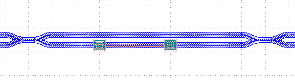
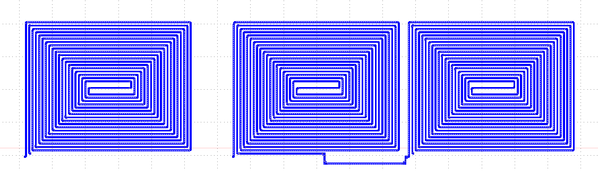
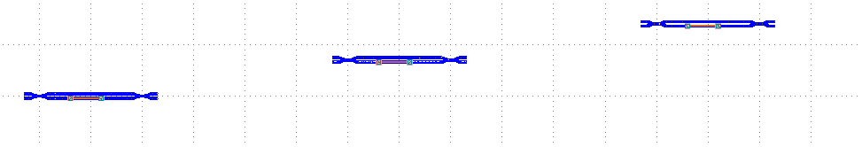
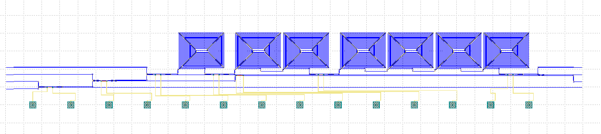

Quantum Key Distribution (QKD)
^^^^^^^^^^^^^^^^^^^^^^^^^^^^^^^^^^^^^^^^^^^^^^^^^^^^^^^^^^^^^^^

**Quantum Key Distribution Receiver** cite: Sibson, P. et. al., “Chip-based quantum key distribution”, Nature
Communications, Vol. 8, https://www.nature.com/articles/ncomms13984.pdf (2017)

Part I. Introduction
------------------------------------
For secure communication, the message is encrypted by the sender and decrypted by the receiver using an encryption key that is shared only between them. Quantum
Key Distribution (QKD) aims to transmit this key in a way that it cannot be intercepted without the receiver being warned.  This is achieved by encoding the key into a series of quantum bits. Due to the law of unclonability, any attempt to read a quantum bit will corrupt This means that the interceptor cannot recreate the lost information and warns the receiver of the quantum bits, which eliminates the possibility of eavesdropping during the encrypted key transmission. This eliminates the possibility of eavesdropping in the encryption key transmission. Once this key is shared, it can only be used once, using a one-time cryptographic algorithm to encrypt the information transmitted over the classical channel in a completely secure manner.

Quantum keys are typically transmitted via a single photon in an optical fiber, and the key is created by an optical circuit called an emitter that encodes it into a series of pulses. The pulses are then detected by a second optical circuit called a receiver, which reads the key from the sequence of pulses.

The use of integrated photons in the QKD allows for greater miniaturization and lower manufacturing costs than traditional Bulk Optical Systems (BOS). and lower manufacturing costs. It is believed that this will lead to a wide range of applications for QKD systems, and as a result, researchers have developed a number of ways to implement emitters and receivers in integrated photonic circuits. As a result, researchers have developed a number of systems that implement transmitters and receivers in integrated photonic circuits.

Part II. Full script
------------------------------------------------------------------
::

    import numpy
    from dataclasses import dataclass
    from fnpcell import all as fp
    from gpdk import all as pdk
    from gpdk.technology import get_technology
    from gpdk.technology.waveguide_factory import EulerBendFactory

    @dataclass(eq=False)
    class QKD(fp.PCell):
        def build(self):
            insts, elems, ports = super().build()
            TECH = get_technology()

            dc_left = pdk.DirectionalCouplerSBend(coupler_spacing=0.7, coupler_length=10, bend_radius=15, bend_degrees=30, straight_after_bend=10)
            dc_right = pdk.DirectionalCouplerSBend(coupler_spacing=0.7, coupler_length=10, bend_radius=15, bend_degrees=30, straight_after_bend=10).translated(200, 0)
            straight = pdk.Straight(length=90).translated((dc_right["op_0"].position[0]-dc_left["op_3"].position[0]) / 2 - 20, dc_left["op_3"].position[1])
            heater = pdk.TiNHeaterwithep(waveguide_length=90, tin_length=60, contact_box_size=6, metal_box_size=10).translated((dc_right["op_1"].position[0]-dc_left["op_2"].position[0]) / 2 + 20, dc_left["op_2"].position[1])

            mzi = fp.Linked(
                link_type=TECH.WG.FWG.C.EXPANDED,
                links=[
                    dc_left["op_2"] >> heater["op_0"],
                    heater["op_1"] >> dc_right["op_1"],
                    dc_left["op_3"] >> straight["op_0"],
                    straight["op_1"] >> dc_right["op_0"],
                ],
                ports=[
                    dc_left["op_0"].with_name("op_0"),
                    dc_left["op_1"].with_name("op_1"),
                    dc_right["op_2"].with_name("op_2"),
                    dc_right["op_3"].with_name("op_3"),
                    heater["ep_0"].with_name("ep_0"),
                    heater["ep_1"].with_name("ep_1"),
                ],
            )

            spiral = pdk.Spiral(min_straight=10, total_length=20000, n_o_loops=18, spacing=10, waveguide_type=TECH.WG.FWG.C.WIRE).h_mirrored()
            spiral_start_x = 1700
            spiral_spacing = 100
            spiral_length = 530

            spiral_1 = [spiral.translated(spiral_start_x, 400)]
            spiral_g1 = spiral_1[0]
            spiral_2 = [spiral.translated(spiral_start_x + spiral_length + spiral_spacing, 400),
                        spiral.translated(spiral_start_x + spiral_length*2 + spiral_spacing, 400)]
            spiral_g2 = fp.Linked(
                link_type=TECH.WG.FWG.C.EXPANDED,
                links=[
                    spiral_2[0]["op_0"] >> fp.Waypoint(spiral_2[0]["op_0"].position[0] + spiral_length / 2, spiral_2[0]["op_0"].position[1] - 30, 0) >> spiral_2[1]["op_1"]
                ],
                ports=[spiral_2[0]["op_1"].with_name("op_1"),
                       spiral_2[1]["op_0"].with_name("op_0")],
            )
            spiral_4 = [
                spiral.translated(spiral_start_x + spiral_length * 3 + spiral_spacing * 2, 400),
                spiral.translated(spiral_start_x + spiral_length * 4 + spiral_spacing * 2, 400),
                spiral.translated(spiral_start_x + spiral_length * 5 + spiral_spacing * 2, 400),
                spiral.translated(spiral_start_x + spiral_length * 6 + spiral_spacing * 2, 400),
            ]
            spiral_g4 = fp.Linked(
                link_type=TECH.WG.FWG.C.EXPANDED,
                # bend_factory=bend_factory, # bend_factory,
                links=[
                    spiral_4[0]["op_0"] >> fp.Waypoint(spiral_4[0]["op_0"].position[0] + spiral_length / 2, spiral_4[0]["op_0"].position[1] - 30, 0) >> spiral_4[1]["op_1"],
                    spiral_4[1]["op_0"] >> fp.Waypoint(spiral_4[1]["op_0"].position[0] + spiral_length / 2, spiral_4[1]["op_0"].position[1] - 30, 0) >> spiral_4[2]["op_1"],
                    spiral_4[2]["op_0"] >> fp.Waypoint(spiral_4[2]["op_0"].position[0] + spiral_length / 2, spiral_4[2]["op_0"].position[1] - 30, 0) >> spiral_4[3]["op_1"],
                ],
                ports=[spiral_4[0]["op_1"].with_name("op_1"),
                       spiral_4[3]["op_0"].with_name("op_0"),
                       ],
            )
            mzi_start_x = spiral_start_x - spiral_length / 2
            mzi_1 = mzi
            mzi_2 = mzi.translated(600, (spiral_1[0]["op_1"].position[1] - mzi_1["op_3"].position[1]) / 2 - 25)
            mzi_3 = mzi.translated(1200, spiral_1[0]["op_1"].position[1] - mzi_1["op_3"].position[1] - 50)
            mzi_4 = mzi.translated(spiral_g2["op_1"].position[0] - 300, mzi_3["op_3"].position[1] - mzi_1["op_3"].position[1])
            mzi_5 = mzi.translated(spiral_g4["op_1"].position[0] - 300, mzi_3["op_3"].position[1] - mzi_1["op_3"].position[1])
            mzi_6 = mzi.translated(spiral_g4["op_1"].position[0] + 1800, mzi_3["op_3"].position[1] - mzi_1["op_3"].position[1])
            DC = dc_left.translated(mzi_6["op_2"].position[0] + 200, mzi_6["op_2"].position[1] - mzi_1["op_3"].position[1])

            TOPS = pdk.TiNHeaterwithep(waveguide_length=90, tin_length=80, tin_box_size=5, contact_box_size=2, metal_box_size=2).translated(spiral_g2["op_1"].position[0] + spiral_spacing / 2, DC["op_1"].position[1])
            # device edges (hotizontal distance 6300um, vertical distance 80um)
            edge_straight = pdk.Straight(length=90)
            edge_left = [
                edge_straight.translated(-400, -20),
                edge_straight.translated(-400, 60),
                edge_straight.translated(-400, 140),
                edge_straight.translated(-400, 220),
            ]
            edge_right = [
                edge_straight.translated(5900, mzi_1["op_2"].position[1]),
                edge_straight.translated(5900, 60),
                edge_straight.translated(5900, DC["op_3"].position[1]),
                edge_straight.translated(5900, 220),
            ]
            link_edge = [
                edge_left[0]["op_1"] >> mzi_1["op_1"],
                edge_left[1]["op_1"] >> mzi_1["op_0"],
                edge_left[2]["op_1"] >> mzi_2["op_0"],
                edge_left[3]["op_1"] >> mzi_3["op_0"],
                mzi_1["op_2"] >> edge_right[0]["op_0"],
                DC["op_2"] >> edge_right[1]["op_0"],
                DC["op_3"] >> edge_right[2]["op_0"],
                mzi_6["op_3"] >> fp.Waypoint(5500, 180, 90) >> edge_right[3]
                ["op_0"],
            ]
            BP = []
            BP_num = 14
            BP_x = numpy.linspace(-100, 5400, BP_num)
            for i in range(BP_num):
                BP.append(pdk.BondPad(pad_width=75,
                                      pad_height=75).translated(BP_x[i], -200))
            link_op = [mzi_1["op_3"] >> mzi_2["op_1"],
                       mzi_2["op_3"] >> mzi_3["op_1"],
                       mzi_3["op_2"] >> mzi_4["op_1"],
                       mzi_3["op_3"] >> spiral_g1["op_1"],
                       spiral_g1["op_0"] >> mzi_4["op_0"],
                       mzi_4["op_2"] >> mzi_5["op_1"],
                       mzi_4["op_3"] >> spiral_g2["op_1"],
                       spiral_g2["op_0"] >> mzi_5["op_0"],
                       mzi_5["op_2"] >> mzi_6["op_1"],
                       mzi_5["op_3"] >> spiral_g4["op_1"],
                       spiral_g4["op_0"] >> mzi_6["op_0"],
                       mzi_6["op_2"] >> DC["op_0"],
                       mzi_2["op_2"] >> TOPS["op_0"],
                       TOPS["op_1"] >> DC["op_1"]]
            link_ep = [mzi_1["ep_0"].with_orientation(degrees=-90) >> BP[0]["ep_0"].with_orientation(degrees=90).with_orientation(degrees=90),
                       mzi_1["ep_1"].with_orientation(degrees=-90) >> fp.Waypoint(BP_x[1], -70, 0) >> BP[1]["ep_0"].with_orientation(degrees=90),
                       mzi_2["ep_0"].with_orientation(degrees=-90) >> fp.Waypoint(BP_x[2], -90, 0) >> BP[2]["ep_0"].with_orientation(degrees=90),
                       mzi_2["ep_1"].with_orientation(degrees=-90) >> fp.Waypoint(BP_x[3], -70, 0) >> BP[3]["ep_0"].with_orientation(degrees=90),
                       mzi_3["ep_0"].with_orientation(degrees=-90) >> fp.Waypoint(BP_x[4], -100, 0) >> BP[4]["ep_0"].with_orientation(degrees=90),
                       mzi_3["ep_1"].with_orientation(degrees=-90) >> fp.Waypoint(BP_x[5], -95, 0) >> BP[5]["ep_0"].with_orientation(degrees=90),
                       mzi_4["ep_0"].with_orientation(degrees=-90) >> fp.Waypoint(BP_x[6], -90, 0) >> BP[6]["ep_0"].with_orientation(degrees=90),
                       mzi_4["ep_1"].with_orientation(degrees=-90) >> fp.Waypoint(BP_x[7], -85, 0) >> BP[7]["ep_0"].with_orientation(degrees=90),
                       TOPS["ep_0"].with_orientation(degrees=-90)  >> fp.Waypoint(BP_x[8], -70, 0) >> BP[8]["ep_0"].with_orientation(degrees=90),
                       TOPS["ep_1"].with_orientation(degrees=-90)  >> fp.Waypoint(BP_x[9], -60, 0) >> BP[9]["ep_0"].with_orientation(degrees=90),
                       mzi_5["ep_0"].with_orientation(degrees=-90) >> fp.Waypoint(BP_x[10], -50, 0) >> BP[10]["ep_0"].with_orientation(degrees=90),
                       mzi_5["ep_1"].with_orientation(degrees=-90) >> fp.Waypoint(BP_x[11], -40, 0) >> BP[11]["ep_0"].with_orientation(degrees=90),
                       mzi_6["ep_0"].with_orientation(degrees=-90) >> fp.Waypoint(BP_x[12], -70, 0) >> BP[12]["ep_0"].with_orientation(degrees=90),
                       mzi_6["ep_1"].with_orientation(degrees=-90) >> fp.Waypoint(BP_x[13], -70, 0) >> BP[13]["ep_0"].with_orientation(degrees=90),
                       ]
            link_device = fp.Linked(
                link_type=TECH.WG.FWG.C.EXPANDED,
                metal_line_type=TECH.METAL.M2.W20.updated(line_width=2),
                metal_min_distance=50,
                links=link_op + link_ep + link_edge,
                ports=[
                    edge_left[3]["op_0"].with_name("op_0"),
                    edge_left[2]["op_0"].with_name("op_1"),
                    edge_left[1]["op_0"].with_name("op_2"),
                    edge_left[0]["op_0"].with_name("op_3"),
                    edge_right[0]["op_1"].with_name("op_4"),
                    edge_right[1]["op_1"].with_name("op_5"),
                    edge_right[2]["op_1"].with_name("op_6"),
                    edge_right[3]["op_1"].with_name("op_7"),
                ],
            )
            insts += link_device

            return insts, elems, ports

    if __name__ == "__main__":
            from pathlib import Path
            gds_file = Path(__file__).parent / "local" /Path(__file__).with_suffix(".gds").name
            library = fp.Library()
            TECH = get_technology()
            # =============================================================
            # fmt: off
            library += QKD()
            # fmt: on
            # =============================================================
            fp.export_gds(library, file=gds_file)

            # fp.plot(library)
            
            
            
Part III. Generation of MZI components
---------------------------------------------------------------------------
In QKD, the MZI component is composed of two ``DirectionalCouplerSBend``s on both sides, and the middle part consists of ``tin_heater`` and ``straight`` waveguide, as shown in the following figure.           

The following code is the design of the ``MZI`` component, first instantiate two ``DC``s, each placed at a certain distance from each other on the same horizontal line. Then use ``Linked()`` function to connect ``dc_left``, ``dc_right``, ``heater`` and ``straight`` as MZI components for later call.

::

          dc_left = pdk.DirectionalCouplerSBend(coupler_spacing=0.7, coupler_length=10, bend_radius=15, bend_degrees=30, straight_after_bend=10)
          dc_right = pdk.DirectionalCouplerSBend(coupler_spacing=0.7, coupler_length=10, bend_radius=15, bend_degrees=30, straight_after_bend=10).translated(200, 0)
          straight = pdk.Straight(length=90).translated((dc_right["op_0"].position[0]-dc_left["op_3"].position[0]) / 2 - 20, dc_left["op_3"].position[1]) # The coordinates here are on the same level as the upper port of DC
          heater = pdk.TiNHeaterwithep(waveguide_length=90, tin_length=60, contact_box_size=6, metal_box_size=10).translated((dc_right["op_1"].position[0]-dc_left["op_2"].position[0]) / 2 + 20, dc_left["op_2"].position[1]) # heater shall be on the same level with the port below the DC
          
          # Connect all as a component, the link_type and bend_factory can be determined according to the requirements.

          mzi = fp.Linked(
              link_type=TECH.WG.FWG.C.WIRE,
              links=[
                  dc_left["op_2"] >> heater["op_0"],
                  heater["op_1"] >> dc_right["op_1"],
                  dc_left["op_3"] >> straight["op_0"],
                  straight["op_1"] >> dc_right["op_0"],
              ],
              ports=[
                  dc_left["op_0"].with_name("op_0"),
                  dc_left["op_1"].with_name("op_1"),
                  dc_right["op_2"].with_name("op_2"),
                  dc_right["op_3"].with_name("op_3"),
                  heater["ep_0"].with_name("ep_0"),
                  heater["ep_1"].with_name("ep_1"),
              ],
          )
            
            
Part IV. Generation and Arrangement of Spiral
-------------------------------------------------------------------------
There are a total of 7 spirals in the QKD layout, which are divided into three groups in total, the first group is one, the second group is 2 in series and the third is 4 in series. In the following script, first load each group of spiral with three lists, and then connect each group of spiral to form a separate
component for later use in the whole connection.      

::

        spiral = pdk.Spiral(min_straight=10, total_length=20000, n_o_loops=18, spacing=10, waveguide_type=TECH.WG.FWG.C.WIRE).h_mirrored()
        spiral_start_x = 1700 # The x-coordinate of the center position of the first spiral
        spiral_spacing = 100 # Spacing between each spiral
        spiral_length = 530 # Length of the spiral in horizontal direction

        spiral_1 = [spiral.translated(spiral_start_x, 400)] # Wrap a single spiral with a list
        spiral_g1 = spiral_1[0] # Since spiral_1 is a list, so to call the device you need to add index [0]
        spiral_2 = [spiral.translated(spiral_start_x + spiral_length + spiral_spacing, 400), spiral.translated(spiral_start_x + spiral_length*2 + spiral_spacing, 400)] # Load 2 spirals in the same list
        spiral_g2 = fp.Linked(
            link_type=TECH.WG.FWG.C.EXPANDED,
            links=[
                spiral_2[0]["op_0"] >> fp.Waypoint(spiral_2[0]["op_0"].position[0] + spiral_length / 2, spiral_2[0]["op_0"].position[1] - 30, 0) >> spiral_2[1]["op_1"]
            ],
            ports=[spiral_2[0]["op_1"].with_name("op_1"),
                   spiral_2[1]["op_0"].with_name("op_0")],
        )
        spiral_4 = [
            spiral.translated(spiral_start_x + spiral_length * 3 + spiral_spacing * 2, 400),
            spiral.translated(spiral_start_x + spiral_length * 4 + spiral_spacing * 2, 400),
            spiral.translated(spiral_start_x + spiral_length * 5 + spiral_spacing * 2, 400),
            spiral.translated(spiral_start_x + spiral_length * 6 + spiral_spacing * 2, 400),
        ] 
        spiral_g4 = fp.Linked(
            link_type=TECH.WG.FWG.C.EXPANDED,
            # bend_factory=bend_factory, # bend_factory,
            links=[
                spiral_4[0]["op_0"] >> fp.Waypoint(spiral_4[0]["op_0"].position[0] + spiral_length / 2, spiral_4[0]["op_0"].position[1] - 30, 0) >> spiral_4[1]["op_1"],
                spiral_4[1]["op_0"] >> fp.Waypoint(spiral_4[1]["op_0"].position[0] + spiral_length / 2, spiral_4[1]["op_0"].position[1] - 30, 0) >> spiral_4[2]["op_1"],
                spiral_4[2]["op_0"] >> fp.Waypoint(spiral_4[2]["op_0"].position[0] + spiral_length / 2, spiral_4[2]["op_0"].position[1] - 30, 0) >> spiral_4[3]["op_1"],
            ],
            ports=[spiral_4[0]["op_1"].with_name("op_1"),
                   spiral_4[3]["op_0"].with_name("op_0"),
                   ],
        )
        
Part V. Arrangement of MZI & heater
---------------------------------------------------------------------------
After generating the ``MZI`` components in the previous section, they are placed to the appropriate positions by directly calling and using ``translated``function to change their positions. After the 6 ``MZI`` componets are placed in the right position, ``DC`` and TOPS (``tin_heater``) are generated and arranged reasonably, and finally 4 ``straight`` waveguides are arranged on both edges of the whole layout. In the placement of components in the whole layout, ``.position`` is often used to obtain the port positions of some devices to achieve horizontal alignment of the ports of two devices.

::

        mzi_start_x = spiral_start_x - spiral_length / 2 # The x-coordinate of the first MZI
        mzi_1 = mzi
        mzi_2 = mzi.translated(600, (spiral_1[0]["op_1"].position[1] - mzi_1["op_3"].position[1]) / 2 - 25)
        mzi_3 = mzi.translated(1200, spiral_1[0]["op_1"].position[1] - mzi_1["op_3"].position[1] - 50)
        mzi_4 = mzi.translated(spiral_g2["op_1"].position[0] - 300, mzi_3["op_3"].position[1] - mzi_1["op_3"].position[1])
        mzi_5 = mzi.translated(spiral_g4["op_1"].position[0] - 300, mzi_3["op_3"].position[1] - mzi_1["op_3"].position[1])
        mzi_6 = mzi.translated(spiral_g4["op_1"].position[0] + 1800, mzi_3["op_3"].position[1] - mzi_1["op_3"].position[1])
        DC = dc_left.translated(mzi_6["op_2"].position[0] + 200, mzi_6["op_2"].position[1] - mzi_1["op_3"].position[1])

        TOPS = pdk.TiNHeaterwithep(waveguide_length=90, tin_length=80, tin_box_size=5, contact_box_size=2, metal_box_size=2).translated(spiral_g2["op_1"].position[0] + spiral_spacing / 2, DC["op_1"].position[1])
        # device edges (hotizontal distance 6300um, vertical distance 80um)
        edge_straight = pdk.Straight(length=90)
        edge_left = [
            edge_straight.translated(-400, -20),
            edge_straight.translated(-400, 60),
            edge_straight.translated(-400, 140),
            edge_straight.translated(-400, 220),
        ]
        edge_right = [
            edge_straight.translated(5900, mzi_1["op_2"].position[1]),
            edge_straight.translated(5900, 60),
            edge_straight.translated(5900, DC["op_3"].position[1]),
            edge_straight.translated(5900, 220),
        ]
            
Use the ``link_edge`` list to define the ``straight`` waveguide connection method for the edge position.            

::

        link_edge = [
            edge_left[0]["op_1"] >> mzi_1["op_1"],
            edge_left[1]["op_1"] >> mzi_1["op_0"],
            edge_left[2]["op_1"] >> mzi_2["op_0"],
            edge_left[3]["op_1"] >> mzi_3["op_0"],
            mzi_1["op_2"] >> edge_right[0]["op_0"],
            DC["op_2"] >> edge_right[1]["op_0"],
            DC["op_3"] >> edge_right[2]["op_0"],
            mzi_6["op_3"] >> fp.Waypoint(5500, 180, 90) >> edge_right[3]
            ["op_0"],
        ]
        

Part VI. Arrangement of BondPad and connection of all components
------------------------------------------------------------------------------
Use an empty list ``BP[]`` to load all BondPads for easy call later when connection; use ``link_op`` to load ``MZI``, ``spiral``, ``DC``,
``heater`` and other devices with the optical port link method loaded up.

::

        BP = []
        BP_num = 14
        BP_x = numpy.linspace(-100, 5400, BP_num)
        for i in range(BP_num):
            BP.append(pdk.BondPad(pad_width=75,
                                  pad_height=75).translated(BP_x[i], -200))
        link_op = [mzi_1["op_3"] >> mzi_2["op_1"],
                   mzi_2["op_3"] >> mzi_3["op_1"],
                   mzi_3["op_2"] >> mzi_4["op_1"],
                   mzi_3["op_3"] >> spiral_g1["op_1"],
                   spiral_g1["op_0"] >> mzi_4["op_0"],
                   mzi_4["op_2"] >> mzi_5["op_1"],
                   mzi_4["op_3"] >> spiral_g2["op_1"],
                   spiral_g2["op_0"] >> mzi_5["op_0"],
                   mzi_5["op_2"] >> mzi_6["op_1"],
                   mzi_5["op_3"] >> spiral_g4["op_1"],
                   spiral_g4["op_0"] >> mzi_6["op_0"],
                   mzi_6["op_2"] >> DC["op_0"],
                   mzi_2["op_2"] >> TOPS["op_0"],
                   TOPS["op_1"] >> DC["op_1"]]

The empty list ``link_ep`` is used to load all the link methods of the electrical ports, which are not set in a for loop despite that there are many parameters. The reason is it is intuitive and easy to adjust a link method (if the user has a need, a for loop can be used to add it, similar operation is done in the optical phased array case, if you need to modify a parameter in the process, you can add an if statement to the for loop and change it when the loop reaches a certain position to change the operation).

::

          link_ep = [mzi_1["ep_0"].with_orientation(degrees=-90) >> BP[0]["ep_0"].with_orientation(degrees=90).with_orientation(degrees=90),
                     mzi_1["ep_1"].with_orientation(degrees=-90) >> fp.Waypoint(BP_x[1], -70, 0) >> BP[1]["ep_0"].with_orientation(degrees=90),
                     mzi_2["ep_0"].with_orientation(degrees=-90) >> fp.Waypoint(BP_x[2], -90, 0) >> BP[2]["ep_0"].with_orientation(degrees=90),
                     mzi_2["ep_1"].with_orientation(degrees=-90) >> fp.Waypoint(BP_x[3], -70, 0) >> BP[3]["ep_0"].with_orientation(degrees=90),
                     mzi_3["ep_0"].with_orientation(degrees=-90) >> fp.Waypoint(BP_x[4], -100, 0) >> BP[4]["ep_0"].with_orientation(degrees=90),
                     mzi_3["ep_1"].with_orientation(degrees=-90) >> fp.Waypoint(BP_x[5], -95, 0) >> BP[5]["ep_0"].with_orientation(degrees=90),
                     mzi_4["ep_0"].with_orientation(degrees=-90) >> fp.Waypoint(BP_x[6], -90, 0) >> BP[6]["ep_0"].with_orientation(degrees=90),
                     mzi_4["ep_1"].with_orientation(degrees=-90) >> fp.Waypoint(BP_x[7], -85, 0) >> BP[7]["ep_0"].with_orientation(degrees=90),
                     TOPS["ep_0"].with_orientation(degrees=-90)  >> fp.Waypoint(BP_x[8], -70, 0) >> BP[8]["ep_0"].with_orientation(degrees=90),
                     TOPS["ep_1"].with_orientation(degrees=-90)  >> fp.Waypoint(BP_x[9], -60, 0) >> BP[9]["ep_0"].with_orientation(degrees=90),
                     mzi_5["ep_0"].with_orientation(degrees=-90) >> fp.Waypoint(BP_x[10], -50, 0) >> BP[10]["ep_0"].with_orientation(degrees=90),
                     mzi_5["ep_1"].with_orientation(degrees=-90) >> fp.Waypoint(BP_x[11], -40, 0) >> BP[11]["ep_0"].with_orientation(degrees=90),
                     mzi_6["ep_0"].with_orientation(degrees=-90) >> fp.Waypoint(BP_x[12], -70, 0) >> BP[12]["ep_0"].with_orientation(degrees=90),
                     mzi_6["ep_1"].with_orientation(degrees=-90) >> fp.Waypoint(BP_x[13], -70, 0) >> BP[13]["ep_0"].with_orientation(degrees=90),
                     ]
            
Finally, define the connection method and type of ``link_op`` and ``link_ep``, pass in the list of three defined links, and name the input and output of the layout
ports.    

::

        link_device = fp.Linked(
            link_type=TECH.WG.FWG.C.EXPANDED,
            metal_line_type=TECH.METAL.M2.W20.updated(line_width=2),
            metal_min_distance=50,
            links=link_op + link_ep + link_edge,
            ports=[
                edge_left[3]["op_0"].with_name("op_0"),
                edge_left[2]["op_0"].with_name("op_1"),
                edge_left[1]["op_0"].with_name("op_2"),
                edge_left[0]["op_0"].with_name("op_3"),
                edge_right[0]["op_1"].with_name("op_4"),
                edge_right[1]["op_1"].with_name("op_5"),
                edge_right[2]["op_1"].with_name("op_6"),
                edge_right[3]["op_1"].with_name("op_7"),
            ],
        )
