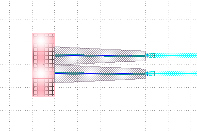

Demultiplexer
^^^^^^^^^^^^^^^^^^^^^^^^^^^^^^^^^^^^^^^^^^

Full script
--------------------------------------
::

    from fnpcell import all as fp
    from gpdk import all as pdk
    from gpdk.technology import get_technology

    class Demultiplexer2(fp.PCell):
        def build(self):
            insts, elems, ports = super().build()
            # fmt: off
            TECH = get_technology()

            ec = pdk.Fixed_Edge_Coupler(name="e")
            dc31 = pdk.DirectionalCouplerBend(
                coupler_spacing=1.5,
                coupler_length=31,
                bend_radius=25,
                waveguide_type=TECH.WG.MWG.C.WIRE,
            )
            dc18 = pdk.DirectionalCouplerBend(
                coupler_spacing=1.5,
                coupler_length=18,
                bend_radius=25,
                waveguide_type=TECH.WG.MWG.C.WIRE,
            )
            dc3 = pdk.DirectionalCouplerBend(
                coupler_spacing=1.5,
                coupler_length=3,
                bend_radius=25,
                waveguide_type=TECH.WG.MWG.C.WIRE,
            )
            tm = pdk.Fixed_Terminator_TE_1550(
                length=30,
                waveguide_type=TECH.WG.MWG.C.WIRE,
                transform=fp.rotate(degrees=180),
            )
            pd = pdk.Fixed_Photo_Detector(name="p")

            ec_0 = ec.translated(-100, 150)
            ec_1 = ec.translated(-100, -150)

            dc_0 = dc31.translated(200, 0)
            dc_1 = dc18.translated(400, 0)
            dc_2 = dc3.translated(600, 0)
            dc_3_0 = dc31.translated(dc_2["op_3"].position[0] - dc31["op_0"].position[0], 180)
            dc_3_1 = dc31.translated(dc_2["op_2"].position[0] - dc31["op_1"].position[0], -180)

            t_0 = tm.translated(500, 280)
            t_1 = tm.translated(500, -280)

            dc_4_0 = dc3.translated(820, 180)
            dc_4_1 = dc3.translated(820, -180)

            pd_0 = pd.translated(970, 300)
            pd_1 = pd.translated(970, 60)
            pd_2 = pd.translated(970, -60)
            pd_3 = pd.translated(970, -300)

            links = fp.create_links(
                link_type=TECH.WG.SWG.C.WIRE,
                bend_factory=TECH.WG.SWG.C.WIRE.BEND_EULER,
                specs=[
                    ec_0["op_0"] >> dc_0["op_0"],
                    ec_1["op_0"] >> dc_0["op_1"],
                    #
                    (dc_0["op_3"] >> dc_1["op_0"], 500),
                    dc_0["op_2"] >> dc_1["op_1"],
                    dc_1["op_3"] >> dc_2["op_0"],
                    (dc_1["op_2"] >> dc_2["op_1"], 500),
                    #
                    dc_2["op_3"] >> dc_3_0["op_1"],
                    dc_2["op_2"] >> dc_3_1["op_0"],
                    t_0["op_0"] >> dc_3_0["op_0"],
                    t_1["op_0"] >> dc_3_1["op_1"],
                    #
                    (dc_3_0["op_3"] >> dc_4_0["op_0"], 300),
                    dc_3_0["op_2"] >> dc_4_0["op_1"],
                    dc_3_1["op_3"] >> dc_4_1["op_0"],
                    (dc_3_1["op_2"] >> dc_4_1["op_1"], 300),
                    #
                    dc_4_0["op_3"] >> pd_0["op_0"],
                    dc_4_0["op_2"] >> pd_1["op_0"],
                    dc_4_1["op_3"] >> pd_2["op_0"],
                    dc_4_1["op_2"] >> pd_3["op_0"],
                ],
            )

            insts += ec_0, 'ec_0'
            insts += ec_1, 'ec_1'
            insts += dc_0, 'dc_0'
            insts += dc_1, 'dc_1'
            insts += dc_2, 'dc_2'
            insts += dc_3_0, 'dc_3_0'
            insts += dc_3_1, 'dc_3_1'
            insts += t_0, 't_0'
            insts += t_1, 't_1'
            insts += dc_4_0, 'dc_4_0'
            insts += dc_4_1, 'dc_4_1'
            insts += pd_0, 'pd_0'
            insts += pd_1, 'pd_1'
            insts += pd_2, 'pd_2'
            insts += pd_3, 'pd_3'
            insts += links

            # fmt: on
            return insts, elems, ports

    if __name__ == "__main__":
        from gpdk.components import all as components
        from gpdk.util.path import local_output_file

        gds_file = local_output_file(__file__).with_suffix(".gds")
        library = fp.Library()

        TECH = get_technology()
        naming_table = {}
        # =============================================================
        # fmt: off

        device = Demultiplexer2()
        library += device

        # fmt: on
        # =============================================================
        fp.export_gds(library, file=gds_file, cell_naming_table=naming_table)
        # fp.plot(library)

View GDS layout file
-------------------------------------------
Use Klayout to open the generated original layout.

.. image:: ../example_image/1.1.png

Instantiation of components
-----------------------------------------
The GDS layout shows that there are 15 devices in total, but only 5 devices are instantiated in the program, indicating that some of the devices have the same parameters except for different locations, which are obtained by multiple calls.

::

      ec = pdk.Fixed_Edge_Coupler(name="e") # Instantiate a Fixed_Edge_Coupler with default parameters and name it "ec"
      # The following instantiates three DCs with different coupler_length, whose spacing, bend_radius, and waveguide_type are all the same
      dc31 = pdk.DirectionalCouplerBend(
          coupler_spacing=1.5,
          coupler_length=31,
          bend_radius=25,
          waveguide_type=TECH.WG.MWG.C.WIRE,
      )
      dc18 = pdk.DirectionalCouplerBend(
          coupler_spacing=1.5,
          coupler_length=18,
          bend_radius=25,
          waveguide_type=TECH.WG.MWG.C.WIRE,
      )
      dc3 = pdk.DirectionalCouplerBend(
          coupler_spacing=1.5,
          coupler_length=3,
          bend_radius=25,
          waveguide_type=TECH.WG.MWG.C.WIRE,
      )
      # Instantiate a Fixed_Terminator_TE_1550 and rotate the angle by 180 degrees
      tm = pdk.Fixed_Terminator_TE_1550(
          length=30,
          waveguide_type=TECH.WG.MWG.C.WIRE,
          transform=fp.rotate(degrees=180),
      )
      # Instantiate a Fixed_Photo_Detector with default parameters and name it "pd"
      pd = pdk.Fixed_Photo_Detector(name="p")

Testing and Analysis
---------------------------------------
Based on the instantiated devices then generate ``ec_0`` and ``ec_1``, which are symmetric about the x-axis as their x-position is ``-100`` and their y-position is ``150`` and ``-150``.

::

  ec_0 = ec.translated(-100, 150)
  ec_1 = ec.translated(-100, -150)
  

We try to change the y of both to ``-20,20`` and see that they are close to each other and closer to the x-axis.

We change the rotation angle in ``tm`` to ``0``. We can see that the generated ``tm`` is oriented to the right, while the original ``180`` degrees is oriented to the left.

::

  tm = pdk.Fixed_Terminator_TE_1550(
    length=30,
    waveguide_type=TECH.WG.MWG.C.WIRE,
    transform=fp.rotate(degrees=0)

.. image:: ../example_image/1.4.png

The following code adjusts the horizontal and vertical coordinates of the generated new DC. The value of the x-direction shift is the value of the x-coordinate of ``op_3`` of ``dc_2`` minus the value of the x-coordinate of ``op_0`` of ``dc31``, ``.position[0]`` returns the x-coordinate, and ``.position[1]`` returns the corresponding y-coordinate.

::

  dc_3_0 = dc31.translated(dc_2["op_3"].position[0] - dc31["op_0"].position[0], 180)
  dc_3_1 = dc31.translated(dc_2["op_2"].position[0] - dc31["op_1"].position[0], -180)

Since there are more components and more ports are connected accordingly, automatic connection between ports can be achieved by using the ``create_links`` function.

::

      links = fp.create_links(
                link_type=TECH.WG.SWG.C.WIRE,
                bend_factory=TECH.WG.SWG.C.WIRE.BEND_EULER,
                specs=[
                    ec_0["op_0"] >> dc_0["op_0"],
                    ec_1["op_0"] >> dc_0["op_1"],
                    #
                    (dc_0["op_3"] >> dc_1["op_0"], 500),
                    dc_0["op_2"] >> dc_1["op_1"],
                    dc_1["op_3"] >> dc_2["op_0"],
                    (dc_1["op_2"] >> dc_2["op_1"], 500),
                    #
                    dc_2["op_3"] >> dc_3_0["op_1"],
                    dc_2["op_2"] >> dc_3_1["op_0"],
                    t_0["op_0"] >> dc_3_0["op_0"],
                    t_1["op_0"] >> dc_3_1["op_1"],
                    #
                    (dc_3_0["op_3"] >> dc_4_0["op_0"], 300),
                    dc_3_0["op_2"] >> dc_4_0["op_1"],
                    dc_3_1["op_3"] >> dc_4_1["op_0"],
                    (dc_3_1["op_2"] >> dc_4_1["op_1"], 300),
                    #
                    dc_4_0["op_3"] >> pd_0["op_0"],
                    dc_4_0["op_2"] >> pd_1["op_0"],
                    dc_4_1["op_3"] >> pd_2["op_0"],
                    dc_4_1["op_2"] >> pd_3["op_0"],
                ],
            )
  
Get Pcells information via ``get``
----------------------------------------------

.. note::
   To use ``get`` function, ensure you have upgraded your ``FnPcell`` version to **1.5.2rc5**.

In the latest version of ``FnPcell``, the information such as port positions, names, orientations, etc., can be collected by ``get`` function. Below scripts shows the usage of how to get the port positions of the Pcells which we initiate in ``Demultiplexer2``::

    pd_2 = device.get("pd_2", pdk.Fixed_Photo_Detector)
    pd_2_op_0 = pd_2["op_0"]
    print(pd_2_op_0.position)

    (970.0, -60.0)

The first item in the bracket of ``get`` returns the key of the Pcell we initiate before, ``pd_2``, which is a fixed photo detector been translated to ``(970, -60)``. The second item make sure that the type of the key is the one we are getting the information and is optional to insert.

It is also available to transform e.g. ``translated``, ``rotated``, ``mirrored``  the Pcell first then get the information.::

    pd_3 = device.translated(20, 0).get("pd_3")
    pd_3_op_0 = pd_3["op_0"]
    print(pd_3_op_0.position)

    (990.0, -300.0)

``pd_3`` is also a fixed photo detector which positioned at  ``(970, -300)`` in the above script. By the ``get`` function, we first translated ``(20, 0)`` and get the position information of the port ``op_0``.

Summary
----------------------------
Although there are more devices and Ports involved in demultiplexer devices, multiple devices can be easily generated and repositioned using fnpcell calls, and then they can be easily interconnected using the Linked function.              
              
