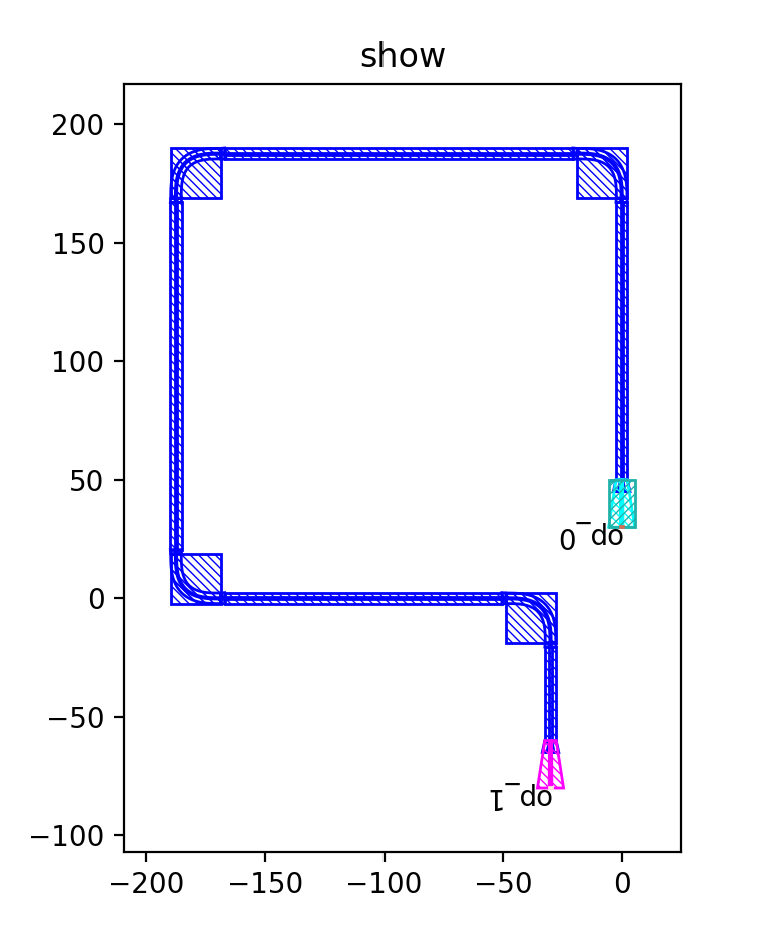
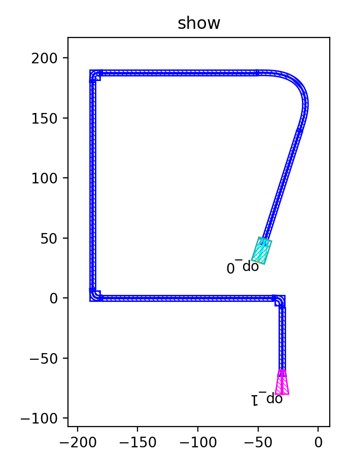

Example: LinkSmooth
^^^^^^^^^^^^^^^^^^^^^^^^^^^^^^^^^^^^^^^^^^^^^^^^^^^^^^^

Full script
-----------------------------------

::

  import math
  from fnpcell import all as fp
  from gpdk import all as pdk
  from gpdk.technology import get_technology
  from gpdk.technology.waveguide_factory import EulerBendFactory
  if __name__ == "__main__":
      from pathlib import Path
      gds_file = Path(__file__).parent / "local" / Path(__file__).with_suffix(".gds").name
      library = fp.Library()
      TECH = get_technology()

      fixed_bend = pdk.BendEuler90(radius_min=20, slab_square=True, waveguide_type=TECH.WG.FWG.C.WIRE)
      R = fixed_bend.raw_curve.radius_eff
      print("R", R)
      ms = 150
      s = 30
      e = -30
      points = [(0, s), (0, 2 * R + ms), (-2 * R - ms, 2 * R + ms), (-2 * R - ms, 0), (e, 0), (e, -80)]
      def bend_factory(central_angle: float):
          if abs(central_angle) != math.pi / 2:
              raise NotImplementedError()
          result = fixed_bend if central_angle > 0 else fixed_bend.v_mirrored()
          return result, R, ("op_0", "op_1")
      library += fp.LinkSmooth(
          points,
          start_type=TECH.WG.SWG.C.WIRE,
          end_type=TECH.WG.MWG.C.WIRE,
          link_type=TECH.WG.FWG.C.EXPANDED,
          bend_factory=bend_factory
      )
      # fp.export_gds(library, file=gds_file)
      fp.plot(library)
      

After running, we get the following figure, from which we can see that the starting port is ``SWG`` and the ending port is ``MWG``. ``points`` contains a total of six points, of which the first and last points are the coordinates of the starting waveguide and the ending waveguide, and the rest of the points are path points.

In the path connecting the two ends of the waveguide, we use the defined form of ``bend_factory`` which waveguide is ``BendEuler90``. This time we will change the first point in ``points`` to ``(-50,s)``, and run the script.

As you can see, the first corner does not meet the 90 degree case replaced with a normal EulerBend, the other several corners are still using the ``EulerBend90``.
      
      
      
      
      
      
      
      
      
      
      
      
      
      
      
      
      
      
      
      
      
      
      
      
      
      
      
      
      
      
      
      
      
