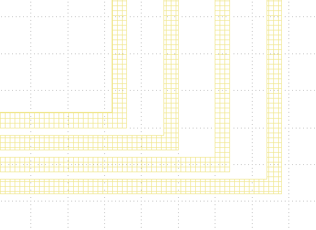
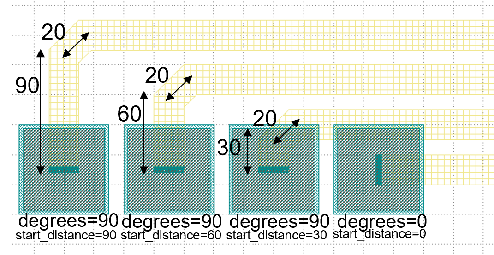

Example: Linked Electrical 2
^^^^^^^^^^^^^^^^^^^^^^^^^^^^^^^^^^^^^^^^^^^^^^^^^^^^^^^^^^^^^^
Full script
------------------------------------------------------

::

    from dataclasses import dataclass
    from fnpcell import all as fp
    from gpdk import all as pdk
    from gpdk.technology import get_technology

    @dataclass(frozen=True)
    class CircularBendFactory:
        radius: float = 80
        def __call__(self, central_angle: float):
            bend = fp.g.CircularBend(radius=self.radius, radians=central_angle)
            return bend, self.radius

    @fp.pcell_class()
    @dataclass(eq=False)
    class LinkedElec2(fp.PCell):
        # fmt: off

        def build(self):
            insts, elems, ports = super().build()
            TECH = get_technology()
            pad_w = pdk.BondPad(pad_width=120, pad_height=60)
            pad = pdk.BondPad(pad_width=60, pad_height=60)
            start_pads_0 = [
                pad_w.translated(-110, -30),
                pad_w.translated(20, -30),
                pad_w.translated(260, -30),
                pad.translated(560, -30),
                pad_w.translated(660, -30),
                pad.translated(760, -30),
                pad.translated(830, -30),
                pad.translated(900, -30),
                pad.translated(970, -30),
            ]
            start_pads_1 = [
                pad.translated(-70, 120),
                pad.translated(60, 120),
                pad_w.translated(170, 120),
                pad_w.translated(360, 120),
                pad_w.translated(490, 120),
                pad.translated(600, 120),
                pad.translated(720, 120),
                pad.translated(780, 120),
                pad.translated(850, 120),
                pad.translated(920, 120),
                pad.translated(990, 120),
            ]

            end_pads_c0 = [
                # center
                pad_w.translated(1220, 1200),
                pad_w.translated(1680, 1200),
            ]

            end_pads_t0 = [
                # top
                pad.translated(2200, 2210),
                pad.translated(2200, 2140),
                pad.translated(2200, 2070),
                pad.translated(2200, 2000),
            ]

            end_pads_b0 = [
                # bottom
                pad_w.rotated(degrees=90).translated(2340, 840),
                pad_w.rotated(degrees=90).translated(2200, 740),
                pad.translated(2270, 645),
                pad.translated(2200, 610),
                pad.translated(2270, 575),
                pad.translated(2200, 540),
                pad.translated(2270, 505),
                pad.translated(2340, 470),
                pad.translated(2410, 435),
                pad.translated(2480, 400),
                pad.translated(2270, 365),
                pad.translated(2340, 330),
                pad.translated(2410, 295),
                pad.translated(2480, 260),

            ]

            to = fp.Waypoint
            MT = "ep_0"
            M2_20 = TECH.METAL.M2.W20
            MT_20 = TECH.METAL.MT.W20
            M2_40 = TECH.METAL.M2.W40
            MT_40 = TECH.METAL.MT.W40
            M2_80 = TECH.METAL.M2.W80
            MT_80 = TECH.METAL.MT.W80

            # fitting_function_80 = None
            # fitting_function_20 = None
            fitting_function_80 = TECH.FITTING_FUNCTION.Stubbed(stub_width=80, stub_right_angle=False)
            fitting_function_20 = TECH.FITTING_FUNCTION.Stubbed(stub_width=20, stub_right_angle=False)
            # fitting_function_80 = TECH.FITTING_FUNCTION.Stubbed(stub_width=80, stub_right_angle=True)
            # fitting_function_20 = TECH.FITTING_FUNCTION.Stubbed(stub_width=20, stub_right_angle=True)
            # fitting_function_80 = TECH.FITTING_FUNCTION.SmoothCircular(radius=80)
            # fitting_function_20 = TECH.FITTING_FUNCTION.SmoothCircular(radius=20)
            device = fp.Linked(
                metal_min_distance=150,
                metal_start_distance=150,
                metal_end_distance=150,
                metal_fitting_function=fitting_function_80,
                links=[
                    # top
                    fp.LinkBetween(
                        start_pads_0[0][MT].with_orientation(degrees=90), end_pads_t0[0][MT].with_orientation(degrees=180),
                        # waypoints=[to(400, 1840, 0), to(500, 1940, 90)],
                        waypoints=[fp.Offset.until_y(1840), fp.Offset.until_x(500)],
                        min_distance=40,
                        metal_line_type=[(0, M2_40), (300, MT_40)],
                    ),
                    fp.LinkBetween(
                        start_pads_1[0][MT].with_orientation(degrees=90), end_pads_t0[1][MT].with_orientation(degrees=180),
                        waypoints=[to(500, 1780, 0), to(600, 1880, 90)],
                        min_distance=20,
                        metal_line_type=[(0, MT_20)],
                    ),
                    fp.LinkBetween(
                        start_pads_0[1][MT].with_orientation(degrees=90), end_pads_t0[2][MT].with_orientation(degrees=180),
                        waypoints=[to(600, 1720, 0), to(700, 1820, 90)],
                        min_distance=20,
                        metal_line_type=[(0, M2_40), (300, MT_40)],
                    ),
                    fp.LinkBetween(
                        start_pads_1[1][MT].with_orientation(degrees=90), end_pads_t0[3][MT].with_orientation(degrees=180),
                        waypoints=[to(700, 1680, 0), to(800, 1780, 90) ],
                        min_distance=20,
                        metal_line_type=[(0, MT_20)],
                    ),
                    # center
                    fp.LinkBetween(
                        start_pads_1[2][MT].with_orientation(degrees=90), end_pads_c0[0][MT].with_orientation(degrees=180),
                        metal_line_type=[(0, MT_80)],
                    ),
                    fp.LinkBetween(
                        start_pads_0[2][MT].with_orientation(degrees=90), end_pads_c0[1][MT].with_orientation(degrees=-90),
                        start_distance=1140,
                        metal_line_type=[(0, M2_80), (300, MT_80)],
                    ),
                    # bottom
                    fp.LinkBetween(
                        start_pads_1[3][MT].with_orientation(degrees=90), end_pads_b0[0][MT].with_orientation(degrees=90),
                        metal_line_type=[(0, MT_80), (-200, M2_80)],
                    ),
                    fp.LinkBetween(
                        start_pads_1[4][MT].with_orientation(degrees=90), end_pads_b0[1][MT].with_orientation(degrees=90),
                        metal_line_type=[(0, MT_80)],
                    ),
                    fp.LinkBetween(
                        start_pads_0[3][MT].with_orientation(degrees=90), end_pads_b0[2][MT].with_orientation(degrees=180),
                        metal_line_type=[(0, M2_40), (300, MT_40), (-200, M2_40)],
                    ),
                    fp.LinkBetween(
                        start_pads_1[5][MT].with_orientation(degrees=90), end_pads_b0[3][MT].with_orientation(degrees=180),
                        metal_line_type=[(0, MT_20)],
                    ),
                    fp.LinkBetween(
                        start_pads_0[4][MT].with_orientation(degrees=90), end_pads_b0[4][MT].with_orientation(degrees=180),
                        metal_line_type=[(0, M2_40), (300, MT_40), (-200, M2_40)],
                    ),
                    #
                    fp.LinkBetween(
                        start_pads_1[6][MT].with_orientation(degrees=90), end_pads_b0[5][MT].with_orientation(degrees=180),
                        metal_line_type=[(-240, M2_20)],
                    ),
                    fp.LinkBetween(
                        start_pads_1[7][MT].with_orientation(degrees=90), end_pads_b0[6][MT].with_orientation(degrees=180),
                        # start_distance=90,
                        metal_line_type=[(-200, M2_20)],
                    ),
                    fp.LinkBetween(
                        start_pads_1[8][MT].with_orientation(degrees=90), end_pads_b0[7][MT].with_orientation(degrees=180),
                        # start_distance=60,
                        metal_line_type=[(-200, M2_20)],
                    ),
                    fp.LinkBetween(
                        start_pads_1[9][MT].with_orientation(degrees=90), end_pads_b0[8][MT].with_orientation(degrees=180),
                        # start_distance=30,
                        metal_line_type=[(-200, M2_20)],
                    ),
                    fp.LinkBetween(
                        start_pads_1[10][MT].with_orientation(degrees=90), end_pads_b0[9][MT].with_orientation(degrees=180),
                        metal_line_type=[(-270, M2_20)],
                    ),
                    #
                    fp.LinkBetween(
                        start_pads_0[5][MT].with_orientation(degrees=90), end_pads_b0[10][MT].with_orientation(degrees=-90),
                        start_distance=90,
                        metal_line_type=[(0, M2_20)],
                        fitting_function=fitting_function_20,
                    ),
                    fp.LinkBetween(
                        start_pads_0[6][MT].with_orientation(degrees=90), end_pads_b0[11][MT].with_orientation(degrees=-90),
                        start_distance=60,
                        metal_line_type=[(0, M2_20)],
                        fitting_function=fitting_function_20,
                    ),
                    fp.LinkBetween(
                        start_pads_0[7][MT].with_orientation(degrees=90), end_pads_b0[12][MT].with_orientation(degrees=-90),
                        start_distance=30,
                        metal_line_type=[(0, M2_20)],
                        fitting_function=fitting_function_20,
                    ),
                    fp.LinkBetween(
                        start_pads_0[8][MT].with_orientation(degrees=0), end_pads_b0[13][MT].with_orientation(degrees=-90),
                        start_distance=0,
                        metal_line_type=[(0, M2_20)],
                        fitting_function=fitting_function_20,
                    ),
                ],
                ports=[] #[sb10["op_0"], s40["op_1"]],
            )
            insts += device
            # fmt: on
            return insts, elems, ports

    if __name__ == "__main__":
        from pathlib import Path
        import gpdk.components.all
        gds_file = Path(__file__).parent / "local" / Path(__file__).with_suffix(".gds").name
        library = fp.Library()
        TECH = get_technology()
        # =============================================================
        # fmt: off
        library += LinkedElec2()
        # fmt: on
        # =============================================================
        fp.export_gds(library, file=gds_file)
        fp.export_pls(library, file=gds_file.with_suffix(".pls"), components=gpdk.components.all)
        fp.plot(library)
        
Run the full program once to generate the following GDS layout:     

Parameters and testing description
---------------------------------------------

Components positioning
"""""""""""""""""""""""""""""""""""""""""""""
There are a large number of BondPads in the entire layout, but they all consist of two sizes of Bond Pads: ``pad_w`` and ``pad``.

::

    	pad_w = pdk.BondPad(pad_width=120, pad_height=60)
    	pad = pdk.BondPad(pad_width=60, pad_height=60)
      
The following calls to ``pad_w`` and ``pad`` are made multiple times to generate the BondPad group, and the following comments within the code explain what each part does.      

::

    # Create the first set of starting pads
    start_pads_0 = [
        pad_w.translated(-110, -30),
        pad_w.translated(20, -30),
        pad_w.translated(260, -30),
        pad.translated(560, -30),
        pad_w.translated(660, -30),
        pad.translated(760, -30),
        pad.translated(830, -30),
        pad.translated(900, -30),
        pad.translated(970, -30),
    ]
    # Create the second set of starting pads
    start_pads_1 = [
        pad.translated(-70, 120),
        pad.translated(60, 120),
        pad_w.translated(170, 120),
        pad_w.translated(360, 120),
        pad_w.translated(490, 120),
        pad.translated(600, 120),
        pad.translated(720, 120),
        pad.translated(780, 120),
        pad.translated(850, 120),
        pad.translated(920, 120),
        pad.translated(990, 120),
    ]
    # Create pads for the middle part of the layout
    end_pads_c0 = [
        # center
        pad_w.translated(1220, 1200),
        pad_w.translated(1680, 1200),
    ]
    # Create pads for the top part of the layout
    end_pads_t0 = [
        # top
        pad.translated(2200, 2210),
        pad.translated(2200, 2140),
        pad.translated(2200, 2070),
        pad.translated(2200, 2000),
    ]
    # Create pads for the bottom part of the layout
    end_pads_b0 = [
        # bottom
        pad_w.rotated(degrees=90).translated(2340, 840),
        pad_w.rotated(degrees=90).translated(2200, 740),
        pad.translated(2270, 645),
        pad.translated(2200, 610),
        pad.translated(2270, 575),
        pad.translated(2200, 540),
        pad.translated(2270, 505),
        pad.translated(2340, 470),
        pad.translated(2410, 435),
        pad.translated(2480, 400),
        pad.translated(2270, 365),
        pad.translated(2340, 330),
        pad.translated(2410, 295),
        pad.translated(2480, 260),
    ]
    # Instantiate the waypoint function as to for easy calling
    to = fp.Waypoint
    # Use MT instead of "ep_0" to facilitate the use of the connection later
    MT = "ep_0"
    # Call different types and widths of line types for later use when setting metal_line_type
    M2_20 = TECH.METAL.M2.W20
    MT_20 = TECH.METAL.MT.W20
    M2_40 = TECH.METAL.M2.W40
    MT_40 = TECH.METAL.MT.W40
    M2_80 = TECH.METAL.M2.W80
    MT_80 = TECH.METAL.MT.W80
    
The code below controls the corner of the wiring: if ``None``, the corner is right angle by default. If ``TECH.FITTING_FUNCTION.Stubbed``, the corner is a ``45°`` angle of the specified length. If set the code to ``TECH.FITTING_FUNCTION.SmoothCircular``, the corner becomes a rounded corner with the specified radius.         

::

        fitting_function_80 = None
        fitting_function_20 = None
        # fitting_function_80 = TECH.FITTING_FUNCTION.Stubbed(stub_width=80, stub_right_angle=False)
        # fitting_function_20 = TECH.FITTING_FUNCTION.Stubbed(stub_width=20, stub_right_angle=False)
        # fitting_function_80 = TECH.FITTING_FUNCTION.Stubbed(stub_width=80, stub_right_angle=True)
        # fitting_function_20 = TECH.FITTING_FUNCTION.Stubbed(stub_width=20, stub_right_angle=True)
        # fitting_function_80 = TECH.FITTING_FUNCTION.SmoothCircular(radius=40)
        # fitting_function_20 = TECH.FITTING_FUNCTION.SmoothCircular(radius=20)
        
        
The default right angle is tested first and the following figure is obtained.       

From the above figure, we can see that the corners are right angles, next comment out the ``None`` code, open the following two lines of code and run.

::

        fitting_function_80 = TECH.FITTING_FUNCTION.Stubbed(stub_width=80, stub_right_angle=False)
        fitting_function_20 = TECH.FITTING_FUNCTION.Stubbed(stub_width=20, stub_right_angle=False)
        

        
After running it, we can see that it is still a right angle and nothing has changed because ``stub_right_angle=False``, we change it to ``True`` and run it once. From the figure below, we can see that the measured length at the center line of the corner are 80 and 20 as set.

The code below mainly controls the connection of the four groups of pads at the bottom right of the layout, specifying the direction of the two end lines, the starting distance, the type of metal wire and the fitting function, etc. After running, the layout fragment is intercepted and marked with a description.

::

        fp.LinkBetween(
            start_pads_0[5][MT].with_orientation(degrees=90), end_pads_b0[10][MT].with_orientation(degrees=-90),
            start_distance=90,
            metal_line_type=[(0, M2_20)],
            fitting_function=fitting_function_20,
        ),
        fp.LinkBetween(
            start_pads_0[6][MT].with_orientation(degrees=90), end_pads_b0[11][MT].with_orientation(degrees=-90),
            start_distance=60,
            metal_line_type=[(0, M2_20)],
            fitting_function=fitting_function_20,
        ),
        fp.LinkBetween(
            start_pads_0[7][MT].with_orientation(degrees=90), end_pads_b0[12][MT].with_orientation(degrees=-90),
            start_distance=30,
            metal_line_type=[(0, M2_20)],
            fitting_function=fitting_function_20,
        ),
        fp.LinkBetween(
            start_pads_0[8][MT].with_orientation(degrees=0), end_pads_b0[13][MT].with_orientation(degrees=-90),
            start_distance=0,
            metal_line_type=[(0, M2_20)],
            fitting_function=fitting_function_20,
        ),
        

After the testing of the 45° corner is completed, we next test the rounded corners.        

::

      fitting_function_80 = TECH.FITTING_FUNCTION.SmoothCircular(radius=80)
      fitting_function_20 = TECH.FITTING_FUNCTION.SmoothCircular(radius=20)
      
      
Since the radius value is not set properly, the error is reported after running.        

We changed ``80`` to ``40`` and ran it again, and took the following part of the corners from the layout, from which we can see that the corners are changed from straight lines to smooth rounded shapes.

.. image:: ../example_image/11.8.png

Finally, as shown in the following image segment, different line types appear in the same linked line. Refer to the relevant instructions in the (:doc:`example_linked_elec.py`) file for details on how to use it.

        
        
        
        
        
        
        
        
        
        
        
        
        
        
        
        
        
        
        
        
        
        
        
        
        
        
        
        
        
        
        
        
        
        
        
        
        
        
        
        
        
        
        
        
        
        
        
        
        
        
        
        
        
        
        
        
        
        
        
        
        
        
