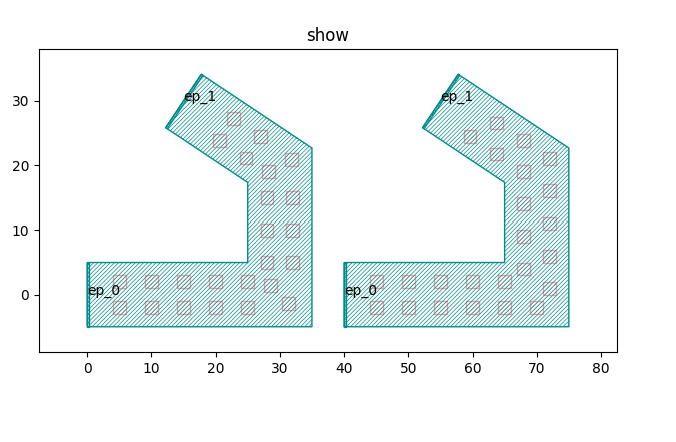
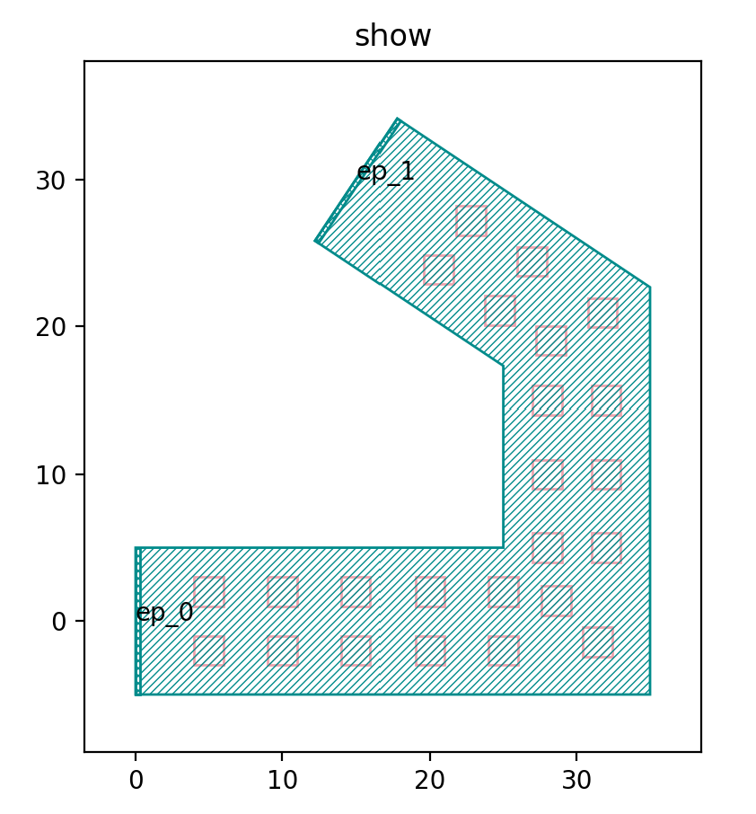
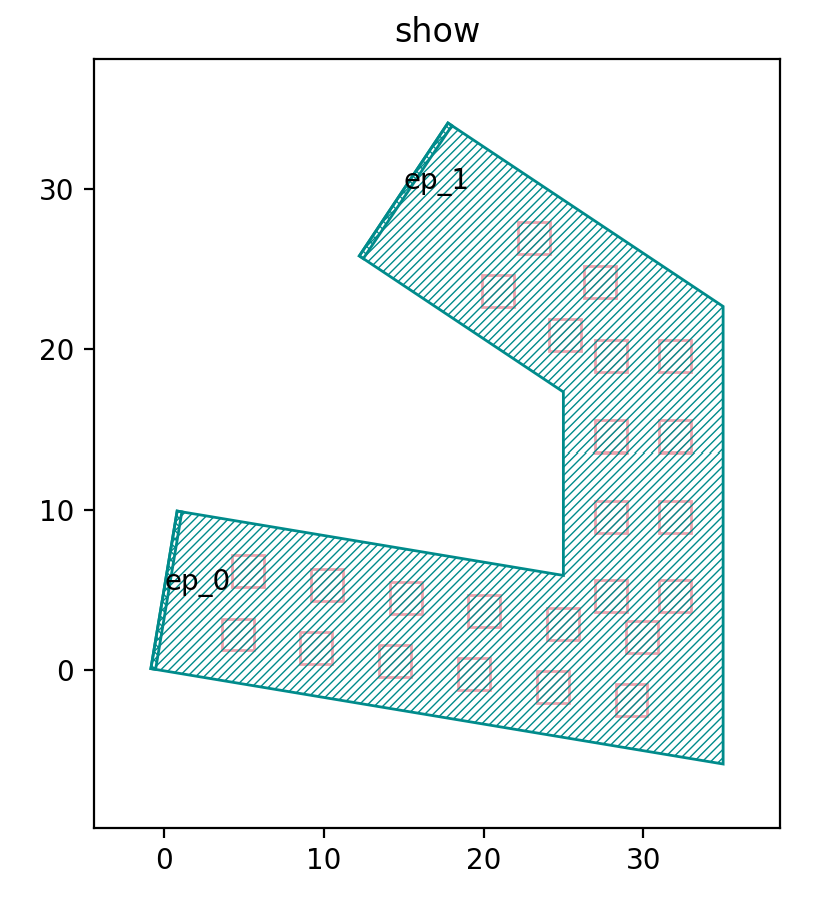
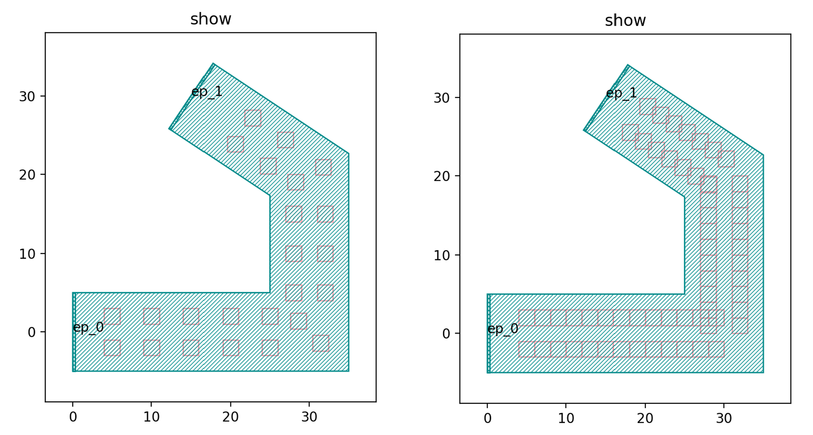
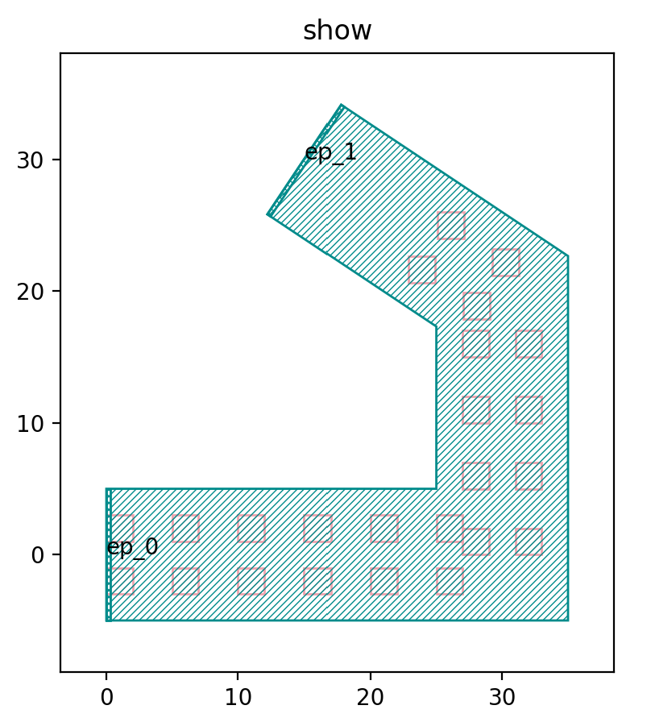
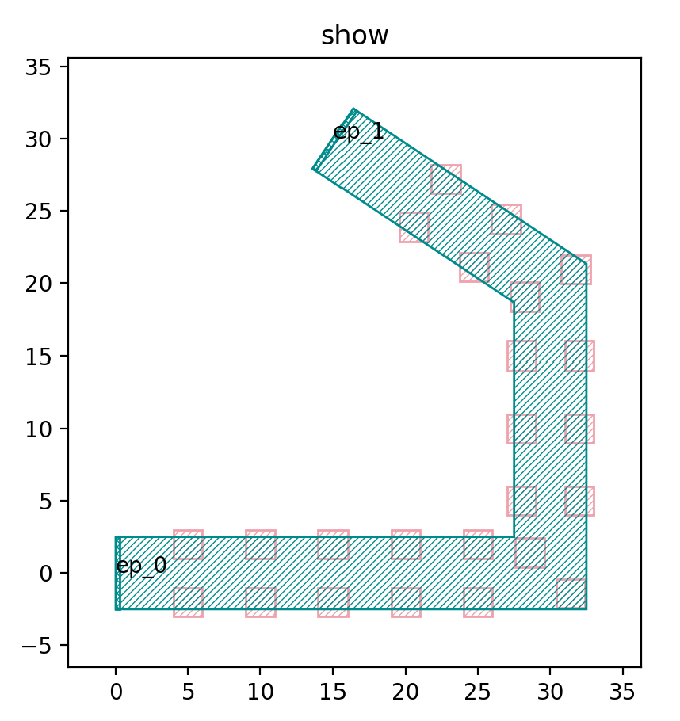
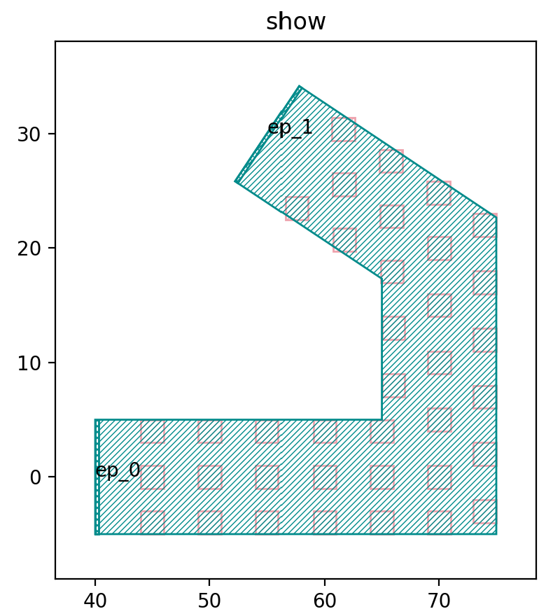

Sampler Periodic
^^^^^^^^^^^^^^^^^^^^^^^^^^^^^^^^^^^^^^^^^^^^^^

Full script
-----------------------------------------

::

  import math
  from fnpcell import all as fp
  from gpdk.technology import get_technology

  if __name__ == "__main__":
      # fixed template start
      from pathlib import Path
      gds_file = Path(__file__).parent / "local" / Path(__file__).with_suffix(".gds").name
      library = fp.Library()
      TECH = get_technology()
      from gpdk.geometry.sampler_periodic import SamplerPeriodic

      path = fp.g.Polyline([(0.0, 0.0), (30.0, 0.0), (30.0, 20.0), (15.0, 30.0)])

      def content_for_sample2(sample: fp.SampleInfo):
          x, y = sample.position
          orientation = sample.orientation
          distance = 2
          dx = distance * math.cos(orientation + math.pi / 2)
          dy = distance * math.sin(orientation + math.pi / 2)
          return fp.Composite(
              fp.el.Rect(width=2, height=2, layer=TECH.LAYER.M1_DRW).translated(x + dx, y + dy),
              fp.el.Rect(width=2, height=2, layer=TECH.LAYER.M1_DRW).translated(x - dx, y - dy),
          )

      def content_for_sample1(sample: fp.SampleInfo):
          x, y = sample.position
          print(x, y)
          return fp.el.Rect(width=2, height=2, layer=TECH.LAYER.M1_DRW).translated(x, y)
      sampler = SamplerPeriodic(period=5, reserved_ends=(5, 5))
      mlt = TECH.METAL.MT.W20.updated(line_width=10)
      library += mlt(curve=path).with_patches(content_for_sample2(sample) for sample in sampler(path))
      r1, r2 = path.bundle(size=2, spacing=2 + 2)
      library += mlt(curve=path).with_patches([content_for_sample1(sample) for sample in sampler(r1) + sampler(r2)]).translated(40, 0)
      fp.export_gds(library, file=gds_file)
      fp.plot(library)

Running the full script will generate the following two graphics.

We will describe the code that generates each of the two graphs, starting with a test of the code that generates the left graph.

Left graph
---------------------------------------------------------

Below is the waypoint of the whole graph, we will adjust the ``path`` for before and after comparison.

::

  path = fp.g.Polyline([(0.0, 0.0), (30.0, 0.0), (30.0, 20.0), (15.0, 30.0)]) # original path

Then we adjust the ``path`` and run the script again.

::

  path = fp.g.Polyline([(0.0, 5.0), (30.0, 0.0), (30.0, 20.0), (15.0, 30.0)])

The following functions are defined to generate the rectangular arrays in the left-hand graph.

::

  def content_for_sample2(sample: fp.SampleInfo):
    x, y = sample.position
    orientation = sample.orientation
    distance = 2
    dx = distance * math.cos(orientation + math.pi / 2)
    dy = distance * math.sin(orientation + math.pi / 2)
    return fp.Composite(
        fp.el.Rect(width=2, height=2, layer=TECH.LAYER.M1_DRW).translated(x + dx, y + dy),
        fp.el.Rect(width=2, height=2, layer=TECH.LAYER.M1_DRW).translated(x - dx, y - dy),
    )

Inside the function, ``x``, ``y`` get the horizontal and vertical coordinates of the sample points respectively; ``orientation`` gets the direction of the sample points; ``dx``, ``dy`` are the functions that define the distance between the two columns of the graph; the shape and position of the two columns of the array graph are defined in ``fp.Composite``.

.. image:: ../example_image/4.4.png

We then adjust the distance value to ``5``, from the following figure can be seen that the spacing between the two columns of graphics increases.

``SamplerPeriodic`` is a function used to generate periodic sampling points, where the ``period`` is the spacing period of the graph, we will change it to 2 for comparison, the period of the left graph in the figure below is 5, and the period of the right graph is 2.

::

  sampler = SamplerPeriodic(period=5, reserved_ends=(5, 5))

The ``reserved_ends`` parameter in the ``SamplerPeriodic`` function is used to control the position of the initial and end points of each column of sampling points. Below we change ``reserved_ends=(5, 5)`` to ``reserved_ends=(1, 8)``. From the figure below, we can see that the end positions are shortened by 8 and the initial end positions are shortened by only 1, indicating that the first value in the parentheses is used to control the initial end, while the second value is used to control the end.

The following script is used to adjust the width of the area, which was 10 before, and we run the script after adjusting it to 5.

::

  mlt = TECH.METAL.MT.W20.updated(line_width=5)

As you can see in the figure above, the width of the green area has changed to 5, which is significantly narrower than the original 10.

Right graph
---------------------------------------
The generated array is returned by passing sample points to the following functions.

::

  def content_for_sample1(sample: fp.SampleInfo):
    x, y = sample.position
      return fp.el.Rect(width=2, height=2, layer=TECH.LAYER.M1_DRW).translated(x, y)

.. image:: ../example_image/4.8.png

The difference with the function that generates the left side of the graph is that the function that generates the right side of the graph only generates a single column array of graphs, and the following procedure can be used to generate multiple columns of graphs.

::

  r1, r2 = path.bundle(size=2, spacing=4)
  library += mlt(curve=path).with_patches([content_for_sample1(sample) for sample in sampler(r1) + sampler(r2)]).translated(40, 0)

In the above script, the ``size`` of the bundle function is the number of columns to be generated, and the ``spacing`` is the spacing between columns; then the graph is laid out by line path using the ``with_patches`` function. Below we change the script to generate three columns of graphs.

::

  r1, r2, r3 = path.bundle(size=3, spacing=4)
  library += mlt(curve=path).with_patches([content_for_sample1(sample) for sample in sampler(r1) + sampler(r2) + sampler(r3)]).translated(40, 0)

The above example is used to generate an array of shapes along the line segment path.
