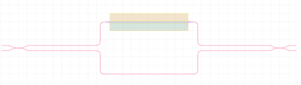
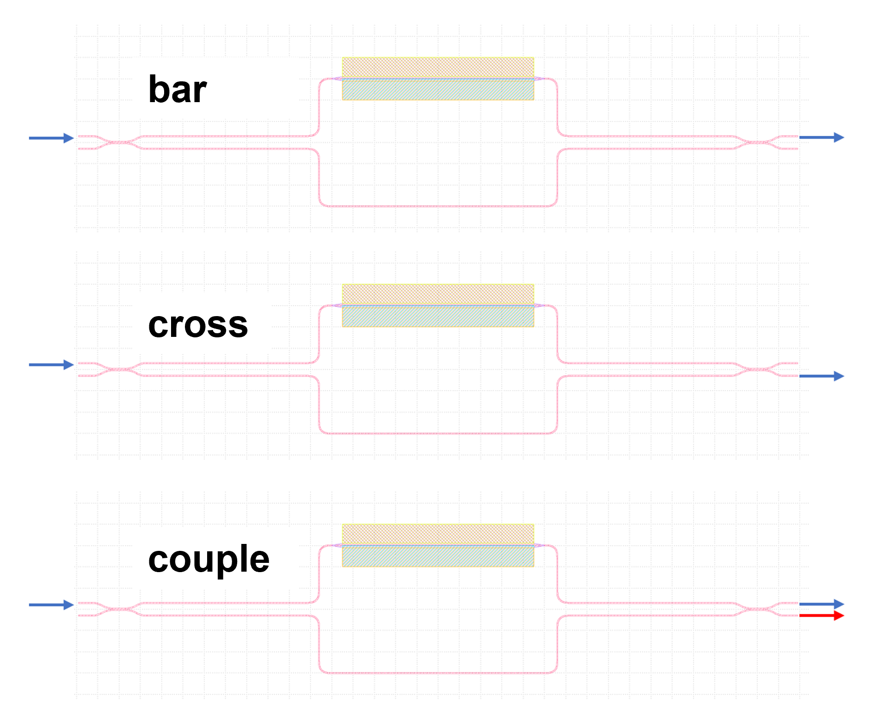
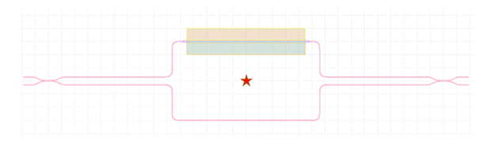
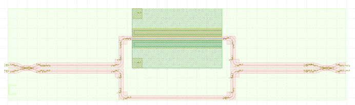
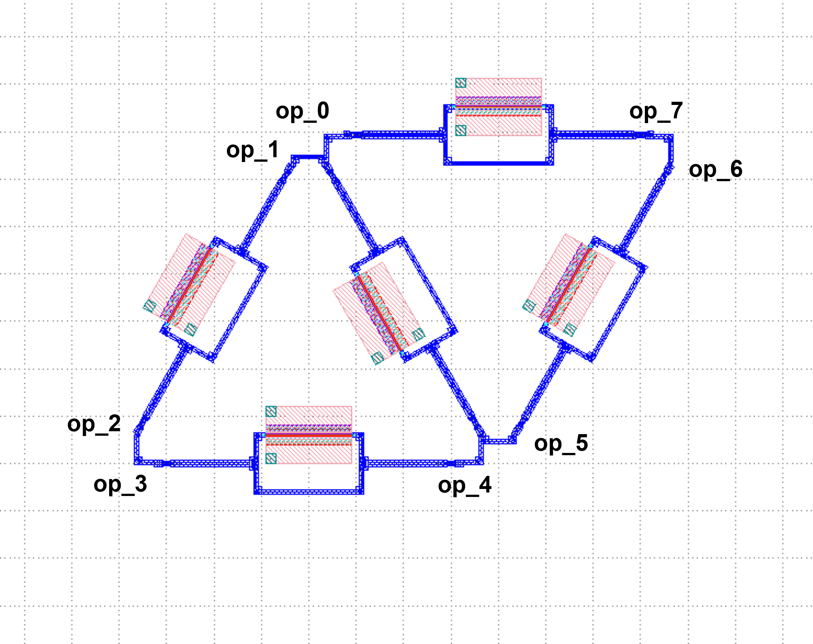
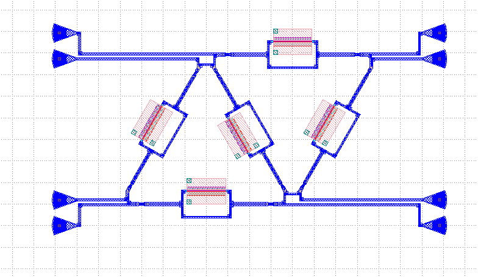
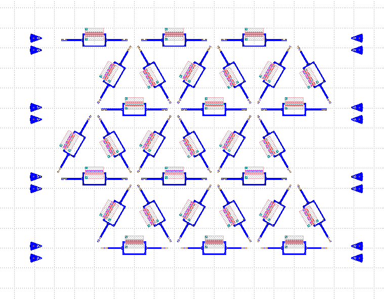
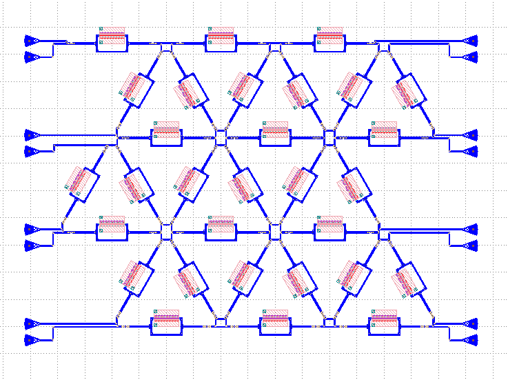

Triangle MZI mesh
^^^^^^^^^^^^^^^^^^^^^^^^^^^^
In addition to rectangular programmable photonic circuits, triangular network-based programmable photonic circuits have also been widely used. This section explains in detail how to build a triangular network programmable photonic link based on PhotoCAD starting from the unit element MZI.

Part I. Build MZI units
------------------------------------------------------
Before building the triangular mesh, the single components in the gpdk need to be supplemented. Here we choose to build a single arm tunable on-chip integrated MZI. The tunability of this device is achieved through a PN junction (electrically tunable), but of course a thermally tunable MZI can also be used to build this triangular mesh.

First, import the library file, where we need to use ``DirectionalCouplerSBend``, ``Straight``, ``PnPhaseShifter``.

::

    from dataclasses import dataclass
    from typing import Tuple

    from fnpcell import all as fp
    from gpdk.components.directional_coupler.directional_coupler_sbend import DirectionalCouplerSBend
    from gpdk.components.straight.straight import Straight
    from gpdk.components.pn_phase_shifter.pn_phase_shifter import PnPhaseShifter
    from gpdk.technology import WG, get_technology
    
    
Define the MZI class of the base single component of the mesh.

::


    class MZI(fp.PCell, band="C"):
        p_width: float = fp.PositiveFloatParam(default=1)
        n_width: float = fp.PositiveFloatParam(default=1)
        np_offset: float = fp.FloatParam(default=0)
        wg_length: float = fp.PositiveFloatParam(default=100)
        arm_spacing: float = fp.PositiveFloatParam(default=60)
        dc_length: float = fp.FloatParam(default=100)
        waveguide_type: WG.FWG.C = fp.WaveguideTypeParam(type=WG.FWG.C)
        pn_phase_shifter: fp.IDevice = fp.DeviceParam(type=PnPhaseShifter, port_count=2, pin_count=2, required=False)
        straight_waveguide: fp.IDevice = fp.DeviceParam(type=Straight, port_count=2, required=False)
        directional_coupler_left: fp.IDevice = fp.DeviceParam(type=DirectionalCouplerSBend, port_count=4, required=False)
        directional_coupler_right: fp.IDevice = fp.DeviceParam(type=DirectionalCouplerSBend, port_count=4, required=False)
        port_names: fp.IPortOptions = fp.PortOptionsParam(count=4,default=["op_0", "op_1", "op_2", "op_3"])

        def _default_waveguide_type(self):
            return get_technology().WG.FWG.C.WIRE

        def _default_pn_phase_shifter(self):
            return PnPhaseShifter(
                name="ps", p_width=self.p_width, n_width=self.n_width, np_offset=self.np_offset,
                wg_length=self.wg_length-10, waveguide_type=self.waveguide_type,
                transform=fp.translate(5, 0)
            )
        def _default_straight_waveguide(self):
            return Straight(
                name="straight", waveguide_type=self.waveguide_type, length=self.wg_length, transform=fp.translate(0, -self.arm_spacing)
            )

        def _default_directional_coupler_left(self):
            return DirectionalCouplerSBend(
                name="dc_l", bend_radius=10, waveguide_type=self.waveguide_type, transform=fp.translate(-self.dc_length, -self.arm_spacing / 2)
            )

        def _default_directional_coupler_right(self):
            return DirectionalCouplerSBend(
                name="dc_r", bend_radius=10, waveguide_type=self.waveguide_type, transform=fp.translate(self.wg_length + self.dc_length, -self.arm_spacing / 2)
            )

        def build(self) -> Tuple[fp.InstanceSet, fp.ElementSet, fp.PortSet]:
            insts, elems, ports = super().build()
            # fmt: off

            waveguide_type = self.waveguide_type
            pn_phase_shifter = self.pn_phase_shifter.translated(-self.wg_length / 2, self.arm_spacing / 2)
            straight_waveguide = self.straight_waveguide.translated(-self.wg_length / 2, self.arm_spacing / 2)
            directional_coupler_left = self.directional_coupler_left.translated(-self.wg_length / 2, self.arm_spacing / 2)
            directional_coupler_right = self.directional_coupler_right.translated(-self.wg_length / 2, self.arm_spacing / 2)

            port_names = self.port_names
            ports += directional_coupler_left["op_0"].with_name(port_names[0])
            ports += directional_coupler_left["op_1"].with_name(port_names[1])
            ports += directional_coupler_right["op_2"].with_name(port_names[2])
            ports += directional_coupler_right["op_3"].with_name(port_names[3])

            insts += fp.Linked(
                link_type=waveguide_type,
                bend_factory=self.waveguide_type.BEND_EULER,
                links=[
                    directional_coupler_left["op_3"] >> pn_phase_shifter["op_0"],
                    directional_coupler_left["op_2"] >> straight_waveguide["op_0"],
                    directional_coupler_right["op_0"] >> pn_phase_shifter["op_1"],
                    directional_coupler_right["op_1"] >> straight_waveguide["op_1"],
                ],
                ports=[],
            )

            # fmt: on
            return insts, elems, ports
            
In this case, the MZI consists of two directional couplers, a phase shifter, and a straight waveguide, and the basic structure is shown in the following figure.



Among them, the phase shifter is built based on the PN structure, and by changing the voltage applied to both ends of the PN junction, the carrier concentration can be changed, thus changing the refractive index of the waveguide and eventually the relative phase. Thus, by varying the voltage, the MZI can be made to operate in different operating modes, such as bar, cross or couple, as shown in the following figure.



In this example, after building four single components in sequence and setting the location parameters, you can directly use **PhotoCAD**'s own ``Linked`` method to realize the automatic connection of ports. Next, you need to assign four ports to the ``MZI`` and specify the names. Note that we have panned each component in class so that the origin of the entire ``MZI`` cell is at the center of the ``MZI``. If you do not do this, you will get an error when rotating the ``MZI``, because the rotation operation in **PhotoCAD** is centered on the origin of a single component by default. The origin of the ``MZI`` in this example is shown in the following figure.



Call ``MZI`` in the main function and generate the gds file.

::

    if __name__ == "__main__":
        from gpdk.util.path import local_output_file

        gds_file = local_output_file(__file__).with_suffix(".gds")
        library = fp.Library()

        TECH = get_technology()
        # =============================================================
        # fmt: off

        library += MZI()

        # fmt: on
        # =============================================================
        fp.export_gds(library, file=gds_file)
       
The automatically generated layout is as follows:



Part II. Build programmable triangular MZI mesh
-------------------------------------------------------------------
In this step, the ``MZI`` class constructed in the previous step will be called to realize the construction of a triangular ``MZI`` mesh. We provide two implementations, one is the ``MZI`` mesh without ``grating couplers``, which provides 8 external optical ports (``op_0 ~ op_7``), which can be easily customized to expand the network; the second implementation is to add 8 ``grating couplers`` to the ``MZI`` network, which constitutes a complete closed-loop photonic circuit layout.

MZI Mesh with 8 external optical ports (MZI_triangle_mesh)
##############################################################################
First import the necessary library files.

::

    from dataclasses import dataclass
    from typing import Tuple

    from fnpcell import all as fp
    from gpdk.components.mzm.mzi import MZI
    from gpdk.technology import WG, get_technology
    from gpdk.routing.extended.extended import Extended
    from gpdk.technology.waveguide_factory import EulerBendFactory
    from gpdk.components.grating_coupler.grating_coupler import GratingCoupler
    from gpdk.routing.comp_scan.comp_scan import CompScan,Block
    
Subsequently, the ``MZI_triangle_mesh`` class is constructed.

::


    class MZI_triangle_mesh(fp.PCell, band="C"):
        """
        Attributes:
            p_width: defaults to 1
            n_width: defaults to 1
            np_offset: defaults to 0
            wg_length: defaults to 25
            arm_spacing: defaults to 100
            dc_length: defaults to 100
            waveguide_type: type of waveguide
            pn_phase_shifter: instance of `PnPhaseShifter`, port_count=2, pin_count=2, required=False
            straight_waveguide: instance of `Straight`, port_count=2, required=False
            directional_coupler_left: instance of `DirectionalCouplerSBend`, port_count=2, required=False
            directional_coupler_right: instance of `DirectionalCouplerSBend`, port_count=2, required=False
            port_names: defaults to ["op_0", "op_1", "op_2", "op_3"]

        Examples:
        ```python
        TECH = get_technology()
        mzi = MZI(wg_length=600, waveguide_type=TECH.WG.FWG.C.WIRE)
        fp.plot(mzi)
        ```
        
        """

        side_length: float = fp.PositiveFloatParam(default=400)
        dc_length: float = fp.FloatParam(default=100)
        arm_spacing: float = fp.FloatParam(default=60)
        wg_length: float = fp.FloatParam(default=100)
        waveguide_type: WG.FWG.C = fp.WaveguideTypeParam(type=WG.FWG.C)
        MZI_unit: fp.IDevice = fp.DeviceParam(type=MZI, port_count=4, required=False)
        port_names: fp.IPortOptions = fp.PortOptionsParam(count=8,
                    default=["op_0", "op_1", "op_2", "op_3", "op_4", "op_5", "op_6", "op_7"])

        def _default_waveguide_type(self):
            return get_technology().WG.FWG.C.WIRE

        def _default_MZI_unit(self):
            return MZI(arm_spacing=self.arm_spacing, dc_length=self.dc_length, wg_length=self.wg_length)

        def build(self) -> Tuple[fp.InstanceSet, fp.ElementSet, fp.PortSet]:
            insts, elems, ports = super().build()
            # fmt: off

            waveguide_type = self.waveguide_type
            port_names = self.port_names
            MZI_0 = self.MZI_unit.translated(0,0)
            MZI_1 = self.MZI_unit.rotated(degrees=120).translated(self.side_length / 4, self.side_length / 4 * (3) ** (0.5))
            MZI_2 = self.MZI_unit.rotated(degrees=60).translated(-self.side_length / 4, self.side_length / 4 * (3) ** (0.5))
            MZI_3 = self.MZI_unit.translated(self.side_length / 2, self.side_length / 2 * (3) ** (0.5))
            MZI_4 = self.MZI_unit.rotated(degrees=60).translated(self.side_length * 3 / 4, self.side_length / 4 * (3) ** (0.5))
            ports += MZI_3["op_0"].with_name(port_names[0])
            ports += MZI_2["op_3"].with_name(port_names[1])
            ports += MZI_2["op_0"].with_name(port_names[2])
            ports += MZI_0["op_1"].with_name(port_names[3])
            ports += MZI_0["op_2"].with_name(port_names[4])
            ports += MZI_4["op_1"].with_name(port_names[5])
            ports += MZI_4["op_2"].with_name(port_names[6])
            ports += MZI_3["op_3"].with_name(port_names[7])

            insts += fp.Linked(
                link_type=waveguide_type,
                bend_factory=self.waveguide_type.BEND_EULER,
                links=[
                    MZI_0["op_0"] >> MZI_2["op_1"],
                    MZI_0["op_3"] >> MZI_1["op_0"],
                    MZI_1["op_1"] >> MZI_4["op_0"],
                    MZI_4["op_3"] >> MZI_3["op_2"],
                    MZI_1["op_2"] >> MZI_3["op_1"],
                    MZI_1["op_3"] >> MZI_2["op_2"],
                ],
                ports=[],
            )

            # fmt: on
            return insts, elems, ports

In this section, we construct a triangular mesh photonic circuit based on five MZIs, and the eight ports and their labels have been labeled in the figure as follows:



In the definition of this class we do not introduce the grating coupler, you need to define the grating coupler (or other types of couplers) in the main function; or you can also connect with other custom single components.

MZI Mesh with 8 Grating Couplers (MZI_triangle_mesh_with_GC)
##################################################################################
Again, the necessary library files are imported first:

::

    from dataclasses import dataclass
    from typing import Tuple

    from fnpcell import all as fp
    from gpdk.components.mzm.mzi import MZI
    from gpdk.technology import WG, get_technology
    from gpdk.routing.extended.extended import Extended
    from gpdk.technology.waveguide_factory import EulerBendFactory
    from gpdk.components.grating_coupler.grating_coupler import GratingCoupler
    from gpdk.routing.comp_scan.comp_scan import CompScan,Block
    
Subsequently, the MZI_triangle_mesh_with_GC class is constructed:    


::


    class MZI_triangle_mesh_with_GC(fp.PCell, band="C"):
        """
        Attributes:
            p_width: defaults to 1
            n_width: defaults to 1
            np_offset: defaults to 0
            wg_length: defaults to 25
            arm_spacing: defaults to 100
            dc_length: defaults to 100
            waveguide_type: type of waveguide
            pn_phase_shifter: instance of `PnPhaseShifter`, port_count=2, pin_count=2, required=False
            straight_waveguide: instance of `Straight`, port_count=2, required=False
            directional_coupler_left: instance of `DirectionalCouplerSBend`, port_count=2, required=False
            directional_coupler_right: instance of `DirectionalCouplerSBend`, port_count=2, required=False
            port_names: defaults to ["op_0", "op_1", "op_2", "op_3"]

        Examples:
        ```python
        TECH = get_technology()
        mzi = MZI(wg_length=600, waveguide_type=TECH.WG.FWG.C.WIRE)
        fp.plot(mzi)
        ```
        
        """

        side_length: float = fp.PositiveFloatParam(default=400)
        dc_length: float = fp.FloatParam(default=100)
        arm_spacing: float = fp.FloatParam(default=60)
        wg_length: float = fp.FloatParam(default=100)
        gc_spacing: float = fp.FloatParam(default=50)
        waveguide_type: WG.FWG.C = fp.WaveguideTypeParam(type=WG.FWG.C)
        MZI_unit: fp.IDevice = fp.DeviceParam(type=MZI, port_count=4, required=False)
        grating_coupler: fp.IDevice = fp.DeviceParam(type=GratingCoupler, port_count=1, required=False)

        def _default_waveguide_type(self):
            return get_technology().WG.FWG.C.WIRE

        def _default_MZI_unit(self):
            return MZI(waveguide_type=self.waveguide_type, arm_spacing=self.arm_spacing,
                       dc_length=self.dc_length, wg_length=self.wg_length)

        def _default_grating_coupler(self):
            return GratingCoupler(waveguide_type=self.waveguide_type)

        def build(self) -> Tuple[fp.InstanceSet, fp.ElementSet, fp.PortSet]:
            insts, elems, ports = super().build()
            # fmt: off

            waveguide_type = self.waveguide_type
            port_names = self.port_names
            MZI_0 = self.MZI_unit.translated(0,0)
            MZI_1 = self.MZI_unit.rotated(degrees=120).translated(self.side_length / 4, self.side_length / 4 * (3) ** (0.5))
            MZI_2 = self.MZI_unit.rotated(degrees=60).translated(-self.side_length / 4, self.side_length / 4 * (3) ** (0.5))
            MZI_3 = self.MZI_unit.translated(self.side_length / 2, self.side_length / 2 * (3) ** (0.5))
            MZI_4 = self.MZI_unit.rotated(degrees=60).translated(self.side_length * 3 / 4, self.side_length / 4 * (3) ** (0.5))
            gc_0 = self.grating_coupler.rotated(degrees=180).translated(-self.side_length / 4 * 3, -self.gc_spacing)
            gc_1 = self.grating_coupler.rotated(degrees=180).translated(-self.side_length / 4 * 3, 10)
            gc_2 = self.grating_coupler.rotated(degrees=180).translated(-self.side_length / 4 * 3, self.side_length / 2 * (3) ** (0.5) - 10 )
            gc_3 = self.grating_coupler.rotated(degrees=180).translated(-self.side_length / 4 * 3, self.side_length / 2 * (3) ** (0.5) + self.gc_spacing)
            gc_4 = self.grating_coupler.translated(-self.side_length / 4 * 3 + self.side_length * 2, -self.gc_spacing)
            gc_5 = self.grating_coupler.translated(-self.side_length / 4 * 3 + self.side_length * 2, 10)
            gc_6 = self.grating_coupler.translated(-self.side_length / 4 * 3 + self.side_length * 2,
                                                                        self.side_length / 2 * (3) ** (0.5) - 10)
            gc_7 = self.grating_coupler.translated(-self.side_length / 4 * 3 + self.side_length * 2,
                                                                        self.side_length / 2 * (3) ** (0.5) + self.gc_spacing)
            insts += fp.Linked(
                link_type=waveguide_type,
                bend_factory=self.waveguide_type.BEND_EULER,
                links=[
                    MZI_0["op_1"] >> gc_0["op_0"],
                    MZI_2["op_0"] >> gc_1["op_0"],
                    MZI_2["op_3"] >> gc_2["op_0"],
                    MZI_3["op_0"] >> gc_3["op_0"],
                    MZI_0["op_2"] >> gc_4["op_0"],
                    MZI_4["op_1"] >> gc_5["op_0"],
                    MZI_4["op_2"] >> gc_6["op_0"],
                    MZI_3["op_3"] >> gc_7["op_0"],
                    MZI_0["op_0"] >> MZI_2["op_1"],
                    MZI_0["op_3"] >> MZI_1["op_0"],
                    MZI_1["op_1"] >> MZI_4["op_0"],
                    MZI_4["op_3"] >> MZI_3["op_2"],
                    MZI_1["op_2"] >> MZI_3["op_1"],
                    MZI_1["op_3"] >> MZI_2["op_2"],
                ],
                ports=[],
            )
            # fmt: on
            return insts, elems, ports
            
In this script contains the following parts: 

First, default parameters are set, such as ``waveguide_type``, ``GratingCoupler``, etc.; then each single component is instantiated, including five ``MZI`` and eight ``GratingCoupler``, and the coordinates and rotation angle are defined during the instantiation process. In this part, the coordinate settings of the ``GratingCoupler`` need to be fine-tuned to avoid the generation of flylines. In addition, the ``side_length`` of the triangular network and the ``gc_spacing`` of the ``GratingCoupler`` are adjustable in this example. Subsequently, the devices are connected by the ``Linked`` method. 

Finally the gds file is generated in the main function.

::

    if __name__ == "__main__":
        from gpdk.util.path import local_output_file

        gds_file = local_output_file(__file__).with_suffix(".gds")
        library = fp.Library()

        TECH = get_technology()
        # =============================================================
        # fmt: off

        mesh = MZI_triangle_mesh_with_GC()
        library += mesh

        # fmt: on
        # =============================================================
        fp.export_gds(library, file=gds_file)

The automatically generated layout is as follows:



Triangle MZI array (MZI_triangle_array)
##################################################################################
In this section, we upgrade the level of freedom of building the MZI array by setting ``col`` & ``row`` in the script. ``row`` represents the amount of triangle in the layout; ``col`` means how many ``GratingCoupler`` set will be generated in the layout.

The first 5 for loops are to generate and position all component, including ``MZI``, ``MZI_60``, ``MZI_120``, ``gc_left`` and ``gc_right``. ``MZI_60`` and  ``MZI_120`` represents the rotation of the MZI coompare to ``MZI``. ``gc_left`` and ``gc_right` represents the ``GratingCoupler`` which is located at the left or right side of the circuit. After the generation of each set of components, ``mzi = cast(Mapping[str, fp.ICellRef], insts)`` is to put those components to ``mzi`` for further use.

::

        for i in range(row):
            for j in range(column):
                if j % 2:
                    MZI = self.MZI_unit.translated(self.side_length * 2 * i / 2, self.side_length * j / 2 * (3) ** (0.5))
                else:
                    MZI = self.MZI_unit.translated(self.side_length / 2+ self.side_length * 2 * i / 2, self.side_length * j / 2 * (3) ** (0.5))
                insts += MZI, f"MZI_{i},{j}"

        for i in range(row):
            for j in range(column-1):
                if j % 2:
                    MZI_rotate_60 = self.MZI_unit.rotated(degrees=60).translated(self.side_length * ((-1) + 4 * i) / 4, self.side_length * (2*j+1) / 4 * (3) ** (0.5))
                else:
                    MZI_rotate_60 = self.MZI_unit.rotated(degrees=60).translated(self.side_length * ((1) + 4 * i) / 4, self.side_length * (2*j+1) / 4 * (3) ** (0.5))
                insts += MZI_rotate_60, f"MZI_60_{i},{j}"

        for i in range(row):
            for j in range(column-1):
                if j % 2:
                    MZI_rotate_120 = self.MZI_unit.rotated(degrees=120).translated(self.side_length * ((1)+4 * i) / 4, self.side_length * (2*j+1) / 4 * (3) ** (0.5))
                else:
                    MZI_rotate_120 = self.MZI_unit.rotated(degrees=120).translated(self.side_length * ((3)+4 * i) / 4, self.side_length * (2*j+1) / 4 * (3) ** (0.5))
                insts += MZI_rotate_120, f"MZI_120_{i},{j}"
        mzi = cast(Mapping[str, fp.ICellRef], insts)

        for i in range(column):
            for j in range(2):
                gc = self.grating_coupler.rotated(degrees=180).translated(mzi[f"MZI_0,0"]["op_1"].position[0]-300, -self.gc_spacing + (self.gc_spacing+10)*j+self.side_length*i / 2 * (3) ** (0.5))
                insts += gc, f"gc_left_{i},{j}"

        for i in range(column):
            for j in range(2):
                gc = self.grating_coupler.translated(mzi[f"MZI_0,1"]["op_1"].position[0]+self.side_length*row+250, -self.gc_spacing + (self.gc_spacing+10)*j+self.side_length*i / 2 * (3) ** (0.5))
                insts += gc, f"gc_right_{i},{j}"

        mzi = cast(Mapping[str, fp.ICellRef], insts)

Here we set ``row=3``, ``col=4`` and the components are being positioned:



Next, the ``LinkBetween`` function is used to connect the optical ports, ``TECH.WG.FWG.C.WIRE`` and ``TECH.WG.FWG.C.WIRE.BEND_EULER`` are set to be default type of the waveguide and bend, respectively. Due to the complexity of the connection through each port, several for loops are used in the script to achieve auto-routing no matter the size of the circuit.

::

                    # bot & top line
                    for i in range(row-1):
                        for j in range(column):
                            if j == 0 :
                                link1 = fp.LinkBetween(
                                    start = mzi[f"MZI_{i},{j}"]["op_2"],
                                    end= mzi[f"MZI_{i+1},{j}"]["op_1"],
                                    link_type=TECH.WG.FWG.C.WIRE,
                                    bend_factory=TECH.WG.FWG.C.WIRE.BEND_EULER
                                    )
                                insts += link1
                            if j == column-1:
                                link2 = fp.LinkBetween(
                                    start=mzi[f"MZI_{i},{j}"]["op_3"],
                                    end=mzi[f"MZI_{i + 1},{j}"]["op_0"],
                                    link_type=TECH.WG.FWG.C.WIRE,
                                    bend_factory=TECH.WG.FWG.C.WIRE.BEND_EULER
                                )
                                insts += link2

                    # 60&120 turning
                    for i in range(row):
                        for j in range(column - 1):
                            if i < row:
                                link3 = fp.LinkBetween(
                                    start=mzi[f"MZI_60_{i},{j}"]["op_2"],
                                    end=mzi[f"MZI_120_{i},{j}"]["op_3"],
                                    link_type=TECH.WG.FWG.C.WIRE,
                                    bend_factory=TECH.WG.FWG.C.WIRE.BEND_CIRCULAR
                                )
                                insts += link3
                            if i < row-1:
                                link4 = fp.LinkBetween(
                                    start=mzi[f"MZI_60_{i+1},{j}"]["op_0"],
                                    end=mzi[f"MZI_120_{i},{j}"]["op_1"],
                                    link_type=TECH.WG.FWG.C.WIRE,
                                    bend_factory=TECH.WG.FWG.C.WIRE.BEND_CIRCULAR
                                )
                                insts += link4

                    for i in range(row):
                        for j in range(column-1):
                            if (j % 2==0) or  (j ==0) :
                                link5 = fp.LinkBetween(
                                    start=mzi[f"MZI_60_{i},{j}"]["op_3"],
                                    end=mzi[f"MZI_{i},{j+1}"]["op_2"],
                                    link_type=TECH.WG.FWG.C.WIRE,
                                    bend_factory=TECH.WG.FWG.C.WIRE.BEND_CIRCULAR
                                )
                                insts += link5
                    for i in range(row-1):
                        for j in range(column - 1):
                            if j % 2==1:
                                link6 = fp.LinkBetween(
                                    start=mzi[f"MZI_60_{i+1},{j}"]["op_3"],
                                    end=mzi[f"MZI_{i},{j + 1}"]["op_2"],
                                    link_type=TECH.WG.FWG.C.WIRE,
                                    bend_factory=TECH.WG.FWG.C.WIRE.BEND_CIRCULAR
                                )
                                insts += link6


                    for i in range(row-1):
                        for j in range(column - 1):
                            if j % 2:
                                link7 = fp.LinkBetween(
                                    start=mzi[f"MZI_120_{i},{j}"]["op_2"],
                                    end=mzi[f"MZI_{i},{j+1}"]["op_1"],
                                    link_type=TECH.WG.FWG.C.WIRE,
                                    bend_factory=TECH.WG.FWG.C.WIRE.BEND_CIRCULAR
                                )
                                insts += link7
                            else:
                                link8 = fp.LinkBetween(
                                    start=mzi[f"MZI_120_{i},{j}"]["op_2"],
                                    end=mzi[f"MZI_{i+1},{j + 1}"]["op_1"],
                                    link_type=TECH.WG.FWG.C.WIRE,
                                    bend_factory=TECH.WG.FWG.C.WIRE.BEND_CIRCULAR
                                )
                                insts += link8

                    for j in range(column-1):
                        if j % 2:
                            linkright = fp.LinkBetween(
                                start=mzi[f"MZI_120_{row-1},{j}"]["op_2"],
                                end=mzi[f"MZI_{row-1},{j + 1}"]["op_1"],
                                link_type=TECH.WG.FWG.C.WIRE,
                                bend_factory=TECH.WG.FWG.C.WIRE.BEND_CIRCULAR
                            )
                            insts += linkright

                    for i in range(row):
                        for j in range(column-1):
                            link9 = fp.LinkBetween(
                                start=mzi[f"MZI_{i},{j}"]["op_0"],
                                end=mzi[f"MZI_60_{i},{j}"]["op_1"],
                                link_type=TECH.WG.FWG.C.WIRE,
                                bend_factory=TECH.WG.FWG.C.WIRE.BEND_CIRCULAR
                            )
                            insts += link9
                            link10 = fp.LinkBetween(
                                start=mzi[f"MZI_{i},{j}"]["op_3"],
                                end=mzi[f"MZI_120_{i},{j}"]["op_0"],
                                link_type=TECH.WG.FWG.C.WIRE,
                                bend_factory=TECH.WG.FWG.C.WIRE.BEND_CIRCULAR
                            )
                            insts += link10


                    for i in range(column-1):
                        linkgcleft_1 = fp.LinkBetween(
                            start=mzi[f"gc_left_{i},1"]["op_0"],
                            end=mzi[f"MZI_60_0,{i}"]["op_0"],
                            link_type=TECH.WG.FWG.C.WIRE,
                            bend_factory=TECH.WG.FWG.C.WIRE.BEND_CIRCULAR,
                        )
                        insts += linkgcleft_1

                    for i in range(column-1):
                        if i % 2 ==0:
                            linkgcleft_2 = fp.LinkBetween(
                                start=mzi[f"gc_left_{i+1},0"]["op_0"],
                                end=mzi[f"MZI_0,{i+1}"]["op_1"],
                                link_type=TECH.WG.FWG.C.WIRE,
                                bend_factory=TECH.WG.FWG.C.WIRE.BEND_CIRCULAR,
                                waypoints=[
                                    fp.Waypoint(mzi[f"gc_left_{i+1},0"]["op_0"].position[0] + 50,
                                                mzi[f"MZI_0,{i+1}"]["op_1"].position[1],
                                                0)
                                ]

                            )
                            insts += linkgcleft_2
                    for i in range(column-1):
                        if i % 2 == 1:
                            linkgcleft_3 = fp.LinkBetween(
                                start=mzi[f"gc_left_{i+1},0"]["op_0"],
                                end=mzi[f"MZI_60_0,{i}"]["op_3"],
                                link_type=TECH.WG.FWG.C.WIRE,
                                bend_factory=TECH.WG.FWG.C.WIRE.BEND_CIRCULAR,
                                waypoints=[
                                    fp.Waypoint(mzi[f"gc_left_{i+1},0"]["op_0"].position[0] + 50,
                                                mzi[f"MZI_60_0,{i}"]["op_3"].position[1],
                                                90)
                                ]

                            )
                            insts += linkgcleft_3


                    for i in range(column-1):
                        linkgcright_1 = fp.LinkBetween(
                            start=mzi[f"gc_right_{i},1"]["op_0"],
                            end=mzi[f"MZI_120_{row-1},{i}"]["op_1"],
                            link_type=TECH.WG.FWG.C.WIRE,
                            bend_factory=TECH.WG.FWG.C.WIRE.BEND_CIRCULAR,
                        )
                        insts += linkgcright_1


                    linkgcleft_top = fp.LinkBetween(
                        start=mzi[f"gc_left_{column-1},1"]["op_0"],
                        end=mzi[f"MZI_0,{column-1}"]["op_0"],
                        link_type=TECH.WG.FWG.C.WIRE,
                        bend_factory=TECH.WG.FWG.C.WIRE.BEND_CIRCULAR,
                    )
                    insts += linkgcleft_top
                    linkgcleft_bot = fp.LinkBetween(
                        start=mzi[f"gc_left_0,0"]["op_0"],
                        end=mzi[f"MZI_0,0"]["op_1"],
                        link_type=TECH.WG.FWG.C.WIRE,
                        bend_factory=TECH.WG.FWG.C.WIRE.BEND_CIRCULAR,
                        waypoints=[
                            fp.Waypoint(mzi[f"gc_left_0,0"]["op_0"].position[0] + 50,
                                        mzi[f"MZI_0,0"]["op_1"].position[1],
                                        0)
                        ]
                    )
                    insts += linkgcleft_bot
                    linkgcright_top = fp.LinkBetween(
                        start=mzi[f"gc_right_{column - 1},1"]["op_0"],
                        end=mzi[f"MZI_{row-1},{column - 1}"]["op_3"],
                        link_type=TECH.WG.FWG.C.WIRE,
                        bend_factory=TECH.WG.FWG.C.WIRE.BEND_CIRCULAR,
                    )
                    insts += linkgcright_top
                    linkgcright_bot = fp.LinkBetween(
                        start=mzi[f"gc_right_0,0"]["op_0"],
                        end=mzi[f"MZI_{row - 1},0"]["op_2"],
                        link_type=TECH.WG.FWG.C.WIRE,
                        bend_factory=TECH.WG.FWG.C.WIRE.BEND_CIRCULAR,
                        waypoints=[
                            fp.Waypoint(mzi[f"gc_right_0,0"]["op_0"].position[0]-50,
                                        mzi[f"MZI_{row-1},0"]["op_2"].position[1],
                                        -180)
                        ]
                    )
                    insts += linkgcright_bot


                    for i in range(column-1):
                        if i%2:
                            linkgcright_2 = fp.LinkBetween(
                                start=mzi[f"gc_right_{i+1},0"]["op_0"],
                                end=mzi[f"MZI_{row - 1},{i+1}"]["op_2"],
                                link_type=TECH.WG.FWG.C.WIRE,
                                bend_factory=TECH.WG.FWG.C.WIRE.BEND_CIRCULAR,
                                waypoints=[
                                    fp.Waypoint(mzi[f"gc_right_{i+1},0"]["op_0"].position[0] - 50,
                                                mzi[f"MZI_{row - 1},{i+1}"]["op_2"].position[1],
                                                -180)
                                ]
                            )
                            insts += linkgcright_2
                        else:
                            linkgcright_3 = fp.LinkBetween(
                                start=mzi[f"gc_right_{i + 1},0"]["op_0"],
                                end=mzi[f"MZI_120_{row - 1},{i}"]["op_2"],
                                link_type=TECH.WG.FWG.C.WIRE,
                                bend_factory=TECH.WG.FWG.C.WIRE.BEND_CIRCULAR,
                                waypoints=[
                                    fp.Waypoint(mzi[f"gc_right_{i + 1},0"]["op_0"].position[0] - 50,
                                                mzi[f"MZI_{row - 1},{i+1}"]["op_2"].position[1],
                                                -180)
                                ]

                            )
                            insts += linkgcright_3
                
                

The automatically generated layout is as follows:




