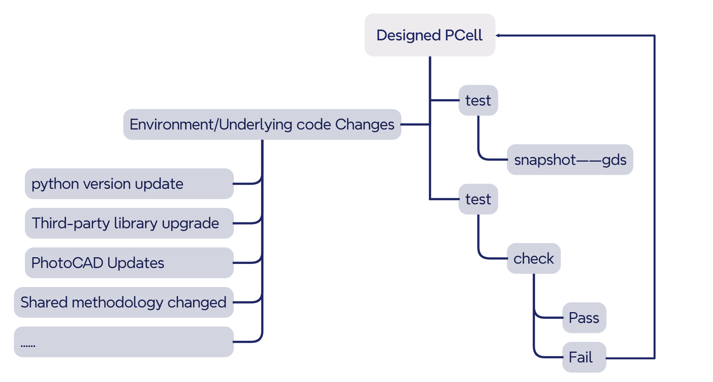
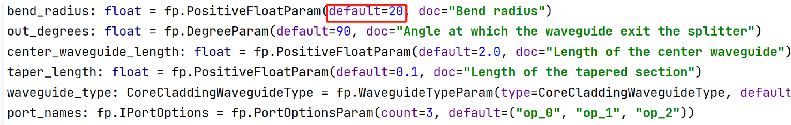
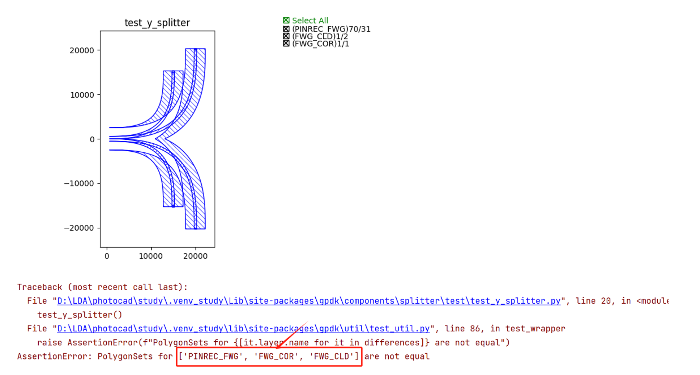
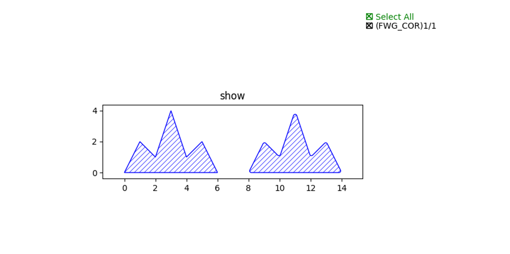
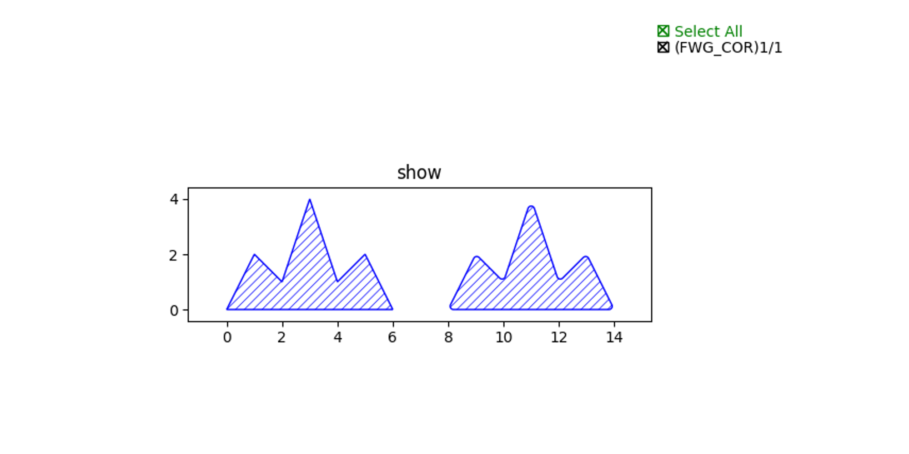
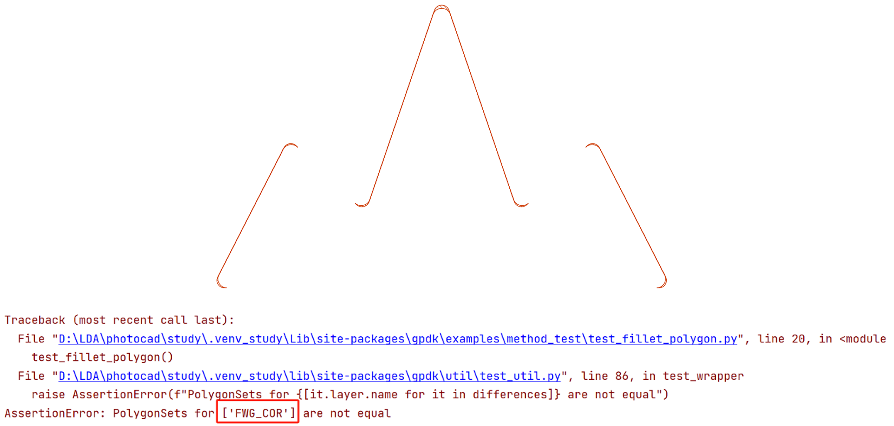

Pytest: Prevent unexpected changes to the layout
==============================================================================

``@expect_same_content()``  decorators are defined in **PhotoCAD** , aimed at ensuring timely detection of PCell changes when environment/underlying code changes occur, proactively identifying and resolving issues to prevent significant impacts during merging or assembly stages.

Accidental modification of PCell with completed design
--------------------------------------------------------------------

Taking the example of ``splitter`` in ``gpdk\components``, there is a ``test_y_splitter.py`` file located at ``gpdk\components\splitter\test``. Running the ``test_y_splitter.py`` file will generate a ``y_splitter.gds`` file in the ``test\snapshot`` directory.

Full script of ``test_y_splitter.py`` :

 ::

    import fnpcell.all as fp
    from gpdk.components import all as pdk
    from gpdk.technology import get_technology
    from gpdk.util.test_util import expect_same_content

    @expect_same_content(plot_differences=True)
    def test_y_splitter():
        library = fp.Library()

        TECH = get_technology()

        #=========================================================
         library += pdk.YSplitter(waveguide_type=TECH.WG.FWG.C.WIRE)
        #=========================================================
        return library

    if __name__ == "__main__":
        test_y_splitter()

Assuming we change the default value of bend_radius from 15 to 20 in y_splitter.py (this is for demonstration purposes only, and we do not recommend users modify default parameters of components). After running the test_y_splitter.py file, incorrect graphics will appear with the coordinate axis units increased by 1000 times, and the user will be informed in the test results which layers are affected.

From the layout change alerts and error messages shown above, we can easily see that the shape of the ``PINREC_FWG``, ``FWG_COR``, and ``FWG_CLD`` layers have changed.

Accidental modification of other shared methods
--------------------------------------------------------------

Users can also utilize the ``@expect_same_content()`` decorator to create a ``test.py`` file for their custom methods. Even if these methods involve third-party libraries, running the ``test.py`` file can promptly detect and correct errors when there are updates or changes in the third-party libraries. Here, a custom chamfering function **fillet_polygon** is defined, which can chamfer polygons and obtain new polygons. Then, a test case is created using this method.

Full script:

First, import the necessary library files.

 ::

    from fnpcell import all as fp
    import math
    from gpdk.technology import get_technology

Next, construct the ``FilletExample``. This involves creating a polygon based on a series of points, then chamfering the polygon and translating it.

 ::

    class FilletExample(fp.PCell):
        def build(self):
            insts, elems, ports = super().build()
            TECH = get_technology()

            points = [(0, 0), (1, 2), (2, 1), (3, 4), (4, 1), (5, 2), (6, 0)]

            polygon_before = fp.el.Polygon(points, layer=TECH.LAYER.LABEL_DRW)
            elems += polygon_before

            polygon_after1 = TECH.fillet_polygon(polygon_before, radius=0.1)
            elems += polygon_after1.translated(8, 0)
            return insts, elems, ports

Finally, generate the GDS file in the main function.

 ::

    if __name__ == "__main__":
        from gpdk.util.path import local_output_file

        TECH = get_technology()

        gds_file = local_output_file(__file__).with_suffix(".gds")
        library = fp.Library()

        po = FilletExample()
        library += po

        fp.export_gds(library, file=gds_file)
        fp.plot(library)

Running this file produces the following results.

Here, we simulate an unexpected change that affects the chamfering function. Running the script file yields the following results, making it difficult to notice such a minor change in the layout.

By creating and running the appropriate Pytest file at this point, we can easily observe the differences in graphics and layers, thus preventing unintended changes to the layout.

 ::

    @expect_same_content(plot_differences=True)
    def test_fillet_polygon():
        library = fp.Library()
        # =======================================================================

        library += FilletExample()

        # =============================================================

        return library

With ``@expect_same_content()``, you can check for unforeseen changes to the layout and quickly pinpoint the problem, so that existing results are protected.