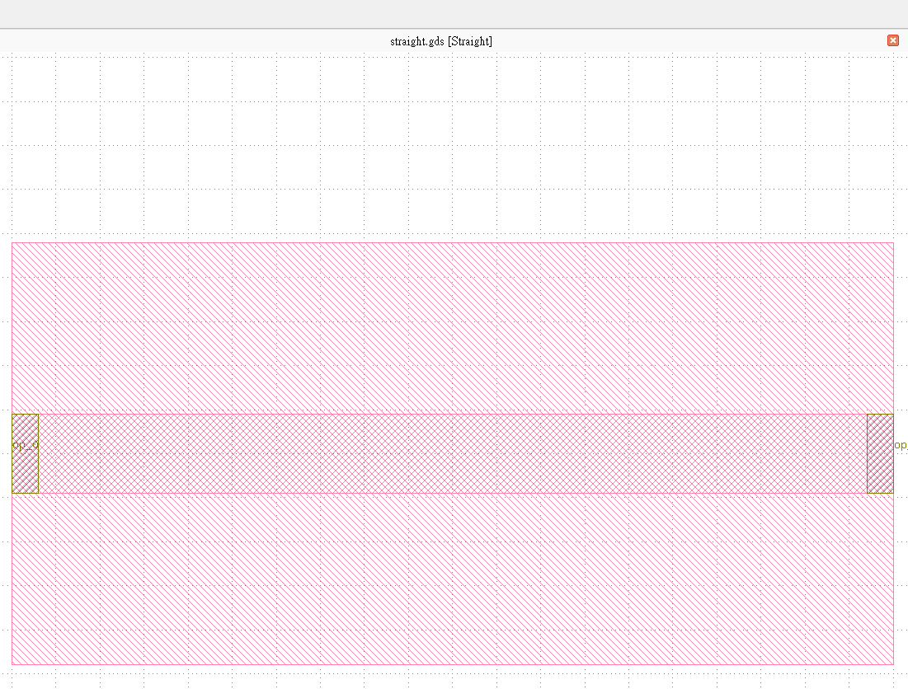
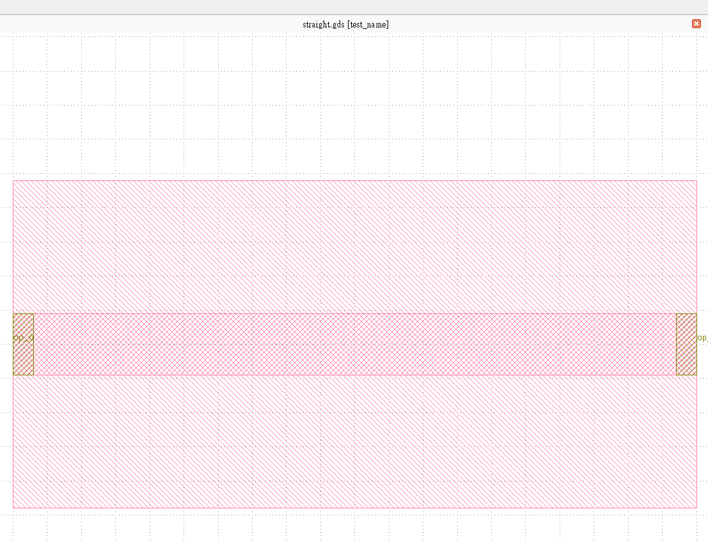

Change the cell name in GDS file
=================================

When exporting GDS file, the name of the cell will be set default by the ``class`` name of the cell. For instance, in the ``Straight`` component, we define ``class Straight`` and by ``library += Straight()`` and ``fp.export_gds(library)`` method we can get a GDS file with a ``Straight`` cell.

  ::

     class Straight(fp.IWaveguideLike, fp.PCell):
     ...

     if __name__ == "__main__":
        from gpdk.util.path import local_output_file

        gds_file = local_output_file(__file__).with_suffix(".gds")
        library = fp.Library()

        TECH = get_technology()

        library += Straight()
        fp.export_gds(library, file=gds_file)

To change the name of the cell, the simplest way is to add ``.with_name("{your_name")`` after adding ``class`` to ``fp.Library``.

  ::

     class Straight(fp.IWaveguideLike, fp.PCell):
     ...

     if __name__ == "__main__":
        from gpdk.util.path import local_output_file

        gds_file = local_output_file(__file__).with_suffix(".gds")
        library = fp.Library()

        TECH = get_technology()

        library += Straight().with_name("test_name")
        fp.export_gds(library, file=gds_file)

Cell naming rules
---------------------

Besides changing the cell name from ``.with_name("{your_name")`` function, here we provide some advanced methods to implement the cell name as one of the parameters in the PCell.

#. Cell name with default name prefix

  The first method doesn't add any ``name`` parameter to the PCell, however, ``fp.PCell`` has already a built-in parameter ``name`` so it can also be used since the PCell ``WithDefaultNamePrefix`` is inherited from ``fp.PCell``.

  * ``library += WithDefaultNamePrefix(size=10)``: The cell name will use the class name as prefix.

     cell name : **WithDefaultNamePrefix**

    .. image:: ../images/naming_policy3.png

  * ``library += WithDefaultNamePrefix(name="N1", size=20)``: ``N1`` is added after the class name.

     cell name : **WithDefaultNamePrefix_N1**

    .. image:: ../images/naming_policy4.png

  * ``library += WithDefaultNamePrefix(size=30).with_name("N1")``: ``N1`` overwrite and used as the cell name.

     cell name : **N1**

    .. image:: ../images/naming_policy5.png

  ::

    class WithDefaultNamePrefix(fp.PCell):
        size: float = fp.FloatParam()

        def build(self) -> Tuple[fp.InstanceSet, fp.ElementSet, fp.PortSet]:
            insts, elems, ports = super().build()
            TECH = get_technology()
            elems += fp.el.Rect(center=(0, 0), width=self.size, height=self.size, layer=TECH.LAYER.M1_DRW)
            return insts, elems, ports

    # gds cell name: WithDefaultNamePrefix, using class name as prefix
    library += WithDefaultNamePrefix(size=10)
    # gds cell name: WithDefaultNamePrefix_N1, using class name as prefix
    library += WithDefaultNamePrefix(name="N1", size=20)
    # gds cell name: N1, force to use "N1" as cell name
    library += WithDefaultNamePrefix(size=30).with_name("N1")

#. Cell name with blank name prefix

  The second method is defining a name parameter ``fp.NameParam`` and setting the prefix to a blank name. This allow users to export the cell name without the ``class`` name prefix when using ``name`` parameter of the PCell (It overrides the ``name`` parameter in ``fp.PCell``).

  * ``library += WithBlankNamePrefix(size=40)``: The cell name will use the class name as prefix.

     cell name : **WithBlankNamePrefix**

    .. image:: ../images/naming_policy6.png

  * ``library += WithBlankNamePrefix(name="N1", size=50)``: ``N1`` will be the cell name with the class name as prefix.

     cell name : **N1**

    .. image:: ../images/naming_policy7.png

  * ``library += WithBlankNamePrefix(size=60).with_name("N1")``: ``N1`` overwrite and used as the cell name.

     cell name : **N1**

    .. image:: ../images/naming_policy8.png

  ::

        class WithBlankNamePrefix(fp.PCell):
            name: str = fp.NameParam(prefix="")
            size: float = fp.FloatParam()

            def build(self) -> Tuple[fp.InstanceSet, fp.ElementSet, fp.PortSet]:
                insts, elems, ports = super().build()
                TECH = get_technology()
                elems += fp.el.Rect(center=(0, 0), width=self.size, height=self.size, layer=TECH.LAYER.M2_DRW)
                return insts, elems, ports

        # gds cell name: WithBlankNamePrefix
        library += WithBlankNamePrefix(size=40)
        # gds cell name: N1, no prefix
        library += WithBlankNamePrefix(name="N1", size=50)
        # gds cell name: N1, force to use "N1" as cell name
        library += WithBlankNamePrefix(size=60).with_name("N1")`

#. Cell name with custom name prefix

  The third method is defining a name parameter ``fp.NameParam`` and setting the prefix to a custom name ``custom``. This allow users to export the cell name without the ``class`` name prefix when using ``name`` parameter of the PCell (It overrides the ``name`` parameter in ``fp.PCell``) and set the default cell name as they wish.

  * ``library += WithCustomNamePrefix(size=70)``: The cell name will be the name set in the ``name`` parameter.

     cell name : **custom**

    .. image:: ../images/naming_policy9.png

  * ``llibrary += WithCustomNamePrefix(name="N1", size=80)``: ``N1`` will be added after the cell name ``custom``.

     cell name : **custom_N1**

    .. image:: ../images/naming_policy10.png

  * ``library += WithCustomNamePrefix(size=90).with_name("N1")``: ``N1`` overwrite and used as the cell name.

     cell name : **N1**

    .. image:: ../images/naming_policy11.png

  ::

        class WithCustomNamePrefix(fp.PCell):
            name: str = fp.NameParam(prefix="custom")
            size: float = fp.FloatParam()

            def build(self) -> Tuple[fp.InstanceSet, fp.ElementSet, fp.PortSet]:
                insts, elems, ports = super().build()
                TECH = get_technology()
                elems += fp.el.Rect(center=(0, 0), width=self.size, height=self.size, layer=TECH.LAYER.MT_DRW)
                return insts, elems, ports

        # gds cell name: custom
        library += WithCustomNamePrefix(size=70)
        # gds cell name: custom_N1
        library += WithCustomNamePrefix(name="N1", size=80)
        # gds cell name: N1
        library += WithCustomNamePrefix(size=90).with_name("N1")

