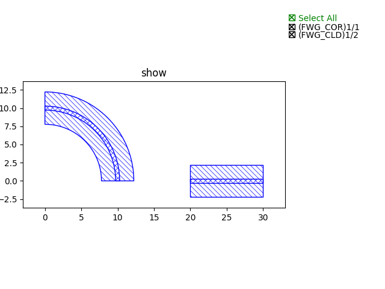

Placing PCell ports
==============================================================================================

* ``new_device_A = fp.place(device_A, “port_A”, at=device_B[”port_B”])``

     In this method, the two ports will be connected.

     .. image:: ../images/fpPlaceEx1.png

* ``new_device_A = fp.place(device_A, “port_A”, at=device_B[”port_B”].position)``

     In this method, ``port_A`` will be placing at the position of ``port_B`` but remaining the port orientation.

     .. image:: ../images/fpPlaceEx2.png
* ``new_device_A = fp.place(device_A, “port_A”, at=device_B[”port_B”]).translated(x, y)``

     In this method, ``port_A`` will first be aligned to ``port_B`` and move to ``(x, y)`` related to ``port_B``.

     .. image:: ../images/fpPlaceEx3.png
* ``new_device_A = fp.place(device_A, “port_A”, at=device_B[”port_B”].rotated(degrees=-90))``

     In this method, ``port_A`` will be connected to  ``port_B`` with an angle difference of 90 degrees.

     .. image:: ../images/fpPlaceEx4.png
