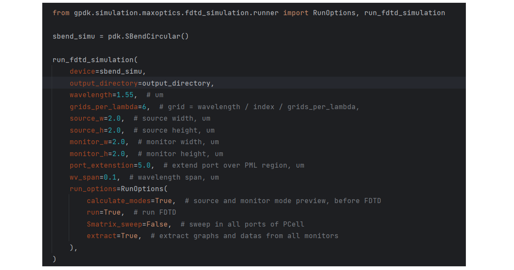
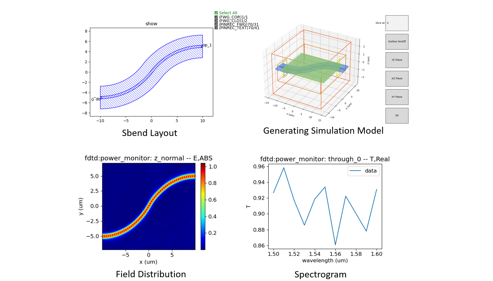

Max-Optics simulation interface: ``runner.py``
==============================================================================

Using **PhotoCAD** and **Max-Optics FDTD** to link up and implement the layout-driven FDTD simulation ensures that both the flow and simulation come from the same layout, avoiding the layout accuracy error caused by simulation first and layout later, which may cause unnecessary impact on the final test results. We provide such an interface file, ``runner.py``, with the path ``gpdk/simulation/ffi/maxoptics/fdtd_simulation/runner.py``.

Interface usage:
------------------------------------------------------------------------------

Import ``RunOptions`` and ``run_fdtd_simulation``, instantiate a PCell, in this case a **Sbend**, pass this **Sbend** into the ``device`` of ``run_fdtd_simulation`` method, and set some relevant simulation parameters.

Run this file, it will generate the layout of the **Sbend** first, according to the layout in **Max-Optics FDTD** for modelling, after the simulation, it will save the relevant results, as shown in the following figure:

Interface script description:
------------------------------------------------------------------------------

Importing some libraries, make sure you have a **Max-Optics FDTD** licence.

 ::

    import json
    import math
    import os
    import time
    from pathlib import Path
    from typing_extensions import Any, Dict, NamedTuple, cast

    from gpdk.technology.wg import CONST

    import fnpcell.all as fp
    from gpdk import all as pdk
    from gpdk.technology import get_technology
    from gpdk.util import port_util

    import maxoptics_sdk.all as mo  # type: ignore
    from maxoptics_sdk.helper import timed, with_path  # type: ignore

Sets the information for each layer and the location of the gds_file. And extend the port of the ``device``, set the information of the extended layer and the position of gds_file_extend.

 ::

    def build_gds(*, device: fp.PCell, extend_length: float = 5.0, output_directory: Path):
        # --- generate device_simu.gds ---
        gds_file = output_directory / "simu_json_gds" / f"{device.name}_simu.gds"
        simu_library = fp.Library()
        TECH = get_technology()
        fwg_cor = device.polygon_set(layer=TECH.LAYER.FWG_COR)
        fwg_cld = device.polygon_set(layer=TECH.LAYER.FWG_CLD)
        fwg_tre = device.polygon_set(layer=TECH.LAYER.FWG_TRE)
        fwg_simu = fp.el.PolygonSet((fwg_cld.region - fwg_cor.region) | fwg_tre.region, layer=TECH.LAYER.FWG_SIMU)

        swg_cor = device.polygon_set(layer=TECH.LAYER.SWG_COR)
        swg_cld = device.polygon_set(layer=TECH.LAYER.SWG_CLD)
        swg_tre = device.polygon_set(layer=TECH.LAYER.SWG_TRE)
        swg_simu = fp.el.PolygonSet((swg_cld.region - swg_cor.region) | swg_tre.region, layer=TECH.LAYER.SWG_SIMU)

        mwg_cor = device.polygon_set(layer=TECH.LAYER.MWG_COR)
        mwg_cld = device.polygon_set(layer=TECH.LAYER.MWG_CLD)
        mwg_tre = device.polygon_set(layer=TECH.LAYER.MWG_TRE)
        mwg_simu = fp.el.PolygonSet((mwg_cld.region - mwg_cor.region) | mwg_tre.region, layer=TECH.LAYER.MWG_SIMU)

        simu_library += fp.Device(name=f"{device.name}", content=[fwg_simu, swg_simu, mwg_simu], ports=[])
        fp.export_gds(simu_library, file=gds_file)
        # --- generate device_simu.gds ---

        # --- generate device_simu_extended.gds ---
        gds_file_extend = output_directory / "simu_json_gds" / f"{device.name}_simu_extended.gds"
        simu_extend_library = fp.Library()
        device_extend = pdk.Extended(device=device, lengths={"*": extend_length}, name=f"{device.name}")

        fwg_cor_extend = device_extend.polygon_set(layer=TECH.LAYER.FWG_COR)
        fwg_cld_extend = device_extend.polygon_set(layer=TECH.LAYER.FWG_CLD)
        fwg_tre_extend = device_extend.polygon_set(layer=TECH.LAYER.FWG_TRE)
        fwg_simu_extend = fp.el.PolygonSet((fwg_cld_extend.region - fwg_cor_extend.region) | fwg_tre_extend.region, layer=TECH.LAYER.FWG_SIMU)

        swg_cor_extend = device_extend.polygon_set(layer=TECH.LAYER.SWG_COR)
        swg_cld_extend = device_extend.polygon_set(layer=TECH.LAYER.SWG_CLD)
        swg_tre_extend = device_extend.polygon_set(layer=TECH.LAYER.SWG_TRE)
        swg_simu_extend = fp.el.PolygonSet((swg_cld_extend.region - swg_cor_extend.region) | swg_tre_extend.region, layer=TECH.LAYER.SWG_SIMU)

        mwg_cor_extend = device_extend.polygon_set(layer=TECH.LAYER.MWG_COR)
        mwg_cld_extend = device_extend.polygon_set(layer=TECH.LAYER.MWG_CLD)
        mwg_tre_extend = device_extend.polygon_set(layer=TECH.LAYER.MWG_TRE)
        mwg_simu_extend = fp.el.PolygonSet((mwg_cld_extend.region - mwg_cor_extend.region) | mwg_tre_extend.region, layer=TECH.LAYER.MWG_SIMU)

        simu_extend_library += fp.Device(name=f"{device.name}", content=[fwg_simu_extend, swg_simu_extend, mwg_simu_extend], ports=[])

        fp.export_gds(simu_extend_library, file=gds_file_extend)
        # --- generate device_simu_extended.gds ---

Calculate the region needed for simulation modelling and set it as a simulation layer (e.g. ``FWG_SIMU``, ``SWG_SIMU``, ``MWG_SIMU``) and generate its gds and json files based on the graphics on the simulation layer.

 ::

    def build_json(
        *,
        device: fp.PCell,
        output_directory: Path,
    ):
        TECH = get_technology()
        PCell = device
        fwg_cor = PCell.polygon_set(layer=TECH.LAYER.FWG_COR)
        fwg_cld = PCell.polygon_set(layer=TECH.LAYER.FWG_CLD)
        fwg_tre = PCell.polygon_set(layer=TECH.LAYER.FWG_TRE)
        fwg_simu = fp.el.PolygonSet((fwg_cld.region - fwg_cor.region) | fwg_tre.region, layer=TECH.LAYER.FWG_SIMU)

        swg_cor = PCell.polygon_set(layer=TECH.LAYER.SWG_COR)
        swg_cld = PCell.polygon_set(layer=TECH.LAYER.SWG_CLD)
        swg_tre = PCell.polygon_set(layer=TECH.LAYER.SWG_TRE)
        swg_simu = fp.el.PolygonSet((swg_cld.region - swg_cor.region) | swg_tre.region, layer=TECH.LAYER.SWG_SIMU)

        mwg_cor = PCell.polygon_set(layer=TECH.LAYER.MWG_COR)
        mwg_cld = PCell.polygon_set(layer=TECH.LAYER.MWG_CLD)
        mwg_tre = PCell.polygon_set(layer=TECH.LAYER.MWG_TRE)
        mwg_simu = fp.el.PolygonSet((mwg_cld.region - mwg_cor.region) | mwg_tre.region, layer=TECH.LAYER.MWG_SIMU)

        simu_library = fp.Device(name=f"{device.name}", content=[fwg_simu, swg_simu, mwg_simu], ports=device.ports)

        device_name = device.name
        json_name = f"{device_name}_simu.json"
        gds_name = f"{device_name}_simu.gds"
        json_path = os.path.join(output_directory, "simu_json_gds", json_name)
        gds_path = os.path.join(output_directory, "simu_json_gds", gds_name)
        fp.export_json(content=simu_library, json_file=json_path, library_file=gds_path, explicit_layers=True, explicit_parameters=True)
        # to delete "*": "<AUTO>"
        json_data = output_directory / "simu_json_gds" / f"{device_name}_simu.json"
        with open(json_data) as json_file:
            parsed_data = cast(Dict[str, Any], json.load(json_file))

        if "*" in parsed_data["layers"]:
            parsed_data["layers"].pop("*")

        # Convert the modified data back to JSON string
        with open(json_data, "w") as json_file:
            json.dump(parsed_data, json_file, indent=4)

The core function, ``run_fdtd_simulation``, is used to call **Max-Optics FDTD** and automate the modelling and simulation.

 ::

    @timed
    @with_path  # type: ignore
    def run_fdtd_simulation(
        *,
        device: fp.PCell,
        # MO setting
        run_mode: str = "local",
        wavelength: float = 1.31,
        grids_per_lambda: int = 6, #Grid density
        run_options: "RunOptions",
        monitor_w: float = 2.0,
        monitor_h: float = 2.0,
        source_w: float = 2.0,
        source_h: float = 2.0,
        port_extension: float = 5.0,
        wv_span: float = 0.1,
        output_directory: Path,
        # LDA setting
        **kwargs: Any,
    ):

0. General Parameters:

    This region sets up the simulation parameters and paths, generates GDS and JSON files, and exports the simulation results in various formats.

 ::

    # region --- 0. General Parameters ---

    waveform_name = f"wv{wavelength * 1e3}"
    device_name = device.name
    device = device

    simu_name = f"{device_name}_FDTD"
    time_str = time.strftime("%Y%m%d_%H%M%S", time.localtime())
    project_name = f"{simu_name}_{run_mode}_{time_str}"

    plot_path = output_directory / "simu_output" / "plots" / f"{project_name}"

    build_gds(device=device, output_directory=output_directory, extend_length=port_extension)
    build_json(device=device, output_directory=output_directory)

    gds_file = str(output_directory / "simu_json_gds" / f"{device_name}_simu_extended.gds")  # str(...) as MO only accept str, Path is not supported yet
    port_files = output_directory / "simu_json_gds" / f"{device_name}_simu.json"
    if port_files.exists():
        with open(port_files) as json_file:
            user = json.load(json_file)
    else:
        raise FileNotFoundError(f"{port_files} is not found.")
    kL = [f"0{k}" for k in range(9)] + ["0A"]
    export_options = {"export_csv": True, "export_mat": True, "export_zbf": True}
    # endregion

1. Project:

    Name the project and define the storage path.

 ::

    # region --- 1. Project ---

    pj = mo.Project(name=project_name, location=run_mode)  # type: ignore
    # endregion

2. Material

    Create a material object mt and add materials.

 ::

    # region --- 2. Material ---

    mt = pj.Material()  # type: ignore
    mt.add_nondispersion(name="Si", data=[(3.47, 0)], order=2)  # type: ignore
    mt.add_nondispersion(name="SiO2", data=[(1.44, 0)], order=2)  # type: ignore
    mt.add_lib(name="Air", data=mo.Material.Air, order=2)  # type: ignore
    # endregion

3. Waveform

    Create and manipulate waveforms, set their properties such as name, center wavelength and span.

 ::

    # region --- 3. Waveform ---

    wv = pj.Waveform()  # type: ignore
    wv.add(name=waveform_name, wavelength_center=wavelength, wavelength_span=wv_span)  # type: ignore
    wv_struct = wv[waveform_name]  # type: ignore
    # endregion

4. Structure

    Create a structure with specific geometries and adds corresponding geometries to the structure based on user-defined layer information.

 ::

    # region --- 4. Structure ---

    (x_min, y_min), (x_max, y_max) = fp.get_bounding_box(device)
    st = pj.Structure(mesh_type="curve_mesh", mesh_factor=1.2, background_material=mt["SiO2"])  # type: ignore
    # create material stack
    st.add_geometry(  # type: ignore
        name="si_board",
        type="Rectangle",
        property={
            "geometry": {
                "x": (x_min + x_max) / 2,
                "x_span": (x_max - x_min) + 4,
                "y": (y_min + y_max) / 2,
                "y_span": (y_max - y_min),
                "z": 0.05,
                "z_span": 0.1,
            },
            "material": {"material": mt["Si"], "mesh_order": 2},
        },
    )

    for layer_name in user["layers"]:
        if user["layers"][layer_name] == "TECH.LAYER.FWG_SIMU":
            st.add_geometry(  # type: ignore
                name="si_etch",
                type="gds_file",
                property={
                    "general": {"path": gds_file, "cell_name": f"{device.name}", "layer_name": (1, 0)},
                    "geometry": {"x": 0, "y": 0, "z": 0, "z_span": 0.2},
                    "material": {"material": mt["SiO2"], "mesh_order": 2},
                },
            )
        if user["layers"][layer_name] == "TECH.LAYER.SWG_SIMU":
            st.add_geometry(  # type: ignore
                name="si_etch",
                type="gds_file",
                property={
                    "general": {"path": gds_file, "cell_name": f"{device.name}", "layer_name": (2, 0)},
                    "geometry": {"x": 0, "y": 0, "z": 0.05, "z_span": 0.1},
                    "material": {"material": mt["SiO2"], "mesh_order": 2},
                },
            )
        if user["layers"][layer_name] == "TECH.LAYER.MWG_SIMU":
            st.add_geometry(  # type: ignore
                name="si_etch",
                type="gds_file",
                property={
                    "general": {"path": gds_file, "cell_name": f"{device.name}", "layer_name": (3, 0)},
                    "geometry": {"x": 0, "y": 0, "z": 0.05, "z_span": 0.1},
                    "material": {"material": mt["SiO2"], "mesh_order": 2},
                },
            )

    # endregion

5. Boundary

    Set the geometric features and boundary types for the boundary object, and configures parameters related to PML.

 ::

    # region --- 5. Boundary ---

    st.OBoundary(  # type: ignore
        property={
            "geometry": {
                "x": (x_min + x_max) / 2,
                "x_span": (x_max - x_min) + 4,
                "y": (y_min + y_max) / 2,
                "y_span": (y_max - y_min) + 4,
                "z": 0,
                "z_span": monitor_h,
            },
            "boundary": {"x_min": "PML", "x_max": "PML", "y_min": "PML", "y_max": "PML", "z_min": "PML", "z_max": "PML"},
            "general_pml": {
                "pml_same_settings": True,
                "pml_layer": 6,
                "pml_kappa": 2,
                "pml_sigma": 0.8,
                "pml_polynomial": 3,
                "pml_alpha": 0,
                "pml_alpha_polynomial": 1,
            },
        }
    )
    # endregion

7. ModeSource

    Add a mode source named "source" to the source object src, with type "mode_source", propagating along the positive x-axis. Set the mode selection to "user_select", and choose the waveform structure wv_struct. Configure geometric parameters, including the x, y, and z coordinates, as well as their spans.

 ::

    # region --- 7. ModeSource ---

    src = pj.Source()  # type: ignore
    ports = {info["name"]: info for info in user["ports"]}
    if run_options.run and not (run_options.Smatrix_sweep):
        src.add(  # type: ignore
            name="source",
            type="mode_source",
            axis="x_forward",
            property={
                "general": {
                    # 'amplitude': 1, 'phase': 0, 'mode_index': 0, 'rotations': {'theta': 0, 'phi': 0, 'rotation_offset': 0}
                    "mode_selection": "user_select",
                    "waveform": {"waveform_id_select": wv_struct},
                },
                "geometry": {
                    "x": ports["op_0"]["position"][0] - 1,
                    "x_span": 0,
                    "y": ports["op_0"]["position"][1],
                    "y_span": source_w,
                    "z": 0,
                    "z_span": source_h,
                },
            },
        )
    # endregion

8. Port

    Create a port object, setting the waveform id and the source port. If S-matrix scanning is required, calculate the number of ports on the device, iterate through each port, and add the corresponding port based on its orientation.

 ::

    # region --- 8. Port ---

    pt = pj.Port(property={"waveform_id": wv_struct, "source_port": "port_left"})  # type: ignore
    if run_options.Smatrix_sweep:
        port_count = len(device.ports)
        # port_angle = []
        for i in range(port_count):
            if math.degrees(device[f"op_{i}"].orientation) == 180:
                pt.add(  # type: ignore
                    name=f"port_{i}_left",
                    type="fdtd_port",
                    property={
                        "geometry": {
                            "x": ports[f"op_{i}"]["position"][0] + 1,
                            "x_span": 0,
                            "y": ports[f"op_{i}"]["position"][1],
                            "y_span": monitor_w,
                            "z": 0,
                            "z_span": monitor_h,
                        },
                        "modal_properties": {
                            "general": {
                                "inject_axis": "x_axis",
                                "direction": "forward",
                                "mode_selection": "fundamental",
                            }
                        },
                    },
                )
            if math.degrees(device[f"op_{i}"].orientation) == 0:
                pt.add(  # type: ignore
                    name=f"port_{i}_right",
                    type="fdtd_port",
                    property={
                        "geometry": {
                            "x": ports["op_1"]["position"][0] - 1,
                            "x_span": 0,
                            "y": ports["op_1"]["position"][1],
                            "y_span": monitor_w,
                            "z": 0,
                            "z_span": monitor_h,
                        },
                        "modal_properties": {
                            "general": {
                                "inject_axis": "x_axis",
                                "direction": "backward",
                                "mode_selection": "fundamental",
                            }
                        },
                    },
                )

    # endregion

9. Monitor

    Add a monitor to the simulation.

    9.0 GlobalMonitor

        Create a global option monitor named "Global Option" and set its properties to control frequency power-related parameters.

    ::

        # region --- 9.0 GlobalMonitor ---
        # Create a global option monitor named "Global Option" and set its properties to control frequency power-related parameters.
        mn = pj.Monitor()  # type: ignore
        mn.add(  # type: ignore
            name="Global Option",
            type="global_option",
            property={
                "frequency_power": {  # 'sample_spacing': 'uniform', 'use_wavelength_spacing': True,
                    # ['min_max','center_span']
                    "spacing_type": "wavelength",
                    "spacing_limit": "center_span",
                    "wavelength_center": wavelength,
                    "wavelength_span": 0.1,
                    "frequency_points": 11,
                }
            },
        )
        # endregion

    9.1 TimeMonitor

        Add a time monitor if necessary.

    ::

        # region --- 9.1 TimeMonitor ---
        # mn.add(name='time_monitor1', type='time_monitor',
        #        property={'general': {
        #            'stop_method': 'end_of_simulation', 'start_time': 0, 'stop_time': 100, 'number_of_snapshots': 0},
        #            'geometry': {'monitor_type': 'point', 'x': 0, 'x_span': 0, 'y': 0, 'y_span': 0, 'z': 0, 'z_span': 0},
        #            'advanced': {'sampling_rate': {'min_sampling_per_cycle': 10}}})
        # endregion

    9.2 PowerMonitor

        Add PowerMonitors.

        9.2.1 z_normal

        Set up a power monitor named "z_normal" and specifie the frequency range, precision, and geometric parameters of the monitoring area, enabling monitoring of power distribution on a 2D z-normal plane.

        ::

            # region --- 9.2.1 z_normal ---

            mn.add(  # type: ignore
                name="z_normal",
                type="power_monitor",
                property={
                    "general": {
                        "frequency_profile": {"wavelength_center": wavelength, "wavelength_span": 0.1, "frequency_points": 3},
                    },
                    "geometry": {
                        "monitor_type": "2d_z_normal",
                        "x": (x_min + x_max) / 2,
                        "x_span": (x_max - x_min) - 0.1,
                        "y": (y_min + y_max) / 2,
                        "y_span": (y_max - y_min) - 0.1,
                        "z": 0,
                        "z_span": 0,
                    },
                },
            )
            # endregion

        9.2.2 Through

        Add power monitors for each right-side port to monitor the power distribution of optical signals at those ports and performs mode expansion and calculation.

        ::

            # region --- 9.2.2 Through ---

            left_port_count = len(port_util.get_left_ports(device))
            right_port_count = len(port_util.get_right_ports(device))
            for i in range(right_port_count):
                mn.add(  # type: ignore
                    name=f"through_{i}",
                    type="power_monitor",
                    property={
                        "general": {
                            "frequency_profile": {"wavelength_center": wavelength, "wavelength_span": 0.1, "frequency_points": 11},
                        },
                        "geometry": {
                            "monitor_type": "2d_x_normal",
                            "x": ports[f"op_{left_port_count + i}"]["position"][0] + 1,
                            "x_span": 0,
                            "y": ports[f"op_{left_port_count + i}"]["position"][1],
                            "y_span": monitor_w,
                            "z": 0,
                            "z_span": monitor_h,
                        },
                        "mode_expansion": {
                            "enable": True,
                            "direction": "positive",
                            "mode_calculation": {
                                "mode_selection": "user_select",
                                "mode_index": [0, 1, 2, 3],
                                "override_global_monitor_setting": {"wavelength_center": wavelength, "wavelength_span": 0.1, "frequency_points": 11},
                            },
                        },
                    },
                )

            # endregion

        9.2.3 Reflection

        Add a power monitor to monitor the reflection of optical signals and sets the frequency profile and geometric parameters for the monitoring region.

        ::

            # region --- 9.2.3 Reflection ---

            mn.add(  # type: ignore
                name="reflection",
                type="power_monitor",
                property={
                    "general": {"frequency_profile": {"wavelength_center": wavelength, "wavelength_span": 0.1, "frequency_points": 11}},
                    "geometry": {
                        "monitor_type": "2d_x_normal",
                        "x": ports["op_0"]["position"][0] - 1.5,
                        "x_span": 0,
                        "y": ports["op_0"]["position"][1],
                        "y_span": monitor_w,
                        "z": 0,
                        "z_span": monitor_h,
                    },
                },
            )
            # endregion
            # endregion
            # endregion

10. Simulation

    A simulation object named "simu" is created, and two sub-objects are added to it.

    - The first sub-object is an FDTD simulator type. It configures general simulation properties such as simulation time and mesh settings, including mesh type, mesh accuracy, and minimum mesh step size.

    - The second sub-object is a simulator for S-matrix scanning. It specifies the ports for conducting S-matrix scanning, including the left-side port, the upper-right port, and the lower-right port. This sub-object will perform S-matrix scanning based on the primary simulator, which is the first sub-object.

 ::

    # region --- 10. Simulation ---

    simu = pj.Simulation()  # type: ignore
    simu.add(  # type: ignore
        name=simu_name,
        type="FDTD",
        property={
            "general": {
                "simulation_time": 10000,
            },
            "mesh_settings": {
                "mesh_type": "auto_non_uniform",
                "mesh_accuracy": {"cells_per_wavelength": grids_per_lambda},
                "minimum_mesh_step_settings": {"min_mesh_step": 1e-4},
            },
            # 'advanced_options': {'auto_shutoff': {'auto_shutoff_min': 1.00e-4, 'down_sample_time': 200}},
            # 'thread_setting': {'thread': 4}
        },
    )

    if run_options.Smatrix_sweep:
        simu.add(  # type: ignore
            name=f"{simu_name}_matrix_sweep",
            type="FDTD:smatrix",
            property={
                "simulation_name": simu_name,
                "s_matrix_setup": [
                    {"port": "port_left", "active": True},
                    {"port": "port_right_up", "active": True},
                    {"port": "port_right_bot", "active": True},
                ],
            },
        )
    # endregion.

11. Structure Show

    Call the structure_show method to generate and save the structural image. Display the 3D structural image using the matplotlib library. Run the simulation index to generate and save images of the specified region.

 ::

    # region --- 11. Structure Show ---

    st.structure_show(  # type: ignore
        fig_type="png",
        show=False,
        savepath=str(plot_path / f"{kL[0]}{simu_name}"),
        simulation_name=simu_name,
    )
    simu[simu_name].show3d(show_with="matplotlib")  # type: ignore
    # endregion

    simu[simu_name].run_index(  # type: ignore
        name=f"{simu_name}_port0",
        savepath=str(plot_path / f"{kL[-1]}_Preview_Index_x=0"),
        # export_csv=False, show=False,
        property={
            "geometry": {"x": ports["op_0"]["position"][0], "x_span": 0, "y": ports["op_0"]["position"][1], "y_span": monitor_w, "z": 0, "z_span": monitor_h}
        },
    )

12. Calculate Mode

    First, it checks whether mode calculation is required. If so, it adds a simulation object, sets the relevant properties, runs the simulation, and retrieves the results. Finally, it extracts the calculated modes' data and saves them to the specified path.

 ::

    # region --- 12. Calculate Mode ---

    if run_options.calculate_modes:
        simu.add(  # type: ignore
            name=simu_name + "_cal_mode",
            simulation_name=simu_name,
            source_name="source",
            type="mode_selection:user_select",
            property={
                "modal_analysis": {
                    "calculate_modes": True,
                    "mesh_structure": True,
                    "wavelength": wavelength,
                    "number_of_trial_modes": 20,
                    "search": "max_index",
                    "calculate_group_index": True,
                }
            },
        )
        src_res = simu[f"{simu_name}_cal_mode"].run()  # type: ignore
        src_res.extract(  # type: ignore
            data="calculate_modes",
            savepath=str(plot_path / f"{kL[2]}_Preview_SourceMode"),
            attribute="E",
            mode=0,
            real=True,
            imag=True,
            **export_options,
            show=False,
        )
    # endregion

13. Run

    The settings related to Run are described in detail in the following code.

 ::

    # region --- 13. Run ---
    # check whether a simulation needs to be run and if S-matrix sweep is not required.
    # If these conditions are met, execute the FDTD simulation and extract data from the simulation result.
    if run_options.run and not (run_options.Smatrix_sweep):
        fdtd_res = simu[simu_name].run()  # type: ignore
        # region --- 13.3 See Result ---
        """ 02_source_modeprofile """
        fdtd_res.extract(  # type: ignore
            data="fdtd:mode_source_mode_info",
            savepath=str(plot_path / f"{kL[2]}_source_modeprofile"),
            source_name="source",
            target="intensity",
            attribute="E",
            mode=0,
            real=True,
            imag=True,
            **export_options,
            show=False,
        )

        # ''' 02_monitorT_modeprofile_fdtd '''
        # Iterates over the number of right-side ports.
        # During each iteration, it calls the fdtd_res.extract function to extract fdtd:power_monitor data and saves the results to specified paths.
        for i in range(right_port_count):
            fdtd_res.extract(  # type: ignore
                data="fdtd:power_monitor",
                savepath=str(plot_path / f"{kL[3]}_monitorT_modeprofile_{i}_fdtd"),
                monitor_name=f"through_{i}",
                target="intensity",
                plot_x="y",
                plot_y="z",
                attribute="E",
                wavelength=f"{wavelength}",
                real=True,
                imag=False,
                **export_options,
                show=False,
            )
            # ''' 03_TransVsLambda_power '''
            # Extract power monitor data from the FDTD simulation results and save these data as CSV and MAT format files to the specified path.
            fdtd_res.extract(  # type: ignore
                data="fdtd:power_monitor",
                savepath=str(plot_path / f"{kL[6]}_TransVsLambda_power"),
                monitor_name=f"through_{i}",
                target="line",
                plot_x="wavelength",
                attribute="T",
                real=True,
                imag=False,
                export_csv=True,
                export_mat=True,
                show=False,
            )
            # ''' 03_TransVsLambda_mode=1 '''
            # Extract mode expansion data from the FDTD simulation results and save these data as CSV and MAT format files to the specified path.
            fdtd_res.extract(  # type: ignore
                data="fdtd:mode_expansion",
                savepath=str(plot_path / f"{kL[5]}_TransVsLambda_mode=0"),
                monitor_name=f"through_{i}",
                target="line",
                plot_x="wavelength",
                mode=0,
                attribute="T_forward",
                real=True,
                imag=True,
                export_csv=True,
                export_mat=True,
                show=False,
            )
            # ''' 05_TransVsOrder '''
            # Extract mode expansion data from the FDTD simulation results and save these data as CSV and MAT format files to the specified path.
            fdtd_res.extract(  # type: ignore
                data="fdtd:mode_expansion",
                savepath=str(plot_path / f"{kL[4]}_TransVsOrder_{i}"),
                monitor_name=f"through_{i}",
                target="line",
                plot_x="mode",
                wavelength=f"{wavelength}",
                attribute="T_forward",
                real=True,
                imag=True,
                export_csv=True,
                export_mat=True,
                show=False,
            )
            # ''' 06_mode_info '''
            # Extract mode expansion mode information data from the FDTD simulation and save the extracted results as files.
            fdtd_res.extract(  # type: ignore
                data="fdtd:mode_expansion_mode_info",
                savepath=str(plot_path / f"{kL[3]}_me_throughmode_{i}_info"),
                monitor_name=f"through_{i}",
                target="intensity",
                attribute="E",
                mode=0,
                wavelength=f"{wavelength}",
                real=True,
                imag=True,
                **export_options,
                show=False,
            )

        """ 03_RlVsLambda_power """
        # Extract power monitor data from the FDTD simulation and save the extracted results as files.
        fdtd_res.extract(  # type: ignore
            data="fdtd:power_monitor",
            savepath=str(plot_path / f"{kL[7]}_RlVsLambda_power"),
            monitor_name=f"reflection",
            target="line",
            plot_x="wavelength",
            attribute="T",
            real=True,
            imag=False,
            export_csv=True,
            export_mat=True,
            show=False,
        )

        """ 04_top_profile """
        # Extract power monitor data from the FDTD simulation results and save these data as files to a specific path,
        # including the real and imaginary parts of the electric field plotted at a specified location.
        fdtd_res.extract(  # type: ignore
            data="fdtd:power_monitor",
            savepath=str(plot_path / f"{kL[1]}_top_profile"),
            monitor_name="z_normal",
            target="intensity",
            plot_x="x",
            plot_y="y",
            attribute="E",
            real=True,
            imag=True,
            **export_options,
            show=False,
        )

        # endregion
    # endregion

14. matrix_sweep

    Perform a parameter sweep of the S-matrix and save the real and imaginary parts of the scan results as CSV and MAT files to a specified path.

 ::

    # region --- 14. matrix_sweep

    if run_options.Smatrix_sweep:
        smatrix_res = simu[f"{simu_name}_matrix_sweep"].run()  # type: ignore
        smatrix_res.extract(  # type: ignore
            data="smatrix_sweep",
            savepath=str(plot_path / f"{kL[8]}_smatrix_sweep"),
            target="line",
            plot_x="wavelength",
            real=True,
            imag=True,
            export_csv=True,
            export_mat=True,
            show=False,
        )
    # endregion

