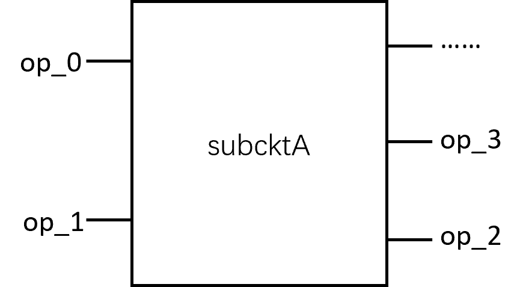
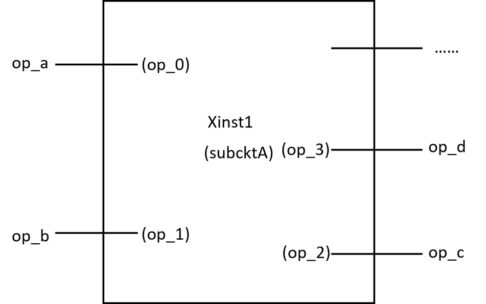
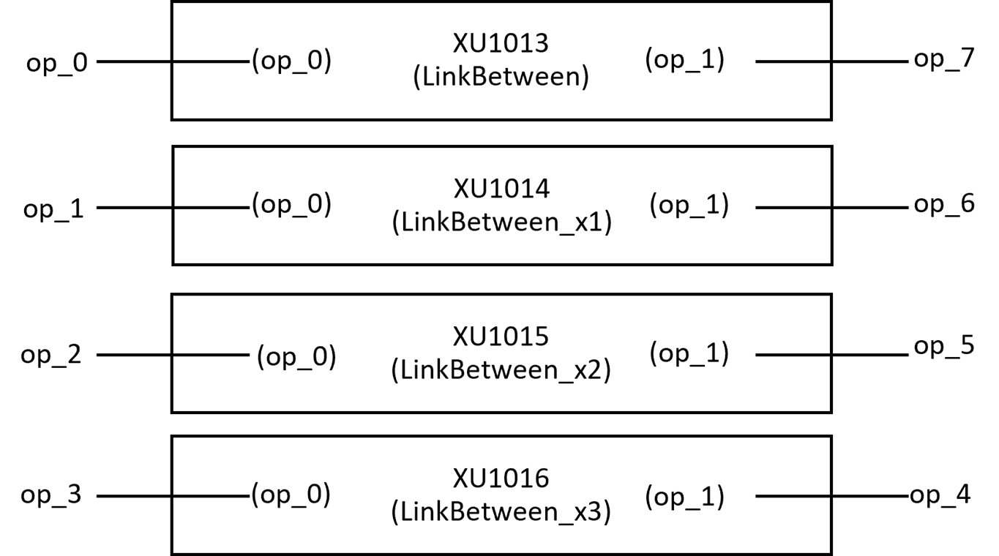

Descriptions of the contents in the netlist
^^^^^^^^^^^^^^^^^^^^^^^^^^^^^^^^^^^^^^^^^^^^^^^^^^^^^^^^^^^^^^^^^^^^^

The exported netlist in the PhotoCAD platform is in SPICE format, i.e. Simulation Program with Integrated Circuit Emphasis, which is the most common language format for describing circuits in the field of integrated circuit design and is highly readable and easily extensible.

Create components and export layouts
-----------------------------------------------------------------

::

  .subckt subcktA op_0 op_1 op_2 ……
  ……
  .ends
  
Submodules are not the top-level structure of the circuit, they need to be called by the upper-level circuit, and their size can be large or small. 

The submodule definition starts with ``.subckt``, followed by the ``module name``, ``module port name``, and a complete list of all ``ports`` in the module definition. The module can contain other modules inside the module to achieve hierarchical invocation. 

The end of the submodule definition is marked by ``.ends``. Submodule definition can not be nested, that is, the definition of a module of ``.subckt`` to ``.ends`` can not appear in the middle of ``.subckt`` definition of other submodules.

Submodules
---------------------------------------------------

::

  Xinst1 op_a op_b op_c op_d … subcktA
  
The call of a submodule can also be understood as instantiation. Instantiating a submodule takes ``X`` as the first letter of the instance name, and the instance name can be defined arbitrarily.

The instance name is followed by the port sequence, and the port name of the instance can be different from the port name defined by the submodule, but the number and order of the ports remain the same as the submodule. The port sequence is followed by the sub-module name for module call.

The following example is extracted from the SPICE format netlist generated after running ``gpdk`` > ``examples`` > ``example_sdl_circuit_05.py``, i.e. ``gpdk`` > ``example_sdl_circuit_05.spc``::

    .subckt Straight op_0 op_1 
    .ends

    .subckt BendEuler90 op_0 op_1 
    .ends

    .subckt LinkBetween op_0 op_7 
       XU1001 op_0 op_7 Straight name=Straight bands=None patches=() port_names=('op_0', 'op_1') transform=Affine2D.new(scaling=(1.0, 1.0), rotation=3.141592653589793, translation=(-192.0, 0.0)) length=58.0 waveguide_type=WG.SWG.C.SWG_C_WIRE(core_layout_width=1.15, cladding_layout_width=11.0, core_design_width=1.0, cladding_design_width=11.0, port_names=('op_0', 'op_1')) anchor=Anchor.START lay_x=-192.0 lay_y=0.0 lay_r=180.0 lay_f=False bbox=((-3.52085954754864e-17, -5.5), (58.0, 5.5))
    .ends

    .subckt LinkBetween_x1 op_1 op_6 
       XU1002 op_1 N3 Straight name=Straight bands=None patches=() port_names=('op_0', 'op_1') transform=Affine2D.new(scaling=(1.0, 1.0), rotation=-1.5707963267948966, translation=(-100.0, -50.574999999999996)) length=41.66834835075724 waveguide_type=WG.SWG.C.SWG_C_WIRE(core_layout_width=1.15, cladding_layout_width=11.0, core_design_width=1.0, cladding_design_width=11.0, port_names=('op_0', 'op_1')) anchor=Anchor.START lay_x=-100.0 lay_y=-50.574999999999996 lay_r=-90.0 lay_f=False bbox=((-3.52085954754864e-17, -5.5), (41.66834835075724, 5.5))
       XU1003 N3 N1 BendEuler90 name=BendEuler90 bands=None patches=() port_names=('op_0', 'op_1') transform=Affine2D.new(scaling=(1.0, 1.0), rotation=-1.5707963267948966, translation=(-100.0, -92.24334835075723)) degrees=90 radius_eff=None radius_min=6.5 p=None l_max=15 waveguide_type=WG.SWG.C.SWG_C_WIRE(core_layout_width=1.15, cladding_layout_width=11.0, core_design_width=1.0, cladding_design_width=11.0, port_names=('op_0', 'op_1')) slab_square=True lay_x=-100.0 lay_y=-92.24334835075723 lay_r=-90.0 lay_f=False bbox=((-6.735557395310443e-16, -5.5), (17.701, 12.201))
       XU1004 N1 N2 Straight name=Straight bands=None patches=() port_names=('op_0', 'op_1') transform=Affine2D.new(scaling=(1.0, 1.0), rotation=0.0, translation=(-87.799, -104.44434835075722)) length=175.598 waveguide_type=WG.SWG.C.SWG_C_WIRE(core_layout_width=1.15, cladding_layout_width=11.0, core_design_width=1.0, cladding_design_width=11.0, port_names=('op_0', 'op_1')) anchor=Anchor.START lay_x=-87.799 lay_y=-104.44434835075722 lay_r=0.0 lay_f=False bbox=((-3.52085954754864e-17, -5.5), (175.598, 5.5))
       XU1005 N2 N4 BendEuler90 name=BendEuler90 bands=None patches=() port_names=('op_0', 'op_1') transform=Affine2D.new(scaling=(1.0, 1.0), rotation=0.0, translation=(87.799, -104.44434835075722)) degrees=90 radius_eff=None radius_min=6.5 p=None l_max=15 waveguide_type=WG.SWG.C.SWG_C_WIRE(core_layout_width=1.15, cladding_layout_width=11.0, core_design_width=1.0, cladding_design_width=11.0, port_names=('op_0', 'op_1')) slab_square=True lay_x=87.799 lay_y=-104.44434835075722 lay_r=0.0 lay_f=False bbox=((-6.735557395310443e-16, -5.5), (17.701, 12.201))
       XU1006 N4 op_6 Straight name=Straight bands=None patches=() port_names=('op_0', 'op_1') transform=Affine2D.new(scaling=(1.0, 1.0), rotation=1.5707963267948966, translation=(100.0, -92.24334835075723)) length=41.668348350757235 waveguide_type=WG.SWG.C.SWG_C_WIRE(core_layout_width=1.15, cladding_layout_width=11.0, core_design_width=1.0, cladding_design_width=11.0, port_names=('op_0', 'op_1')) anchor=Anchor.START lay_x=100.0 lay_y=-92.24334835075723 lay_r=90.0 lay_f=False bbox=((-3.52085954754864e-17, -5.5), (41.668348350757235, 5.5))
    .ends

In the above netlist, ``LinkBetween``, ``LinkBetween_x1`` is the bottom submodule, where ``LinkBetween`` contains only one straight waveguide in the form of submodule; ``LinkBetween_x1`` contains three straight waveguides in the form of submodule and two Euler90 type bend in the form of submodule. Thus, it can be seen that in the optical circuit netlist, the most basic waveguide is also described in the submodule way.

::

    .subckt Linked_links op_0 op_7 op_1 op_6 op_2 op_5 op_3 op_4 
       XU1013 op_0 op_7 LinkBetween start=YSplitter['op_0'] end=GratingCoupler['op_0'] waypoints=() flyline_layer=None linking_policy=None auto_transition=None link_type=WG.SWG.C.SWG_C_WIRE(core_layout_width=1.15, cladding_layout_width=11.0, core_design_width=1.0, cladding_design_width=11.0, port_names=('op_0', 'op_1')) straight_factory=None bend_factory=EulerBendFactory(radius_min=6.5, l_max=15) target_length=None transform=Affine2D.identity() name=LinkBetween bands=None patches=() port_names=('op_0', 'op_7') user_properties=None lay_x=0 lay_y=0 lay_r=0.0 lay_f=False bbox=((-250.0, -5.5), (-192.0, 5.5))
       XU1014 op_1 op_6 LinkBetween_x1 start=YSplitter['op_1'] end=YCombiner['op_1'] waypoints=() flyline_layer=None linking_policy=None auto_transition=None link_type=WG.SWG.C.SWG_C_WIRE(core_layout_width=1.15, cladding_layout_width=11.0, core_design_width=1.0, cladding_design_width=11.0, port_names=('op_0', 'op_1')) straight_factory=None bend_factory=EulerBendFactory(radius_min=6.5, l_max=15) target_length=300 transform=Affine2D.identity() name=LinkBetween bands=None patches=() port_names=('op_1', 'op_6') user_properties=None lay_x=0 lay_y=0 lay_r=0.0 lay_f=False bbox=((-105.5, -109.94434835075722), (105.5, -50.574999999999996))
       XU1015 op_2 op_5 LinkBetween_x2 start=YSplitter['op_2'] end=YCombiner['op_0'] waypoints=() flyline_layer=None linking_policy=None auto_transition=None link_type=WG.SWG.C.SWG_C_WIRE(core_layout_width=1.15, cladding_layout_width=11.0, core_design_width=1.0, cladding_design_width=11.0, port_names=('op_0', 'op_1')) straight_factory=None bend_factory=EulerBendFactory(radius_min=6.5, l_max=15) target_length=400 transform=Affine2D.identity() name=LinkBetween bands=None patches=() port_names=('op_2', 'op_5') user_properties=None lay_x=0 lay_y=0 lay_r=0.0 lay_f=False bbox=((-105.5, 50.57499999999999), (105.5, 159.94434835075725))
       XU1016 op_3 op_4 LinkBetween_x3 start=YCombiner['op_2'] end=GratingCoupler['op_0'] waypoints=() flyline_layer=None linking_policy=None auto_transition=None link_type=WG.SWG.C.SWG_C_WIRE(core_layout_width=1.15, cladding_layout_width=11.0, core_design_width=1.0, cladding_design_width=11.0, port_names=('op_0', 'op_1')) straight_factory=None bend_factory=EulerBendFactory(radius_min=6.5, l_max=15) target_length=None transform=Affine2D.identity() name=LinkBetween bands=None patches=() port_names=('op_3', 'op_4') user_properties=None lay_x=0 lay_y=0 lay_r=0.0 lay_f=False bbox=((192.0, -5.5), (250.0, 5.5))
    .ends

The above sub-module ``Linked_links`` has 8 ports in op_0 and op_7, and ``XU1013`` ~ ``XU1016`` are the device instances contained in it, and the 8 ports are connected to the ports of 4 device instances respectively. 

4 device instances call 4 sub-modules, namely ``LinkBetween``, ``LinkBetween_x1`` ~ ``LinkBetween_x3``, and the port names of the device instances are used for the connection in the upper link, i.e. ``Linked_links``. ``LinkBetween_x3``, and the ports inside each link sub-module correspond to the ports of the device instances in sequential order to achieve a hierarchical design.

::

    .subckt Linked  
       XU1017 N6 N2 N3 YSplitter name=YSplitter bands=None patches=() port_names=('op_0', 'op_1', 'op_2') transform=Affine2D.new(scaling=(1.0, 1.0), rotation=0.0, translation=(-150, 0)) bend_radius=50 out_degrees=90 center_waveguide_length=2.0 taper_length=40 waveguide_type=WG.SWG.C.SWG_C_WIRE(core_layout_width=1.15, cladding_layout_width=11.0, core_design_width=1.0, cladding_design_width=11.0, port_names=('op_0', 'op_1')) lay_x=-150 lay_y=0 lay_r=0.0 lay_f=False bbox=((-42.0, -50.574999999999996), (55.50004263200196, 50.574999999999996))
       XU1018 N1 GratingCoupler name=GratingCoupler bands=frozenset({Band(value=(1530, 1565), description='Conventional Band', name='C', order=4)}) patches=() port_names=('op_0',) transform=Affine2D.new(scaling=(1.0, 1.0), rotation=0.0, translation=(250, 0)) length=30 half_degrees=20 ellipse_ratio=1.0 tooth_width=0.5 etch_width=0.5 teeth=30 waveguide_type=WG.SWG.C.SWG_C_WIRE(core_layout_width=1.15, cladding_layout_width=11.0, core_design_width=1.0, cladding_design_width=11.0, port_names=('op_0', 'op_1')) lay_x=250 lay_y=0 lay_r=0.0 lay_f=False bbox=((0.0, -27.18824004955002), (65.5, 27.188240049550025))
       XU1019 N5 GratingCoupler name=GratingCoupler bands=frozenset({Band(value=(1530, 1565), description='Conventional Band', name='C', order=4)}) patches=() port_names=('op_0',) transform=Affine2D.new(scaling=(1.0, 1.0), rotation=3.141592653589793, translation=(-250, 0)) length=30 half_degrees=20 ellipse_ratio=1.0 tooth_width=0.5 etch_width=0.5 teeth=30 waveguide_type=WG.SWG.C.SWG_C_WIRE(core_layout_width=1.15, cladding_layout_width=11.0, core_design_width=1.0, cladding_design_width=11.0, port_names=('op_0', 'op_1')) lay_x=-250 lay_y=0 lay_r=180.0 lay_f=False bbox=((0.0, -27.18824004955002), (65.5, 27.188240049550025))
       XU1020 N8 N7 N4 YCombiner name=YCombiner bands=None patches=() port_names=('op_0', 'op_1', 'op_2') transform=Affine2D.new(scaling=(1.0, 1.0), rotation=0.0, translation=(150, 0)) bend_radius=50 out_degrees=90 center_waveguide_length=2.0 taper_length=40 waveguide_type=WG.SWG.C.SWG_C_WIRE(core_layout_width=1.15, cladding_layout_width=11.0, core_design_width=1.0, cladding_design_width=11.0, port_names=('op_0', 'op_1')) lay_x=150 lay_y=0 lay_r=0.0 lay_f=False bbox=((-55.50004263200196, -50.574999999999996), (42.0, 50.574999999999996))
       XU1021 N6 N5 N2 N7 N3 N8 N4 N1 Linked_links assigned_cell=Cell(content=(WaveguideBetween(start=OwnedPort(name='op_0', raw=OwnedPort(name='op_0', raw=OwnedPort(name='op_0', raw=Port(name='op_0', position=(-2.0, 0), orientation=3.141592653589793, waveguide_type=WG.SWG.C.SWG_C_WIRE(core_layout_width=1.15, cladding_layout_width=11.0, core_design_width=1.0, cladding_design_width=11.0, port_names=('op_0', 'op_1')), shape=Rect(width=0.3, height=1.15, corner_radii=(0, 0, 0, 0), transform=Affine2D.new(scaling=(1.0, 1.0), rotation=3.141592653589793, translation=(-1.85, 0.0))), hidden=False), assigned_orientation=None, hidden=False), assigned_orientation=None, hidden=False), assigned_orientation=None, hidden=False), end=OwnedPort(name='op_0', raw=Port(name='op_0', position=(0, 0), orientation=3.141592653589793, waveguide_type=WG.SWG.C.SWG_C_WIRE(core_layout_width=1.15, cladding_layout_width=11.0, core_design_width=1.0, cladding_design_width=11.0, port_names=('op_0', 'op_1')), shape=Rect(width=0.3, height=1.15, corner_radii=(0, 0, 0, 0), transform=Affine2D.new(scaling=(1.0, 1.0), rotation=3.141592653589793, translation=(0.15, 0.0))), hidden=False), assigned_orientation=None, hidden=False), waypoints=(), flyline_layer=None, linking_policy=None, auto_transition=None, link_type=WG.SWG.C.SWG_C_WIRE(core_layout_width=1.15, cladding_layout_width=11.0, core_design_width=1.0, cladding_design_width=11.0, port_names=('op_0', 'op_1')), straight_factory=None, bend_factory=EulerBendFactory(radius_min=6.5, l_max=15), target_length=None, transform=Affine2D.identity(), name='LinkBetween', bands=None, patches=(), port_names=('op_0', 'op_7'), user_properties=None), WaveguideBetween(start=OwnedPort(name='op_1', raw=OwnedPort(name='op_1', raw=OwnedPort(name='op_1', raw=Port(name='op_1', position=(49.99999999999999, 49.99999999999999), orientation=1.5707963267948966, waveguide_type=WG.SWG.C.SWG_C_WIRE(core_layout_width=1.15, cladding_layout_width=11.0, core_design_width=1.0, cladding_design_width=11.0, port_names=('op_0', 'op_1')), shape=Rect(width=0.3, height=1.15, corner_radii=(0, 0, 0, 0), transform=Affine2D.new(scaling=(1.0, 1.0), rotation=1.5707963267948966, translation=(49.99999999999999, 49.849999999999994))), hidden=False), assigned_orientation=None, hidden=False), assigned_orientation=None, hidden=False), assigned_orientation=None, hidden=False), end=OwnedPort(name='op_1', raw=OwnedPort(name='op_1', raw=OwnedPort(name='op_1', raw=OwnedPort(name='op_1', raw=Port(name='op_1', position=(49.99999999999999, 49.99999999999999), orientation=1.5707963267948966, waveguide_type=WG.SWG.C.SWG_C_WIRE(core_layout_width=1.15, cladding_layout_width=11.0, core_design_width=1.0, cladding_design_width=11.0, port_names=('op_0', 'op_1')), shape=Rect(width=0.3, height=1.15, corner_radii=(0, 0, 0, 0), transform=Affine2D.new(scaling=(1.0, 1.0), rotation=1.5707963267948966, translation=(49.99999999999999, 49.849999999999994))), hidden=False), assigned_orientation=None, hidden=False), assigned_orientation=None, hidden=False), assigned_orientation=None, hidden=False), assigned_orientation=None, hidden=False), waypoints=(), flyline_layer=None, linking_policy=None, auto_transition=None, link_type=WG.SWG.C.SWG_C_WIRE(core_layout_width=1.15, cladding_layout_width=11.0, core_design_width=1.0, cladding_design_width=11.0, port_names=('op_0', 'op_1')), straight_factory=None, bend_factory=EulerBendFactory(radius_min=6.5, l_max=15), target_length=300, transform=Affine2D.identity(), name='LinkBetween', bands=None, patches=(), port_names=('op_1', 'op_6'), user_properties=None), WaveguideBetween(start=OwnedPort(name='op_2', raw=OwnedPort(name='op_2', raw=OwnedPort(name='op_1', raw=Port(name='op_1', position=(49.99999999999999, 49.99999999999999), orientation=1.5707963267948966, waveguide_type=WG.SWG.C.SWG_C_WIRE(core_layout_width=1.15, cladding_layout_width=11.0, core_design_width=1.0, cladding_design_width=11.0, port_names=('op_0', 'op_1')), shape=Rect(width=0.3, height=1.15, corner_radii=(0, 0, 0, 0), transform=Affine2D.new(scaling=(1.0, 1.0), rotation=1.5707963267948966, translation=(49.99999999999999, 49.849999999999994))), hidden=False), assigned_orientation=None, hidden=False), assigned_orientation=None, hidden=False), assigned_orientation=None, hidden=False), end=OwnedPort(name='op_0', raw=OwnedPort(name='op_0', raw=OwnedPort(name='op_2', raw=OwnedPort(name='op_1', raw=Port(name='op_1', position=(49.99999999999999, 49.99999999999999), orientation=1.5707963267948966, waveguide_type=WG.SWG.C.SWG_C_WIRE(core_layout_width=1.15, cladding_layout_width=11.0, core_design_width=1.0, cladding_design_width=11.0, port_names=('op_0', 'op_1')), shape=Rect(width=0.3, height=1.15, corner_radii=(0, 0, 0, 0), transform=Affine2D.new(scaling=(1.0, 1.0), rotation=1.5707963267948966, translation=(49.99999999999999, 49.849999999999994))), hidden=False), assigned_orientation=None, hidden=False), assigned_orientation=None, hidden=False), assigned_orientation=None, hidden=False), assigned_orientation=None, hidden=False), waypoints=(), flyline_layer=None, linking_policy=None, auto_transition=None, link_type=WG.SWG.C.SWG_C_WIRE(core_layout_width=1.15, cladding_layout_width=11.0, core_design_width=1.0, cladding_design_width=11.0, port_names=('op_0', 'op_1')), straight_factory=None, bend_factory=EulerBendFactory(radius_min=6.5, l_max=15), target_length=400, transform=Affine2D.identity(), name='LinkBetween', bands=None, patches=(), port_names=('op_2', 'op_5'), user_properties=None), WaveguideBetween(start=OwnedPort(name='op_2', raw=OwnedPort(name='op_2', raw=OwnedPort(name='op_0', raw=OwnedPort(name='op_0', raw=Port(name='op_0', position=(-2.0, 0), orientation=3.141592653589793, waveguide_type=WG.SWG.C.SWG_C_WIRE(core_layout_width=1.15, cladding_layout_width=11.0, core_design_width=1.0, cladding_design_width=11.0, port_names=('op_0', 'op_1')), shape=Rect(width=0.3, height=1.15, corner_radii=(0, 0, 0, 0), transform=Affine2D.new(scaling=(1.0, 1.0), rotation=3.141592653589793, translation=(-1.85, 0.0))), hidden=False), assigned_orientation=None, hidden=False), assigned_orientation=None, hidden=False), assigned_orientation=None, hidden=False), assigned_orientation=None, hidden=False), end=OwnedPort(name='op_0', raw=Port(name='op_0', position=(0, 0), orientation=3.141592653589793, waveguide_type=WG.SWG.C.SWG_C_WIRE(core_layout_width=1.15, cladding_layout_width=11.0, core_design_width=1.0, cladding_design_width=11.0, port_names=('op_0', 'op_1')), shape=Rect(width=0.3, height=1.15, corner_radii=(0, 0, 0, 0), transform=Affine2D.new(scaling=(1.0, 1.0), rotation=3.141592653589793, translation=(0.15, 0.0))), hidden=False), assigned_orientation=None, hidden=False), waypoints=(), flyline_layer=None, linking_policy=None, auto_transition=None, link_type=WG.SWG.C.SWG_C_WIRE(core_layout_width=1.15, cladding_layout_width=11.0, core_design_width=1.0, cladding_design_width=11.0, port_names=('op_0', 'op_1')), straight_factory=None, bend_factory=EulerBendFactory(radius_min=6.5, l_max=15), target_length=None, transform=Affine2D.identity(), name='LinkBetween', bands=None, patches=(), port_names=('op_3', 'op_4'), user_properties=None)), ports=(OwnedPort(name='op_0', raw=OwnedPort(name='op_0', raw=OwnedPort(name='op_0', raw=Port(name='op_0', position=(0.0, 0), orientation=3.141592653589793, waveguide_type=WG.SWG.C.SWG_C_WIRE(core_layout_width=1.15, cladding_layout_width=11.0, core_design_width=1.0, cladding_design_width=11.0, port_names=('op_0', 'op_1')), shape=Rect(width=0.3, height=1.15, corner_radii=(0, 0, 0, 0), transform=Affine2D.new(scaling=(1.0, 1.0), rotation=3.141592653589793, translation=(0.15, 0.0))), hidden=False), assigned_orientation=None, hidden=False), assigned_orientation=None, hidden=False), assigned_orientation=None, hidden=False), OwnedPort(name='op_7', raw=OwnedPort(name='op_7', raw=OwnedPort(name='op_1', raw=Port(name='op_1', position=(58.0, 0), orientation=0.0, waveguide_type=WG.SWG.C.SWG_C_WIRE(core_layout_width=1.15, cladding_layout_width=11.0, core_design_width=1.0, cladding_design_width=11.0, port_names=('op_0', 'op_1')), shape=Rect(width=0.3, height=1.15, corner_radii=(0, 0, 0, 0), transform=Affine2D.new(scaling=(1.0, 1.0), rotation=0.0, translation=(57.85, 0.0))), hidden=False), assigned_orientation=None, hidden=False), assigned_orientation=None, hidden=False), assigned_orientation=None, hidden=False), OwnedPort(name='op_1', raw=OwnedPort(name='op_1', raw=OwnedPort(name='op_0', raw=Port(name='op_0', position=(0.0, 0), orientation=3.141592653589793, waveguide_type=WG.SWG.C.SWG_C_WIRE(core_layout_width=1.15, cladding_layout_width=11.0, core_design_width=1.0, cladding_design_width=11.0, port_names=('op_0', 'op_1')), shape=Rect(width=0.3, height=1.15, corner_radii=(0, 0, 0, 0), transform=Affine2D.new(scaling=(1.0, 1.0), rotation=3.141592653589793, translation=(0.15, 0.0))), hidden=False), assigned_orientation=None, hidden=False), assigned_orientation=None, hidden=False), assigned_orientation=None, hidden=False), OwnedPort(name='op_6', raw=OwnedPort(name='op_6', raw=OwnedPort(name='op_1', raw=Port(name='op_1', position=(41.668348350757235, 0), orientation=0.0, waveguide_type=WG.SWG.C.SWG_C_WIRE(core_layout_width=1.15, cladding_layout_width=11.0, core_design_width=1.0, cladding_design_width=11.0, port_names=('op_0', 'op_1')), shape=Rect(width=0.3, height=1.15, corner_radii=(0, 0, 0, 0), transform=Affine2D.new(scaling=(1.0, 1.0), rotation=0.0, translation=(41.518348350757236, 0.0))), hidden=False), assigned_orientation=None, hidden=False), assigned_orientation=None, hidden=False), assigned_orientation=None, hidden=False), OwnedPort(name='op_2', raw=OwnedPort(name='op_2', raw=OwnedPort(name='op_0', raw=Port(name='op_0', position=(0.0, 0), orientation=3.141592653589793, waveguide_type=WG.SWG.C.SWG_C_WIRE(core_layout_width=1.15, cladding_layout_width=11.0, core_design_width=1.0, cladding_design_width=11.0, port_names=('op_0', 'op_1')), shape=Rect(width=0.3, height=1.15, corner_radii=(0, 0, 0, 0), transform=Affine2D.new(scaling=(1.0, 1.0), rotation=3.141592653589793, translation=(0.15, 0.0))), hidden=False), assigned_orientation=None, hidden=False), assigned_orientation=None, hidden=False), assigned_orientation=None, hidden=False), OwnedPort(name='op_5', raw=OwnedPort(name='op_5', raw=OwnedPort(name='op_1', raw=Port(name='op_1', position=(91.66834835075727, 0), orientation=0.0, waveguide_type=WG.SWG.C.SWG_C_WIRE(core_layout_width=1.15, cladding_layout_width=11.0, core_design_width=1.0, cladding_design_width=11.0, port_names=('op_0', 'op_1')), shape=Rect(width=0.3, height=1.15, corner_radii=(0, 0, 0, 0), transform=Affine2D.new(scaling=(1.0, 1.0), rotation=0.0, translation=(91.51834835075726, 0.0))), hidden=False), assigned_orientation=None, hidden=False), assigned_orientation=None, hidden=False), assigned_orientation=None, hidden=False), OwnedPort(name='op_3', raw=OwnedPort(name='op_3', raw=OwnedPort(name='op_0', raw=Port(name='op_0', position=(0.0, 0), orientation=3.141592653589793, waveguide_type=WG.SWG.C.SWG_C_WIRE(core_layout_width=1.15, cladding_layout_width=11.0, core_design_width=1.0, cladding_design_width=11.0, port_names=('op_0', 'op_1')), shape=Rect(width=0.3, height=1.15, corner_radii=(0, 0, 0, 0), transform=Affine2D.new(scaling=(1.0, 1.0), rotation=3.141592653589793, translation=(0.15, 0.0))), hidden=False), assigned_orientation=None, hidden=False), assigned_orientation=None, hidden=False), assigned_orientation=None, hidden=False), OwnedPort(name='op_4', raw=OwnedPort(name='op_4', raw=OwnedPort(name='op_1', raw=Port(name='op_1', position=(58.0, 0), orientation=0.0, waveguide_type=WG.SWG.C.SWG_C_WIRE(core_layout_width=1.15, cladding_layout_width=11.0, core_design_width=1.0, cladding_design_width=11.0, port_names=('op_0', 'op_1')), shape=Rect(width=0.3, height=1.15, corner_radii=(0, 0, 0, 0), transform=Affine2D.new(scaling=(1.0, 1.0), rotation=0.0, translation=(57.85, 0.0))), hidden=False), assigned_orientation=None, hidden=False), assigned_orientation=None, hidden=False), assigned_orientation=None, hidden=False)), bands=None, name='Linked_links') transform=Affine2D.identity() user_properties=None lay_x=0 lay_y=0 lay_r=0.0 lay_f=False bbox=((-250.0, -109.94434835075722), (250.0, 159.94434835075725))
    .ends

Above is the submodule ``Linked``, where:

* Instances ``XU1017`` and ``XU1020`` call the submodules ``YSplitter`` and ``YCombiner`` respectively. ``YSplitter``, followed by parameters such as ``bend_radius``, is read in by the simulation when reading the netlist, and the parameters will affect the simulation results.
* Instances ``XU1018`` and ``XU1019`` call the submodule ``GratingCoupler``, followed by parameters containing ``waveguide_type``, layout coordinates, etc. The parameters are read in when the simulator reads the netlist, and the parameters will affect the simulation results.
* Instance ``XU1021`` calls the submodule ``Linked_links`` and connects the next eight ports ``N6``, ``N5``, ``N2``, ``N7``, ``N3``, ``N8``, ``N4`` and ``N1`` in order corresponding to the ports of the submodule ``Linked_links``.

By browsing the complete netlist, we can found that ``Linked`` is the top-level unit, although it's internal contains 5 instances, but ``XU1018`` and ``XU1019`` call the same submodule ``GratingCoupler``, so it's internal actually uses 4 submodules. Moreover, we can also see that in the unit list of the layout, ``Linked`` contains 4 layout modules.
  
