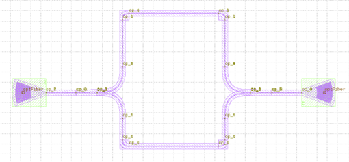
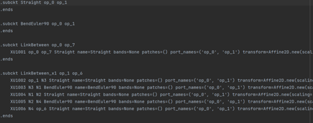

Export netlist implementation
^^^^^^^^^^^^^^^^^^^^^^^^^^^^^^^^^^^^^^^^^^^^^^^^^^^^^^^^^^^^^^^^^^

Refer to ``gpdk`` > ``examples`` > ``example_sdl_circuit_05.py``, in the output file code segment, besides defining the GDS file output path and file name, there is also code to define the SPICE netlist file output path and file name, and to realize the netlist output by ``fp.export_spc``.

The following code is extracted from ``gpdk`` > ``examples`` > ``example_sdl_circuit_05.py``::

  if __name__ == "__main__":
      from pathlib import Path

      gds_file = Path(__file__).parent / "local" / Path(__file__).with_suffix(".gds").name
      spc_file = Path(__file__).parent / "local" / Path(__file__).with_suffix(".spc").name
      library = fp.Library()

      TECH = get_technology()
      # =======================================================================
      # fmt: off
      import gpdk.components.all

      library += Circuit05_mzm()

      # fmt: on
      # =============================================================
      fp.export_gds(library, file=gds_file)
      fp.export_spc(library, file=spc_file, components=gpdk.components.all)
      fp.export_pls(library, file=gds_file.with_suffix(".pls"), components=gpdk.components.all)
      # fp.plot(library)
      
where::

  spc_file = Path(__file__).parent / "local" / Path(__file__).with_suffix(".spc").name
  
Define where the generated SPICE netlist files are stored and how their generated files are named.

Run ``example_sdl_circuit_05.py`` to see the files ``example_sdl_circuit_05.gds`` and ``example_sdl_circuit_05.spc`` in ``gpdk`` > ``examples`` > ``local``:

where::

  fp.export_spc(library, file=spc_file, components=gpdk.components.all)
  
Export the netlist file by the ``export_spc`` method in fnpcell is called to , ``file`` is used to receive the type of the spc file, and ``components`` is used to receive the components in the pdk.  

