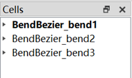
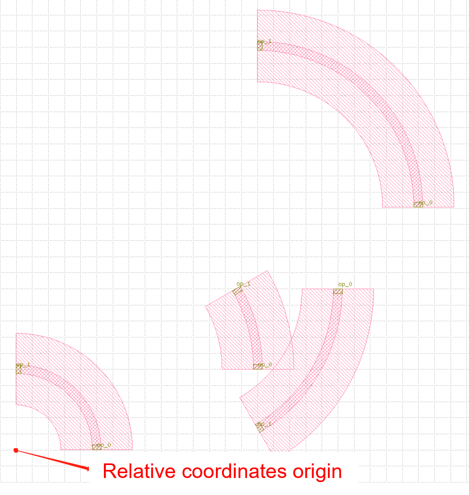

Example of using fnpcell to build class
^^^^^^^^^^^^^^^^^^^^^^^^^^^^^^^^^^^^^^^^
Example1: ``bend_bezier.py``
=============================

Full script
----------------
::

    from functools import cached_property
    from typing import Sequence, Tuple

    from fnpcell import all as fp
    from gpdk.technology import get_technology


    class BendBezier(fp.IWaveguideLike, fp.PCell):
        """
        Attributes:
            start: start point of bezier curve
            controls: control points of bezier, 1 for Quadratic Bezier, 2 for Cubic Bezier, ...
            end: end point of bezier curve
            waveguide_type: type of waveguide of the bend
            port_names: defaults to ["op_0", "op_1"]

        Examples:
        ```python
        TECH = get_technology()
            bend = BendBezier(name="q", start=(0, 0), controls=[(31, 30)], end=(60, 0), waveguide_type=TECH.WG.FWG.C.WIRE)
        fp.plot(bend)
        ```
        
        """

        start: fp.Point2D = fp.PositionParam(default=(0, 0), doc="position where bend start, eg. (x, y)")
        controls: Sequence[fp.Point2D] = fp.PointsParam(default=[(10, 0)], min_count=1, doc="control points, count >= 1, eg. [(x1, y1), (x2, y2)]")
        end: fp.Point2D = fp.PositionParam(default=(10, 10), doc="position where bend end, eg. (x, y)")
        waveguide_type: fp.IWaveguideType = fp.WaveguideTypeParam(doc="Waveguide parameters")
        port_names: fp.IPortOptions = fp.PortOptionsParam(count=2, default=["op_0", "op_1"])

        def _default_waveguide_type(self):
            return get_technology().WG.FWG.C.WIRE

        @cached_property
        def raw_curve(self):
            return fp.g.Bezier(
                start=self.start,
                controls=self.controls,
                end=self.end,
            )

        def build(self) -> Tuple[fp.InstanceSet, fp.ElementSet, fp.PortSet]:
            insts, elems, ports = super().build()
            wg = self.waveguide_type(curve=self.raw_curve).with_ports(self.port_names)
            insts += wg
            ports += wg.ports
            return insts, elems, ports


    if __name__ == "__main__":
        from pathlib import Path

        gds_file = Path(__file__).parent / "local" / Path(__file__).with_suffix(".gds").name
        library = fp.Library()

        TECH = get_technology()
        # =======================================================================
        # fmt: off

        library += BendBezier(name="bend1", start=(0, 0), controls=[(30, 30)], end=(60, 0), waveguide_type=TECH.WG.FWG.C.WIRE)
        library += BendBezier(name="bend2", start=(0, 0), controls=[(50, 20)], end=(60, 0), waveguide_type=TECH.WG.FWG.C.WIRE)
        library += BendBezier(name="bend3", start=(0, 0), controls=[(10, 20)], end=(60, 0), waveguide_type=TECH.WG.FWG.C.WIRE)

        # fmt: on
        # =============================================================
        fp.export_gds(library, file=gds_file)
        # fp.plot(library)


Section Script Definition
--------------------------------
#. Use ``BendBezier()`` class in ``bend_bezier.py`` to create three layout units, named ``bend1``, ``bend2``, and ``bend3``, and modify the controls parameter coordinates to different values, as follows::

        library += BendBezier(name="bend1", start=(0, 0), controls=[(30, 30)], end=(60, 0), waveguide_type=TECH.WG.FWG.C.WIRE)
        library += BendBezier(name="bend2", start=(0, 0), controls=[(50, 20)], end=(60, 0), waveguide_type=TECH.WG.FWG.C.WIRE)
        library += BendBezier(name="bend3", start=(0, 0), controls=[(10, 20)], end=(60, 0), waveguide_type=TECH.WG.FWG.C.WIRE)

   The units created by the three ``BendBezier()`` classes will generate three layout cells in the GDS file. The starting points of the three bends are in the same position, and the waypoints of the bezier curves will be different depending on the parameter settings.

#. Running the ``bend_bezier.py`` script will by default generate the GDS file under ``gpdk`` > ``components`` > ``bend`` > ``local``. If the relevant file already exists in the original local folder, the newly generated ``bend_bezier.gds`` file will automatically overwrite the original file (no warning message), but you can confirm that the existing file is the newly generated GDS file by the file modification time.

#. Using the GDS file viewer to view the layout (e.g. KLayout), you will see three layout cells in the cell list, all prefixed with ``BendBezier_`` and with the cell names defined when fetching the functions, i.e. ``bend1``, ``bend2``, ``bend3``. To easily compare, create a new cell and import three bends to see the shape of the bend controlled by the parameter.



.. image:: ../images/fnpcell_example2.png

Example2: bend_circular.py
==============================

Full script
-------------
::

        from functools import cached_property
        from typing import Tuple

        from fnpcell import all as fp
        from gpdk.technology import get_technology


        class BendCircular(fp.IWaveguideLike, fp.PCell):
            """
            Attributes:
                degrees: central angle of the bend, in degrees
                radius: raidus of the bend
                waveguide_type: type of waveguide of the bend
                port_names: defaults to ["op_0", "op_1"]

            Examples:
            ```python
            TECH = get_technology()
                bend = BendCircular(name="s", radius=5, waveguide_type=TECH.WG.FWG.C.WIRE)
            fp.plot(bend)
            ```
            
            """

            degrees: float = fp.DegreeParam(default=90, min=-180, max=180, doc="Bend angle in degrees")
            radius: float = fp.PositiveFloatParam(default=10, doc="Bend radius")
            waveguide_type: fp.IWaveguideType = fp.WaveguideTypeParam(doc="Waveguide parameters")
            port_names: fp.IPortOptions = fp.PortOptionsParam(count=2, default=["op_0", "op_1"])

            def _default_waveguide_type(self):
                return get_technology().WG.FWG.C.WIRE

            def __post_pcell_init__(self):
                assert fp.is_nonzero(self.degrees)

            @cached_property
            def raw_curve(self):
                return fp.g.EllipticalArc(
                    radius=self.radius,
                    final_degrees=self.degrees,
                )

            def build(self) -> Tuple[fp.InstanceSet, fp.ElementSet, fp.PortSet]:
                insts, elems, ports = super().build()
                wg = self.waveguide_type(curve=self.raw_curve).with_ports(self.port_names)
                insts += wg
                ports += wg.ports
                return insts, elems, ports


        if __name__ == "__main__":
            from pathlib import Path

            gds_file = Path(__file__).parent / "local" / Path(__file__).with_suffix(".gds").name
            library = fp.Library()

            TECH = get_technology()
            # =======================================================================
            # fmt: off

            library += BendCircular(name="bend1", radius=5, waveguide_type=TECH.WG.FWG.C.WIRE)
            library += BendCircular(name="bend2", radius=10, degrees=30, waveguide_type=TECH.WG.FWG.C.WIRE, transform=fp.translate(0, 5))
            library += BendCircular(name="bend3", radius=10, degrees=-60, waveguide_type=TECH.WG.FWG.C.WIRE).translated(5, 5)
            library += BendCircular(name="bend4", radius=10, degrees=90, waveguide_type=TECH.WG.FWG.C.WIRE, transform=fp.translate(0, 5)).translated(5, 5)

            # fmt: on
            # =============================================================
            fp.export_gds(library, file=gds_file)
            fp.plot(library)

Section Script Definition
---------------------------
#. In ``bend_circular.py`` script,  ``BendCircular()`` class is used to generate four layout cells, named ``bend1``~``bend4``.

   Different ``radius`` parameters, ``degrees`` parameters and ``translate`` parameters are used to reflect their effects on the device, where the use of the ``transform`` parameter is mainly reflected in ``bend2`` ~ ``bend4``, please refer to the comments in the source code for details; examples are shown below::

    library += BendCircular(name="bend1", radius=5, waveguide_type=TECH.WG.FWG.C.WIRE)
    library += BendCircular(name="bend2", radius=10, degrees=30, waveguide_type=TECH.WG.FWG.C.WIRE, transform=fp.translate(0, 5))
    library += BendCircular(name="bend3", radius=10, degrees=-60, waveguide_type=TECH.WG.FWG.C.WIRE).translated(5, 5)
    library += BendCircular(name="bend4", radius=10, degrees=90, waveguide_type=TECH.WG.FWG.C.WIRE, transform=fp.translate(0, 5)).translated(5, 5)

#. Run the ``bend_circular.py`` script will, by default, generate the GDS file under ``gpdk`` > ``components`` > ``bend`` > ``local``.

#. Open the GDS file to view the layout, there are four layout cells in the cell list, and they are all prefixed with ``BendCircular`` and suffixed with the cell names defined by the keyword name during creation, i.e., ``bend1`` ~ ``bend4``.

   Create a new cell and import the four bends, place the origin of the four bends at the same position, and you can see the effect on the device position due to the the effect of the ``fp.translate`` parameter on the device position.

   Note that in bend4, when creating the device using the ``BendCircular()`` class, we set translate both inside and outside of it, and its relative position is also the result of superimposing the two translate parameters, as shown below.

