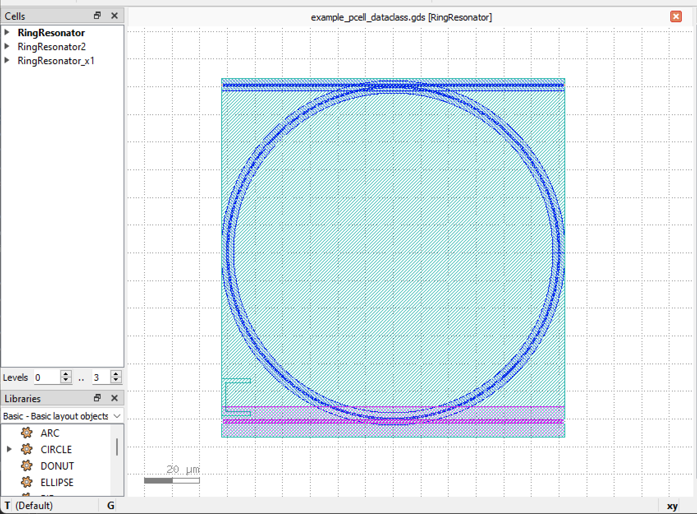

Writing a user-defined PCell in PhotoCAD
^^^^^^^^^^^^^^^^^^^^^^^^^^^^^^^^^^^^^^^^^^^^^^^^^^^

The following ``gpdk`` > ``examples`` > ``example_pcell_dataclass.py`` is an example of a custom ``RingResonator``.

Import module
-------------------------
::

    from dataclasses import dataclass, field
    from typing import cast

    from fnpcell import all as fp
    from gpdk import all as pdk
    from gpdk.technology import get_technology  # get TECH definition
    from gpdk.technology.interfaces import CoreCladdingWaveguideType
    
First import the function modules that need to be used in the script, such as the ``fnpcell`` function module; ``RingResonator`` will call the parameter units in ``gpdk``, so import ``gpdk``.

Define ``RingResonator``
------------------------------------
::

    class RingResonator(fp.PCell, band="C"):
        ring_radius: float = 5
        top_spacing: float = fp.PositiveFloatParam(default=0.2)
        bottom_spacing: float = fp.PositiveFloatParam(default=0.2)
        ring_type: CoreCladdingWaveguideType = fp.WaveguideTypeParam(type=CoreCladdingWaveguideType)
        top_type: CoreCladdingWaveguideType = fp.WaveguideTypeParam(type=CoreCladdingWaveguideType)
        bottom_type: CoreCladdingWaveguideType = fp.WaveguideTypeParam(type=CoreCladdingWaveguideType)
        port_names: fp.IPortOptions = fp.PortOptionsParam(count=4, default=["op_0", "op_1", "op_2", "op_3"])

        def _default_bottom_type(self):
            return get_technology().WG.FWG.C.WIRE

        def __post_pcell_init__(self):
            assert self.ring_radius > 0, "ring_radius must be > 0"

        def build(self):
            insts, elems, ports = fp.InstanceSet(), fp.ElementSet(), fp.PortSet()
            # fmt: off

            min_radius_of_type = cast(float, self.ring_type.BEND_CIRCULAR.radius_eff)  # type: ignore

            ring = self.ring_type(curve=fp.g.EllipticalArc(radius=self.ring_radius)).with_ports((None, None)).with_name("ring")
            insts += ring
            ring_core_width = self.ring_type.core_width
            ring_cladding_width = self.ring_type.cladding_width

            line_length = self.ring_radius * 2 + ring_cladding_width

            top_core_width = self.top_type.core_width
            top = pdk.Straight(name="top", length=line_length, waveguide_type=self.top_type, transform=fp.translate(-line_length / 2, self.ring_radius + self.top_spacing + top_core_width / 2 + ring_core_width / 2))
            insts += top
            ports += top["op_0"].with_name(self.port_names[0])
            ports += top["op_1"].with_name(self.port_names[3])
            bottom_core_width = self.bottom_type.core_width
            bottom = pdk.Straight(name="bottom", length=line_length, waveguide_type=self.bottom_type, transform=fp.translate(-line_length / 2, -(self.ring_radius + self.bottom_spacing + bottom_core_width / 2 + ring_core_width / 2)))
            insts += bottom
            ports += bottom["op_0"].with_name(self.port_names[1])
            ports += bottom["op_1"].with_name(self.port_names[2])

            # fmt: on
            return insts, elems, ports
            
            

Create a class called ``RingResonator`` and ``RingResonator`` will be used as a prefix for the name of the layout cell in the GDS file; ``fp.PCell`` then declares this to be a pcell via the module in ``fnpcell``::

    class RingResonator(fp.PCell, band="C")
    
Defines parameter ``ring_radius`` in the ``RingResonator()`` class; it is a positive floating point number and has a default value of 5::

    ring_radius: float = 5

Define the upper waveguide width parameter ``top_spacing``, default 0.2, and the lower waveguide width parameter ``bottom_spacing``, default 0.2, for the device, respectively::

    top_spacing: float = fp.PositiveFloatParam(default=0.2).as_field()
    bottom_spacing: float = fp.PositiveFloatParam(default=0.2).as_field()

Define the waveguide type parameters for the ring and the upper and lower waveguides. The waveguide type will contain ``core_width``, ``core_layer``, ``cladding_layer``, ``bend_radius``::

    ring_type: CoreCladdingWaveguideType = fp.WaveguideTypeParam(type=CoreCladdingWaveguideType).as_field()
    top_type: CoreCladdingWaveguideType = fp.WaveguideTypeParam(type=CoreCladdingWaveguideType).as_field()
    bottom_type: CoreCladdingWaveguideType = fp.WaveguideTypeParam(type=CoreCladdingWaveguideType,).as_field()
    
Defines the number of ports, default to 4; also given the four default names::

    port_names: fp.IPortOptions = fp.PortOptionsParam(count=4, default=["op_0", "op_1", "op_2", "op_3"]).as_field()
    
Define the function that returns the default waveguide type::

    def _default_bottom_type(self):
      return get_technology().WG.FWG.C.WIRE

Declare a function for the radius parameter, requiring that ``ring_radius`` must be greater than 0 or an error will be raised::

    def __post_pcell_init__(self):
      assert self.ring_radius > 0, "ring_radius must be > 0"
      
      
Each pcell function takes transform as the last parameter, which is used to pass position information when generating the layout::

    transform=fp.TransformParam()
    
    
Defining the build function to plot the component::

    def build(self):
    
Create insts, elems, ports and using them as fixed templates::

    insts, elems, ports = fp.InstanceSet(), fp.ElementSet(), fp.PortSet()

Define the minimum radius of the ring resonator::

    min_radius_of_type = cast(float, self.ring_type.BEND_CIRCULAR.radius_eff)

Define the ring in the ring resonator as an instance of a waveguide, with parameters containing the waveguide name ``ring``, the curve graph ``curve``, where the curve graph is generated by means of an elliptic curve, and the radius parameter radius of the curve::

    ring =self.ring_type(curve=fp.g.EllipticalArc(radius=self.ring_radius)).with_ports((None, None)).with_name("ring")
    
Instantiate the ring::

    insts += ring

Define a set of parameters to obtain data on the dimensions of the graph in the ring resonator::

    ring_core_width = self.ring_type.core_width
    ring_cladding_width = self.ring_type.cladding_width
    line_length = self.ring_radius * 2 + ring_cladding_width

Define the upper waveguide as an instance of a straight waveguide, the parameters of which include ``name``, ``length``, ``waveguide_type``, and relative position coordinate ``transform``::

    top_core_width = self.top_type.core_width
    top = pdk.Straight(name="top", length=line_length, waveguide_type=self.top_type, transform=fp.translate(-line_length / 2, self.ring_radius + self.top_spacing + top_core_width / 2 + ring_core_width / 2))

Use the upper waveguide ``top`` as an instance::

    insts += top

Add the ports and their names at both ends of the upper waveguide::

    ports += top["op_0"].with_name(self.port_names[0])
    ports += top["op_1"].with_name(self.port_names[3])

Define the lower waveguide as an instance of a straight waveguide, the parameters of which include ``name``, ``length``, ``waveguide_type``, and relative position coordinates ``transform``::

    bottom_core_width = self.bottom_type.core_width
    bottom = pdk.Straight(name="bottom", length=line_length, waveguide_type=self.bottom_type, transform=fp.translate(-line_length / 2, -(self.ring_radius + self.bottom_spacing + bottom_core_width / 2 + ring_core_width / 2)))
    
Use lower waveguide ``bottom`` as an instance::

    insts += bottom
    
Add the ports and their names at both ends of the lower waveguide::  

    ports += bottom["op_0"].with_name(self.port_names[1])
    ports += bottom["op_1"].with_name(self.port_names[2])
    
Returns the ring, upper waveguide, lower waveguide instance, elements, and ports defined above::    

    return insts, elems, ports
    
    
Define ``RingResonator2``
-----------------------------------------------------
::

    class RingResonator2(RingResonator, band="C"):
        ring_radius: float = fp.PositiveFloatParam(default=10) 
        computed_value: float = field(init=False)
        computed_v2: float = 7

        def _default_bottom_type(self):
            return get_technology().WG.SWG.C.WIRE

        def __post_pcell_init__(self):
            self.computed_value = self.ring_radius * 2
            self.computed_v2 = 8
            
            
Define a class named ``RingResonator2``, which inherits from the ``RingResonator`` class and can use all the ``RingResonator`` class's parent public properties and methods, while restricting the type of all the bands in the class to ``C``::

    class RingResonator2(RingResonator, band="C")    
    
Define the parameter ``ring_radius`` default to 10; parameter ``computed_value``; parameter ``computed_v2`` default to 7::

    ring_radius: float = fp.PositiveFloatParam(default=10).as_field()
    computed_value: float = field(init=False)
    computed_v2: float = 7
    
Define functions that return the default lower waveguide type::

    def _default_bottom_type(self):
      return get_technology().WG.SWG.C.WIRE
      
 Define built-in functions that assign values to the parameters ``computed_value`` and ``computed_v2``::
 
     def __post_pcell_init__(self):
        self.computed_value = self.ring_radius * 2
        self.computed_v2 = 8
        
Create examples(layout units) using classes ``RingResonator`` and ``RingResonator2``
-----------------------------------------------------------------------------------------------
::

    if __name__ == "__main__":
        from pathlib import Path
        gds_file = Path(__file__).parent / "local" / Path(__file__).with_suffix(".gds").name
        library = fp.Library()

        TECH = get_technology()

        # =============================================================
        # fmt: off
        r0 = RingResonator(ring_radius=60, ring_type=TECH.WG.FWG.C.WIRE, top_type=TECH.WG.FWG.C.WIRE, bottom_type=TECH.WG.MWG.C.WIRE)
        library += r0
        r1 = RingResonator(ring_type=TECH.WG.FWG.C.WIRE, top_type=TECH.WG.FWG.C.WIRE).translated(20, 0)
        library += r1
        r2 = RingResonator2(ring_type=TECH.WG.FWG.C.WIRE, top_type=TECH.WG.FWG.C.WIRE).translated(50, 0)
        library += r2
        # fmt: on
        # =============================================================
        fp.export_gds(library, file=gds_file)
        # fp.plot(library)

Set the path and filename where the script will be saved to generate the GDS file::

    gds_file = Path(__file__).parent / "local" /Path(__file__).with_suffix(".gds").name
    
Call ``fp.Library()`` for the layouts of the device created by the class::    

    library = fp.Library()

Call ``get_technology()`` to obtain process information for the layout file::

    TECH = get_technology()

Create three examples(devices ``r0``, ``r1``, ``r2``) using classes ``RingResonator`` and ``RingResonator2``, set the type of ring and upper and lower waveguides, and control the relative coordinates of the devices by means of the ``translated(x, y)`` method::

    r0 = RingResonator(ring_radius=60, ring_type=TECH.WG.FWG.C.WIRE, top_type=TECH.WG.FWG.C.WIRE, bottom_type=TECH.WG.MWG.C.WIRE)
    library += r0
     r1 = RingResonator(ring_type=TECH.WG.FWG.C.WIRE, top_type=TECH.WG.FWG.C.WIRE).translated(20, 0)
    library += r1
    r2 = RingResonator2(ring_type=TECH.WG.FWG.C.WIRE, top_type=TECH.WG.FWG.C.WIRE).translated(50, 0)
    library += r2

Export the layout cells as GDS files::

    fp.export_gds(library, file=gds_file)
    
GDS Layout
-----------------

    
    
    
    
    

    

