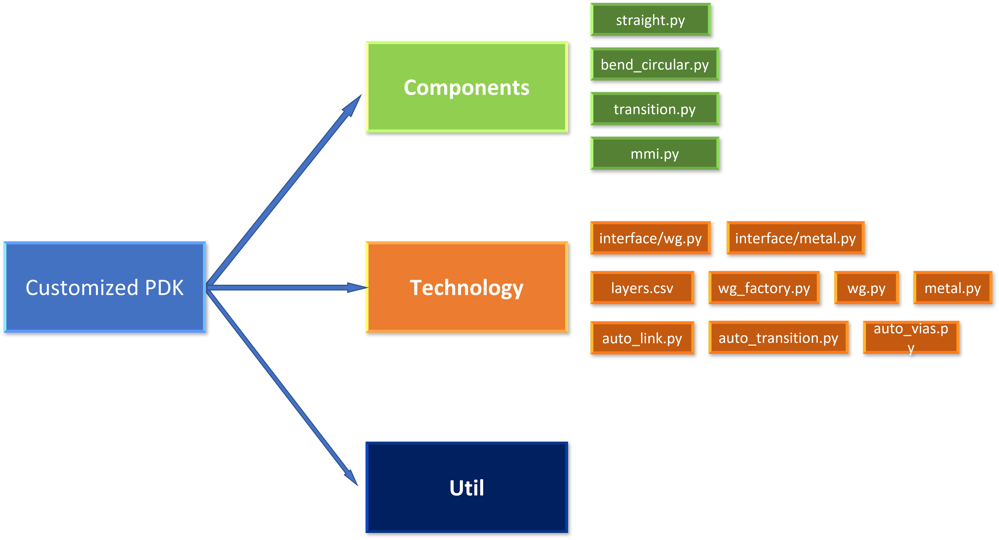

Create a customized PDK
=========================

This chapter is designed to help users quickly create PDKs that use their own process flows to automate layout routing.
A customized PDK must have the following files to configure their settings to **PhotoCAD**.

Contents：

- components：Store base passive and active components e.g., straight waveguides, circular bends, waveguide transitions, MMIs, heaters.
- technology：PDK technology setting such as waveguide settings, automatic waveguide routing settings, layer information.
- util：some useful function.

Standard Procedure
---------------------------

#. Configure CAD layer information (layer ID/datatype/layer name) in :ref:`layers.csv`.

#. Add waveguide information(waveguide type/wg width/wg layer) in :ref:`wg.py` but keep straight factory and bend factories blank.

#. Create basic components such as straight waveguide, bends, taper, transitions in **component** folder.

#. Assign straight factory and bend factory in every waveguide in :ref:`wg.py`.

#. Configure taper and transition components in :ref:`auto_transition.py`.

#. Set up ``LINKING_POLICY`` in :ref:``auto_link.py`` to easily connect waveguides with bends and connections.

#. Build ``linker.py`` settings to assign designated waveguide with designated length, bends and transitions.

#. After ``LINKER`` or ``LinkBetween`` works in your PDK, try to create more components and build up a real photonic integrated circuit by using various function in **PhotoCAD**.

.. toctree::
   :hidden:

   technology
   components

