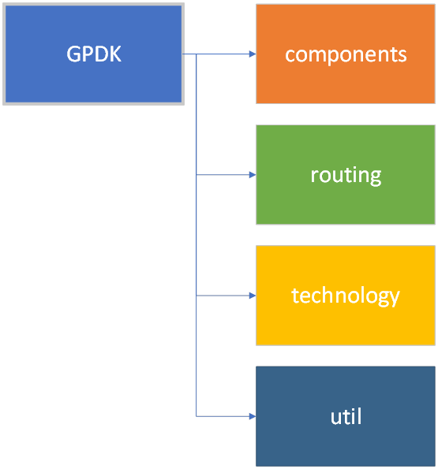

Create a customized PDK
=========================

This chapter is designed to help users quickly create PDKs that use their own process flows to automate layout routing.

Contents：

- components：store base components
- routing：automatic layout routing
- technology：layout base layer related
- util：configuraton file

.. toctree::
   :hidden:

   components
   routing
   technology
