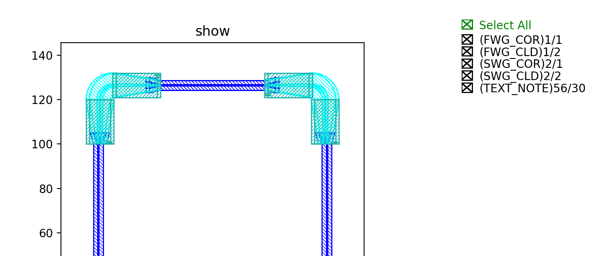

auto_transition.py
============================================================

Create transition components
------------------------------------
This function mainly defines the waveguide type and the default bend waveguide when the port is connected. Before this, users have to first create components such as ``FWG2MWGTransition`` to allow auto transition to work, and specified parameters such as transition length, shape will also be defined in the component (Ref: Lib/site-packages/gpdk/components/transition/fwg2mwg_transition.py).

Set up transition settings
---------------------------------------
We define several transition types which combines every possibilities between our waveguide types. The rules are set in ``class AUTO_TRANSITION``, which we have to import it in ``gpdk/technology/tech.py`` after we defined it.

::

    from typing import Tuple, cast
    from fnpcell.pdk.technology import all as fpt
    from .interfaces import CoreCladdingWaveguideType
    from .wg import WG

    def _c_fwg2mwg(end_types: Tuple[fpt.IWaveguideType, fpt.IWaveguideType]):
        from ..components.transition.fwg2mwg_transition import FWG2MWGTransition

        a = end_types[0]
        b = end_types[1]
        assert isinstance(a, WG.FWG.C)
        assert isinstance(b, WG.MWG.C)

        return FWG2MWGTransition(name="auto", length=20, fwg_type=a, mwg_type=b), ("op_0", "op_1")

    def _c_fwg2swg(end_types: Tuple[fpt.IWaveguideType, fpt.IWaveguideType]):
        from ..components.transition.fwg2swg_transition import FWG2SWGTransition

        a = end_types[0]
        b = end_types[1]
        assert isinstance(a, WG.FWG.C)
        assert isinstance(b, WG.SWG.C)

        return FWG2SWGTransition(name="auto", length=20, fwg_type=a, swg_type=b), ("op_0", "op_1")

    def _c_swg2mwg(end_types: Tuple[fpt.IWaveguideType, fpt.IWaveguideType]):
        from ..components.transition.swg2mwg_transition import SWG2MWGTransition

        a = end_types[0]
        b = end_types[1]
        assert isinstance(a, WG.SWG.C)
        assert isinstance(b, WG.MWG.C)

        return SWG2MWGTransition(name="auto", swg_length=10, mwg_length=10, swg_type=a, mwg_type=b), ("op_0", "op_1")

    class _Taper:
        def __init__(self, slope: float) -> None:
            self.slope = slope

        def __call__(self, end_types: Tuple[fpt.IWaveguideType, fpt.IWaveguideType]):
            from ..components.taper.taper_linear import TaperLinear

            a = cast(CoreCladdingWaveguideType, end_types[0])
            b = cast(CoreCladdingWaveguideType, end_types[1])
            k = self.slope
            length = max(0.01, abs(a.core_width - b.core_width) / k)
            return TaperLinear(name="auto", length=length, left_type=a, right_type=b), ("op_0", "op_1")

    class AUTO_TRANSITION:
        @fpt.classconst
        @classmethod
        def DEFAULT(cls):
            return fpt.AutoTransition().updated(
                [
                    (WG.FWG.C >> WG.MWG.C, _c_fwg2mwg),
                    (WG.FWG.C >> WG.SWG.C, _c_fwg2swg),
                    (WG.SWG.C >> WG.MWG.C, _c_swg2mwg),
                    #
                    (WG.FWG.C >> WG.FWG.C, _Taper(0.2)),
                    (WG.SWG.C >> WG.SWG.C, _Taper(0.2)),
                    (WG.MWG.C >> WG.MWG.C, _Taper(0.2)),
                ]
            )

Example
---------------------
We use waveguide routing method ``create_links`` to demonstrate the auto transition function. You can see from the below figure, the link type of these waveguide ports is ``FWG.C.WIRE`` and the circular bend type is ``SWG.C.WIRE``. Thus, ``_c_fwg2swg`` occurs in the transition between straight waveguide and circular bend::

        link = fp.create_links(
            link_type=TECH.WG.FWG.C.WIRE,
            bend_factory=TECH.WG.SWG.C.WIRE.BEND_CIRCULAR,
            specs=[
                wg1["op_0"] >> wg2["op_1"],
                wg1["op_1"] >> wg3["op_1"],
            ],
        )

