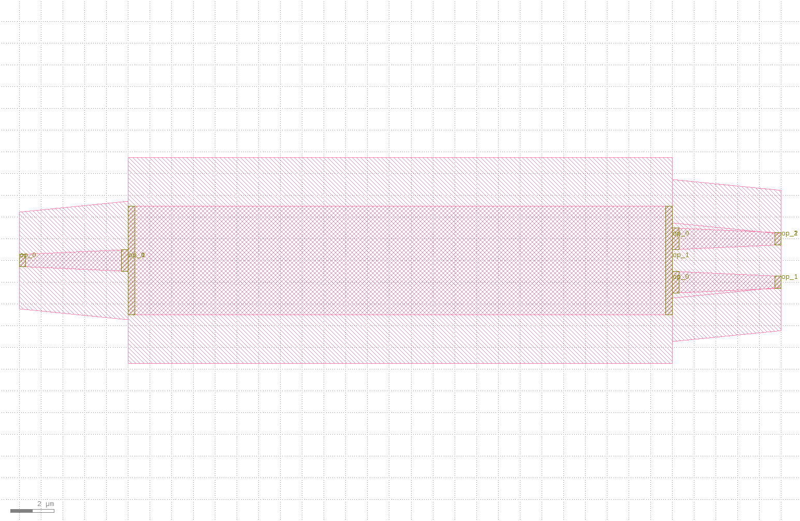
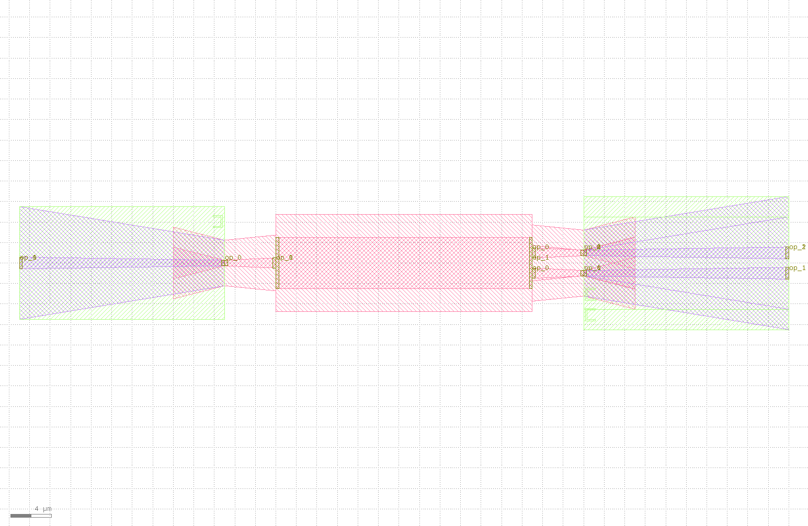

auto_transitioned
====================

When connecting components to components, many times we face the port mismatch problem, and then we need to introduce taper waveguide to achieve the transition. The automatic port transition function provides us with a fast method for port transition.

Automatic port transition is defined as follows::

    @dataclass(eq=False)
    class AutoTransitioned(PCell):
        """
        Attributes:
            device: device whose ports need to be auto-transitioned
            waveguide_type: dict with port name as key, waveguide type as value, "*" means every other port

        Examples:
        ```python
        TECH = get_technology()
            device = AutoTransitioned(device=Mmi(waveguide_type=TECH.WG.FWG.C.WIRE), waveguide_types={"*": WG.SWG.C.WIRE})
        fp.plot(device)
        ```
        
        """

        device: fp.IDevice = fp.DeviceParam()
        waveguide_types: Mapping[str, fp.IWaveguideType] = fp.MappingParam(K=str, V=fp.IWaveguideType, immutable=True)

        def build(self) -> Tuple[fp.InstanceSet, fp.ElementSet, fp.PortSet]:
            insts, elems, ports = super().build()
            TECH = get_technology()
            waveguide_types = self.waveguide_types
            joints: List[Tuple[fp.IOwnedTerminal, fp.IOwnedTerminal]] = []
            transition_ports: List[fp.IOwnedTerminal] = []
            for port in self.device.ports:
                if isinstance(port, fp.IOwnedPort) and not port.disabled:
                    start_type = port.waveguide_type
                    end_type = waveguide_types.get(port.name) or waveguide_types.get("*")
                    if end_type is not None and start_type != end_type:
                        transition, (port_in, port_out) = TECH.AUTO_TRANSITION.DEFAULT[start_type >> end_type]
                        joints.append(port <= transition[port_in])
                        port_name = port.name
                        transition_ports.append(transition[port_out].with_name(fp.Hidden(port_name) if port.hidden and port_name else port_name))

            used_port_names = set(port.name for port in transition_ports)
            unused_ports = [port for port in self.device.ports if not port.disabled and port.name not in used_port_names]
            device = fp.Connected(
                joints=joints,
                ports=transition_ports + unused_ports,
            )
            insts += device
            ports += device.ports

            return insts, elems, ports

After defing the automatic transition, we can directly use it when designing the layout::

    library += AutoTransitioned(device=Mmi(waveguide_type=TECH.WG.FWG.C.WIRE), waveguide_types={"*": TECH.WG.SWG.C.WIRE})
    fp.export_gds(library, file=gds_file)

The following shows the MMI structure and the corresponding layout of the circuit after the automatic port transition, where the mmi structure can be seen here（:doc:`mmi`）：



