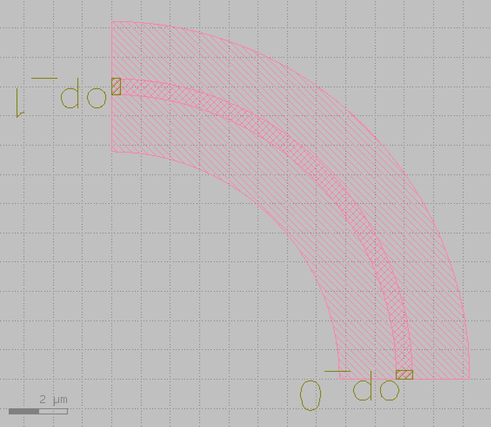

.. _bend_circular :

bend_circular
====================

Circular bending is the most common bend using in a photonic integrated circuit. This section teaches you how to create a circular bend.

Steps are as follows:

Import Library::

    from dataclasses import dataclass
    from functools import cached_property
    from typing import Optional, Tuple

    from fnpcell import all as fp
    from gpdk.technology import get_technology, PCell
    from gpdk.technology.interfaces import CoreCladdingWaveguideType

Define BendCircular class::

    class BendCircular(fp.IWaveguideLike, fp.PCell):

        degrees: float = fp.DegreeParam(default=90, min=-180, max=180, doc="Bend angle in degrees")
        radius: float = fp.PositiveFloatParam(default=10, doc="Bend radius")
        waveguide_type: fp.IWaveguideType = fp.WaveguideTypeParam(doc="Waveguide parameters")
        port_names: fp.IPortOptions = fp.PortOptionsParam(count=2, default=["op_0", "op_1"])

        def _default_waveguide_type(self):
            return get_technology().WG.FWG.C.WIRE

        def __post_pcell_init__(self):
            assert fp.is_nonzero(self.degrees)

        @cached_property
        def raw_curve(self):
            return fp.g.EllipticalArc(
                radius=self.radius,
                final_degrees=self.degrees,
            )

        def build(self) -> Tuple[fp.InstanceSet, fp.ElementSet, fp.PortSet]:
            insts, elems, ports = super().build()
            wg = self.waveguide_type(curve=self.raw_curve).with_ports(self.port_names)
            insts += wg
            ports += wg.ports
            return insts, elems, ports

Define BendCircular at 90 degree angle::

    class BendCircular90(BendCircular):
        degrees: float = fp.DegreeParam(default=90, locked=True)
        waveguide_type: fp.IWaveguideType = fp.WaveguideTypeParam(locked=True)

This class definition implements layout design through the following calls::

    library += BendEuler()
    library += BendEuler90()
    fp.export_gds(library, file=gds_file)

Run and plot:

