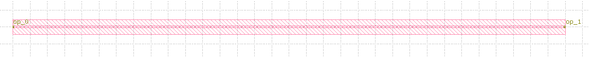

.. _Straight :

Straight
====================

The straight waveguide is an indispensable component of the photonic integration circuit.

The building steps are as follows:

Import library::

    from dataclasses import dataclass
    from functools import cached_property
    from typing import Tuple

    from fnpcell import all as fp
    from fnpcell.interfaces import angle_between, distance_between
    from gpdk.technology import get_technology, PCell

Define class Straight::

    class Straight(fp.IWaveguideLike, PCell):

        length: float = fp.FloatParam(default=10, min=0)
        waveguide_type: fp.IWaveguideType = fp.WaveguideTypeParam()
        anchor: fp.Anchor = fp.AnchorParam(default=fp.Anchor.START)
        port_names: fp.IPortOptions = fp.PortOptionsParam(count=2, default=("op_0", "op_1"))

 - First, users has to list all parameters they want for this PCell to be adjustable.::

        def _default_waveguide_type(self):
            return get_technology().WG.FWG.C.WIRE

 - Second, a default parameter will be assigned to some parameters listed above. In this example, the default waveguide type of this straight component will be ``FWG.C.WIRE``. However, users can adjust different waveguide types when using ``Straight`` and are not limited to ``CoreCladdingWaveguideType`` waveguides because we are setting ``waveguide_type: fp.IWaveguideType``.::

        @cached_property
        def raw_curve(self):
            return fp.g.Line(
                length=self.length,
                anchor=self.anchor,
            )

 - Then, a ``raw_curve`` function is defined to send the length of the ``Straight`` component to the designated waveguide type. It is important to define ``raw_curve`` in every basic cells which will be used in routing functions such as straight waveguides, bends, tapers, transitions. When using ``Linked``, ``LinkBetween`` or any other routing function,  **PhotoCAD** will calculate the length between two ports and assign proper components for routing.::

        def build(self) -> Tuple[fp.InstanceSet, fp.ElementSet, fp.PortSet]:
            insts, elems, ports = super().build()
            wg = self.waveguide_type(curve=self.raw_curve).with_ports(self.port_names)
            insts += wg
            ports += wg.ports
            return insts, elems, ports

- Finally, we build up the ``Straight`` component by adding instances, elements, and ports information to this class.

            
This class definition implements the layout design through the following calls::

    TECH = get_technology()
        straight = Straight(name="s", length=10, waveguide_type=TECH.WG.FWG.C.WIRE)
    fp.plot(straight)

In addition, it is necessary to define the function of the straight waveguide connection between the ports::

    def StraightBetween(
        *,
        start: fp.Point2D = (0, 0),
        end: fp.Point2D,
        waveguide_type: fp.IWaveguideType,
        port_names: fp.IPortOptions = ("op_0", "op_1"),
    ):
        length = distance_between(end, start)
        orientation = angle_between(end, start)
        straight = Straight(length=length, waveguide_type=waveguide_type, port_names=port_names).rotated(radians=orientation).translated(*start)
        return straight

Run and plot:

