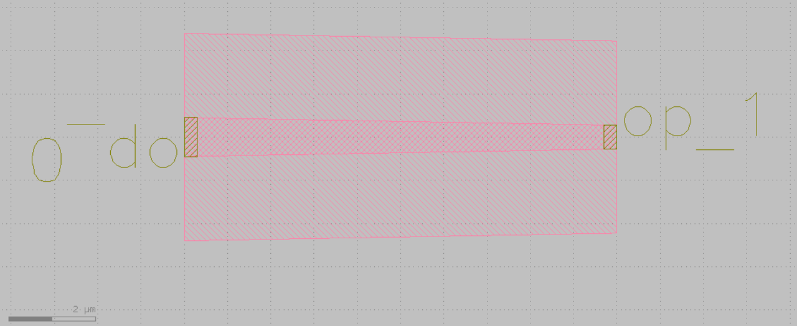

.. _Taper :

Taper
====================

A Taper has a structure of different width in two ends. It is commonly used to connect waveguides with different width.

The building steps are as follows:

Import library::

    from functools import cached_property
    from typing import Tuple

    from fnpcell import all as fp
    from fnpcell.interfaces import angle_between, distance_between
    from gpdk.technology import get_technology, PCell

Define class TaperLinear::

    class TaperLinear(fp.IWaveguideLike, fp.PCell):

        length: float = fp.PositiveFloatParam(default=10)
        left_type: CoreCladdingWaveguideType = fp.WaveguideTypeParam(type=CoreCladdingWaveguideType)
        right_type: CoreCladdingWaveguideType = fp.WaveguideTypeParam(type=CoreCladdingWaveguideType)
        anchor: fp.Anchor = fp.AnchorParam(default=fp.Anchor.CENTER)
        port_names: fp.IPortOptions = fp.PortOptionsParam(count=2, default=["op_0", "op_1"])

 - First, users has to list all parameters they want for this PCell to be adjustable. It is very similar when building a straight waveguide, and the difference between them is that we have to assign the waveguide type of the two ends (left and right) ::

        def _default_left_type(self):
            return get_technology().WG.FWG.C.WIRE

        def _default_right_type(self):
            return get_technology().WG.FWG.C.EXPANDED

 - Second, a default parameter will be assigned to some parameters listed above. In this example, the two different default waveguide types of this taper component will be ``FWG.C.WIRE`` on the left and ``FWG.C.EXPANDED`` on the right.::

        @cached_property
        def raw_curve(self):
            return fp.g.Line(
                length=self.length,
                anchor=self.anchor,
            )

 - Then, a ``raw_curve`` function is defined to send the length of the ``TaperLinear`` component to the designated waveguide type. It is important to define ``raw_curve`` in every basic cells which will be used in routing functions such as straight waveguides, bends, tapers, transitions. When using ``Linked``, ``LinkBetween`` or any other routing function,  **PhotoCAD** will calculate the length between two ports and assign proper components for routing.::

        def build(self) -> Tuple[fp.InstanceSet, fp.ElementSet, fp.PortSet]:
            insts, elems, ports = super().build()
            assert self.left_type.is_isomorphic_to(self.right_type), "left_type must be isomorphic to right_type"

            wgt = self.left_type.tapered(taper_function=fp.TaperFunction.LINEAR, final_type=self.right_type)
            wg = wgt(curve=self.raw_curve).with_ports(self.port_names)
            insts += wg
            ports += wg.ports
            return insts, elems, ports

- Finally, we build up the ``Taper`` component by adding instances, elements, and ports information to this class. Note that the two ends of the ``Taper`` has to be applying to the same band e.g, FWG.C and SWG.C and also same waveguide types since we set left/right type has to be ``CoreCladdingWaveguideType``.

Run and plot:

