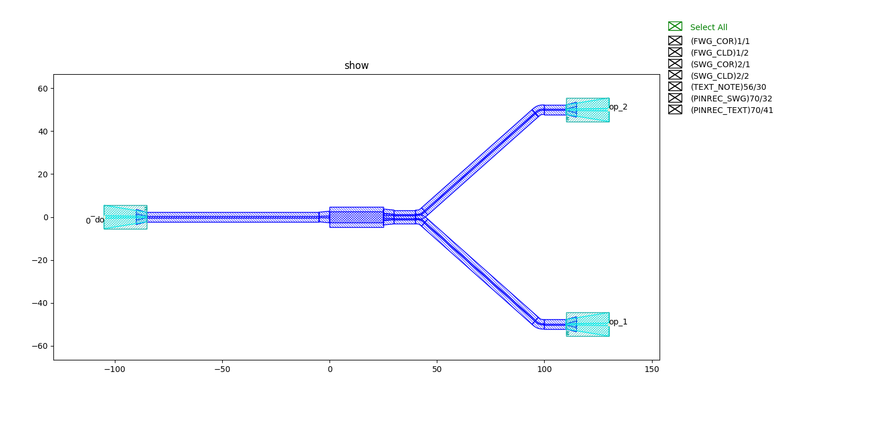
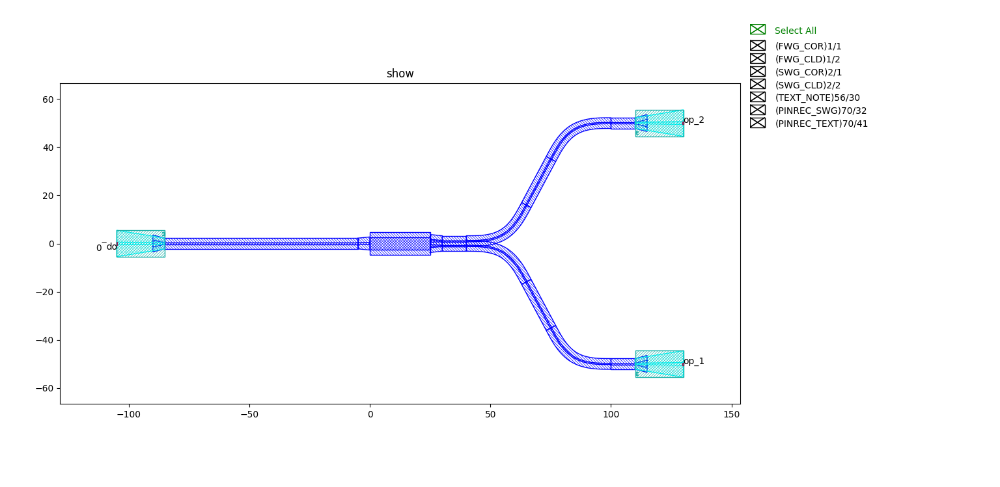

waveguide_factory.py
============================================================

This script mainly provides a more intelligent solution for implementing port acquisition and bend routing in automatic waveguide routing. The main components are
:
    * Straight_
    * CircularBend_
    * EulerBend_
    * Examples_

Straight
---------------------------

Define class StraightFactory ::

    @dataclass(frozen=True)
    class StraightFactory(fpt.IStraightWaveguideFactory):
        def __call__(self, type: fpt.IWaveguideType, length: float):
            from gpdk.components.straight.straight import Straight

            straight = Straight(length=length, waveguide_type=type)
            return straight, ("op_0", "op_1")

Returns straight waveguide and port information to provide support for port connections during automatic routing.

CircularBend
---------------------------

Define class CircularBendFactory::

    @dataclass(frozen=True)
    class CircularBendFactory(fpt.IBendWaveguideFactory):
        radius_eff: float
        waveguide_type: fpt.IWaveguideType = field(repr=False, compare=False)

        def __call__(self, central_angle: float):
            from gpdk.components.bend.bend_circular import BendCircular, BendCircular90_FWG_C_WIRE, BendCircular90_FWG_C_EXPANDED
            from gpdk.technology import get_technology

            TECH = get_technology()

            radius_eff = self.radius_eff

            bend = None
            if fp.is_close(abs(central_angle), math.pi / 2):
                if self.waveguide_type == TECH.WG.FWG.C.WIRE:
                    bend = BendCircular90_FWG_C_WIRE()
                elif self.waveguide_type == TECH.WG.FWG.C.EXPANDED:
                    bend = BendCircular90_FWG_C_EXPANDED()

                if bend and central_angle < 0:
                    bend = bend.v_mirrored()

            if bend is None:
                bend = BendCircular(degrees=math.degrees(central_angle), radius=radius_eff, waveguide_type=self.waveguide_type)

            return bend, radius_eff, ("op_0", "op_1")

The parameters that can be set optionally are

- radius_eff 
- waveguide_type

``BendCircular90_FWG_C_WIRE`` or  ``BendCircular90_FWG_C_EXPANDED`` will be automatically used when the bend angle is 90 degree and the waveguide type of two connected ports are also ``FWG.C.WIRE`` or ``FWG.C.EXPANDED``, respectively.

Returns the bend waveguide and the radius and port information.

EulerBend
---------------------------

Define class EulerBendFactory::

    @dataclass(frozen=True)
    class EulerBendFactory(fpt.IBendWaveguideFactory):
        radius_min: float
        l_max: float
        waveguide_type: fpt.IWaveguideType = field(repr=False, compare=False)

        def __call__(self, central_angle: float):
            from gpdk.components.bend.bend_euler import BendEuler, BendEuler90, BendEuler90_FWG_C_WIRE, BendEuler90_FWG_C_EXPANDED
            from gpdk.technology.interfaces import CoreCladdingWaveguideType
            from gpdk.technology import get_technology

            TECH = get_technology()

            bend = None
            if fp.is_close(abs(central_angle), math.pi / 2):
                if self.waveguide_type == TECH.WG.FWG.C.WIRE:
                    bend = BendEuler90_FWG_C_WIRE()
                elif self.waveguide_type == TECH.WG.FWG.C.EXPANDED:
                    bend = BendEuler90_FWG_C_EXPANDED()
                elif isinstance(self.waveguide_type, CoreCladdingWaveguideType):
                    bend = BendEuler90(slab_square=True, radius_min=self.radius_min, l_max=self.l_max, waveguide_type=self.waveguide_type)

                if bend and central_angle < 0:
                    bend = bend.v_mirrored()

            if bend is None:
                bend = BendEuler(degrees=math.degrees(central_angle), radius_min=self.radius_min, l_max=self.l_max, waveguide_type=self.waveguide_type)

            return bend, bend.raw_curve.radius_eff, ("op_0", "op_1")

The parameters that can be set optionally are

- radius_min : Minimum radius in the Euler bend
- l_max : Maximum length of Euler spiral in half bend
- waveguide_type : Type of the Euler bend waveguide

``BendEuler90`` , ``BendEuler90_FWG_C_WIRE`` and ``BendEuler90_FWG_C_EXPANDED``  are also created in the components to automatically generated 90 degree bend when the bend angle of the two waveguide ports are 90 degree.

Returns the Euler bend, along with the equivalent radius of the Euler bend and the corresponding port information.

Examples
---------------------------

Original circuit::

    from pathlib import Path

    gds_file = Path(__file__).parent / "local" / Path(__file__).with_suffix(".gds").name
    library = fp.Library()

    TECH = get_technology()
    # =============================================================
    # fmt: off
    from gpdk.components.directional_coupler.directional_coupler_sbend import DirectionalCouplerSBend
    from gpdk.components.mmi.mmi import Mmi
    from gpdk.technology.waveguide_factory import EulerBendFactory

    library += [
            HFanout(name="mmi",device=Mmi(waveguide_type=TECH.WG.FWG.C.WIRE), left_spacing=100, right_spacing=100, left_distance=100,
                    right_distance=100,
                    left_waveguide_type=TECH.WG.SWG.C.WIRE,
                    right_waveguide_type=TECH.WG.SWG.C.WIRE)
        ]
    # fmt: on
    # =============================================================
    fp.export_gds(library, file=gds_file)
    fp.plot(library)

Circuit for routing the ports by Euler bending 'EulerBendFactory()'::

    from pathlib import Path

    gds_file = Path(__file__).parent / "local" / Path(__file__).with_suffix(".gds").name
    library = fp.Library()

    TECH = get_technology()
    # =============================================================
    # fmt: off
    from gpdk.components.directional_coupler.directional_coupler_sbend import DirectionalCouplerSBend
    from gpdk.components.mmi.mmi import Mmi
    from gpdk.technology.waveguide_factory import EulerBendFactory

    def bend_factories(waveguide_type: fp.IWaveguideType):
        if waveguide_type == TECH.WG.FWG.C.WIRE:
            return EulerBendFactory(radius_min=15, l_max=15, waveguide_type=waveguide_type)
        return waveguide_type.bend_factory

    library += [
            HFanout(name="mmi",device=Mmi(waveguide_type=TECH.WG.FWG.C.WIRE), left_spacing=100, right_spacing=100, left_distance=100,
                    right_distance=100,
                    bend_factories=bend_factories,
                    left_waveguide_type=TECH.WG.SWG.C.WIRE,
                    right_waveguide_type=TECH.WG.SWG.C.WIRE)
        ]
    # fmt: on
    # =============================================================
    fp.export_gds(library, file=gds_file)
    fp.plot(library)

Comparison of final circuit results：

Commo
---------------------------
