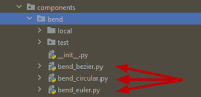

Components: Provided by **gpdk**
^^^^^^^^^^^^^^^^^^^^^^^^^^^^^^^^^^^^^^^^^^^^^^^^^^^
The **components** folder in gpdk holds all Python scripts for parametric component layout units, where each type of parametric component unit is stored in a subfolder named after the component unit, such as ``bend``, ``bondpad``, ``combiner``, and other component subfolders.

Each single component subfolder within the **components** folder contains the Python script source code for that class of component.

Take the ``bend`` folder as an example: 

1. The ``local`` folder is used to store the GDS and SPC netlist files generated by the python scripts of bend devices (if the ``local`` folder does not exist, it will be generated automatically after running the python source code of the device).
2. The test folder can be ignored by users for the time being.
3. The red arrows in the figure below show the python source code of three different types of bends, users can try to run the source code to experience its' functions.

