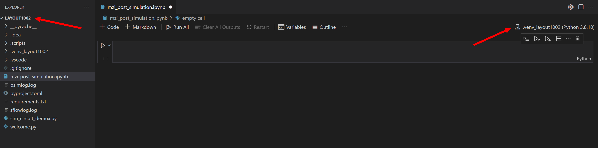
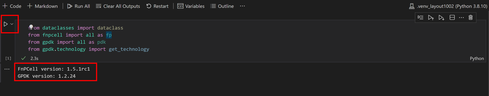

MZI circuit layout generation in Jupyter notebook
^^^^^^^^^^^^^^^^^^^^^^^^^^^^^^^^^^^^^^^^^^^^^^^^^^^^^^^^^^^^^^^^^^

Belows are steps to create Jupyter Notebook on VScode environment, running a Jupyter notebook is free on VScode, however if you are designing on PyCharm, only Pycharm Pro supports Jupyter Notebook.

Create a Jupyter Notebook
-------------------------------

First, we have to create a Jupyter Notebook by running the Create: New Jupyter Notebook command from the Command Palette (Ctrl+Shift+P) or by creating a new ``.ipynb`` file in your workspace. **Note: The ``ipynb`` file has to be create under the folder ``LAYOUT100X``, so that the kernel and language will be correct for running PhotoCAD**

Code cell & Markdown cell
------------------------------------
In code cell mode, users are allowed to script Python code and run a single cell using the ``Run`` icon to the left of the cell and the output will be displayed below the code cell.

Running multiple cells is also possible by using the double arrow in the main toolbar of the Notebook editor to run all cells within the Notebook or the ``Run`` icons with directional arrows in the cell toolbar to run all cells above ot below the current code cell.

.. image:: ../images/notebook3.png

In Markdown cell mode, we can write content in the cell to provide information or notification to the cell codes. After selecting the check mark or use the shortcut ``Ctrl+Enter``, the Markdown cell will transform into contents.

.. image:: ../images/notebook4.png
.. image:: ../images/notebook5.png

Generate MZI layout
-------------------------------------

#. Import function packages

   Run the code cell and it will tell you the version of ``PhotoCAD``.

    .. image:: ../images/notebook6.png

#.  Place ``DC_050`` components in MZI

    Create ``Instanceset``, ``Elementset``, ``Portset`` for components and ports to add in the Device function in ``fnpcell``. Then call two ``DC_050`` in pdk naming ``DC1`` and ``DC2``, translating their locations and instantiating to ``insts``. Users can use ``fp.plot`` to monitor the cells.

        .. image:: ../images/notebook7.png

#.  Create links and ports to connect ``DC_050`` in MZI

    The scripts here to generate links( ``fp.create_links`` ) and ports are the same when using Python IDE environment. However, in the end we have to create a cell reference which contains the ``instanceset``, ``elementset``, and ``portset`` we generated above. We can also plot the MZI device by using ``fp.plot`` function. ::

            links = fp.create_links(
                link_type=TECH.WG.FWG.C.WIRE,
                bend_factory=TECH.WG.FWG.C.WIRE.BEND_CIRCULAR,
                specs=[
                    fp.LinkBetween(
                        DC1["op_2"],
                        DC2["op_1"],
                        target_length=base_length,
                    ),
                    fp.LinkBetween(
                        DC1["op_3"],
                        DC2["op_0"],
                        target_length=base_length + delta_L
                    ),
                ],
            )
            insts += links

            ports += DC1["op_0"].with_name("op_1")
            ports += DC1["op_1"].with_name("op_2")
            ports += DC2["op_2"].with_name("op_3")
            ports += DC2["op_3"].with_name("op_4")

#. Generate GDS file and plot

    Users can also export GDS file of the generated cell after adding the instance set and port set into ``fp.Device`` to become a cell.
    Then to export GDS and plot using the same ``fp.export_gds`` method in all the examples.::

        gds_file = "C:\\LDA\\layout1001\\local\\mzi_jupyter_notebook.gds"
        library = fp.Library()
        TECH = get_technology()
        device = fp.Device(content=[insts], ports=ports)
        library += device
        fp.export_gds(library, file=gds_file)
        fp.plot(library)

        .. image:: ../images/notebook8.png

Users can download :download:`jupyter_notebook_mzi.ipynb <../jupyter_notebook/jupyter_notebook_mzi.ipynb>` for example.

