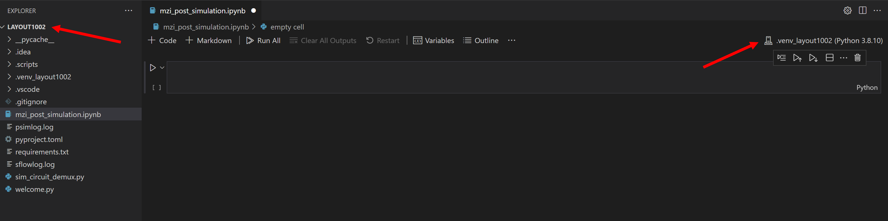
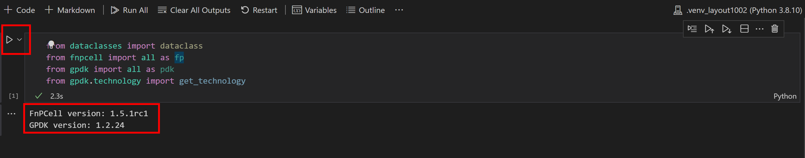
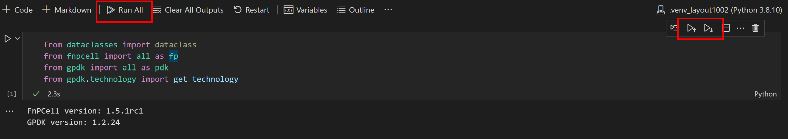
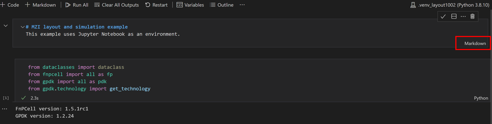
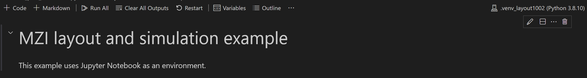

MZI circuit layout generation and simulation in Jupyter notebook
^^^^^^^^^^^^^^^^^^^^^^^^^^^^^^^^^^^^^^^^^^^^^^^^^^^^^^^^^^^^^^^^^^

Belows are steps to create Jupyter Notebook on VScode environment, running a Jupyter notebook is free on VScode, however if you are designing on PyCharm, only Pycharm Pro supports Jupyter Notebook environment.

Create a Jupyter Notebook
-------------------------------

First, we have to create a Jupyter Notebook by running the Create: New Jupyter Notebook command from the Command Palette (Ctrl+Shift+P) or by creating a new ``.ipynb`` file in your workspace. **Note: The ``ipynb`` file has to be create under the folder ``LAYOUT100X``, so that the kernel and language will be correct for running PhotoCAD**

Code cell & Markdown cell
------------------------------------
In code cell mode, users are allowed to script Python code and run a single cell using the ``Run`` icon to the left of the cell and the output will be displayed below the code cell.

Running multiple cells is also possible by using the double arrow in the main toolbar of the Notebook editor to run all cells within the Notebook or the ``Run`` icons with directional arrows in the cell toolbar to run all cells above ot below the current code cell.

In Markdown cell mode, we can write content in the cell to provide information or notification to the cell codes. After selecting the check mark or use the shortcut ``Ctrl+Enter``, the Markdown cell will transform into contents.

Generate MZI layout
-------------------------------------

#. Import function packages

   Run the code cell and it will tell you the version of the ``FnPCell`` and ``GPDK``.

    .. image:: ../images/notebook6.png

#.  Create ``MMi1x2`` components in MZI

    Create ``Instanceset``, ``Elementset``, ``Portset`` for components and ports to add in the ``Device`` function in ``fnpcell``. Then call two ``Mmi1x2`` in ``pdk`` naming ``m1`` and ``m2``, repositioning their locations and instantiating to ``insts``. Users can add the script ``fp.plot()`` to display the components generated here.

        .. image:: ../images/notebook7.png

#.  Create links and ports to connect ``MMI1x2`` in MZI

    The scripts here to generate links( ``fp.create_links`` ) and ports are the same when using Python IDE environment. However, in the end we have to create a cell reference which contains the ``instanceset``, ``elementset``, and ``portset`` we generated above. We can also plot the MZI device by using ``fp.plot`` function.

        .. image:: ../images/notebook8.png
        .. image:: ../images/notebook9.png

MZI Post-layout simulation
--------------------------------
#.  Import function package and export netlist(``.spc`` file)

    To run the post-simulation, we have to first define the environment of simulation. Note that in ``fp.sim.Env``, ``wl_start``, ``wl_end``, and ``points_num`` are necessary. Users are allowed to define some custom parameters, such as ``T`` or others.

    Then we export the netlist file by ``fp.export_spc``. ``device`` is the cell we generate above, which is the MZI circuit; ``file`` is the file location we want the netlist file to be export; ``components`` is all of the components we defined in ``gpdk``;``sim_env`` is the environment setting of the simulation.

        .. image:: ../images/notebook10.png

#.  Run the simulation ``sflow``

    First we have to define the optical signal input and output port, then define the simulation environment and the netlist file we defined already.

        .. image:: ../images/notebook11.png

#.  Plot the simulation results

    Finally, we can plot the simulation results by importing ``matplot.pyplot``, the data are stored in ``sim_result``.

        .. image:: ../images/notebook12.png

See :download:`ipynb <jupyter_notebook/mzi_post_simulation.ipynb>`.

