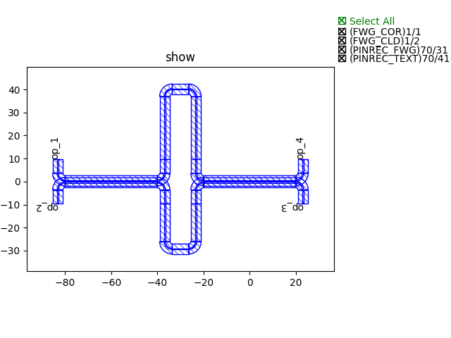

Cascaded Mach-Zehnder (CMZ) wavelength filter
^^^^^^^^^^^^^^^^^^^^^^^^^^^^^^^^^^^^^^^^^^^^^^^^^^^^^

This example is to demonstrate how ``PhotoCAD`` post-simulation can be used in a CMZ wavelength filter [1]_ and help users to validate their concepts from a simple simulation implementation.

Implement simulation models for auto-link
---------------------------------------------

To use auto-link functions such as ``fp.Linked``, ``fp.LinkBetween``, ``fp.create_links``, we have to implement simulation models in some essential components.

For example, in the CMZ filter circuit, we will use the below scripts and both ``fp.create_links`` and ``fp.LinkBetween`` to connect DCs and wavelength splitters.

 ::

    device = fp.create_links(
                        link_type=TECH.WG.FWG.C.WIRE,
                        bend_factory=TECH.WG.FWG.C.WIRE.BEND_CIRCULAR,
                        specs=[
                            fp.LinkBetween(
                                DC1["op_2"],
                                DC2["op_1"],
                                target_length=base_length,
                            ),
                            fp.LinkBetween(DC1["op_3"], DC2["op_0"], target_length=base_length + delta_L),
                        ],
                    )

As a result, since component ``Straight`` will be used to generate ``TECH.WG.FWG.C.WIRE``, we should add simulation model ``WGModel`` to ``Straight``.

For ``TECH.WG.FWG.C.WIRE.BEND_CIRCULAR``, we are using ``CircularBendFactory`` to return a circular bend, so it is also necessary to add ``BendModel`` in every circular bend cells that are assigned in ``CircularBendFactory``.

Noted that in some cases, transitions simulation models will also have to be implemented in transition cells.

Wavelength Splitters
--------------------------

To demultiplex 8 wavelength channel, 3-level of wavelength splitters will be needed to implement in the CMZ circuit. Splitters are build up from several directional couplers (DCs) and connected together with different length. Below table shows the relations between each level (1st, 2nd, 3rd) wavelength splitters and the length which linked the DCs.

.. table:: Parameters for the calculation of the delay line lengths of the wavelength splitters in a CMZ wavelength filter.[1]

   +----------+---------------------------+----------------------------+
   |Splitter  | :math:`\Delta L_{FSR}`    | :math:`\Delta L_{shift}`   |
   +==========+===========================+============================+
   |3st       |:math:`\Delta L_{base}`    | 0                          |
   +----------+---------------------------+----------------------------+
   |2st A     |:math:`\Delta L_{base}`/2  | 0                          |
   +----------+---------------------------+----------------------------+
   |2st B     |:math:`\Delta L_{base}`/2  | 0.75 :math:`\Delta L_{FS}` |
   +----------+---------------------------+----------------------------+
   |1st A     |:math:`\Delta L_{base}`/4  | 0                          |
   +----------+---------------------------+----------------------------+
   |1st B     |:math:`\Delta L_{base}`/4  | 0.25 :math:`\Delta L_{FS}` |
   +----------+---------------------------+----------------------------+
   |1st C     |:math:`\Delta L_{base}`/4  | 0.125 :math:`\Delta L_{FS}`|
   +----------+---------------------------+----------------------------+
   |1st D     |:math:`\Delta L_{base}`/4  | 0.375 :math:`\Delta L_{FS}`|
   +----------+---------------------------+----------------------------+

Note that the correct delay line :math:`\Delta L` indicate in each splitter can be obtained from :math:`\Delta L_{FSR}` + :math:`\Delta L_{shift}`.

#. 1st level: Below figure [1] show the schematic structure of the 1st level. It contains two 50/50 DCs connected to each other and the length difference :math:`\Delta L` is calculated by the table mentioned above.

   ::

        class DEMUX_1(fp.PCell):
            L_FSR_coeff: float = fp.PositiveFloatParam(default=1)
            L_shift_coeff: float = fp.NonNegFloatParam(default=0)
            FSR: float = 3.2  # nm
            lambda_center: float = 1490  # nm
            neff: float = 2.4
            ng: float = 4.0

            def build(self):
                insts, elems, ports = super().build()
                TECH = get_technology()
                FSR = self.FSR * 1e-9
                lambda_center = self.lambda_center * 1e-9
                neff = self.neff
                ng = self.ng
                L_FSR_coeff = self.L_FSR_coeff
                L_shift_coeff = self.L_shift_coeff

                base_length = 50  # um
                delta_L_base = (lambda_center**2 / 2 / FSR / ng) * 1e6
                delta_L_FS = (lambda_center / neff) * 1e6
                delta_L_FSR = delta_L_base / L_FSR_coeff
                delta_L_shift = delta_L_FS * L_shift_coeff
                delta_L = delta_L_FSR + delta_L_shift

                DC_050 = pdk.DC_050()

                DC1 = DC_050.translated(-60, 0)
                insts += DC1, "DC1"
                DC2 = DC_050.translated(0, 0)
                insts += DC2, "DC2"

                device = fp.create_links(
                    link_type=TECH.WG.FWG.C.WIRE,
                    bend_factory=TECH.WG.FWG.C.WIRE.BEND_CIRCULAR,
                    specs=[
                        fp.LinkBetween(
                            DC1["op_2"],
                            DC2["op_1"],
                            target_length=base_length,
                        ),
                        fp.LinkBetween(DC1["op_3"], DC2["op_0"], target_length=base_length + delta_L),
                    ],
                )
                insts += device

                ports += DC1["op_0"].with_name("op_1")
                ports += DC1["op_1"].with_name("op_2")
                ports += DC2["op_2"].with_name("op_3")
                ports += DC2["op_3"].with_name("op_4")

                # fmt: on
                return insts, elems, ports

            def sim_model(self, left_coupling: float = 0.5, right_coupling: float = 0.5):
                left_dc = self.get("DC1", pdk.DC_050)
                right_dc = self.get("DC2", pdk.DC_050)
                models = {
                    left_dc: left_dc.sim_model(coupling=left_coupling),
                    right_dc: right_dc.sim_model(coupling=right_coupling),
                }
                return fp.sim.CircuitModel(self, self.netlist(), models)

#. 2nd level: Below figure [1] show the schematic structure of the 2nd level. It contains a 50/50 DC, a 71/29 DC, and a 92/8 DC connected to each other and the length difference :math:`\Delta L` is calculated by the table mentioned above.

   ::

        class DEMUX_2(fp.PCell):
            L_FSR_coeff: float = fp.PositiveFloatParam(default=1)
            L_shift_coeff: float = fp.NonNegFloatParam(default=0)
            FSR: float = 3.2  # nm
            lambda_center: float = 1490  # nm
            neff: float = 2.4
            ng: float = 4.0

            def build(self):
                insts, elems, ports = super().build()
                TECH = get_technology()
                FSR = self.FSR * 1e-9
                lambda_center = self.lambda_center * 1e-9
                neff = self.neff
                ng = self.ng
                L_FSR_coeff = self.L_FSR_coeff
                L_shift_coeff = self.L_shift_coeff

                base_length = 50
                delta_L_base = (lambda_center**2 / 2 / FSR / ng) * 1e6
                delta_L_FS = (lambda_center / neff) * 1e6
                delta_L_FSR = delta_L_base / L_FSR_coeff
                delta_L_shift = delta_L_FS * L_shift_coeff
                delta_L = delta_L_FSR + delta_L_shift

                DC_050 = pdk.DC_050()
                DC_029 = pdk.DC_029()
                DC_008 = pdk.DC_008()

                DC1 = DC_050.translated(-95, 0)
                insts += DC1, "DC1"
                DC2 = DC_029.translated(-40, 0)
                insts += DC2, "DC2"
                DC3 = DC_008.translated(0, 0)
                insts += DC3, "DC3"

                device = fp.create_links(
                    link_type=TECH.WG.FWG.C.WIRE,
                    bend_factory=TECH.WG.FWG.C.WIRE.BEND_CIRCULAR,
                    specs=[
                        fp.LinkBetween(
                            DC1["op_2"],
                            DC2["op_1"],
                            target_length=base_length,
                        ),
                        fp.LinkBetween(DC1["op_3"], DC2["op_0"], target_length=base_length + delta_L),
                        fp.LinkBetween(DC2["op_2"], DC3["op_1"], target_length=base_length + 2 * delta_L),
                        fp.LinkBetween(DC2["op_3"], DC3["op_0"], target_length=base_length),
                    ],
                )
                insts += device

                ports += DC1["op_0"].with_name("op_1")
                ports += DC1["op_1"].with_name("op_2")
                ports += DC3["op_2"].with_name("op_3")
                ports += DC3["op_3"].with_name("op_4")

                # fmt: on
                return insts, elems, ports

            def sim_model(self, left_coupling: float = 0.5, mid_coupling: float = 0.29, right_coupling: float = 0.08):
                left_dc = self.get("DC1", pdk.DC_050)
                mid_dc = self.get("DC2", pdk.DC_029)
                right_dc = self.get("DC3", pdk.DC_008)
                models = {
                    left_dc: left_dc.sim_model(coupling=left_coupling),
                    mid_dc: mid_dc.sim_model(coupling=mid_coupling),
                    right_dc: right_dc.sim_model(coupling=right_coupling),
                }
                return fp.sim.CircuitModel(self, self.netlist(), models)

.. image:: ../images/2st_gds.png

#. 3rd level: Below figure [1] show the schematic structure of the 3rd level. It contains a 50/50 DC, a 80/20 DC, and a 96/4 DC connected to each other and the length difference :math:`\Delta L` is calculated by the table mentioned above.

   ::

        class DEMUX_3(fp.PCell):
            L_FSR_coeff: float = fp.PositiveFloatParam(default=1)
            L_shift_coeff: float = fp.NonNegFloatParam(default=0)
            FSR: float = 3.2  # nm
            lambda_center: float = 1490  # nm
            # wl_offset: float = 0
            neff: float = 2.4
            ng: float = 4.0

            def build(self):
                insts, elems, ports = super().build()
                TECH = get_technology()
                FSR = self.FSR * 1e-9
                lambda_center = self.lambda_center * 1e-9
                neff = self.neff
                ng = self.ng
                L_FSR_coeff = self.L_FSR_coeff
                L_shift_coeff = self.L_shift_coeff

                base_length = 50
                delta_L_base = (lambda_center**2 / 2 / FSR / ng) * 1e6
                delta_L_FS = (lambda_center / neff) * 1e6
                delta_L_FSR = delta_L_base / L_FSR_coeff
                delta_L_shift = delta_L_FS * L_shift_coeff

                delta_L = delta_L_FSR + delta_L_shift
                Lpi = (lambda_center / (2 * neff)) * 1e6

                DC_050 = pdk.DC_050()
                DC_020 = pdk.DC_020()
                DC_004 = pdk.DC_004()

                DC1 = DC_050.translated(-97.5, 0)
                insts += DC1, "DC1"
                DC2 = DC_020.translated(-45, 0)
                insts += DC2, "DC2"
                DC3 = DC_020.translated(0, 0)
                insts += DC3, "DC3"
                DC4 = DC_004.translated(36, 0)
                insts += DC4, "DC4"

                device = fp.create_links(
                    link_type=TECH.WG.FWG.C.WIRE,
                    bend_factory=TECH.WG.FWG.C.WIRE.BEND_CIRCULAR,
                    specs=[
                        fp.LinkBetween(
                            DC1["op_2"],
                            DC2["op_1"],
                            target_length=base_length,
                        ),
                        fp.LinkBetween(DC1["op_3"], DC2["op_0"], target_length=base_length + delta_L),
                        fp.LinkBetween(DC2["op_2"], DC3["op_1"], target_length=base_length + 2 * delta_L),
                        fp.LinkBetween(DC2["op_3"], DC3["op_0"], target_length=base_length),
                        fp.LinkBetween(DC3["op_2"], DC4["op_1"], target_length=base_length + 2 * delta_L + Lpi),
                        fp.LinkBetween(DC3["op_3"], DC4["op_0"], target_length=base_length),
                    ],
                )
                insts += device

                ports += DC1["op_0"].with_name("op_1")
                ports += DC1["op_1"].with_name("op_2")
                ports += DC4["op_2"].with_name("op_3")
                ports += DC4["op_3"].with_name("op_4")

                # fmt: on
                return insts, elems, ports

            def sim_model(self, left_coupling: float = 0.5, mid_coupling: float = 0.20, mid2_coupling: float = 0.20, right_coupling: float = 0.04):
                left_dc = self.get("DC1", pdk.DC_050)
                mid_dc = self.get("DC2", pdk.DC_020)
                mid2_dc = self.get("DC3", pdk.DC_020)
                right_dc = self.get("DC4", pdk.DC_004)
                models = {
                    left_dc: left_dc.sim_model(coupling=left_coupling),
                    mid_dc: mid_dc.sim_model(coupling=mid_coupling),
                    mid2_dc: mid2_dc.sim_model(coupling=mid2_coupling),
                    right_dc: right_dc.sim_model(coupling=right_coupling),
                }
                return fp.sim.CircuitModel(self, self.netlist(), models)

CMZ wavelength demultiplexer
------------------------------

By combining the above three wavelength splitter unit, we are able to build an 8-channel wavelength demultiplexer.

 ::

    class CMZ(fp.PCell):
        def build(self):
            insts, elems, ports = super().build()
            TECH = get_technology()

            demux_3st = DEMUX_3().translated(0, 0)
            insts += demux_3st, "D3"

            demux_2stA = DEMUX_2(L_FSR_coeff=2, L_shift_coeff=0)
            demux_2stA = demux_2stA["op_1"].repositioned(at=(demux_3st["op_3"].position[0], 100)).owner
            demux_2stB = DEMUX_2(L_FSR_coeff=2, L_shift_coeff=0.75).translated(200, -150)
            demux_2stB = demux_2stB["op_1"].repositioned(at=(demux_3st["op_3"].position[0], -100)).owner
            insts += demux_2stA, "D2A"
            insts += demux_2stB, "D2B"

            demux_1stA = DEMUX_1(L_FSR_coeff=4, L_shift_coeff=0)
            demux_1stA = demux_1stA["op_1"].repositioned(at=(demux_2stA["op_3"].position[0], 180)).owner
            demux_1stB = DEMUX_1(L_FSR_coeff=4, L_shift_coeff=0.25)
            demux_1stB = demux_1stB["op_1"].repositioned(at=(demux_2stA["op_3"].position[0], 60)).owner
            demux_1stC = DEMUX_1(L_FSR_coeff=4, L_shift_coeff=0.125)
            demux_1stC = demux_1stC["op_1"].repositioned(at=(demux_2stA["op_3"].position[0], -60)).owner
            demux_1stD = DEMUX_1(L_FSR_coeff=4, L_shift_coeff=0.375)
            demux_1stD = demux_1stD["op_1"].repositioned(at=(demux_2stA["op_3"].position[0], -180)).owner
            insts += demux_1stA, "D1A"
            insts += demux_1stB, "D1B"
            insts += demux_1stC, "D1C"
            insts += demux_1stD, "D1D"

            device = fp.create_links(
                link_type=TECH.WG.FWG.C.WIRE,
                bend_factory=TECH.WG.FWG.C.WIRE.BEND_CIRCULAR,
                specs=[
                    fp.LinkBetween(start=demux_3st["op_4"], end=demux_2stA["op_2"]),
                    fp.LinkBetween(start=demux_3st["op_3"], end=demux_2stB["op_1"]),
                    fp.LinkBetween(start=demux_2stA["op_4"], end=demux_1stA["op_2"]),
                    fp.LinkBetween(start=demux_2stA["op_3"], end=demux_1stB["op_1"]),
                    fp.LinkBetween(start=demux_2stB["op_4"], end=demux_1stC["op_2"]),
                    fp.LinkBetween(start=demux_2stB["op_3"], end=demux_1stD["op_1"]),
                ],
            )
            insts += device

            ports += demux_3st["op_2"].with_name("In")
            ports += demux_1stA["op_4"].with_name("Out_lambda1")
            ports += demux_1stA["op_3"].with_name("Out_lambda2")
            ports += demux_1stB["op_4"].with_name("Out_lambda3")
            ports += demux_1stB["op_3"].with_name("Out_lambda4")
            ports += demux_1stC["op_4"].with_name("Out_lambda5")
            ports += demux_1stC["op_3"].with_name("Out_lambda6")
            ports += demux_1stD["op_4"].with_name("Out_lambda7")
            ports += demux_1stD["op_3"].with_name("Out_lambda8")

            return insts, elems, ports

        def simpre_netlist(self):
            optical_netlist, electrical_netlist = self.interconnect()

            D3 = self.get("D3", DEMUX_3)
            D2A = self.get("D2A", DEMUX_2)
            D2B = self.get("D2B", DEMUX_2)
            D1A = self.get("D1A", DEMUX_1)
            D1B = self.get("D1B", DEMUX_1)
            D1C = self.get("D1C", DEMUX_1)
            D1D = self.get("D1D", DEMUX_1)

            return optical_netlist, electrical_netlist

        def sim_model(self):

            D3 = self.get("D3", DEMUX_3)
            D2A = self.get("D2A", DEMUX_2)
            D2B = self.get("D2B", DEMUX_2)
            D1A = self.get("D1A", DEMUX_1)
            D1B = self.get("D1B", DEMUX_1)
            D1C = self.get("D1C", DEMUX_1)
            D1D = self.get("D1D", DEMUX_1)
            models = {
                D3: D3.sim_model(left_coupling=0.5, mid_coupling=0.20, mid2_coupling=0.20, right_coupling=0.04),
                D2A: D2A.sim_model(left_coupling=0.5, mid_coupling=0.29, right_coupling=0.08),
                D2B: D2B.sim_model(left_coupling=0.5, mid_coupling=0.29, right_coupling=0.08),
                D1A: D1A.sim_model(left_coupling=0.5, right_coupling=0.5),
                D1B: D1B.sim_model(left_coupling=0.5, right_coupling=0.5),
                D1C: D1C.sim_model(left_coupling=0.5, right_coupling=0.5),
                D1D: D1D.sim_model(left_coupling=0.5, right_coupling=0.5),
            }
            return fp.sim.CircuitModel(self, self.simpre_netlist(), models)

.. [1] Horst, F., Green, W. M., Assefa, S., Shank, S. M., Vlasov, Y. A., & Offrein, B. J. (2013). Cascaded Mach-Zehnder wavelength filters in silicon photonics for low loss and flat pass-band WDM (de-)multiplexing. Optics express, 21(10), 11652–11658.