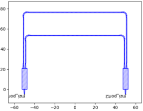
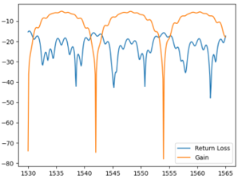

Example of post-simulation
^^^^^^^^^^^^^^^^^^^^^^^^^^^^^^

Full script
---------------
::

    from dataclasses import dataclass
    from fnpcell import all as fp
    from gpdk import all as pdk
    from gpdk.technology import get_technology

    @dataclass(eq=False)
    class CircuitMzi(fp.PCell):
        def build(self):
            insts, elems, ports = super().build()
            TECH = get_technology()

            mmi = pdk.Mmi1x2()
            m1 = mmi.rotated(degrees=90).translated(-50, 0)
            insts += m1
            m2 = mmi.rotated(degrees=90).translated(50, 0)
            insts += m2

            links = fp.create_links(
                link_type=TECH.WG.FWG.C.WIRE,
                bend_factory=TECH.WG.FWG.C.EXPANDED.BEND_CIRCULAR,
                specs=[
                    fp.LinkBetween(
                        m1["op_2"],
                        m2["op_1"],
                        target_length=200,
                    ),
                    fp.LinkBetween(
                        m1["op_1"],
                        m2["op_2"],
                        target_length=150
                    ),
                ],
            )
            insts += links
            ports += m1["op_0"].with_name("mzi_port1")
            ports += m2["op_0"].with_name("mzi_port2")

            return insts, elems, ports

    if __name__ == "__main__":
        from pathlib import Path
        gds_file = Path(__file__).parent / "local" / Path(__file__).with_suffix(".gds").name

        device = fp.Library()

        device += CircuitMzi()

        fp.export_gds(device, file=gds_file)
        fp.plot(device)

        ################################
        #### Start post-simulation #####
        ################################
        import sflow as sf
        import matplotlib.pyplot as plt
        import gpdk.components.all

        components = gpdk.components.all

        env = dict(wl_start=1.53, wl_end=1.565, points_num=351, T=300)
        spc_filename = Path(__file__).parent / "local" / Path(__file__).with_suffix(".spc").name

        fp.export_spc(device, file=spc_filename, components=components, sim_env=fp.sim.Env(**env))

        sim_result = sf.run_sim(
            input_ports=["mzi_port1"],
            output_ports=["mzi_port1", "mzi_port2"],
            env=env,
            netlist_file=spc_filename,
            print_netlist=True
        )

        return_loss = sim_result["mzi_port1"]
        trans_gain = sim_result["mzi_port2"]

        plt.plot(return_loss["wl"], return_loss["te_gain"], label="Return Loss")
        plt.plot(trans_gain["wl"], trans_gain["te_gain"], label="Gain")
        plt.legend()
        plt.show()

 Build Class ``CircuitMzi``
------------------------------------

The below scripts shows how to build a MZI circuit by 2 ``Mmi`` already existing in ``gpdk``.

#. Import function packages::

        from dataclasses import dataclass
        from fnpcell import all as fp
        from gpdk import all as pdk
        from gpdk.technology import get_technology

#. Define class ``CircuitMzi`` and call ``mmi`` in ``gpdk`` package. The rotation angle and position are set by ``rotated(degrees=)`` and ``translated()``::

        @dataclass(eq=False)
        class CircuitMzi(fp.PCell):
            def build(self):
                insts, elems, ports = super().build()
                TECH = get_technology()

                mmi = pdk.Mmi1x2()
                m1 = mmi.rotated(degrees=90).translated(-50, 0)
                insts += m1
                m2 = mmi.rotated(degrees=90).translated(50, 0)
                insts += m2

#. Create links between ``mmi`` ports, ``target_length`` will be adjusted through ``fp.LinkBetween`` function::

        links = fp.create_links(
                    link_type=TECH.WG.FWG.C.WIRE,
                    bend_factory=TECH.WG.FWG.C.EXPANDED.BEND_CIRCULAR,
                    specs=[
                        fp.LinkBetween(
                            m1["op_2"],
                            m2["op_1"],
                            target_length=200,
                        ),
                        fp.LinkBetween(
                            m1["op_1"],
                            m2["op_2"],
                            target_length=150
                        ),
                    ],
                )
                insts += links

#. Define the ports of the circuit and return built instances, elements and ports::

        ports += m1["op_0"].with_name("mzi_port1")
                ports += m2["op_0"].with_name("mzi_port2")

                return insts, elems, ports

#. Export GDS file and plot a figure of the circuit::

        if __name__ == "__main__":
            from pathlib import Path
            gds_file = Path(__file__).parent / "local" / Path(__file__).with_suffix(".gds").name

            device = fp.Library()
            device += CircuitMzi()

            fp.export_gds(device, file=gds_file)
            fp.plot(device)

Post-layout simulation
--------------------------------
Below scripts are described step-by-step to show how to run a S-matrix simulation on ``CircuitMzi`` and plot the simulated transmission spectrum.

#. Import **PhotoCAD** simulation package ``sflow`` and other necessary packages::

        import sflow as sf
        import matplotlib.pyplot as plt
        import gpdk.components.all

        components = gpdk.components.all

#. Define the environment of simulation. Note that in ``fp.sim.Env``, ``wl_start``, ``wl_end``, and ``points_num`` are necessary. Users are allowed to define some custom parameters, such as "T" or others::

        env = dict(wl_start=1.53, wl_end=1.565, points_num=351, T=300)

#. Define and export the netlist file::

        spc_filename = Path(__file__).parent / "local" / Path(__file__).with_suffix(".spc").name
        fp.export_spc(device, file=spc_filename, components=components, sim_env=fp.sim.Env(**env))

#. Run the simulation ``sflow``. First we have to define the optical signal input and output port, then define the simulation environment and the netlist file we defined already::

        sim_result = sf.run_sim(
                input_ports=["mzi_port1"],
                output_ports=["mzi_port1", "mzi_port2"],
                env=env,
                netlist_file=spc_filename,
                print_netlist=True
            )

#. Get the data of each ports and plot the figure::

            return_loss = sim_result["mzi_port1"]
            trans_gain = sim_result["mzi_port2"]

            plt.plot(return_loss["wl"], return_loss["te_gain"], label="Return Loss")
            plt.plot(trans_gain["wl"], trans_gain["te_gain"], label="Gain")
            plt.legend()
            plt.show()

