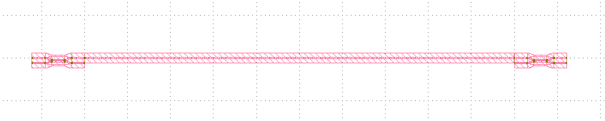

MZI post-simulation
^^^^^^^^^^^^^^^^^^^^^^^^^^^^^^

Full script
---------------
::

    from typing import Any, Sequence, Tuple

    import matplotlib.pyplot as plt
    import numpy as np

    from fnpcell import all as fp
    from fnpcell.interfaces import IScatterMatrix
    from gpdk import all as pdk

    class DCModel(fp.sim.SimModel):
        op_0: fp.IOwnedPort
        op_1: fp.IOwnedPort
        op_2: fp.IOwnedPort
        op_3: fp.IOwnedPort
        coupling: float = 0.5

        def simulate_scatter(self, wavelengths: Sequence[float]) -> IScatterMatrix:
            coupling = np.array(self.coupling)
            kappa = coupling**0.5
            tau = (1 - coupling) ** 0.5

            op_0, op_1, op_2, op_3 = self.op_0, self.op_1, self.op_2, self.op_3

            S = fp.sim.SMatrix()

            S[op_2, op_1] = S[op_1, op_2] = tau, 0
            S[op_3, op_1] = S[op_1, op_3] = kappa, np.pi / 2
            S[op_2, op_0] = S[op_0, op_2] = kappa, np.pi / 2
            S[op_3, op_0] = S[op_0, op_3] = tau, 0

            return S

    class WGModel(fp.sim.SimModel):
        op_0: fp.IOwnedPort
        op_1: fp.IOwnedPort
        wl0: float = 1.55
        neff: float = 2.34
        ng: float = 3.4
        loss: float = 0.0

        def simulate_scatter(self, wavelengths: Sequence[float]) -> IScatterMatrix:
            wl = np.array(wavelengths)
            wl0 = np.array(self.wl0)
            neff = np.array(self.neff)
            ng = np.array(self.ng)
            loss = np.array(self.loss)
            length = fp.distance_between(self.op_0.position, self.op_1.position)

            dwl = wl - self.wl0
            dneff_dwl = (ng - neff) / wl0
            neff = neff - dwl * dneff_dwl

            mag = 10 ** (-loss * length / 20)
            arg = 2 * np.pi * neff * length / wl

            op_0 = self.op_0
            op_1 = self.op_1

            S = fp.sim.SMatrix()

            S[op_1, op_0] = S[op_0, op_1] = mag, arg

            return S

    class DC(fp.PCell):
        def build(self):
            insts, elems, ports = super().build()

            dc = pdk.DirectionalCouplerSBend()
            insts += dc, "dc"
            ports += dc.ports

            return insts, elems, ports

        def sim_model(self, coupling: float = 0.5):
            op_0, op_1, op_2, op_3 = self[fp.IOwnedPort, "op_0", "op_1", "op_2", "op_3"]
            return DCModel(op_0=op_0, op_1=op_1, op_2=op_2, op_3=op_3, coupling=coupling)

    class Straight(fp.PCell):
        length: float = fp.PositiveFloatParam(default=200)

        def build(self):
            insts, elems, ports = super().build()

            s = pdk.Straight(length=self.length)
            insts += s, "s"
            ports += s.ports

            return insts, elems, ports

        def sim_model(self, wl0: float = 1.55, neff: float = 2.34, ng: float = 3.4, loss: float = 0.0):
            op_0, op_1 = self[fp.IOwnedPort, "op_0", "op_1"]
            return WGModel(op_0=op_0, op_1=op_1, wl0=wl0, neff=neff, ng=ng, loss=loss)

    class Mzi(fp.PCell):
        def build(self):
            insts, elems, ports = super().build()

            dc = DC()
            top_arm = Straight()
            insts += top_arm, "top_arm"

            left_dc = fp.place(dc, "op_3", at=top_arm["op_0"])
            insts += left_dc, "left_dc"

            right_dc = fp.place(dc, "op_0", at=top_arm["op_1"])
            insts += right_dc, "right_dc"

            ports += left_dc["op_0"]
            ports += left_dc["op_1"]
            ports += right_dc["op_2"]
            ports += right_dc["op_3"]

            return insts, elems, ports

        def simpre_netlist(self):
            optical_netlist, electrical_netlist = self.interconnect()

            left_dc = self.get("left_dc", DC)
            right_dc = self.get("right_dc", DC)

            optical_netlist += left_dc[fp.IOwnedPort, "op_2"] >> right_dc[fp.IOwnedPort, "op_1"]

            return optical_netlist, electrical_netlist

        def sim_model(self, left_coupling: float = 0.5, right_coupling: float = 0.5):
            left_dc = self.get("left_dc", DC)
            right_dc = self.get("right_dc", DC)
            models = {
                left_dc: left_dc.sim_model(coupling=left_coupling),
                right_dc: right_dc.sim_model(coupling=right_coupling),
            }
            return fp.sim.CircuitModel(self, self.simpre_netlist(), models)

    class MziArray(fp.PCell):
        def build(self):
            insts, elems, ports = super().build()

            mzi = Mzi()
            mzi_array = mzi.new_array(cols=2, col_width=100)
            insts += mzi_array, "mzi_array"

            mzi_0 = mzi_array.get(col=0)
            mzi_1 = mzi_array.get(col=1)
            ports += mzi_0["op_0"]
            ports += mzi_0["op_1"]
            ports += mzi_1["op_2"]
            ports += mzi_1["op_3"]

            return insts, elems, ports

        def simpre_netlist(self):
            optical_netlist, electrical_netlist = self.interconnect()

            mzi_array = self.get("mzi_array", fp.IArrayRepetition[Mzi])
            mzi_0 = mzi_array.get(col=0)
            mzi_1 = mzi_array.get(col=1)

            optical_netlist += mzi_0[fp.IOwnedPort, "op_2"] >> mzi_1[fp.IOwnedPort, "op_1"]
            optical_netlist += mzi_0[fp.IOwnedPort, "op_3"] >> mzi_1[fp.IOwnedPort, "op_0"]

            return optical_netlist, electrical_netlist

        def sim_model(self, left_coupling: float = 0.5, right_coupling: float = 0.5):
            mzi_array = self.get("mzi_array", fp.IArrayRepetition[Mzi])
            models = {inst: inst.sim_model(left_coupling, right_coupling) for inst in mzi_array.decompose()}
            return fp.sim.CircuitModel(self, self.simpre_netlist(), models)

    if __name__ == "__main__":
        from gpdk.util.path import local_output_file

        gds_file = local_output_file(__file__).with_suffix(".gds")
        library = fp.Library()
        # ===========================

        # layout
        mzi_array = MziArray()
        # wg = Straight()
        # mzi = Mzi()

        library += mzi_array
        fp.export_gds(library, file=gds_file)
        fp.plot(library)

        # simulation
        model = mzi_array.sim_model(left_coupling=0.3, right_coupling=0.8)
        # model = wg.sim_model()

        wl = np.linspace(1.53, 1.57, 1000)  # type: ignore
        smatrix = model.simulate_scatter(wl)  # type: ignore

        # plot
        def p2r(value: Tuple[Any, Any]):
            mag = value[0]
            ang = value[1]
            return mag * np.exp(1j * ang)

        op_1, op_2, op_3 = mzi_array[fp.IOwnedPort, "op_1", "op_2", "op_3"]
        # op_1, op_2 = wg[fp.IOwnedPort, "op_0", "op_1"]
        plt.plot(1e3 * wl, np.abs(p2r(smatrix[op_1, op_2])) ** 2, label="op_1<-op_2")  # type: ignore
        plt.plot(1e3 * wl, np.abs(p2r(smatrix[op_1, op_3])) ** 2, label="op_1<-op_3", ls="--")  # type: ignore
        plt.xlabel("λ [nm]")  # type: ignore
        plt.ylabel("T")  # type: ignore
        plt.grid(True)  # type: ignore
        plt.figlegend(ncol=2, loc="upper center")  # type: ignore
        plt.show()  # type: ignore

Build simulation models for WG, DC
------------------------------------

The below scripts shows how to build a simulation model which will be then implemented in waveguide and directional coupler.

#. Directional Coupler simulation model:

 ::

        class DCModel(fp.sim.SimModel):
            op_0: fp.IOwnedPort
            op_1: fp.IOwnedPort
            op_2: fp.IOwnedPort
            op_3: fp.IOwnedPort
            coupling: float = 0.5

            def simulate_scatter(self, wavelengths: Sequence[float]) -> IScatterMatrix:
                coupling = np.array(self.coupling)
                kappa = coupling**0.5
                tau = (1 - coupling) ** 0.5

                op_0, op_1, op_2, op_3 = self.op_0, self.op_1, self.op_2, self.op_3

                S = fp.sim.SMatrix()

                S[op_2, op_1] = S[op_1, op_2] = tau, 0
                S[op_3, op_1] = S[op_1, op_3] = kappa, np.pi / 2
                S[op_2, op_0] = S[op_0, op_2] = kappa, np.pi / 2
                S[op_3, op_0] = S[op_0, op_3] = tau, 0

                return S

#. Waveguide simulation model:

 ::

    class WGModel(fp.sim.SimModel):
        op_0: fp.IOwnedPort
        op_1: fp.IOwnedPort
        wl0: float = 1.55
        neff: float = 2.34
        ng: float = 3.4
        loss: float = 0.0

        def simulate_scatter(self, wavelengths: Sequence[float]) -> IScatterMatrix:
            wl = np.array(wavelengths)
            wl0 = np.array(self.wl0)
            neff = np.array(self.neff)
            ng = np.array(self.ng)
            loss = np.array(self.loss)
            length = fp.distance_between(self.op_0.position, self.op_1.position)

            dwl = wl - self.wl0
            dneff_dwl = (ng - neff) / wl0
            neff = neff - dwl * dneff_dwl

            mag = 10 ** (-loss * length / 20)
            arg = 2 * np.pi * neff * length / wl

            op_0 = self.op_0
            op_1 = self.op_1

            S = fp.sim.SMatrix()

            S[op_1, op_0] = S[op_0, op_1] = mag, arg

            return S

Implement simulation models to components
-----------------------------------------------
After building up the simulation models, we have to implement them to the components. The ``sim_model`` function of the component will be defined under the cell class.

Take waveguide as an example, the port names which we defined in the build method ``op_0``, ``op_1`` have to be implemented in the ``sim_model`` ``self[fp.IOwnedPort, "op_0", "op_1"]``.

#. Directional Coupler::

     class DC(fp.PCell):
        def build(self):
            insts, elems, ports = super().build()

            dc = pdk.DirectionalCouplerSBend()
            insts += dc, "dc"
            ports += dc.ports

            return insts, elems, ports

        def sim_model(self, coupling: float = 0.5):
            op_0, op_1, op_2, op_3 = self[fp.IOwnedPort, "op_0", "op_1", "op_2", "op_3"]
            return DCModel(op_0=op_0, op_1=op_1, op_2=op_2, op_3=op_3, coupling=coupling)

#. Waveguide::

    class Straight(fp.PCell):
        length: float = fp.PositiveFloatParam(default=200)

        def build(self):
            insts, elems, ports = super().build()

            s = pdk.Straight(length=self.length)
            insts += s, "s"
            ports += s.ports

            return insts, elems, ports

        def sim_model(self, wl0: float = 1.55, neff: float = 2.34, ng: float = 3.4, loss: float = 0.0):
            op_0, op_1 = self[fp.IOwnedPort, "op_0", "op_1"]
            return WGModel(op_0=op_0, op_1=op_1, wl0=wl0, neff=neff, ng=ng, loss=loss)

Build MZI circuit and define poet-simulation functions
---------------------------------------------------------

#. Build function to build MZI circuit. Note that those ports which are not connected to other ports should be added to ``ports+=``, otherwise there will be error when generating netlist.::

    class Mzi(fp.PCell):
        def build(self):
            insts, elems, ports = super().build()

            dc = DC()
            top_arm = Straight()
            insts += top_arm, "top_arm"

            left_dc = fp.place(dc, "op_3", at=top_arm["op_0"])
            insts += left_dc, "left_dc"

            right_dc = fp.place(dc, "op_0", at=top_arm["op_1"])
            insts += right_dc, "right_dc"

            ports += left_dc["op_0"]
            ports += left_dc["op_1"]
            ports += right_dc["op_2"]
            ports += right_dc["op_3"]

            return insts, elems, ports

#. Generate netlist for pre-simulation. Ports connections without physically connected should be added here. For example, ``op_2`` of ``left_dc`` and ``op_1`` of ``right_dc`` is not linked to each other in the build method yet. However, we can virtually connect them together in the ``simpre_netlist`` method to run the post-simulation::

    def simpre_netlist(self):
        optical_netlist, electrical_netlist = self.interconnect()

        left_dc = self.get("left_dc", DC)
        right_dc = self.get("right_dc", DC)

        optical_netlist += left_dc[fp.IOwnedPort, "op_2"] >> right_dc[fp.IOwnedPort, "op_1"]

        return optical_netlist, electrical_netlist

#. Define simulation model for the MZI circuit. In this example, we are only setting the simulation parameters of ``left_dc`` and ``right_dc`` to be controllable. Thus, in this case, the other components in this circuit will remain to the simulation model we implemented in the cell class::

    def sim_model(self, left_coupling: float = 0.5, right_coupling: float = 0.5):
        left_dc = self.get("left_dc", DC)
        right_dc = self.get("right_dc", DC)
        models = {
            left_dc: left_dc.sim_model(coupling=left_coupling),
            right_dc: right_dc.sim_model(coupling=right_coupling),
        }
        return fp.sim.CircuitModel(self, self.simpre_netlist(), models)

Generate GDS file and run post-simulation
-----------------------------------------------------

#. Generate GDS file.::

    if __name__ == "__main__":
        from gpdk.util.path import local_output_file

        gds_file = local_output_file(__file__).with_suffix(".gds")
        library = fp.Library()
        # ===========================

        # layout
        mzi= Mzi()

        library += mzi
        fp.export_gds(library, file=gds_file)
        fp.plot(library)

#. Run post-simulation of the circuit.

   #. Set circuit simulation model. Here the parameters ``left_coupling`` and ``right_coupling`` will assign to the coupling parameters of the DC simulation model.::

        model = mzi_array.sim_model(left_coupling=0.3, right_coupling=0.8)

   #. Calculate circuit S-Matrix.::

        wl = np.linspace(1.53, 1.57, 1000)  # type: ignore
        smatrix = model.simulate_scatter(wl)  # type: ignore

   #. Plot the simulation results. We first convert magnitude and argument to a complex data.::

        def p2r(value: Tuple[Any, Any]):
            mag = value[0]
            ang = value[1]
            return mag * np.exp(1j * ang)

        op_1, op_2, op_3 = mzi_array[fp.IOwnedPort, "op_1", "op_2", "op_3"]
        plt.plot(1e3 * wl, np.abs(p2r(smatrix[op_1, op_2])) ** 2, label="op_1<-op_2")  # type: ignore
        plt.plot(1e3 * wl, np.abs(p2r(smatrix[op_1, op_3])) ** 2, label="op_1<-op_3", ls="--")  # type: ignore
        plt.xlabel("λ [nm]")  # type: ignore
        plt.ylabel("T")  # type: ignore
        plt.grid(True)  # type: ignore
        plt.figlegend(ncol=2, loc="upper center")  # type: ignore
        plt.show()  # type: ignore

   .. image:: ../images/postsim_mzi_result.png

