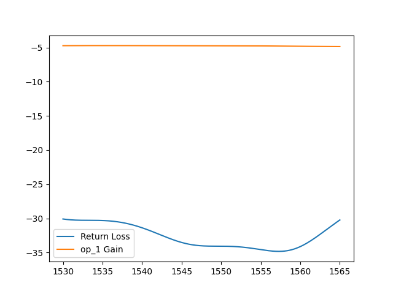

Component simulation method by ``fp.Device``
^^^^^^^^^^^^^^^^^^^^^^^^^^^^^^^^^^^^^^^^^^^^^^^^^^^^^^^^^^
In this section, we will introduce a method which allows users to post-simulate the cells(components) generated by ``fp.Device``. Since the cells created by ``fp.Device`` is not a ``PCell`` type, we are not allow to use the ``build`` method to generate the component and layout.

To build a cell using ``fp.Device``, the contents inside ``content`` and ``ports`` need to be defined. ``contents`` can be a ``PCell`` or geometry created by ``fp.g.`` or ``fp.el``. ``ports`` has to be a either ports or pins of a cell.

The method that allows a ``fp.Device`` cell available to run post-simulation is to pre-define the simulation model(``ExternalFileModel``, ``SMatrixWavelengthModel``) in the cell which later will be insert in the ``content``.

Full script
===============
::

        from fnpcell import all as fp
        import gpdk.components.all as pdk

        if __name__ == "__main__":
            from pathlib import Path

            gds_file = Path(__file__).parent / "local" / Path(__file__).with_suffix(".gds").name
            device = fp.Library()
            MMI = pdk.Mmi1x2()
            device += fp.Device(content=[MMI], ports=MMI.ports)
            fp.export_gds(device, file=gds_file)
            fp.plot(device)

            ################################
            #### Start post-simulation #####
            ################################
            import sflow as sf
            import matplotlib.pyplot as plt
            import gpdk.components.all as components

            env = dict(wl_start=1.53, wl_end=1.565, points_num=351, T=300)
            spc_filename = Path(__file__).parent / "local" / Path(__file__).with_suffix(".spc").name
            fp.export_spc(device, file=spc_filename, components=components, sim_env=fp.sim.Env(**env))
            sim_result = sf.run_sim(
                input_ports=["op_0"],  # Define the port which optical signal input
                output_ports=["op_0", "op_1"],  # Define the ports which optical signal output
                env=env,  # Define the environment
                netlist_file=spc_filename,  # Define the netlist file
                # print_netlist=True  # Defines whether to print a simplified netlist information
            )
            # Get the data of each ports
            return_loss = sim_result["op_0"]
            trans_gain = sim_result["op_1"]
            # Plot figure
            plt.plot(return_loss["wl"], return_loss["te_gain"], label="Return Loss")
            plt.plot(trans_gain["wl"], trans_gain["te_gain"], label="op_1 Gain")
            plt.legend()
            plt.show()

Add ``MMI`` to ``fp.Library`` and export GDS file
=======================================================
The below scripts shows how to add a cell created by ``fp.Device``  to ``fp.Library`` and export the layout.

#. Import ``fnpcell`` and the components created in ``gpdk`` to be called::

        from fnpcell import all as fp
        import gpdk.components.all as pdk

#. Call ``MMi1x2`` in ``gpdk`` and add the components and ports into ``fp.Device``::

        if __name__ == "__main__":
            from pathlib import Path

            gds_file = Path(__file__).parent / "local" / Path(__file__).with_suffix(".gds").name
            device = fp.Library()
            MMI = pdk.Mmi1x2()
            device += fp.Device(content=[MMI], ports=MMI.ports)

Post-layout simulation
====================================
Below scripts are described step-by-step to show how to run a S-matrix simulation on ``MMi11x2`` and plot the simulated spectrum.

#. Import ``sflow`` and necessary package, define the simulation environment, and define and export the netlist file.::

           import sflow as sf
            import matplotlib.pyplot as plt
            import gpdk.components.all as components

            env = dict(wl_start=1.53, wl_end=1.565, points_num=351, T=300)
            spc_filename = Path(__file__).parent / "local" / Path(__file__).with_suffix(".spc").name
            fp.export_spc(device, file=spc_filename, components=components, sim_env=fp.sim.Env(**env))

#. Netlist difference when not using ``fp.Device`` to add a component into ``fp.Library``.

    * Netlist generated by ``device += fp.Device(content=[MMI], ports=MMI.ports)``::

            .subckt Mmi1x2 op_0 op_1 op_2
            .ends

            .subckt x21b9039ae50 op_0 op_1 op_2
                XU1001 op_0 op_1 op_2 Mmi1x2 name=Mmi1x2 bands=None patches=() port_names=() transform=Affine2D.identity() mid_wav_core_width=5 wav_core_width=1 n_inputs=1 n_outputs=2 length=25 transition_length=5 trace_spacing=2 waveguide_type=WG.FWG.C._T_WIRE(core_layout_width=0.55, cladding_layout_width=4.45, core_design_width=0.45, cladding_design_width=4.45, port_names=('op_0', 'op_1')) lay_x=0 lay_y=0 lay_r=0.0 lay_f=False bbox=((-5.0, -4.725), (30.0, 4.725)) sim_model=ExternalFileModel(path=WindowsPath('C:/photoCAD/layout1002/.venv_layout1002/lib/site-packages/gpdk/components/mmi/Mmi1x2.dat'), format=None)
            .ends

     We can see that the submodule ``.subckt x21b9039ae50`` contains the ``Mmi1x2`` cell and ports ``op_0 ~ 2`` information. The simulation model ``ExternalFileModel`` is also defined in the netlist file.

    * Netlist generated by ``device += MMI``::

            .subckt Straight op_0 op_1
            .ends

            .subckt TaperLinear op_0 op_1
            .ends

            .subckt Mmi1x2 op_0 op_1 op_2
                XU1001 N1 N/A Straight name=Straight bands=None patches=() port_names=('op_0', 'op_1') transform=Affine2D.identity() length=25 waveguide_type=WG.FWG.C._T_WIRE(core_layout_width=5, cladding_layout_width=9.45, core_design_width=0.45, cladding_design_width=4.45, port_names=('op_0', 'op_1')) anchor=Anchor.START lay_x=0 lay_y=0 lay_r=0.0 lay_f=False bbox=((-1.5308084989341916e-16, -4.725), (25.0, 4.725)) sim_model=StraightWaveguideModel(theoretical_parameters=TheoreticalParameters(wl=(1.4, 1.5, 1.6), n_eff=(2.5066666, 2.4, 2.2933333), loss=(1, 0.9, 0.8)), length=25)
                XU1002 op_0 N1 TaperLinear name=TaperLinear bands=None patches=() port_names=('op_0', 'op_1') transform=Affine2D.identity() length=5 left_type=WG.FWG.C._T_WIRE(core_layout_width=0.55, cladding_layout_width=4.45, core_design_width=0.45, cladding_design_width=4.45, port_names=('op_0', 'op_1')) right_type=WG.FWG.C._T_WIRE(core_layout_width=1, cladding_layout_width=5.45, core_design_width=0.45, cladding_design_width=4.45, port_names=('op_0', 'op_1')) anchor=Anchor.END lay_x=0 lay_y=0 lay_r=0.0 lay_f=False bbox=((-5.0, -2.725), (3.061616997868383e-17, 2.725)) sim_model=TaperLinearModel(stops=(TheoreticalParameters(wl=(1.4, 1.5, 1.6), n_eff=(2.5066666, 2.4, 2.2933333), loss=(1, 0.9, 0.8)), TheoreticalParameters(wl=(1.4, 1.5, 1.6), n_eff=(2.5066666, 2.4, 2.2933333), loss=(1, 0.9, 0.8))), length=5)
                XU1003 N/A op_1 TaperLinear name=TaperLinear bands=None patches=() port_names=('op_0', 'op_1') transform=Affine2D.new(scaling=(1.0, 1.0), rotation=0.0, translation=(25, -1.0)) length=5 left_type=WG.FWG.C._T_WIRE(core_layout_width=1, cladding_layout_width=5.45, core_design_width=0.45, cladding_design_width=4.45, port_names=('op_0', 'op_1')) right_type=WG.FWG.C._T_WIRE(core_layout_width=0.55, cladding_layout_width=4.45, core_design_width=0.45, cladding_design_width=4.45, port_names=('op_0', 'op_1')) anchor=Anchor.START lay_x=25 lay_y=-1.0 lay_r=0.0 lay_f=False bbox=((-3.061616997868383e-17, -2.725), (5.0, 2.725)) sim_model=TaperLinearModel(stops=(TheoreticalParameters(wl=(1.4, 1.5, 1.6), n_eff=(2.5066666, 2.4, 2.2933333), loss=(1, 0.9, 0.8)), TheoreticalParameters(wl=(1.4, 1.5, 1.6), n_eff=(2.5066666, 2.4, 2.2933333), loss=(1, 0.9, 0.8))), length=5)
                XU1004 N/A op_2 TaperLinear name=TaperLinear bands=None patches=() port_names=('op_0', 'op_1') transform=Affine2D.new(scaling=(1.0, 1.0), rotation=0.0, translation=(25, 1.0)) length=5 left_type=WG.FWG.C._T_WIRE(core_layout_width=1, cladding_layout_width=5.45, core_design_width=0.45, cladding_design_width=4.45, port_names=('op_0', 'op_1')) right_type=WG.FWG.C._T_WIRE(core_layout_width=0.55, cladding_layout_width=4.45, core_design_width=0.45, cladding_design_width=4.45, port_names=('op_0', 'op_1')) anchor=Anchor.START lay_x=25 lay_y=1.0 lay_r=0.0 lay_f=False bbox=((-3.061616997868383e-17, -2.725), (5.0, 2.725)) sim_model=TaperLinearModel(stops=(TheoreticalParameters(wl=(1.4, 1.5, 1.6), n_eff=(2.5066666, 2.4, 2.2933333), loss=(1, 0.9, 0.8)), TheoreticalParameters(wl=(1.4, 1.5, 1.6), n_eff=(2.5066666, 2.4, 2.2933333), loss=(1, 0.9, 0.8))), length=5)
            .ends

     There is a huge difference between the above netlist and the previous one. In this situation, the netlist described all base components ( ``Straight``, ``TaperLinear``) which generate the ``Mmi1x2``.

     Since we already pre-defined the simulation model inside the base component (``StraightWaveguideModel`` for ``Straight``, ``TaperLinearModel`` for ``TaperLinear``), once we run the post-simulation, ``sflow`` will use the model defined in every base component for simulation.

#. Run the simulation ``sflow``.::

        sim_result = sf.run_sim(
                        input_ports=["op_0"],  # Define the port which optical signal input
                        output_ports=["op_0", "op_1"],  # Define the ports which optical signal output
                        env=env,  # Define the environment
                        netlist_file=spc_filename,  # Define the netlist file
                        # print_netlist=True  # Defines whether to print a simplified netlist information
                    )

#. Get the data of each ports and plot the figure.::

            return_loss = sim_result["op_0"]
            trans_gain = sim_result["op_1"]

            plt.plot(return_loss["wl"], return_loss["te_gain"], label="Return Loss")
            plt.plot(trans_gain["wl"], trans_gain["te_gain"], label="op_1 Gain")
            plt.legend()
            plt.show()

