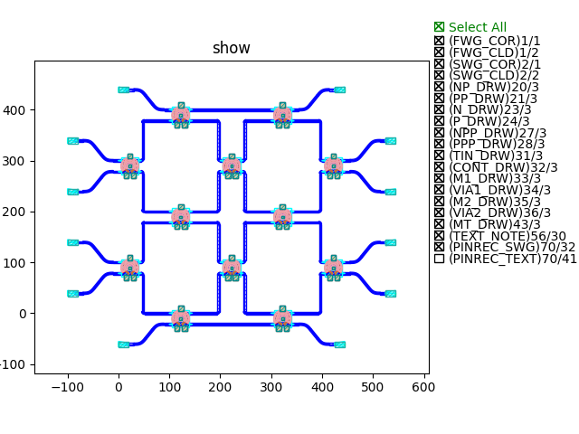
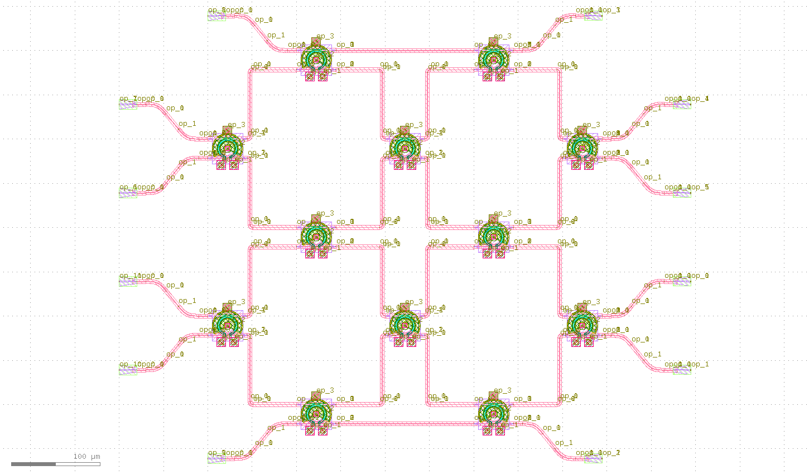
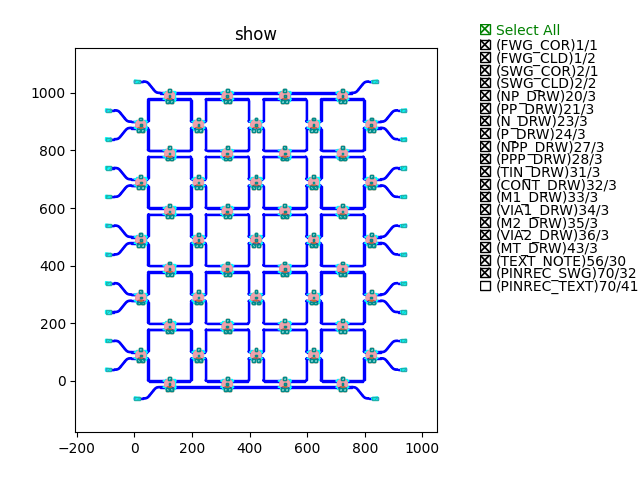
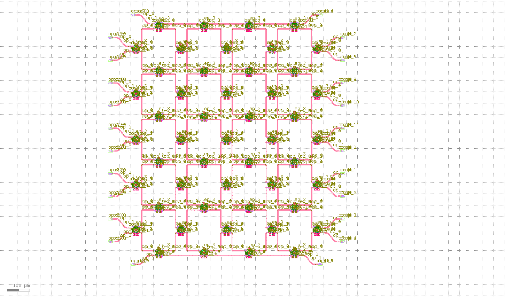
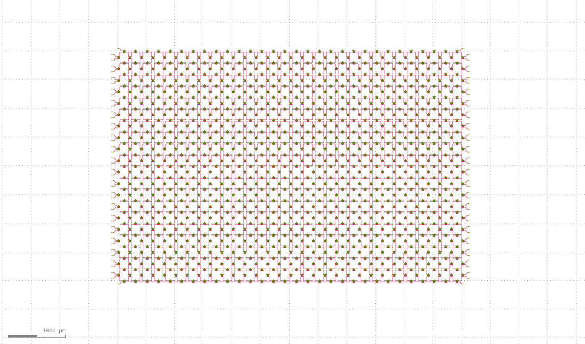

可编程光子集成链路
====================

可编程光子链路是光子学发展的一门重要学科，这一部分主要详细讲解如何搭建可重构式可编程光子链路。

这一部分以矩形网络为例，旨在搭建可重构式矩形光网络。可重构参数包括：

- 基础模块
- 网络大小
- 设计参数

第一部分 构建矩形网络
---------------------------

导入必要库文件::

    from dataclasses import dataclass
    from typing import Mapping, cast

    from fnpcell import all as fp
    from gpdk.technology import get_technology
    from ring_modulator import RingModulator
    from h_fanout import HFanout
    from gpdk.technology.waveguide_factory import EulerBendFactory

定义可编程光子链路类::

    @dataclass(eq=False)
    class PICircuit(fp.PCell):
        def build(self):
            insts, elems, ports = super().build()
            TECH = get_technology()

            row_number = 6
            column_number = 6
            basic_comp = RingModulator()
            spacing = 200

            xy_spacing = []
            xx_spacing = []
            yy_spacing = []
            yx_spacing = []

            for i in range(row_number + 1):
                xy_spacing.append(spacing * i)

            for i in range(column_number):
                xx_spacing.append(spacing * (i + 0.5))

            for i in range(row_number):
                yy_spacing.append(spacing * (i + 0.5))

            for i in range(column_number + 1):
                yx_spacing.append(spacing * i)

            for i in range(row_number + 1):
                for j in range(column_number):
                    x = xx_spacing[j]
                    y = xy_spacing[i]
                    x_dcoupler = basic_comp["op_0"].repositioned(at=(x, y)).owner
                    insts += x_dcoupler, f"{0},{i},{j}"

            for i in range(row_number):
                for j in range(column_number + 1):
                    x = yx_spacing[j]
                    y = yy_spacing[i]
                    y_dcoupler = basic_comp["op_0"].repositioned(at=(x, y)).owner
                    insts += y_dcoupler, f"{1},{i},{j}"

            progcuit = cast(Mapping[str, fp.ICellRef], insts)

            for i in range(row_number + 1):
                for j in range(column_number):
                    if i == 0 and (j < column_number - 1):
                        link1 = fp.LinkBetween(start=progcuit[f"{0},{i},{j}"]["op_2"],
                                               end=progcuit[f"{0},{i},{j + 1}"]["op_1"],
                                               bend_factory=TECH.WG.FWG.C.WIRE.BEND_CIRCULAR)
                        insts += link1
                    if i == row_number and (j < column_number - 1):
                        link2 = fp.LinkBetween(start=progcuit[f"{0},{i},{j}"]["op_3"],
                                               end=progcuit[f"{0},{i},{j + 1}"]["op_0"],
                                               bend_factory=TECH.WG.FWG.C.WIRE.BEND_CIRCULAR)
                        insts += link2
                    if (i < row_number) and (j < column_number):
                        link3 = fp.LinkBetween(start=progcuit[f"{0},{i},{j}"]["op_0"],
                                               end=progcuit[f"{1},{i},{j}"]["op_2"],
                                               bend_factory=TECH.WG.FWG.C.WIRE.BEND_CIRCULAR)
                        insts += link3
                        link4 = fp.LinkBetween(start=progcuit[f"{0},{i},{j}"]["op_3"],
                                               end=progcuit[f"{1},{i},{j + 1}"]["op_1"],
                                               bend_factory=TECH.WG.FWG.C.WIRE.BEND_CIRCULAR)
                        insts += link4
                        link5 = fp.LinkBetween(start=progcuit[f"{0},{i + 1},{j}"]["op_1"],
                                               end=progcuit[f"{1},{i},{j}"]["op_3"],
                                               bend_factory=TECH.WG.FWG.C.WIRE.BEND_CIRCULAR)
                        insts += link5
                        link6 = fp.LinkBetween(start=progcuit[f"{0},{i + 1},{j}"]["op_2"],
                                               end=progcuit[f"{1},{i},{j + 1}"]["op_0"],
                                               bend_factory=TECH.WG.FWG.C.WIRE.BEND_CIRCULAR)
                        insts += link6
            n = 0
            ports += progcuit[f"0,0,{column_number-1}"]["op_2"].with_name("op_"+str(n))

            for i in range(row_number):
                n = n + 1
                ports += progcuit[f"1,{i},{column_number}"]["op_2"].with_name("op_"+str(n))
                n = n + 1
                ports += progcuit[f"1,{i},{column_number}"]["op_3"].with_name("op_"+str(n))

            n = n+1
            ports += progcuit[f"0,{row_number},{column_number-1}"]["op_3"].with_name("op_"+str(n))

            n = n+1
            ports += progcuit[f"0,{row_number},0"]["op_0"].with_name("op_"+str(n))

            for i in range(row_number-1,-1,-1):
                n = n + 1
                ports += progcuit[f"1,{i},0"]["op_0"].with_name("op_"+str(n))
                n = n + 1
                ports += progcuit[f"1,{i},0"]["op_1"].with_name("op_"+str(n))

            n = n+1
            ports += progcuit["0,0,0"]["op_1"].with_name("op_"+str(n))

            # fmt: on
            return insts, elems, ports

主函数中调用，并利用‘Hfanout’函数实现端口光栅耦合器设计::

    if __name__ == "__main__":
        from pathlib import Path

        gds_file = Path(__file__).parent / "local" / Path(__file__).with_suffix(".gds").name
        library = fp.Library()

        TECH = get_technology()
        # =============================================================
        # fmt: off

        def bend_factories(waveguide_type: fp.IWaveguideType):
            if waveguide_type == TECH.WG.FWG.C.WIRE:
                return EulerBendFactory(radius_min=15, l_max=15, waveguide_type=waveguide_type)
            return waveguide_type.bend_factory

        library += [
                HFanout(name="mmi",
                        device=PICircuit(),
                        left_spacing=100,
                        right_spacing=100,
                        left_distance=100,
                        right_distance=100,
                        bend_factories=bend_factories,
                        left_waveguide_type=TECH.WG.SWG.C.WIRE,
                        right_waveguide_type=TECH.WG.SWG.C.WIRE)
            ]

        # fmt: on
        # =============================================================
        fp.export_gds(library, file=gds_file)
        fp.plot(library)

第二部分 参数说明
---------------------------

- row_number 光网络横向网格数
- column_number 光网络竖向网络数
- basic_comp 基础模块器件，这里选用的是微环调制器
- spacing 组件间距设置

第三部分 测试说明
---------------------------

首先2*2方形网络

其自动生成版图如下所示

继续测试5*4矩形网络

其自动生成版图如下所示

最后，为了展示PhotoCAD在可编程光子集成链路设计领域的巨大潜力，我们设计了20*30的光网络以及100*100的光网络。

.. image:: ../images/PIC_square_100100.png

第四部分 总结
---------------------------

PhotoCAD设计大规模可编程光子链路版图性能优异，根据官方提供的可重构代码，我们可以轻松的实现各种复杂网络。
