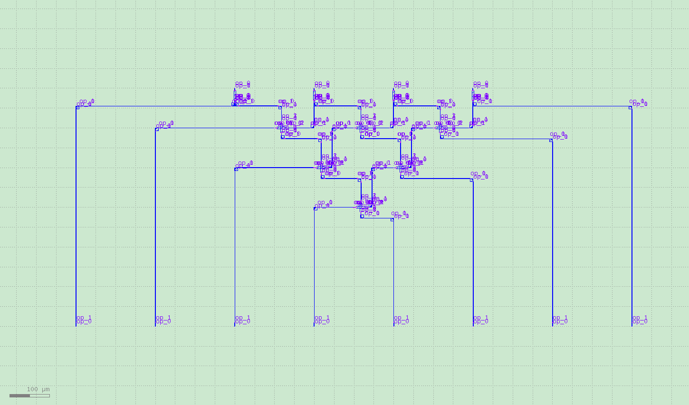
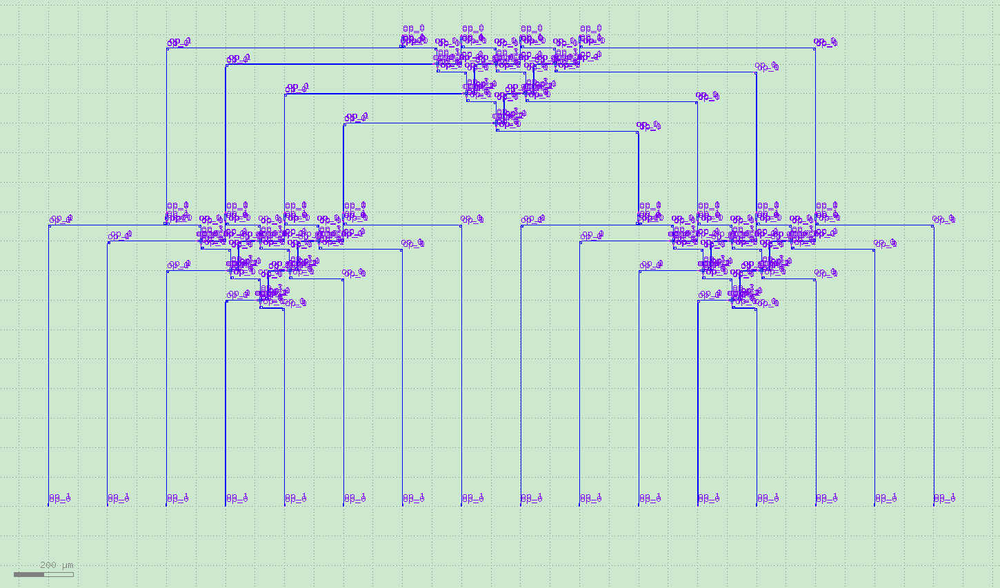
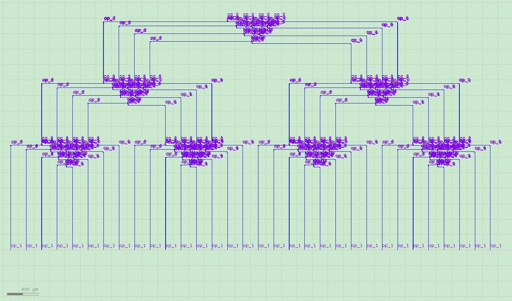

可重构多级交叉链路
====================

可重构多级交叉链路是设计复杂链路的必要部分，本章节使用AMFpdk实现了可重构式多级交叉链路的设计，用户可以通过简单修改脚本实现复杂设计。

基础模块包括：

- 多模干涉仪1×2
- 交叉波导

第一部分 参数说明
---------------------------

- spacing = 200 组件间距设置
- row_number = 8 单元数
- basic_comp_y = RingModulator(transform=fp.rotate(degrees=90)) 基础单元

第二部分 原理说明
---------------------------

通过模块数，计算层级以及分支数::

    def sp_num(order):
        spnum=0
        for i in range(order):
            spnum = spnum+2**i
        return spnum

    def isPower(row_number):
        mmi_tree_order = 0
        while(1):
            if row_number % 2==0:
                mmi_tree_order = mmi_tree_order+1
                row_number =row_number/2
            else:
                return mmi_tree_order

第三部分 测试说明
---------------------------

下面分别展示不同层级数的版图设计，仅仅需要修改简单参数即可：

第四部分 总结
---------------------------

PhotoCAD在设计大规模可重构光电子链路有着巨大的优势，欢迎用户购买软件，同时提供定制链路服务。
