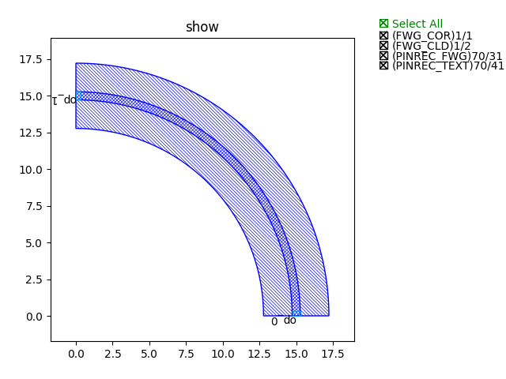
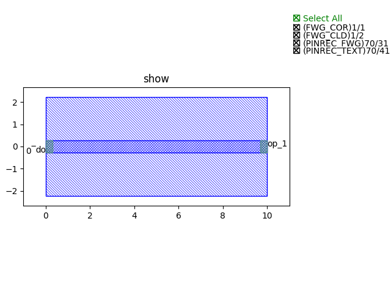

步骤1： 搭建链路基础模块
^^^^^^^^

前言
---------

本案例实现了三个基础模块的搭建，包括：

- 弯曲波导
- 直波导
- Taper过渡波导

弯曲波导
>>>>>>>>>
定义弯曲波导类::

    class BendCircular(fp.IWaveguideLike, fp.PCell):
    degrees: float = fp.DegreeParam(default=90, min=-180, max=180, doc="Bend angle in degrees")
    radius: float = fp.PositiveFloatParam(default=10, doc="Bend radius")
    waveguide_type: fp.IWaveguideType = fp.WaveguideTypeParam(doc="Waveguide parameters")
    port_names: fp.IPortOptions = fp.PortOptionsParam(count=2, default=["op_0", "op_1"])

    def _default_waveguide_type(self):
        return get_technology().WG.FWG.C.WIRE

    def __post_pcell_init__(self):
        assert fp.is_nonzero(self.degrees)

    @cached_property
    def raw_curve(self):
        return fp.g.EllipticalArc(
            radius=self.radius,
            final_degrees=self.degrees,
        )

    def build(self) -> Tuple[fp.InstanceSet, fp.ElementSet, fp.PortSet]:
        insts, elems, ports = super().build()
        wg = self.waveguide_type(curve=self.raw_curve).with_ports(self.port_names)
        insts += wg
        ports += wg.ports
        return insts, elems, ports

调用类，并生成弯曲波导版图文件并显示图例::

    library += BendCircular(name="s", radius=15, waveguide_type=TECH.WG.FWG.C.WIRE)
    fp.export_gds(library, file=gds_file)
    fp.plot(library)

图例展示

直波导
>>>>>>>>>
定义直波导类::

    class Straight(fp.IWaveguideLike, fp.PCell):
    length: float = fp.FloatParam(default=10, min=0)
    waveguide_type: fp.IWaveguideType = fp.WaveguideTypeParam()
    anchor: fp.Anchor = fp.AnchorParam(default=fp.Anchor.START)
    port_names: fp.IPortOptions = fp.PortOptionsParam(count=2, default=("op_0", "op_1"))

    def _default_waveguide_type(self):
        return get_technology().WG.FWG.C.WIRE

    @cached_property
    def raw_curve(self):
        return fp.g.Line(
            length=self.length,
            anchor=self.anchor,
        )

    def build(self) -> Tuple[fp.InstanceSet, fp.ElementSet, fp.PortSet]:
        insts, elems, ports = super().build()
        wg = self.waveguide_type(curve=self.raw_curve).with_ports(self.port_names)
        insts += wg
        ports += wg.ports
        return insts, elems, ports

调用类，并生成弯曲波导版图文件并显示图例::

    library += Straight(name="s", length=10, waveguide_type=TECH.WG.FWG.C.WIRE)
    fp.export_gds(library, file=gds_file)
    fp.plot(library)

图例展示

