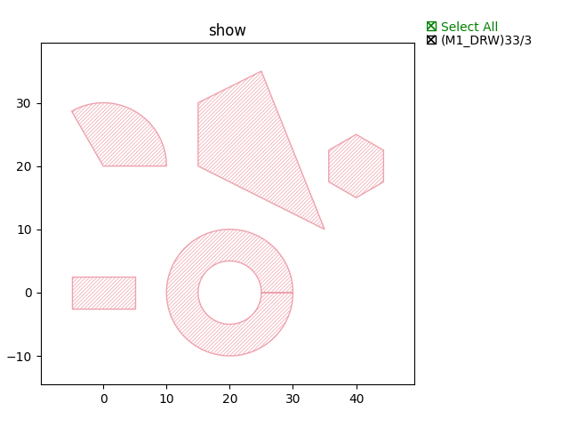
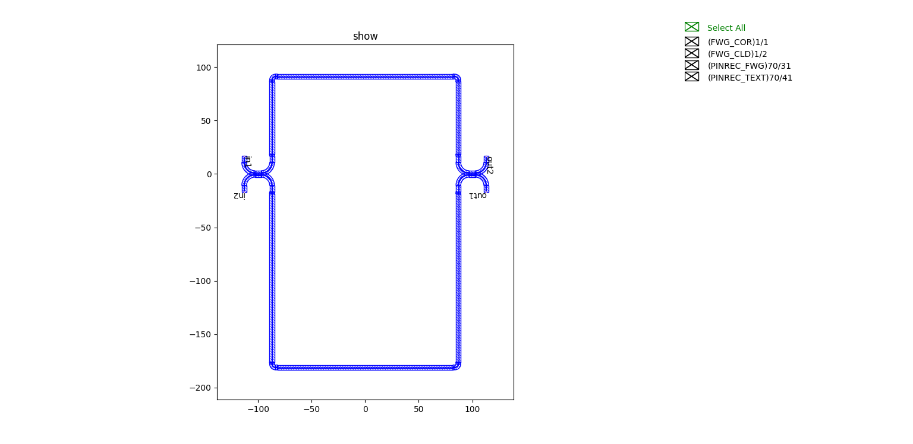
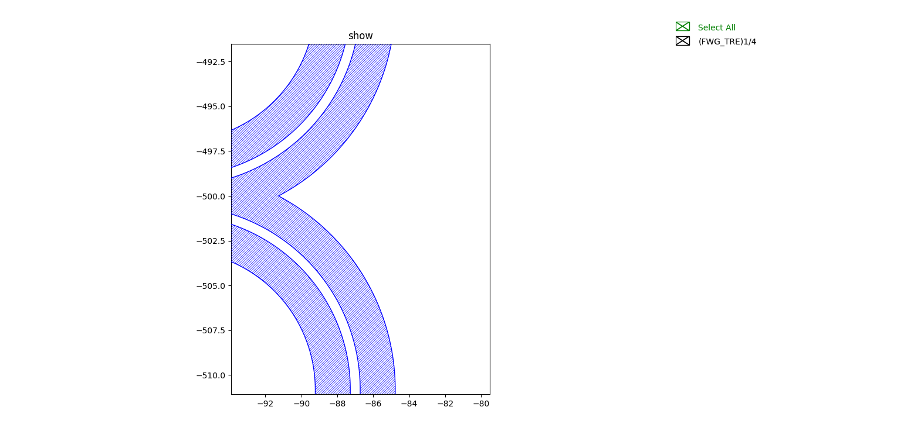

步骤4： 常用图形的绘制以及通过布尔运算实现版图设计
^^^^^^^^^^^^^^^^^^^^^^^^^^^^^^^^^^^^^^^^^^^^^^^^^^^^^^^^^^^^^^^^^^^^^^^^^^^^^^^^^^^^^^^^^^^^^^^^

前言
---------------------------
本案例展示了常用图形的绘制以及通过布尔运算实现复杂结构的版图设计。

本小节主要内容包括：

- 常用图形绘制_
- 布尔运算_
- 案例展示_

首先是常用图形的绘制，这里主要展示：

- 矩形_
- 圆形_
- 多边形_
- 圆环_
- 规则多边形_

布尔运算是版图设计的重要设计手段，特别是针对复杂结构的设计。常见的图形间的布尔运算主要包括：

- 并集_
- 交集_
- 差集_
- 异或集_

常用图形绘制
---------------------------

矩形
>>>>>>>>>>>>>>>>>>>>>>>>>>>

代码::

    rect = fp.el.Rect(width=10, height=5, center=(0,0), layer=TECH.LAYER.M1_DRW)

圆形
>>>>>>>>>>>>>>>>>>>>>>>>>>>

代码::

    circ = fp.el.Circle(radius=10, initial_degrees=0, final_degrees=120, layer=TECH.LAYER.M1_DRW)

多边形
>>>>>>>>>>>>>>>>>>>>>>>>>>>

代码::

    poly = fp.el.Polygon(raw_shape=[(-5, 0), (-5, 10), (5, 15), (15, -10)], layer=TECH.LAYER.M1_DRW)

圆环
>>>>>>>>>>>>>>>>>>>>>>>>>>>

代码::

    ring = fp.el.Ring(inner_radius=5, outer_radius=10, layer=TECH.LAYER.M1_DRW)

规则多边形
>>>>>>>>>>>>>>>>>>>>>>>>>>>

代码::

        rpoly = fp.el.RegularPolygon(sides=6, side_length=5, layer=TECH.LAYER.M1_DRW)

上述案例展示如下：

布尔运算
---------------------------

并集
>>>>>>>>>>>>>>>>>>>>>>>>>>>

代码::

        bool = rect | circ

交集
>>>>>>>>>>>>>>>>>>>>>>>>>>>

代码::

    bool = rect & circ

差集
>>>>>>>>>>>>>>>>>>>>>>>>>>>

代码::

    bool = rect - circ

异或集
>>>>>>>>>>>>>>>>>>>>>>>>>>>

代码::

    bool = rect ^ circ

上述案例展示如下：

.. image:: ../images/boolean.png

案例展示
>>>>>>>>>>>>>>>>>>>>>>>>>>>

将步骤3（:doc:`Step1`）U型定长MZI结构导入，绘制版图::

    class CircuitBool(fp.IWaveguideLike, fp.PCell):
        def build(self) -> Tuple[fp.InstanceSet, fp.ElementSet, fp.PortSet]:
            insts, elems, ports = super().build()
            TECH = get_technology()

            device = MZI()
            ports += device.ports
            insts += device
            cor = device.polygon_set(layer=TECH.LAYER.FWG_COR)
            # elems += cor
            cld = device.polygon_set(layer=TECH.LAYER.FWG_CLD)
            tre = fp.el.PolygonSet.boolean_sub(cld, cor, layer=TECH.LAYER.FWG_TRE)
            elems += tre.translated(0, -500)

            return insts, elems, ports

上面代码通过布尔运算实现两种版图，一种包含所有图层信息，一种为刻蚀层掏空型，具体如图所示：

包含所有图层信息的版图：

局部展示如下：

.. image:: ../images/initial_circuit_part.png

刻蚀层掏空型版图案例局部展示：

