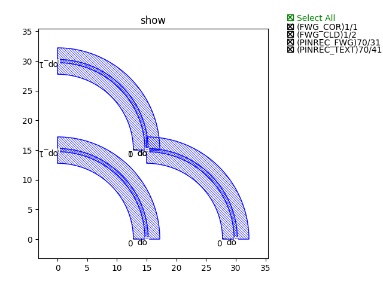
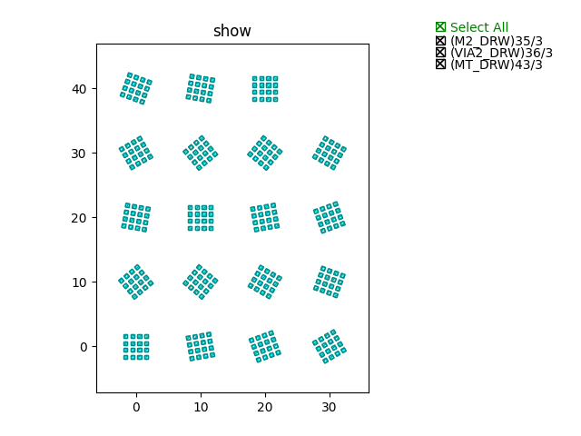

工具类api
====================

工具类api主要包含::

    translated
    rotated
    h_mirrored
    v_mirrored
    repositioned
    position
    get_bounding_box

下面将通过详细的代码解释各工具函数的功能以及用法。

translated
---------------------------

案例代码::

    from dataclasses import dataclass
    from functools import cached_property
    from pathlib import Path
    from typing import Tuple

    from fnpcell import all as fp
    from gpdk.technology import get_technology


    @dataclass(eq=False)
    class BendCircular(fp.IWaveguideLike, fp.PCell):
        """
        Attributes:
            degrees: central angle of the bend, in degrees
            radius: raidus of the bend
            waveguide_type: type of waveguide of the bend
            port_names: defaults to ["op_0", "op_1"]

        Examples:
        ```python
        TECH = get_technology()
            bend = BendCircular(name="s", radius=5, waveguide_type=TECH.WG.FWG.C.WIRE)
        fp.plot(bend)
        ```
        
        """
        degrees: float = fp.DegreeParam(default=90, min=-180, max=180, doc="Bend angle in degrees")
        radius: float = fp.PositiveFloatParam(default=10, doc="Bend radius")
        waveguide_type: fp.IWaveguideType = fp.WaveguideTypeParam(doc="Waveguide parameters")
        port_names: fp.IPortOptions = fp.PortOptionsParam(count=2, default=["op_0", "op_1"])

        def _default_waveguide_type(self):
            return get_technology().WG.FWG.C.WIRE

        def __post_pcell_init__(self):
            assert fp.is_nonzero(self.degrees)

        @cached_property
        def raw_curve(self):
            return fp.g.EllipticalArc(
                radius=self.radius,
                final_degrees=self.degrees,
            )

        def build(self) -> Tuple[fp.InstanceSet, fp.ElementSet, fp.PortSet]:
            insts, elems, ports = super().build()
            wg = self.waveguide_type(curve=self.raw_curve).with_ports(self.port_names)
            insts += wg
            ports += wg.ports
            return insts, elems, ports


    @dataclass(eq=False)
    class BendCircular90(BendCircular):
        degrees: float = fp.DegreeParam(default=90, locked=True)
        waveguide_type: fp.IWaveguideType = fp.WaveguideTypeParam(locked=True)

        @fp.cache()
        def sim_model(self, env: fp.ISimEnv):
            return fp.sim.ExternalFileModel(Path(f"{type(self).__name__}_radius={self.radius}").with_suffix(".dat"))


    @dataclass(eq=False)
    class BendCircular90_FWG_C_WIRE(BendCircular90, locked=True):
        radius: float = fp.PositiveFloatParam(default=3.225, doc="Bend radius")

        @fp.cache()
        def sim_model(self, env: fp.ISimEnv):
            return fp.sim.ExternalFileModel(Path("BendCircular90_radius=10").with_suffix(".dat"))


    @dataclass(eq=False)
    class BendCircular90_FWG_C_EXPANDED(BendCircular, locked=True):
        radius: float = fp.PositiveFloatParam(default=3.4, doc="Bend radius")
        waveguide_type: fp.IWaveguideType = fp.WaveguideTypeParam()

        def _default_waveguide_type(self):
            return get_technology().WG.FWG.C.EXPANDED

        @fp.cache()
        def sim_model(self, env: fp.ISimEnv):

            file_path = Path("BendCircular90_radius=10").with_suffix(".dat")

            return fp.sim.ExternalFileModel(file_path)


    if __name__ == "__main__":
        from gpdk.util.path import local_output_file

        gds_file = local_output_file(__file__).with_suffix(".gds")
        library = fp.Library()

        TECH = get_technology()
        # =======================================================================
        # fmt: off

        library += BendCircular(name="s", radius=15, waveguide_type=TECH.WG.FWG.C.WIRE)
        library += BendCircular(name="d", radius=15, waveguide_type=TECH.WG.FWG.C.WIRE).translated(0, 15)
        library += BendCircular(name="t", radius=15, waveguide_type=TECH.WG.FWG.C.WIRE).translated(15, 0)

        # fmt: on
        # =============================================================
        # fp.export_gds(library, file=gds_file)
        fp.plot(library)

功能说明::

>>> library += BendCircular(name="d", radius=15, waveguide_type=TECH.WG.FWG.C.WIRE).translated(0, 15)

将组件向X轴正向平移15个基本单位

>>> library += BendCircular(name="t", radius=15, waveguide_type=TECH.WG.FWG.C.WIRE).translated(15, 0)

将组件向Y轴正向15个基本单位

案例展示::



rotated
---------------------------

案例代码::

    import math
    from dataclasses import dataclass

    from fnpcell import all as fp
    from gpdk.components.via.via import Via
    from gpdk.technology import get_technology


    @dataclass(eq=False)
    class Vias(fp.PCell):
        """
        Attributes:
            width: width of array of via
            height: height of array of via
            spacing: spacing between vias in array
            top_layer: defaults to `LAYER.MT_DRW`, top layer
            via_layer: defaults to `LAYER.VIA2_DRW`, via layer
            bottom_layer: defaults to `LAYER.M2_DRW`, bottom layer
            port_names: defaults to ["ep_0", "ep_1"]

        Examples:
        ```python
        vias = Vias(name="s", width=4.3, height=4.3)
        fp.plot(vias)
        ```
        
        """

        width: float = fp.NonNegFloatParam(default=4.3)
        height: float = fp.NonNegFloatParam(default=4.3)
        spacing: float = fp.PositiveFloatParam()
        top_layer: fp.ILayer = fp.LayerParam()
        via_layer: fp.ILayer = fp.LayerParam()
        bottom_layer: fp.ILayer = fp.LayerParam()
        via: Via = fp.DeviceParam(type=Via)
        port_names: fp.IPortOptions = fp.PortOptionsParam(count=2, default=["ep_0", "ep_1"])

        def _default_spacing(self):
            return get_technology().VIAS.SPACING

        def _default_top_layer(self):
            return get_technology().LAYER.MT_DRW

        def _default_via_layer(self):
            return get_technology().LAYER.VIA2_DRW

        def _default_bottom_layer(self):
            return get_technology().LAYER.M2_DRW

        def _default_via(self):
            return Via(
                top_layer=self.top_layer,
                via_layer=self.via_layer,
                bottom_layer=self.bottom_layer,
                port_names=(None, None),
            )

        def __post_pcell_init__(self):
            assert self.spacing >= get_technology().VIAS.SPACING, f"requires spacing >= TECH.VIAS.SPACING, got: {self.spacing} >= {get_technology().VIAS.SPACING}"

        def build(self):
            insts, elems, ports = fp.InstanceSet(), fp.ElementSet(), fp.PortSet()
            width = self.width
            height = self.height
            spacing = self.spacing
            via = self.via
            (x_min, y_min), (x_max, y_max) = fp.get_bounding_box(via)
            w = x_max - x_min
            h = y_max - y_min

            width = max(width, w)
            height = max(height, h)
            m = max(1, math.floor((width + spacing) / (w + spacing)))
            n = max(1, math.floor((height + spacing) / (h + spacing)))

            col_width = width / m
            row_height = height / n
            spacing_x = (col_width - w) / 2
            spacing_y = (row_height - h) / 2

            via_array = via.new_array(
                cols=m,
                col_width=col_width,
                rows=n,
                row_height=row_height,
                transform=fp.translate(-x_min - width / 2 + spacing_x, -y_min - height / 2 + spacing_y),
            )
            insts += via_array

            # rect = fp.g.Rect(width=width, height=height, center=(0, 0))
            # ports += fp.Pin(name=self.port_names[0], position=(0, 0), shape=rect, layer=self.top_layer)
            # ports += fp.Pin(name=self.port_names[1], position=(0, 0), shape=rect, layer=self.bottom_layer)
            return insts, elems, ports


    if __name__ == "__main__":
        from gpdk.util.path import local_output_file

        gds_file = local_output_file(__file__).with_suffix(".gds")
        library = fp.Library()

        TECH = get_technology()
        # =============================================================
        # fmt: off

        library += Vias()
        library += Vias(name="s", width=4.3, height=4.3).rotated(degrees=10).translated(10,  0)
        library += Vias(name="s", width=4.3, height=4.3).rotated(degrees=20).translated(20,  0)
        library += Vias(name="s", width=4.3, height=4.3).rotated(degrees=30).translated(30,  0)
        library += Vias(name="s", width=4.3, height=4.3).rotated(degrees=40).translated( 0, 10)
        library += Vias(name="s", width=4.3, height=4.3).rotated(degrees=50).translated(10, 10)
        library += Vias(name="s", width=4.3, height=4.3).rotated(degrees=60).translated(20, 10)
        library += Vias(name="s", width=4.3, height=4.3).rotated(degrees=70).translated(30, 10)
        library += Vias(name="s", width=4.3, height=4.3).rotated(degrees=80).translated(0, 20)
        library += Vias(name="s", width=4.3, height=4.3).rotated(degrees=90).translated(10, 20)
        library += Vias(name="s", width=4.3, height=4.3).rotated(degrees=100).translated(20, 20)
        library += Vias(name="s", width=4.3, height=4.3).rotated(degrees=110).translated(30, 20)
        library += Vias(name="s", width=4.3, height=4.3).rotated(degrees=120).translated(0, 30)
        library += Vias(name="s", width=4.3, height=4.3).rotated(degrees=130).translated(10, 30)
        library += Vias(name="s", width=4.3, height=4.3).rotated(degrees=140).translated(20, 30)
        library += Vias(name="s", width=4.3, height=4.3).rotated(degrees=150).translated(30, 30)
        library += Vias(name="s", width=4.3, height=4.3).rotated(degrees=160).translated(0, 40)
        library += Vias(name="s", width=4.3, height=4.3).rotated(degrees=170).translated(10, 40)
        library += Vias(name="s", width=4.3, height=4.3).rotated(degrees=180).translated(20, 40)
        # fmt: on
        # =============================================================
        # fp.export_gds(library, file=gds_file)
        fp.plot(library)

功能说明::

        library += Vias(name="s", width=4.3, height=4.3).rotated(degrees=10).translated(10,  0)
        library += Vias(name="s", width=4.3, height=4.3).rotated(degrees=20).translated(20,  0)
        library += Vias(name="s", width=4.3, height=4.3).rotated(degrees=30).translated(30,  0)
        library += Vias(name="s", width=4.3, height=4.3).rotated(degrees=40).translated( 0, 10)
        library += Vias(name="s", width=4.3, height=4.3).rotated(degrees=50).translated(10, 10)
        library += Vias(name="s", width=4.3, height=4.3).rotated(degrees=60).translated(20, 10)
        library += Vias(name="s", width=4.3, height=4.3).rotated(degrees=70).translated(30, 10)
        library += Vias(name="s", width=4.3, height=4.3).rotated(degrees=80).translated(0, 20)
        library += Vias(name="s", width=4.3, height=4.3).rotated(degrees=90).translated(10, 20)
        library += Vias(name="s", width=4.3, height=4.3).rotated(degrees=100).translated(20, 20)
        library += Vias(name="s", width=4.3, height=4.3).rotated(degrees=110).translated(30, 20)
        library += Vias(name="s", width=4.3, height=4.3).rotated(degrees=120).translated(0, 30)
        library += Vias(name="s", width=4.3, height=4.3).rotated(degrees=130).translated(10, 30)
        library += Vias(name="s", width=4.3, height=4.3).rotated(degrees=140).translated(20, 30)
        library += Vias(name="s", width=4.3, height=4.3).rotated(degrees=150).translated(30, 30)
        library += Vias(name="s", width=4.3, height=4.3).rotated(degrees=160).translated(0, 40)
        library += Vias(name="s", width=4.3, height=4.3).rotated(degrees=170).translated(10, 40)
        library += Vias(name="s", width=4.3, height=4.3).rotated(degrees=180).translated(20, 40)

组件逆时针依次旋转10度，并放置到相应位置。从左至右，从下至上。

案例展示::



h_mirrored
---------------------------

案例代码::

    import math
    from dataclasses import dataclass
    from typing import Tuple, cast
    from fnpcell import all as fp
    from gpdk.components.sbend.sbend_circular import SBendCircular
    from gpdk.components.straight.straight import Straight
    from gpdk.technology import get_technology
    from gpdk.technology.interfaces import CoreCladdingWaveguideType


    @dataclass(eq=False)
    class DirectionalCouplerSBend(fp.PCell):
        """
        Attributes:
            coupler_spacing: Spacing between the two waveguide centre lines.
            coupler_length: Length of the directional coupler
            bend_radius: Bend radius for the auto-generated bends
            bend_degrees: Angle(in degrees) at which the directional coupler is bent
            straight_after_bend: Length of the straight waveguide after the bend
            waveguide_type: type of waveguide
            port_names: defaults to ["op_0", "op_1", "op_2", "op_3"]

        Examples:
        ```python
        TECH = get_technology()
            dc = DirectionalCouplerSBend(name="f", coupler_spacing=0.7, coupler_length=6, bend_radius=10, bend_degrees=30, straight_after_bend=6, waveguide_type=TECH.WG.FWG.C.WIRE)
        fp.plot(dc)
        ```
        
        """

        coupler_spacing: float = fp.PositiveFloatParam(default=0.7, doc="Spacing between the two waveguide centre lines.")
        coupler_length: float = fp.PositiveFloatParam(default=6, doc="Length of the directional coupler")
        bend_radius: float = fp.PositiveFloatParam(required=False, doc="Bend radius for the auto-generated bends")
        bend_degrees: float = fp.DegreeParam(default=30, min=0, max=90, invalid=[0], doc="Angle(in degrees) at which the directional coupler is bent")
        straight_after_bend: float = fp.PositiveFloatParam(default=6, doc="Length of the straight waveguide after the bend")
        waveguide_type: CoreCladdingWaveguideType = fp.WaveguideTypeParam(type=CoreCladdingWaveguideType, doc="Waveguide parameters")
        port_names: fp.IPortOptions = fp.PortOptionsParam(count=4, default=["op_0", "op_1", "op_2", "op_3"])

        def _default_waveguide_type(self):
            return get_technology().WG.FWG.C.WIRE

        def build(self) -> Tuple[fp.InstanceSet, fp.ElementSet, fp.PortSet]:
            insts, elems, ports = super().build()

            coupler_spacing = self.coupler_spacing
            coupler_length = self.coupler_length
            bend_radius = self.bend_radius
            bend_degrees = self.bend_degrees
            straight_after_bend = self.straight_after_bend
            waveguide_type = self.waveguide_type
            port_names = self.port_names

            if bend_radius is None:
                bend_radius = cast(float, waveguide_type.BEND_CIRCULAR.radius_eff)  # type: ignore

            assert coupler_spacing > waveguide_type.core_width, "waveguide core overlap: coupler spacing must be greater than core_width"

            central_angle = math.radians(bend_degrees)
            d = bend_radius * math.sin(central_angle)
            h = bend_radius - bend_radius * math.cos(central_angle)
            sbend_height = h * 2
            sbend_distance = d * 2

            dy = coupler_spacing / 2
            dx = coupler_length / 2

            right_straight_after_bend = Straight(
                name="afterbend",
                length=straight_after_bend,
                waveguide_type=waveguide_type,
                transform=fp.translate(dx + sbend_distance, -dy - sbend_height),
            )
            left_straight_after_bend = right_straight_after_bend.h_mirrored()
            sbend = SBendCircular(
                name="sbend",
                distance=sbend_distance,
                height=sbend_height,
                min_radius=bend_radius,
                waveguide_type=waveguide_type,
                transform=fp.translate(-d - dx, -h - dy),
            )
            straight_coupler = Straight(
                name="coupler",
                length=coupler_length,
                waveguide_type=waveguide_type,
                transform=fp.translate(-dx, -dy),
            )

            bottom_half = fp.Device(
                name="bottom",
                content=[
                    right_straight_after_bend,
                    sbend,
                    straight_coupler,
                    sbend.h_mirrored(),
                    left_straight_after_bend,
                ],
                ports=[
                    left_straight_after_bend["op_1"].with_name("op_0"),
                    right_straight_after_bend["op_1"],
                ],
            )
            insts += bottom_half
            # ports += bottom_half["op_0"].with_name(port_names[1])  # for right port index(0 1 2 3) in netlist
            # ports += bottom_half["op_1"].with_name(port_names[2])
            top_half = bottom_half.v_mirrored()
            insts += top_half
            ports += top_half["op_0"].with_name(port_names[0])
            ports += bottom_half["op_0"].with_name(port_names[1])
            ports += bottom_half["op_1"].with_name(port_names[2])
            ports += top_half["op_1"].with_name(port_names[3])

            return insts, elems, ports


    if __name__ == "__main__":
        from gpdk.util.path import local_output_file

        gds_file = local_output_file(__file__).with_suffix(".gds")
        library = fp.Library()

        TECH = get_technology()
        # =============================================================
        # fmt: off

        library += DirectionalCouplerSBend()
        # library += DirectionalCouplerSBend(name="f", coupler_spacing=0.7, coupler_length=6, bend_radius=10, bend_degrees=30, straight_after_bend=6, waveguide_type=TECH.WG.FWG.C.WIRE)
        # library += DirectionalCouplerSBend(name="s", coupler_spacing=1.7, coupler_length=6, bend_radius=20, bend_degrees=30, straight_after_bend=6, waveguide_type=TECH.WG.SWG.C.WIRE)

        # fmt: on
        # =============================================================
        # fp.export_gds(library, file=gds_file)
        fp.plot(library)

功能说明::

>>>left_straight_after_bend = right_straight_after_bend.h_mirrored()

水平镜像

v_mirrored
---------------------------

案例展示::

    import math
    from dataclasses import dataclass
    from typing import Tuple, cast
    from fnpcell import all as fp
    from gpdk.components.sbend.sbend_circular import SBendCircular
    from gpdk.components.straight.straight import Straight
    from gpdk.technology import get_technology
    from gpdk.technology.interfaces import CoreCladdingWaveguideType


    @dataclass(eq=False)
    class DirectionalCouplerSBend(fp.PCell):
        """
        Attributes:
            coupler_spacing: Spacing between the two waveguide centre lines.
            coupler_length: Length of the directional coupler
            bend_radius: Bend radius for the auto-generated bends
            bend_degrees: Angle(in degrees) at which the directional coupler is bent
            straight_after_bend: Length of the straight waveguide after the bend
            waveguide_type: type of waveguide
            port_names: defaults to ["op_0", "op_1", "op_2", "op_3"]

        Examples:
        ```python
        TECH = get_technology()
            dc = DirectionalCouplerSBend(name="f", coupler_spacing=0.7, coupler_length=6, bend_radius=10, bend_degrees=30, straight_after_bend=6, waveguide_type=TECH.WG.FWG.C.WIRE)
        fp.plot(dc)
        ```
        
        """

        coupler_spacing: float = fp.PositiveFloatParam(default=0.7, doc="Spacing between the two waveguide centre lines.")
        coupler_length: float = fp.PositiveFloatParam(default=6, doc="Length of the directional coupler")
        bend_radius: float = fp.PositiveFloatParam(required=False, doc="Bend radius for the auto-generated bends")
        bend_degrees: float = fp.DegreeParam(default=30, min=0, max=90, invalid=[0], doc="Angle(in degrees) at which the directional coupler is bent")
        straight_after_bend: float = fp.PositiveFloatParam(default=6, doc="Length of the straight waveguide after the bend")
        waveguide_type: CoreCladdingWaveguideType = fp.WaveguideTypeParam(type=CoreCladdingWaveguideType, doc="Waveguide parameters")
        port_names: fp.IPortOptions = fp.PortOptionsParam(count=4, default=["op_0", "op_1", "op_2", "op_3"])

        def _default_waveguide_type(self):
            return get_technology().WG.FWG.C.WIRE

        def build(self) -> Tuple[fp.InstanceSet, fp.ElementSet, fp.PortSet]:
            insts, elems, ports = super().build()

            coupler_spacing = self.coupler_spacing
            coupler_length = self.coupler_length
            bend_radius = self.bend_radius
            bend_degrees = self.bend_degrees
            straight_after_bend = self.straight_after_bend
            waveguide_type = self.waveguide_type
            port_names = self.port_names

            if bend_radius is None:
                bend_radius = cast(float, waveguide_type.BEND_CIRCULAR.radius_eff)  # type: ignore

            assert coupler_spacing > waveguide_type.core_width, "waveguide core overlap: coupler spacing must be greater than core_width"

            central_angle = math.radians(bend_degrees)
            d = bend_radius * math.sin(central_angle)
            h = bend_radius - bend_radius * math.cos(central_angle)
            sbend_height = h * 2
            sbend_distance = d * 2

            dy = coupler_spacing / 2
            dx = coupler_length / 2

            right_straight_after_bend = Straight(
                name="afterbend",
                length=straight_after_bend,
                waveguide_type=waveguide_type,
                transform=fp.translate(dx + sbend_distance, -dy - sbend_height),
            )
            left_straight_after_bend = right_straight_after_bend.h_mirrored()
            sbend = SBendCircular(
                name="sbend",
                distance=sbend_distance,
                height=sbend_height,
                min_radius=bend_radius,
                waveguide_type=waveguide_type,
                transform=fp.translate(-d - dx, -h - dy),
            )
            straight_coupler = Straight(
                name="coupler",
                length=coupler_length,
                waveguide_type=waveguide_type,
                transform=fp.translate(-dx, -dy),
            )

            bottom_half = fp.Device(
                name="bottom",
                content=[
                    right_straight_after_bend,
                    sbend,
                    straight_coupler,
                    sbend.h_mirrored(),
                    left_straight_after_bend,
                ],
                ports=[
                    left_straight_after_bend["op_1"].with_name("op_0"),
                    right_straight_after_bend["op_1"],
                ],
            )
            insts += bottom_half
            # ports += bottom_half["op_0"].with_name(port_names[1])  # for right port index(0 1 2 3) in netlist
            # ports += bottom_half["op_1"].with_name(port_names[2])
            top_half = bottom_half.v_mirrored()
            insts += top_half
            ports += top_half["op_0"].with_name(port_names[0])
            ports += bottom_half["op_0"].with_name(port_names[1])
            ports += bottom_half["op_1"].with_name(port_names[2])
            ports += top_half["op_1"].with_name(port_names[3])

            return insts, elems, ports


    if __name__ == "__main__":
        from gpdk.util.path import local_output_file

        gds_file = local_output_file(__file__).with_suffix(".gds")
        library = fp.Library()

        TECH = get_technology()
        # =============================================================
        # fmt: off

        library += DirectionalCouplerSBend()
        # library += DirectionalCouplerSBend(name="f", coupler_spacing=0.7, coupler_length=6, bend_radius=10, bend_degrees=30, straight_after_bend=6, waveguide_type=TECH.WG.FWG.C.WIRE)
        # library += DirectionalCouplerSBend(name="s", coupler_spacing=1.7, coupler_length=6, bend_radius=20, bend_degrees=30, straight_after_bend=6, waveguide_type=TECH.WG.SWG.C.WIRE)

        # fmt: on
        # =============================================================
        # fp.export_gds(library, file=gds_file)
        fp.plot(library)
功能说明::

>>>top_half = bottom_half.v_mirrored()

垂直镜像

repositioned
---------------------------

Positioned at new point,Owner will translated.

Attributes
target
any drawable instance, such as IPolygon, ICell, ICellRef, ILibrary …
Returns
(x_min,y_min,x_max,y_max) Usage:

(x_min, y_min), (x_max, y_max) = fp.get_bounding_box(cell)

position
---------------------------

get_bounding_box
---------------------------