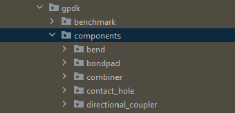
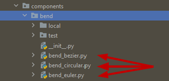

**Components**: gpdk 内置元件
^^^^^^^^^^^^^^^^^^^^^^^^^^^^^^^^^^^^^^^^^^^^^^^^^^^
gpdk 中的 **components** 文件夹保存了参数化器件布局单元的所有 Python 脚本，其中每种类型的参数化元件都保存在以元件单元命名的子文件夹中，比如 ``bend``, ``bondpad``, ``combiner``, 以及其他元件的子文件夹。

**components** 文件夹中的每个元件子文件夹都包含该类元件的 Python 脚本源代码。

以 ``bend`` 文件夹为例：

1.  ``local`` 文件夹用于存储弯曲元件的 python 脚本生成的 GDS 和 SPC 网表文件（如果 ``local`` 文件夹不存在，则会在运行元件的 python 源代码后自动生成）。
2. 用户可以暂时忽略测试文件夹 ``test`` .
3. 下图中的红色箭头显示了三种不同类型弯曲波导的 python 源代码，用户可以尝试运行这些代码来体验其功能。

无源器件
-------------------------------------------

     
+--------+-----------------------------+-------------------------------------------------------------------------------------------------------------------------------------------------------------------------------------------------------------------------------------+----------------------------+----------------------------------------------+
|        |                             |                                                                                                                                                                                                                                     |                            |                                              |
| No.    |         Cell Name           |                                                                                                          Key Parameters                                                                                                             |        Default WG          | Layout                                       |
+========+=============================+=====================================================================================================================================================================================================================================+============================+==============================================+
|  1     |        BendBezier           |                                                                                         start,  controls,  end,  waveguide_type,  port_names                                                                                        |        FWG.C.WIRE          |    .. image:: ../images/passive1.png         |
+--------+-----------------------------+-------------------------------------------------------------------------------------------------------------------------------------------------------------------------------------------------------------------------------------+----------------------------+----------------------------------------------+
|  2     |       BendCircular          |                                                                                            degrees, radius, waveguide_type, port_names                                                                                              |        FWG.C.WIRE          |    .. image:: ../images/passive2.png         |
+--------+-----------------------------+-------------------------------------------------------------------------------------------------------------------------------------------------------------------------------------------------------------------------------------+----------------------------+----------------------------------------------+
|  3     |         BendEuler           |                                                                                        degrees, radius_min, p, waveguide_type, port_names                                                                                           |        FWG.C.WIRE          |    .. image:: ../images/passive3.png         |
+--------+-----------------------------+-------------------------------------------------------------------------------------------------------------------------------------------------------------------------------------------------------------------------------------+----------------------------+----------------------------------------------+
|  4     |         Ycombiner           |                                                                   bend_radius, out_degrees, center_waveguide_length, taper_length, waveguide_type, port_names                                                                       |        FWG.C.WIRE          |    .. image:: ../images/passive4.png         |
+--------+-----------------------------+-------------------------------------------------------------------------------------------------------------------------------------------------------------------------------------------------------------------------------------+----------------------------+----------------------------------------------+
|  5     |        ContactHole          |                                                                              num_sides, top_width, tin_width, bottom_width, via_width, port_names                                                                                   |                            |     .. image:: ../images/passive5.png        |
+--------+-----------------------------+-------------------------------------------------------------------------------------------------------------------------------------------------------------------------------------------------------------------------------------+----------------------------+----------------------------------------------+
|  6     |      DirectionalCouplerBend |                                                                  coupler_spacing, coupler_length, bend_radius, straight_after_bend, waveguide_type, port_names                                                                      |        FWG.C.WIRE          |     .. image:: ../images/passive6.png        | 
+--------+-----------------------------+-------------------------------------------------------------------------------------------------------------------------------------------------------------------------------------------------------------------------------------+----------------------------+----------------------------------------------+
|  7     |          DCHalfRingStraight |                                                                            coupler_spacing, coupler_length, bend_radius, waveguide_type, port_names                                                                                 |        FWG.C.WIRE          |     .. image:: ../images/passive7.png        |
+--------+-----------------------------+-------------------------------------------------------------------------------------------------------------------------------------------------------------------------------------------------------------------------------------+----------------------------+----------------------------------------------+
|  8     |      DirectionalCouplerSBend|                                                           coupler_spacing, coupler_length, bend_radius, bend_degrees, straight_after_bend, waveguide_type, port_names                                                               |        FWG.C.WIRE          |    .. image:: ../images/passive8.png         |
+--------+-----------------------------+-------------------------------------------------------------------------------------------------------------------------------------------------------------------------------------------------------------------------------------+----------------------------+----------------------------------------------+
|  9     |    Fixed_Edge_Coupler       |                                                                                                                                                                                                                                     |        FWG.C.WIRE          |    .. image:: ../images/passive9.png         |
+--------+-----------------------------+-------------------------------------------------------------------------------------------------------------------------------------------------------------------------------------------------------------------------------------+----------------------------+----------------------------------------------+
|  10    |          Fixed_MH_TE_1550   |                                                                                                                                                                                                                                     |                            |    .. image:: ../images/passive10.png        |
+--------+-----------------------------+-------------------------------------------------------------------------------------------------------------------------------------------------------------------------------------------------------------------------------------+----------------------------+----------------------------------------------+
|  11    | Fixed_Terminator_TE_1550    |                                                                                                  length, waveguide_type, anchor                                                                                                     |        FWG.C.WIRE          |   .. image:: ../images/passive11.png         |
+--------+-----------------------------+-------------------------------------------------------------------------------------------------------------------------------------------------------------------------------------------------------------------------------------+----------------------------+----------------------------------------------+
|  12    |      GratingCoupler         |                                                                 length, half_degrees, ellipse_ratio, tooth_width, etch_width, teeth, waveguide_type, port_names                                                                     |        FWG.C.WIRE          |   .. image:: ../images/passive12.png         |
+--------+-----------------------------+-------------------------------------------------------------------------------------------------------------------------------------------------------------------------------------------------------------------------------------+----------------------------+----------------------------------------------+
|  13    |         SiHeater            |                                                                                       length, half_metal_width, waveguide_type, port_names                                                                                          |        FWG.C.WIRE          |   .. image:: ../images/passive13.png         |
+--------+-----------------------------+-------------------------------------------------------------------------------------------------------------------------------------------------------------------------------------------------------------------------------------+----------------------------+----------------------------------------------+
|  14    |         TiNHeater           |                                                       waveguide_length, tin_length, tin_width, tin_box_size, metal_box_size, contact_box_size, waveguide_type, port_names                                                           |        FWG.C.WIRE          |   .. image:: ../images/passive14.png         |
+--------+-----------------------------+-------------------------------------------------------------------------------------------------------------------------------------------------------------------------------------------------------------------------------------+----------------------------+----------------------------------------------+
|  15    |       RingResonator         |                                                                     ring_radius, top_spacing, bottom_spacing, ring_type, top_type, bottom_type, port_names                                                                          |        FWG.C.WIRE          |   .. image:: ../images/passive15.png         |
+--------+-----------------------------+-------------------------------------------------------------------------------------------------------------------------------------------------------------------------------------------------------------------------------------+----------------------------+----------------------------------------------+
|  16    |       SBendCircular         |                                                                                     distance, height, min_radius, waveguide_type, port_names                                                                                        |        FWG.C.WIRE          |   .. image:: ../images/passive16.png         |
+--------+-----------------------------+-------------------------------------------------------------------------------------------------------------------------------------------------------------------------------------------------------------------------------------+----------------------------+----------------------------------------------+
|  17    |           SBend             |                                                                     distance, height, bend_degrees, max_distance, bend_factory, waveguide_type, port_names                                                                          |        FWG.C.WIRE          |   .. image:: ../images/passive17.png         |
+--------+-----------------------------+-------------------------------------------------------------------------------------------------------------------------------------------------------------------------------------------------------------------------------------+----------------------------+----------------------------------------------+
|  18    |         Ysplitter           |                                                                   bend_radius, out_degrees, center_waveguide_length, taper_length, waveguide_type, port_names                                                                       |        FWG.C.WIRE          |   .. image:: ../images/passive18.png         |
+--------+-----------------------------+-------------------------------------------------------------------------------------------------------------------------------------------------------------------------------------------------------------------------------------+----------------------------+----------------------------------------------+
|  19    |         Straight            |                                                                                            length, waveguide_type, anchor, port_names                                                                                               |        FWG.C.WIRE          |   .. image:: ../images/passive19.png         |
+--------+-----------------------------+-------------------------------------------------------------------------------------------------------------------------------------------------------------------------------------------------------------------------------------+----------------------------+----------------------------------------------+
|  20    |        TaperLinear          |                                                                                         length, left_type, right_type, anchor, port_names                                                                                           |        FWG.C.WIRE          |   .. image:: ../images/passive20.png         |
+--------+-----------------------------+-------------------------------------------------------------------------------------------------------------------------------------------------------------------------------------------------------------------------------------+----------------------------+----------------------------------------------+
|        |                             |                                                                                                                                                                                                                                     |     (left)FWG.C.WIRE,      |   .. image:: ../images/passive21.png         |                                           
|  21    |      TaperParabolic         |                                                                                      length, left_type, right_type, step, anchor, port_names                                                                                        |     (right)FWG.C.EXPANDED  |                                              |
+--------+-----------------------------+-------------------------------------------------------------------------------------------------------------------------------------------------------------------------------------------------------------------------------------+----------------------------+----------------------------------------------+
|        |                             |                                                                                                                                                                                                                                     |         FWG.C.WIRE   ,     |   .. image:: ../images/passive22.png         |
|  22    |           FWG2MWGTransition |                                                                        length, wire_only_length, deep_only_width, fwg_type, mwg_type, anchor, port_names                                                                            |         MWG.C.WIRE         |                                              |
+--------+-----------------------------+-------------------------------------------------------------------------------------------------------------------------------------------------------------------------------------------------------------------------------------+----------------------------+----------------------------------------------+
|        |           FWG2SWGTransition |                                                                                                                                                                                                                                     |         FWG.C.WIRE   ,     |   .. image:: ../images/passive23.png         |
|  23    |                             |                                                                        length, wire_only_length, deep_only_width, fwg_type, swg_type, anchor, port_names                                                                            |         MWG.C.WIRE         |                                              |
+--------+-----------------------------+-------------------------------------------------------------------------------------------------------------------------------------------------------------------------------------------------------------------------------------+----------------------------+----------------------------------------------+
|        |           SWG2MWGTransition |                                                                                                                                                                                                                                     |         SWG.C.WIRE   ,     |   .. image:: ../images/passive24.png         |
|  24    |                             |                          swg_length, swg_wire_only_length, swg_deep_only_width, swg_type, mwg_length, mwg_wire_only_length, mwg_wire_only_length, mwg_deep_only_width, mwg_type, anchor, port_names                                 |         MWG.C.WIRE         |                                              |
+--------+-----------------------------+-------------------------------------------------------------------------------------------------------------------------------------------------------------------------------------------------------------------------------------+----------------------------+----------------------------------------------+
|  25    |         CompScan            |                              max_lines, blocks, width, spacing, bend_degrees, bend_factory,   bend_factories, waveguide_type connection_type, device_connection_length, min_io_connection_length                                    |                            |   .. image:: ../images/passive25.png         |
+--------+-----------------------------+-------------------------------------------------------------------------------------------------------------------------------------------------------------------------------------------------------------------------------------+----------------------------+----------------------------------------------+
|  26    |          HFanout            | device, left_spacing, right_spacing, bend_degrees, bend_factories, device_left_ports, device_right_ports, left_distance, right_distance, left_ports, right_ports, left_waveguide_type, right_waveguide_type, connect_length         |                            |   .. image:: ../images/passive26.png         |
+--------+-----------------------------+-------------------------------------------------------------------------------------------------------------------------------------------------------------------------------------------------------------------------------------+----------------------------+----------------------------------------------+
|  27    |          Spiral             |                                                                    bend_radius, min_straight, spacing, total_length, n_o_loops, waveguide_type, port_names,                                                                         |        FWG.C.WIRE          |   .. image:: ../images/passive27.png         |
+--------+-----------------------------+-------------------------------------------------------------------------------------------------------------------------------------------------------------------------------------------------------------------------------------+----------------------------+----------------------------------------------+
|  28    |          BondPad            |                                                                                                              pad_width, pad_height, port_names                                                                                      |                            |   .. image:: ../images/passive28.png         |
+--------+-----------------------------+-------------------------------------------------------------------------------------------------------------------------------------------------------------------------------------------------------------------------------------+----------------------------+----------------------------------------------+
|  29    |          Via                |                                                                                                              top_layer, via_layer, bottom_layer, top_shape, via_shape, bottom_shape, port_names                                     |                            |   .. image:: ../images/passive29.png         |
+--------+-----------------------------+-------------------------------------------------------------------------------------------------------------------------------------------------------------------------------------------------------------------------------------+----------------------------+----------------------------------------------+
|  30    |          Vias               |                                                                                                                width, height, spacing, top_layer, via_layer, bottom_layer, port_names                                               |                            |   .. image:: ../images/passive30.png         |
+--------+-----------------------------+-------------------------------------------------------------------------------------------------------------------------------------------------------------------------------------------------------------------------------------+----------------------------+----------------------------------------------+

有源器件
-------------------------------------------

+--------+-------------------------+-----------------------------------------------------------------------------------------------------------------------------------------------------------------------------------------------+---------------+-----------------------------------------------------------------------------------------------+
|        |                         |                                                                                                                                                                                               |               |                                                                                               |
| No.    |       Cell Name         |                                                                                       Key Parameters                                                                                          | Default WG    |                                           Layout                                              |
+========+=========================+===============================================================================================================================================================================================+===============+===============================================================================================+
|        |                         |                                                                                                                                                                                               |               |                .. image:: ../images/active1.png                                               |
|  1     | Fixed_Photo_Detector    |                                                                                                                                                                                               |               |                                                                                               |
+--------+-------------------------+-----------------------------------------------------------------------------------------------------------------------------------------------------------------------------------------------+---------------+-----------------------------------------------------------------------------------------------+
|        |                         |                                                                                                                                                                                               |               |               .. image:: ../images/active2.png                                                |
|  2     |          Mzm            |      p_width, n_width, np_offset, wg_length,   phase_shifter_spacing, splitter_wg_length, waveguide_type, pn_phase_shifter_0,   pn_phase_shifter_1, y_splitter, y_combiner, port_names        |               |                                                                                               |
+--------+-------------------------+-----------------------------------------------------------------------------------------------------------------------------------------------------------------------------------------------+---------------+-----------------------------------------------------------------------------------------------+
|        |                         |                                                                                                                                                                                               |               |                                                                                               |
|        |          TW_Mzm         |                                                                                                                                                                                               |               |              .. image:: ../images/active3.png                                                 |
|  3     |                         | modulator_length, delta, ground_width, signal_width,   metal_spacing, delay, additional_length, pad_width, pad_length, taper_length,   period_pad, waveguide_type, mzm_default, port_names    |               |                                                                                               |
|        |                         |                                                                                                                                                                                               |               |                                                                                               |
+--------+-------------------------+-----------------------------------------------------------------------------------------------------------------------------------------------------------------------------------------------+---------------+-----------------------------------------------------------------------------------------------+
|        |                         |                                                                                                                                                                                               |               |              .. image:: ../images/active4.png                                                 |
|  4     |    PnPhaseShifter       |                                                            p_width, n_width, np_offset, wg_length, waveguide_type,   port_names                                                               |               |                                                                                               |
+--------+-------------------------+-----------------------------------------------------------------------------------------------------------------------------------------------------------------------------------------------+---------------+-----------------------------------------------------------------------------------------------+
|        |                         |                                                                                                                                                                                               |               |               .. image:: ../images/active5.png                                                |
|  5     |      RingFilter         |                                                                  ring_radius, gap, gap_monitor, waveguide_type, port_names                                                                    | FWG.C.WIRE    |                                                                                               |
+--------+-------------------------+-----------------------------------------------------------------------------------------------------------------------------------------------------------------------------------------------+---------------+-----------------------------------------------------------------------------------------------+
|        |                         |                                                                                                                                                                                               |               |               .. image:: ../images/active6.png                                                |
|  6     |     RingModulator       |                                                             gap_monitor, gap, ring_radius, waveguide_type, ring_filter,   ports                                                               | FWG.C.WIRE    |                                                                                               |
+--------+-------------------------+-----------------------------------------------------------------------------------------------------------------------------------------------------------------------------------------------+---------------+-----------------------------------------------------------------------------------------------+

