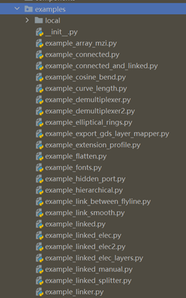

**Examples**: gpdk 内置案例
^^^^^^^^^^^^^^^^^^^^^^^^^^^^^^^^^^^^^^^^^^^^^^^^^^^^^^^^^^^^^^

gpdk 中的 ``examples`` 文件夹存储了由相关元件生成的器件和链路示例，以及许多功能设计模板和 PhotoCAD 案例。包括但不限于：

* 完整的 PCell 脚本示例： ``example_pcell_dataclass.py``, ``example_pcell_dataclass_oversimplified.py``, ``example_pcell_ dataclass _with_final.py``

* Flatten 设计脚本示例： ``example_flatten.py``

* 分阶段设计链路的脚本示例： ``example_hierarchical.py``

* 图形布尔运算示例： ``example_merged.py``

* 创建网表示例： ``example_ringMod_transceiver.py``

* 布局单元旋转和放置示例： ``example_transform.py``

* 根据调用的器件及其端口进行自动布线的示例： ``example_linked.py``

用户可以运行 python 源代码，并进入示例中的 ``local`` 文件夹查看其结果。

  
