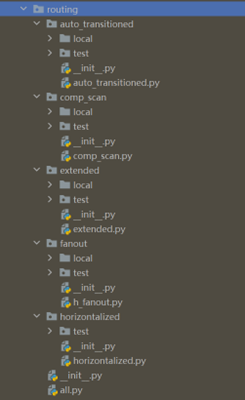

**Routing**: gpdk 内置路由方法
^^^^^^^^^^^^^^^^^^^^^^^^^^^^^^^^^^^^^^^^^^^^^^^^^^^^^^

gpdk 中的路由子文件夹包含功能强大的链路级设计模板，其中包含以下一些功能：

* 波导类型自动转换功能： ``auto_transitioned``

* Implement modular layout and routing features by batch processing function: ``comp_scan``

* 通过批处理功能实现模块化布局和布线功能： ``extended``

* 为下游组件扩展布局空间的功能： ``fanout``

* 端口平移功能： ``horizontalized``

用户可以运行相应功能文件夹中的 python 源代码，并进入其 ``local`` 文件夹查看结果。

