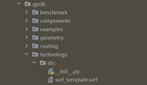
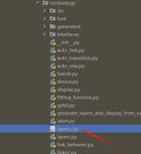
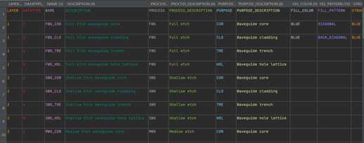
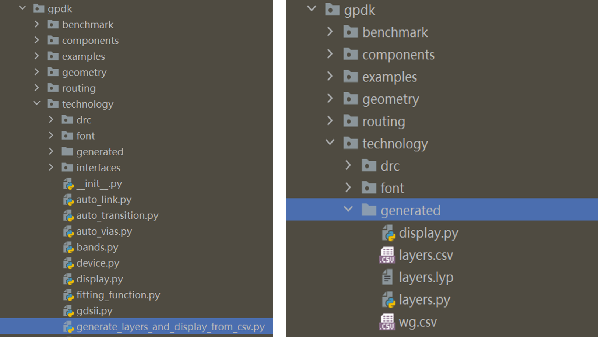
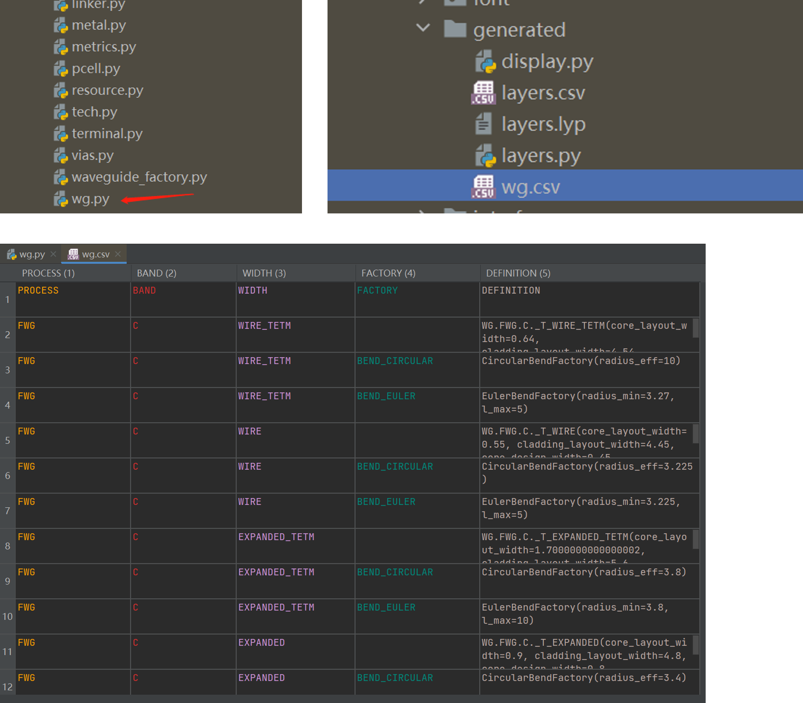

**Technology**: gpdk 相关工艺设置
^^^^^^^^^^^^^^^^^^^^^^^^^^^^^^^^^^^^^^^^^^^^^^^^^^^^^^^^^^^^^^^^^^^^^

默认工艺
------------------------------------------

gpdk 中的 ``technology`` 包含许多处理工艺和布局显示的常用配置文件，例如：
   
* 工艺层定义： ``layers.py``
   
* 图层显示设置： ``display.py``
   
* 布局图案精度设置： ``metrics.py``
   
* 波导类型定义： ``wg`` 文件夹
   
* 布线相关设置定义： ``auto_link.py``
   
* 波导类型自动转换： ``auto_transition.py``
   
* 金属布线相关设置： ``auto_via.py``, ``fitting_function.py``

Note: ``technology`` 下的 drc 子文件夹中的 ``svrf_template.py`` 已更改路径，现位于 ``gpdk`` 文件夹下，该文件为基于当前工艺生成的版图的设计规则检查模板，即 Calibre\ :sup:`TM` DRC 规则检查模板脚本。

    
定制工艺
---------------------------------------------------

为了方便用户使用和自定义工艺信息，主要针对 ``layers.py`` 和 ``display.py``， **technology** 提供了一个方便用户自定义的 ``layers.csv`` 文件，用户可以打开 ``gpdk`` > ``technology`` > ``layers.csv`` 文件自定义自己的相关工艺。
   

   
首先双击文件，打开下图所示的表格：
   

   
* ``LAYER`` 和 ``DATATYPE`` 共同决定层的编号。
   
* ``NAME`` 用于定义层的名称。
   
* ``DESCRIPTION`` 是对该层的描述。
   
* ``PROCESS`` 和 ``PROCESS_DESCRIPTION`` 分别用于定义和描述蚀刻工艺。
   
* ``PURPOSE`` 和 ``PURPOSE_DESCRIPTION`` 分别用于定义和描述加工工艺。
   
* ``FILL_COLOR`` 用于定义填充图层的颜色。
   
* ``FILL_PATTERN`` 用于定义填充图层的图形，常用 ``DIAGONAL`` and ``BACK_DIAGONAL``.
   
* ``STROKE_COLOR`` is used to define the color of the border of the layer. 
   
All these information are user-defined.
   
Then after the user has customized the relevant process information, running ``gpdk`` > ``technology`` > ``generate_layers_display_from_csv.py`` directly will generate the generated folder in ``gpdk`` > ``technology``, which contains the ``display.py``, ``layers.csv``, ``layers.lyp``, ``layers.py``, and ``wg.csv`` files.
   

   
Finally, we can use the relevant process setup files generated in the file via ``gpdk`` > ``technology`` > ``tech.py`` . Double-click to open the ``tech.py`` file to reveal the following scripts::
   
    from .auto_link import LINKING_POLICY
    from .auto_transition import AUTO_TRANSITION
    from .auto_vias import AUTO_VIAS
    from .bands import BAND
    from .device import DEVICE
    from .display import DISPLAY
    from .fitting_function import FITTING_FUNCTION
    from .gdsii import GDSII
    from .label import LABEL
    from .layers import LAYER, PROCESS, PURPOSE
    from .linker import LINKER
    from .metal import METAL
    from .metrics import METRICS
    from .terminal import PIN, PORT
    from .vias import VIAS
    from .wg import WG
    from .resource import RESOURCE
    
In the module import section we replace the original::
   
    from .display import DISPLAY
    from .layers import LAYER, PROCESS, PURPOSE
    
to::
   
    from .gennerated.display import DISPLAY
    from .gennerated.layers import LAYER, PROCESS, PURPOSE
    
Save it again and then you can use the custom process information.

Waveguide information
-----------------------------------------------------

In order to be more convenient for users to view the information of the waveguide process in use, **technology** provides a convenient method to reverse the python source file to generate a csv netlist file, users can open ``gpdk`` > ``technology`` > ``wg.py`` and run it, then the ``wg.csv`` file will be generated in the generate folder, you can open the file to quickly view various information related to waveguide.
   

   
    
    

   

   
